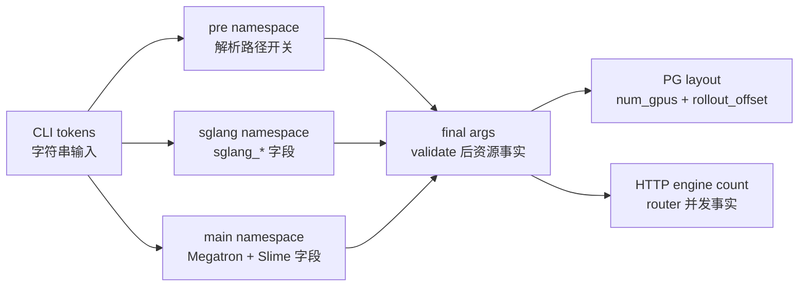

# Ray参数 · 数据流

## 你为什么要读

这篇把源码走读压缩成对象流和场景矩阵。读完后，你应该能拿一条启动命令，手算最终 `args`、Ray placement group layout、SGLang engine 数，以及哪些字段会在 validate 中被改写。

## 对象流



这条流里有两个关键转折：

- namespace 合并前，字段只是各 parser 的局部视图。
- validate 后，字段才变成 Ray、RolloutManager、SGLangEngine 能消费的运行事实。

## 字段生命周期

| 字段 | 输入阶段 | validate 后 | 第一个关键消费者 |
|------|----------|-------------|------------------|
| `actor_num_nodes` | CLI / 默认 1 | 可能被 debug rollout-only 改写 | `_get_placement_group_layout` |
| `actor_num_gpus_per_node` | CLI / 默认 8 | 可能被 debug rollout-only 改写 | Megatron world size 与 PG layout |
| `rollout_num_gpus` | CLI / 默认 `None` | colocate 默认到 actor GPU；external 写回远端总 GPU；`0` 保留为明确选择 | PG layout、HTTP engine 数 |
| `rollout_num_gpus_per_engine` | CLI / 默认 1 | SGLang TP 默认值和 engine 数推导依据 | `sglang_validate_args`、`get_rollout_num_engines` |
| `colocate` | CLI bool | debug rollout-only 会强制 False | PG layout、offload/onload 路径 |
| `offload` | CLI 便利开关 | 删除，只留下 `offload_train` / `offload_rollout` | 主循环 offload/onload |
| `rollout_external_engine_addrs` | CLI 地址列表 | 触发 `rollout_external=True` 和远端 discovery | external rollout server adapter |

源码证据集中在 validate 收口段：

```python
# 来源：slime/utils/arguments.py L1851-L1864
args.rollout_external = args.rollout_external_engine_addrs is not None

if args.rollout_external and not args.debug_train_only:
    apply_external_engine_info_to_args(args, logger=logger)

args.use_critic = args.advantage_estimator == "ppo"
# Critic always uses the same GPU count as actor.
args.critic_num_gpus_per_node = args.actor_num_gpus_per_node
args.critic_num_nodes = args.actor_num_nodes

if args.offload:
    args.offload_train = True
    args.offload_rollout = True
del args.offload
```

## 场景矩阵：从 args 到 PG layout

下面的表以测试中的默认 actor 配置为基准：`actor_num_nodes=2`、`actor_num_gpus_per_node=8`，所以 actor GPU 总量是 16。

| 场景 | 关键输入 | PG layout | 含义 |
|------|----------|-----------|------|
| 普通 decoupled | `rollout_num_gpus=32` | `(48, 16)` | Ray 申请 48 GPU；rollout 从第 16 个 bundle 后开始 |
| train-only debug | `debug_train_only=True` | `(16, 0)` | 只保留 actor 资源 |
| rollout-only debug | `debug_rollout_only=True`、`rollout_num_gpus=32` | `(32, 0)` | 只按 rollout GPU 建 PG |
| colocate 小于 actor | `colocate=True`、`rollout_num_gpus=8` | `(16, 0)` | rollout 使用前 8 个 bundle，与 actor 前缀重叠 |
| colocate 等于 actor | `colocate=True`、`rollout_num_gpus=16` | `(16, 0)` | 两侧视图长度相同，覆盖同一组 16 GPU |
| colocate 大于 actor | `colocate=True`、`rollout_num_gpus=32` | `(32, 0)` | actor 使用前 16 个 bundle，rollout 可使用 32 个；共同前缀重叠 |
| zero rollout non-colocate | `rollout_num_gpus=0` | `(16, 16)` | 仍有 actor PG；rollout 视图为空切片 |
| zero rollout colocate | `colocate=True`、`rollout_num_gpus=0` | `(16, 0)` | 同卡模式保留 actor PG，不启动本地 engine |
| external engines | `rollout_external=True` | `(16, 16)` | PG 只申请 actor GPU；rollout offset 指向空切片 |
| external + rollout-only debug | `rollout_external=True`、`debug_rollout_only=True` | `(0, 0)` | 本地 Ray 不申请训练或 rollout GPU |

这些期望值由 placement group 单测固定：

```python
# 来源：slime/tests/test_placement_group.py L30-L46
@pytest.mark.parametrize(
    ("overrides", "expected"),
    [
        pytest.param({}, (48, 16), id="normal_non_colocate"),
        pytest.param({"debug_train_only": True}, (16, 0), id="debug_train_only"),
        pytest.param({"debug_rollout_only": True}, (32, 0), id="debug_rollout_only"),
        pytest.param({"colocate": True, "rollout_num_gpus": 8}, (16, 0), id="colocate_rollout_less_than_actor"),
        pytest.param({"colocate": True, "rollout_num_gpus": 16}, (16, 0), id="colocate_rollout_equals_actor"),
        pytest.param({"colocate": True, "rollout_num_gpus": 32}, (32, 0), id="colocate_rollout_more_than_actor"),
        pytest.param({"rollout_num_gpus": 0}, (16, 16), id="zero_rollout_gpus"),
        pytest.param({"colocate": True, "rollout_num_gpus": 0}, (16, 0), id="colocate_zero_rollout_gpus"),
        pytest.param({"rollout_external": True}, (16, 16), id="external"),
        pytest.param({"rollout_external": True, "debug_rollout_only": True}, (0, 0), id="external_debug_rollout"),
    ],
)
def test_placement_group_layout(overrides, expected):
    assert _get_placement_group_layout(_args(**overrides)) == expected
```

## 为什么 external 是 `(16, 16)` 而不是 `(48, 16)`

external 模式下，远端 engine 的 GPU 已经被外部系统占用，不应由 Slime 的 Ray job 再申请一次。本地 placement group 只保留 actor GPU；rollout offset 等于 actor GPU 数，所以切出来的 rollout bundle 列表为空。

```python
# 来源：slime/ray/placement_group.py L103-L117
if args.debug_train_only:
    return actor_num_gpus, 0

if args.rollout_external:
    if args.debug_rollout_only:
        return 0, 0
    return actor_num_gpus, actor_num_gpus

if args.debug_rollout_only:
    return args.rollout_num_gpus, 0

if args.colocate:
    return max(actor_num_gpus, args.rollout_num_gpus), 0

return actor_num_gpus + args.rollout_num_gpus, actor_num_gpus
```

运行时，external 会走专门的 rollout server 启动路径：

```python
# 来源：slime/ray/rollout.py L1089-L1104
def start_rollout_servers(args, pg) -> tuple[dict[str, Any], list[Any]]:
    """Start rollout servers without waiting for final engine initialization.

    Each model defined in the sglang config gets its own router and set
    of server groups.  Server groups within a model may have different
    ``num_gpus_per_engine`` (e.g. for PD disaggregation where prefill
    and decode use different TP sizes).

    Returns ``(servers, init_handles)`` where servers maps model name to
    ``RolloutServer`` and init_handles contains pending ``engine.init`` refs.

    Note: ``init_http_client`` should be called separately before this,
    as the HTTP client is shared across all servers.
    """
    if args.rollout_external:
        return start_external_rollout_servers(args, start_router=_start_router)
```

这里的交互边界是：Ray PG 不给 external engine 分 GPU，但 RolloutManager 仍会创建 router 和 adapter，把外部 server 接进生成与权重更新控制面。

## `rollout_num_gpus_per_engine` 的两次消费

同一个字段会在两个层面被消费：

1. SGLang 参数层：决定默认 `sglang_tensor_parallel_size` 和最终 `sglang_tp_size`。
2. HTTP 层：如果没有 external discovery 写回 `rollout_num_engines`，用它推导 engine 数。

```python
# 来源：slime/utils/http_utils.py L201-L210
def get_rollout_num_engines(args) -> int:
    """Return the number of rollout HTTP engines behind the router."""
    if (num_engines := getattr(args, "rollout_num_engines", None)) is not None:
        return int(num_engines)

    rollout_num_gpus = getattr(args, "rollout_num_gpus", None) or 0
    rollout_num_gpus_per_engine = getattr(args, "rollout_num_gpus_per_engine", None) or 1
    if rollout_num_gpus <= 0:
        return 0
    return max(1, rollout_num_gpus // rollout_num_gpus_per_engine)
```

例子：`rollout_num_gpus=32`、`rollout_num_gpus_per_engine=4`，本地推导是 8 个 engine。external 模式下，如果 discovery 已写回 `rollout_num_engines=2`，这里直接返回 2。

## `None`、`0`、正整数的交互边界

| `rollout_num_gpus` | colocate | external | 结果 |
|--------------------|----------|----------|------|
| `None` | True | False | validate 改成 actor GPU 总数 |
| `None` | False | True | external discovery 改成远端 GPU 总和 |
| `None` | False | False | 源码没有通用 fallback；普通 decoupled 应显式传数字 |
| `0` | 任意 | False | 明确不启动本地 engine，保留 0 |
| 正整数 | 任意 | False | 作为本地 rollout GPU 总量 |

这里第三行是从源码分支反推的边界：`rollout_num_gpus is None` 只在 debug/colocate 分支被处理，external 则通过 discovery 写回。如果普通 decoupled 没有显式传数字，后续 PG layout 的加法需要一个整数。

## 与训练主循环的交互

`parse_args` 只是把资源事实准备好，真正消费发生在训练入口：

```python
# 来源：train_async.py L9-L15
# The framework supports other asynchronous approaches such as fully async (which is shown in examples/full_async).
def train(args):
    assert not args.colocate, "Colocation is not supported for async training."
    configure_logger()
    # allocate the GPUs
    pgs = create_placement_groups(args)
    init_tracking(args)
```

这个 assert 解释了一个容易误解的点：参数层没有禁止 `train_async.py + --colocate`，但 async 训练入口会拒绝这个组合。排障时要看消费点，而不是只看 parser。

## 验证方法

运行：

```powershell
python -m pytest slime/tests/test_placement_group.py -q
```

依赖齐全时，预期结果是场景矩阵中的十个 layout 全部通过。当前轻量环境缺 `ray` 时会在 collection 阶段失败；此时只能逐行核对参数化用例与 `_get_placement_group_layout`，不能把静态核对写成运行通过。

下一篇 [[Slime-Ray参数-排障指南]] 会按症状进入这些分支。
