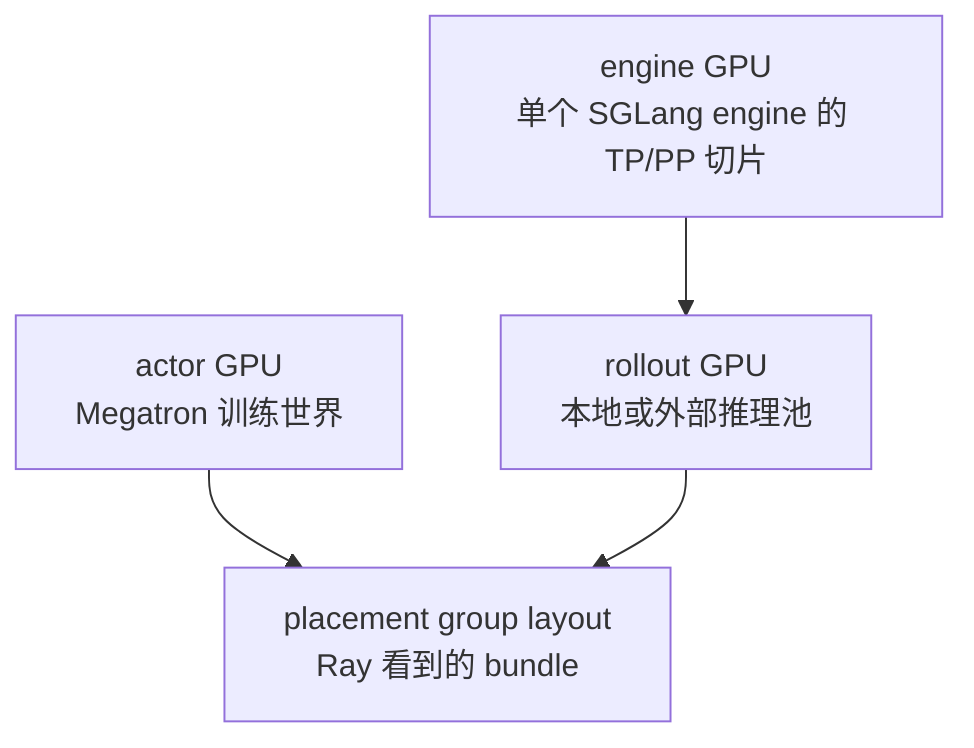

# Ray参数 · 核心概念

这篇先建立模型，不急着看所有参数。你要抓住的主线是：Slime 把“我要多少训练卡、多少推理卡、是否同卡、是否接外部引擎”编译成一个 Ray 可调度的资源视图。

## 先建立模型

把 Arguments-Ray 看成一张三层地图：



- actor GPU 决定 Megatron world size 和 actor placement group。
- rollout GPU 决定本地 SGLang engine 池，或 external 模式下记录远端事实。
- engine GPU 决定每个 SGLang 实例的并行度，常由 `rollout_num_gpus_per_engine` 表示。
- placement group 只消费 validate 后的最终 args，不关心用户最初怎么写 CLI。

## 术语表

| 概念 | 关键字段 | 心理模型 |
|------|----------|----------|
| Actor 集群 | `actor_num_nodes * actor_num_gpus_per_node` | 训练侧 GPU 总量 |
| Rollout GPU | `rollout_num_gpus` | 本地推理池 GPU 总量；external 下由远端 discovery 写回 |
| Engine GPU | `rollout_num_gpus_per_engine` | 一个 SGLang engine 吃几张卡 |
| Colocate | `colocate` | actor 与 rollout 的 GPU 视图从同一 bundle 前缀开始并发生重叠，靠 offload 时间复用 |
| Decoupled | `colocate=False` | actor 和 rollout 使用 placement group 的不同切片 |
| Offload train | `offload_train` | 生成时训练模型让出 GPU 显存 |
| Offload rollout | `offload_rollout` | 训练时 SGLang 让出 GPU 显存 |
| External rollout | `rollout_external` | Slime 不启动本地 GPU engine，只接管外部 SGLang server |

## Colocate 不是“少申请一点卡”

Colocate 的关键不是节约一个字段，而是让 actor 和 rollout 的资源视图重叠。两侧 GPU 数相等时视图一致；数量不等时，较小一侧只使用共同前缀。重叠区域不能同时常驻双方完整 GPU 状态，所以 validate 会把默认 offload 打开。

```python
# 来源：slime/utils/arguments.py L70-L100
parser.add_argument(
    "--colocate",
    action="store_true",
    default=False,
    help=(
        "Whether to colocate the inference engines and the actor. "
        "Turning this on will also set --offload to true."
    ),
)
parser.add_argument(
    "--offload",
    action="store_true",
    default=False,
    help=("Equivalent to --offload-train + --offload-rollout. "),
)
parser.add_argument(
    "--offload-train",
    action=argparse.BooleanOptionalAction,
    help=(
        "Whether to offload the training actor to CPU during training. "
        "This will always be true when --colocate is set."
    ),
)
parser.add_argument(
    "--offload-rollout",
    action=argparse.BooleanOptionalAction,
    help=(
        "Whether to offload the rollout generator to CPU during training. "
        "This will always be true when --colocate is set."
    ),
)
```

读源码时把 colocate 想成“同一间机房轮流开灯”：训练和推理都在同一组卡上工作，但不同阶段要把另一方的显存状态移走。这个类比只解释资源时间复用，不解释权重同步内部的 CUDA IPC 细节。

## `rollout_num_gpus` 有三种状态

`rollout_num_gpus` 最容易误读，因为它不是一开始就等于最终事实。

| 状态 | 进入 validate 前的含义 | validate 后的含义 |
|------|------------------------|-------------------|
| `None` | 用户没有决定 rollout GPU 总量 | colocate 下默认等于 actor GPU；external 下由远端写回 |
| `0` | 用户要求不启动本地 SGLang GPU engine | 仍保留为 0；debug rollout-only 还会把 actor GPU 清零 |
| 正整数 | 用户指定本地 rollout GPU 总量 | colocate 下可小于、等于或大于 actor GPU |

证据在 validate 分支：

```python
# 来源：slime/utils/arguments.py L1885-L1899
# always true on offload for colocate at the moment.
if args.colocate:
    if args.offload_train is None:
        args.offload_train = True
    if args.offload_rollout is None:
        args.offload_rollout = True
    if args.rollout_num_gpus is None:
        args.rollout_num_gpus = args.actor_num_gpus_per_node * args.actor_num_nodes
    elif args.rollout_num_gpus == 0:
        logger.info("rollout_num_gpus is 0 under colocate; no local SGLang engines will be launched.")

if args.offload_train is None:
    args.offload_train = False
if args.offload_rollout is None:
    args.offload_rollout = False
```

关键点：`None` 会被解析成默认资源事实；`0` 是一个明确选择，不会被自动改成 actor GPU。

## Parser 前端有一个预解析闸门

Slime 同时接 Megatron、SGLang 和自身参数。某些 debug 模式不需要 SGLang server，所以要先看少量 CLI，再决定是否跳过 SGLang parser。

```python
# 定位骨架（非逐行摘录）：来源 slime/utils/arguments.py L1530-L1559
def _pre_parse_mode():
    temp_parser = argparse.ArgumentParser(add_help=False, allow_abbrev=False)
    temp_parser.add_argument("--train-backend", type=str, choices=["megatron"], default="megatron")
    temp_parser.add_argument("--debug-rollout-only", action="store_true", default=False)
    temp_parser.add_argument("--debug-train-only", action="store_true", default=False)
    temp_parser.add_argument("--load-debug-rollout-data", type=str, default=None)
    temp_args, _ = temp_parser.parse_known_args()
    return temp_args


def parse_args(add_custom_arguments=None):
    pre = _pre_parse_mode()
    skip_sglang = pre.debug_train_only or pre.load_debug_rollout_data is not None

    sglang_ns = None
    if not skip_sglang:
        sglang_ns = sglang_parse_args()
```

这说明 `parse_args` 不是“一个 argparse 调完收工”，而是先拿会影响解析路径的字段，再决定后续 parser 是否参与。

## External engines 会把远端拓扑写回本地 args

传 `--rollout-external-engine-addrs` 后，Slime 不应该相信本地 CLI 猜测的 GPU 数。它会访问每个外部 server 的 `/server_info` 或 `/get_server_info`，再写回 `args.rollout_num_gpus` 和 `args.rollout_num_engines`。

```python
# 来源：slime/backends/sglang_utils/external.py L107-L119
def apply_external_engine_info_to_args(args, logger=None) -> None:
    """Detect external engines and store the derived topology on ``args``."""
    addrs = args.rollout_external_engine_addrs
    if not addrs:
        raise ValueError("apply_external_engine_info_to_args requires --rollout-external-engine-addrs.")

    infos = discover_external_engines(addrs)
    if not infos:
        raise ValueError("--rollout-external-engine-addrs did not contain any engines.")

    args.rollout_external_engine_infos = [info.to_dict() for info in infos]
    args.rollout_num_engines = len(infos)
    args.rollout_num_gpus = sum(info.num_gpus for info in infos)
```

所以 external 模式下，`rollout_num_gpus` 是“远端事实的本地缓存”，不是本地 Ray 需要启动的 rollout GPU 数。

## Placement group 消费最终事实

`placement_group.py` 不负责猜测用户意图，它只看 validate 后的字段。

```python
# 来源：slime/ray/placement_group.py L100-L117
def _get_placement_group_layout(args) -> tuple[int, int]:
    actor_num_gpus = args.actor_num_nodes * args.actor_num_gpus_per_node

    if args.debug_train_only:
        return actor_num_gpus, 0

    if args.rollout_external:
        if args.debug_rollout_only:
            return 0, 0
        return actor_num_gpus, actor_num_gpus

    if args.debug_rollout_only:
        return args.rollout_num_gpus, 0

    if args.colocate:
        return max(actor_num_gpus, args.rollout_num_gpus), 0

    return actor_num_gpus + args.rollout_num_gpus, actor_num_gpus
```

这个函数返回两件事：

- `num_gpus`：整个 placement group 要申请多少 GPU bundle。
- `rollout_offset`：rollout 视图从 bundle 的哪个位置开始。

如果 `rollout_offset=0`，rollout 从 PG 的第一个 bundle 开始，与 actor 使用的前缀重叠；这不保证两侧长度相同。如果 offset 等于 actor GPU 数，rollout 从 actor 资源之后开始。

## 复盘

读 Arguments-Ray 时不要按参数列表背诵。更稳的读法是：

1. 先判断 CLI 字段是原始意图还是最终事实。
2. 再看 `_pre_parse_mode` 是否改变 parser 路径。
3. 然后看 `slime_validate_args` 是否重写 debug、external、critic、offload、colocate。
4. 最后用 `_get_placement_group_layout` 验证 Ray 实际申请和切片。

下一篇 [[Slime-Ray参数-源码走读]] 会沿一个真实启动场景走完这条链。
