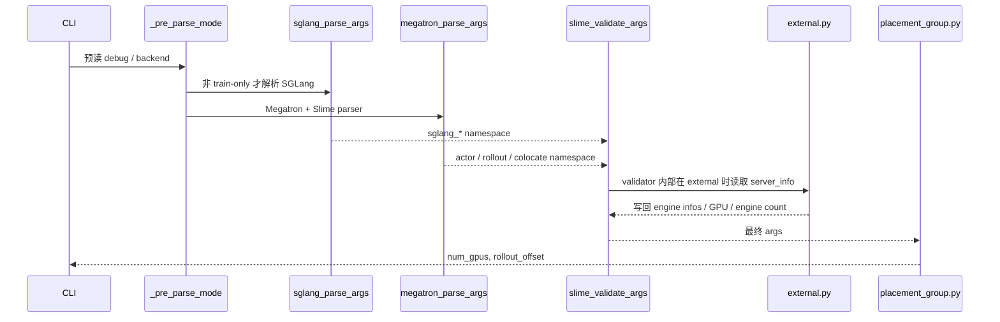

# Ray参数 · 源码走读

这篇追踪一条真实主线：用户写下一组训练和 rollout 资源参数后，Slime 如何把它们变成 Ray placement group、SGLang engine 数和 offload 行为。

读完后，你应该能定位这些问题：为什么 CLI 里的 `None` 和 `0` 表示不同语义，为什么 `--colocate` 会改写 offload，为什么 debug rollout-only 会改 actor GPU，为什么 external engines 会反过来覆盖 rollout GPU 数。

## 长文读法

这篇按“CLI 原始意图如何被编译成 Ray 资源事实”读：cluster 参数先登记 actor/rollout/colocate/offload 的原始值，预解析决定是否需要 SGLang parser，Slime validate 再收口 debug、external、critic、offload，最后 placement group 只消费已经定型的 args。

| 读者任务 | 先读 | 要抓住的判断 |
|----------|------|--------------|
| 第一次建立参数主线 | 贯穿场景、步骤一到四 | CLI 参数不是最终事实，两个 namespace 合并后才进入统一 validate |
| 排查 `None` 和 `0` | 步骤一、步骤六到八 | `None` 表示等待 validate 推导，`0` 在 rollout GPU 上表示不启动本地 engine |
| 排查 SGLang TP/PP | 步骤五 | `sglang_tp_size` 默认来自 `rollout_num_gpus_per_engine / pp_size` |
| 排查 debug rollout-only | 步骤六到七 | debug rollout-only 会重写 actor 资源，并关闭 colocate/offload |
| 排查 colocate/offload | 步骤八 | colocate 会默认打开 train/rollout offload，并在必要时补 rollout GPU 数 |
| 排查 external engines | 步骤九到十一 | 远端 `/server_info`（失败时回退 `/get_server_info`）会写回 rollout engine 数和 GPU 总量，PG 只看最终结果 |

读的时候不要把 parser default 当运行拓扑。真正决定 Ray placement group 的，是 validate 与 external discovery 后的最终 args。

## 贯穿场景

先看普通 decoupled 场景：

```powershell
python train.py --actor-num-nodes 2 --actor-num-gpus-per-node 8 --rollout-num-gpus 32 --rollout-num-gpus-per-engine 4
```

这条命令表达的是：16 张训练卡，32 张本地 rollout 卡，每个 SGLang engine 4 张卡。源码会把它编译成：

- actor GPU 总量：16。
- rollout GPU 总量：32。
- placement group 总 GPU：48。
- rollout offset：16。
- SGLang TP 默认值：4，除非 PP 配置继续切分。

如果把 `--colocate`、`--debug-rollout-only`、`--rollout-external-engine-addrs` 加进去，主线会分叉，但仍然经过同一个编译链路。



## 步骤一：cluster 参数只登记原始意图

系统压力：训练、推理、节点布局、offload 是同一个资源问题的不同投影。Slime 先把它们登记成 CLI 字段，但此时还没有形成最终资源事实。

设计选择：`add_cluster_arguments` 把 actor、rollout、node、colocate、offload 放在同一组。

```python
# 来源：slime/utils/arguments.py L38-L60
def add_cluster_arguments(parser):
    parser.add_argument("--actor-num-nodes", type=int, default=1, help="Number of nodes for training actor")
    parser.add_argument(
        "--actor-num-gpus-per-node", type=int, default=8, help="Number of gpus per node for training actor"
    )

    parser.add_argument(
        "--rollout-num-gpus",
        type=int,
        default=None,
        help=(
            "Number of GPUs for inference. Note that when using --colocate, "
            "i.e. the training and the inference engines are on the same gpus, this param will be set as "
            "actor_num_gpus_per_node * actor_num_nodes unless it is explicitly set. "
            "Set it to 0 to launch routers without local SGLang engines."
        ),
    )
    parser.add_argument(
        "--rollout-num-gpus-per-engine",
        type=int,
        default=1,
        help="Number of GPUs per inference engine, just like the tp_size in sglang.",
    )
```

执行逻辑：

- actor 参数给训练侧总 GPU。
- rollout 参数给推理池总 GPU。
- `rollout_num_gpus_per_engine` 是单 engine 粒度，不是 rollout 总量。
- `rollout_num_gpus` 默认是 `None`，保留“以后再决定”的空间。
- 如果普通 decoupled 路径没有后续分支把它变成数字，进入 placement group 前就应该由用户显式传入。

不变量与失败模式：

- 不要在这里推断 Ray 会申请多少 GPU；这段只是 CLI schema。
- 如果读者把 `None` 当成 0，会误判默认 decoupled 和 colocate 的行为。

## 步骤二：provider 顺序决定谁能覆盖谁

系统压力：Slime 需要把自定义参数、Slime 参数、Megatron 参数放进同一个 parser 生态。重复注册会冲突，覆盖顺序也会影响默认值。

设计选择：先注册用户自定义参数，再注册 cluster、train、rollout、data、algo、debug 等 Slime 参数，最后重置少量 Megatron 字段。

```python
# 来源：slime/utils/arguments.py L1495-L1523
# Add custom arguments in front to prevent overwritten some slime arguments.
if add_custom_arguments is not None:
    parser = add_custom_arguments(parser)

parser = add_cluster_arguments(parser)
parser = add_train_arguments(parser)
parser = add_rollout_arguments(parser)
parser = add_fault_tolerance_arguments(parser)
parser = add_data_arguments(parser)
parser = add_eval_arguments(parser)
parser = add_algo_arguments(parser)
parser = add_on_policy_distillation_arguments(parser)
parser = add_wandb_arguments(parser)
parser = add_tensorboard_arguments(parser)
parser = add_debug_arguments(parser)
parser = add_network_arguments(parser)
parser = add_reward_model_arguments(parser)
parser = add_rollout_buffer_arguments(parser)
parser = add_mtp_training_arguments(parser)
parser = add_ci_arguments(parser)
parser = add_custom_megatron_plugins_arguments(parser)
reset_arg(
    parser,
    "--custom-config-path",
    type=str,
    default=None,
    help="Path to the YAML config for custom function arguments.",
)
reset_arg(parser, "--padded-vocab-size", type=int, default=None)
```

读者抓手：如果一个参数看起来“不是在 cluster 段定义的”，先别跳结论。它可能在 rollout、debug、network 或 custom provider 中注册，但最终仍由 `slime_validate_args` 统一收尾。

## 步骤三：预解析决定是否需要 SGLang parser

系统压力：`debug_train_only` 和 `load_debug_rollout_data` 不需要启动 SGLang server。如果还强行解析 SGLang 相关参数，会让训练调试路径背上不必要的依赖和校验。

设计选择：`_pre_parse_mode` 只读能改变解析路径的字段；`parse_args` 根据它决定是否跳过 `sglang_parse_args`。

```python
# 定位骨架（非逐行摘录）：来源 slime/utils/arguments.py L1530-L1559
def _pre_parse_mode():
    """Pre-parse CLI to extract arguments that control parsing flow.

    These arguments are removed from add_slime_arguments to avoid
    registering them twice.  The returned namespace is merged into
    the final ``args`` after Phase 2 parsing.
    """
    temp_parser = argparse.ArgumentParser(add_help=False, allow_abbrev=False)
    temp_parser.add_argument("--train-backend", type=str, choices=["megatron"], default="megatron")
    temp_parser.add_argument("--debug-rollout-only", action="store_true", default=False)
    temp_parser.add_argument("--debug-train-only", action="store_true", default=False)
    temp_parser.add_argument("--load-debug-rollout-data", type=str, default=None)
    temp_args, _ = temp_parser.parse_known_args()
    return temp_args


def parse_args(add_custom_arguments=None):
    pre = _pre_parse_mode()
    skip_sglang = pre.debug_train_only or pre.load_debug_rollout_data is not None

    # Phase 1: Parse sglang args independently (separate parser, parse_known_args).
    # Skipped when sglang servers are not needed.
    sglang_ns = None
    if not skip_sglang:
        sglang_ns = sglang_parse_args()
```

执行逻辑：

- `debug_train_only`：训练侧调试，不需要 SGLang parser。
- `load_debug_rollout_data`：从保存的 rollout 数据训练，也不需要 SGLang parser。
- `debug_rollout_only`：只测 rollout，仍需要 SGLang parser，所以不会跳过。

不变量与失败模式：不要在 `parse_args` 之后期待 `pre` 还是独立对象；它会被 merge 回最终 `args`。

## 步骤四：两个 namespace 合并后才 validate

系统压力：Megatron parser 和 SGLang parser 各自只理解自己的参数，Slime 的资源校验需要同时看到两边字段。

设计选择：先解析 Megatron + Slime，再把 pre 和 SGLang namespace 写回同一个 `args`，最后统一 validate。

```python
# 来源：slime/utils/arguments.py L1561-L1589
# Phase 2: Parse megatron + slime args.
# Uses ignore_unknown_args=True so that --sglang-* and pre-parsed CLI flags
# are silently ignored by the megatron parser.
from slime.backends.megatron_utils.arguments import megatron_parse_args
from slime.backends.megatron_utils.arguments import validate_args as megatron_validate_args

args = megatron_parse_args(
    extra_args_provider=add_slime_arguments,
    skip_hf_validate=pre.debug_rollout_only,
)

# Merge pre-parsed args into the main namespace
for key, value in vars(pre).items():
    setattr(args, key, value)

# Merge sglang args into the main namespace
if sglang_ns is not None:
    for key, value in vars(sglang_ns).items():
        setattr(args, key, value)

slime_validate_args(args)

if pre.train_backend == "megatron" and not args.debug_rollout_only:
    megatron_validate_args(args)

if not args.debug_train_only:
    sglang_validate_args(args)

return args
```

这段顺序很关键：

- Slime validate 先运行，因为它会设置 `debug_train_only`、`rollout_external`、offload 等跨后端事实。
- Megatron validate 在非 rollout-only 下运行。
- SGLang validate 在非 train-only 下运行。

运行验证：在排查参数问题时，断点放在 `slime_validate_args(args)` 前后各一次，比较 `rollout_num_gpus`、`colocate`、`offload_train`、`offload_rollout`、`rollout_external`。

## 步骤五：SGLang TP 默认值来自每 engine GPU

系统压力：SGLang server 需要 `tensor_parallel_size`，但 Slime 用户更常从“每个 rollout engine 几张卡”来配置。

设计选择：SGLang parser 先临时读取 `rollout_num_gpus_per_engine` 和 PP size，给 `sglang_tensor_parallel_size` 设置默认值；正式 validate 时再次校验 PP 可整除。

```python
# 来源：slime/backends/sglang_utils/arguments.py L188-L199
# Compute default sglang_tensor_parallel_size from CLI args
temp_parser = argparse.ArgumentParser(add_help=False)
temp_parser.add_argument("--rollout-num-gpus-per-engine", type=int, default=1)
temp_parser.add_argument("--sglang-pp-size", type=int, default=1)
temp_parser.add_argument("--sglang-pipeline-parallel-size", type=int, default=1)
temp_args, _ = temp_parser.parse_known_args()
pp_size = temp_args.sglang_pp_size if temp_args.sglang_pp_size != 1 else temp_args.sglang_pipeline_parallel_size
sglang_tp_size = temp_args.rollout_num_gpus_per_engine // pp_size
parser.set_defaults(sglang_tensor_parallel_size=sglang_tp_size)

args, _ = parser.parse_known_args()
return args
```

```python
# 来源：slime/backends/sglang_utils/arguments.py L141-L154
def validate_args(args):
    args.sglang_dp_size = args.sglang_data_parallel_size
    args.sglang_pp_size = args.sglang_pipeline_parallel_size
    args.sglang_ep_size = args.sglang_expert_parallel_size

    # Compute effective TP size considering PP size
    if args.sglang_pp_size > 1:
        assert args.rollout_num_gpus_per_engine % args.sglang_pp_size == 0, (
            f"rollout_num_gpus_per_engine ({args.rollout_num_gpus_per_engine}) must be divisible by "
            f"sglang_pipeline_parallel_size ({args.sglang_pp_size})"
        )
        args.sglang_tp_size = args.rollout_num_gpus_per_engine // args.sglang_pp_size
    else:
        args.sglang_tp_size = args.rollout_num_gpus_per_engine
```

不变量：`rollout_num_gpus_per_engine` 是 SGLang 并行度的入口，不是 engine 数。engine 数另由 `rollout_num_gpus / rollout_num_gpus_per_engine` 或 external discovery 决定。

## 步骤六：validate 把 debug、external、critic 和 offload 收口

系统压力：启动脚本支持很多调试组合。如果不在进入 Ray 前收口，后续资源创建会同时面对“训练调试”“推理调试”“外部引擎”“PPO critic”“colocate”等半成品状态。

设计选择：`slime_validate_args` 集中改写这些字段。

```python
# 来源：slime/utils/arguments.py L1844-L1864
if args.load_debug_rollout_data is not None:
    logger.info(
        f"load_debug_rollout_data {args.load_debug_rollout_data} is set, "
        "will not instantiate sglang servers and will only run the training process."
    )
    args.debug_train_only = True

args.rollout_external = args.rollout_external_engine_addrs is not None

if args.rollout_external and not args.debug_train_only:
    apply_external_engine_info_to_args(args, logger=logger)

args.use_critic = args.advantage_estimator == "ppo"
# Critic always uses the same GPU count as actor.
args.critic_num_gpus_per_node = args.actor_num_gpus_per_node
args.critic_num_nodes = args.actor_num_nodes

if args.offload:
    args.offload_train = True
    args.offload_rollout = True
del args.offload
```

执行逻辑：

- `load_debug_rollout_data` 强制变成 train-only。
- external 地址一旦存在，就设置 `rollout_external`，并在非 train-only 下 discovery。
- PPO 打开 critic，critic GPU 数与 actor 保持一致。
- `--offload` 是临时便利开关，validate 后删除。

不变量与失败模式：后续代码不应该再依赖 `args.offload`，因为这个字段已经被删除。

## 步骤七：debug rollout-only 会重写 actor 资源

系统压力：只测 rollout 时，训练模型不应该再占常规 actor 资源。但 Ray placement group 仍需要一个布局，让 rollout server 能被创建。

设计选择：`debug_rollout_only` 根据 rollout GPU 反推 actor 字段，或在 `rollout_num_gpus=0` 时直接把 actor 资源清零。

```python
# 来源：slime/utils/arguments.py L1866-L1883
if args.debug_rollout_only:
    if args.colocate and args.rollout_num_gpus is None:
        args.rollout_num_gpus = args.actor_num_gpus_per_node * args.actor_num_nodes
    elif args.rollout_num_gpus == 0:
        args.actor_num_gpus_per_node = 0
        args.actor_num_nodes = 0
    else:
        args.actor_num_gpus_per_node = min(8, args.rollout_num_gpus)
        args.actor_num_nodes = args.rollout_num_gpus // args.actor_num_gpus_per_node
    args.colocate = False
    args.offload_train = args.offload_rollout = False
    if args.train_memory_margin_bytes > 0:
        logger.warning("Force train_memory_margin_bytes=0 since debug_rollout_only does not support it")
        args.train_memory_margin_bytes = 0

assert not (args.debug_rollout_only and args.debug_train_only), (
    "debug_rollout_only and debug_train_only cannot be set at the same time, " "please set only one of them."
)
```

读者抓手：如果你传了 `--debug-rollout-only --rollout-num-gpus 0`，不要再期待 actor placement group 保留训练资源。源码明确把 actor nodes 和 per-node GPU 都设为 0。

## 步骤八：colocate/offload 默认值在 validate 里最终确定

系统压力：共享 GPU 时必须默认开启 offload；非共享 GPU 时又不能平白打开 offload，否则会引入多余的 CPU/GPU 搬运。

设计选择：colocate 块先填默认值；离开 colocate 后，仍为 `None` 的 offload 字段统一变成 False；PPO critic 再强制 train offload。

```python
# 来源：slime/utils/arguments.py L1885-L1906
# always true on offload for colocate at the moment.
if args.colocate:
    if args.offload_train is None:
        args.offload_train = True
    if args.offload_rollout is None:
        args.offload_rollout = True
    if args.rollout_num_gpus is None:
        args.rollout_num_gpus = args.actor_num_gpus_per_node * args.actor_num_nodes
    elif args.rollout_num_gpus == 0:
        logger.info("rollout_num_gpus is 0 under colocate; no local SGLang engines will be launched.")

if args.offload_train is None:
    args.offload_train = False
if args.offload_rollout is None:
    args.offload_rollout = False

if args.use_critic:
    args.offload_train = True

if args.offload_train:
    args.disable_grad_buffers_cpu_backup = True
    args.disable_param_buffers_cpu_backup = True
```

不变量：

- colocate 未显式关闭时，两个 offload 默认 True。
- non-colocate 未显式打开时，两个 offload 默认 False。
- PPO critic 会让 `offload_train=True`，即使它不是 colocate 的结果。

## 步骤九：external discovery 把远端 server_info 变成资源事实

系统压力：external 模式下，Slime 不知道远端 SGLang server 是 regular、prefill、decode，TP/PP 是多少，也不知道总 GPU 数。只靠用户地址无法创建正确的 router 和 HTTP client。

设计选择：逐个地址规范化，访问 `/server_info` 或 `/get_server_info`，再把结果写回 args。

```python
# 来源：slime/backends/sglang_utils/external.py L79-L104
def discover_external_engines(addrs: list[str], timeout: float = 30.0) -> list[ExternalEngineInfo]:
    infos = []
    for addr in addrs:
        url = normalize_external_engine_addr(addr)
        parsed = urlparse(url)
        assert parsed.hostname is not None and parsed.port is not None
        server_info = get_server_info(url, timeout=timeout)

        pp_size = int(server_info.get("pp_size") or server_info.get("pipeline_parallel_size") or 1)
        tp_size = int(server_info.get("tp_size") or server_info.get("tensor_parallel_size") or 1)
        num_gpus = int(server_info.get("num_gpus") or server_info.get("num_gpus_per_engine") or tp_size * pp_size)
        bootstrap_port = server_info.get("disaggregation_bootstrap_port")
        bootstrap_port = int(bootstrap_port) if bootstrap_port is not None else None

        infos.append(
            ExternalEngineInfo(
                url=url,
                host=parsed.hostname,
                port=parsed.port,
                worker_type=_infer_worker_type(server_info),
                num_gpus=num_gpus,
                disaggregation_bootstrap_port=bootstrap_port,
                server_info=server_info,
            )
        )
    return infos
```

```python
# 来源：slime/backends/sglang_utils/external.py L107-L119
def apply_external_engine_info_to_args(args, logger=None) -> None:
    """Detect external engines and store the derived topology on ``args``."""
    addrs = args.rollout_external_engine_addrs
    if not addrs:
        raise ValueError("apply_external_engine_info_to_args requires --rollout-external-engine-addrs.")

    infos = discover_external_engines(addrs)
    if not infos:
        raise ValueError("--rollout-external-engine-addrs did not contain any engines.")

    args.rollout_external_engine_infos = [info.to_dict() for info in infos]
    args.rollout_num_engines = len(infos)
    args.rollout_num_gpus = sum(info.num_gpus for info in infos)
```

运行验证：mock 或真实访问外部 server 的 `http://host:port/server_info`，预期能看到 `tp_size`、`pp_size`、`disaggregation_mode`；Slime validate 后 `args.rollout_num_gpus` 应等于所有外部 engine 的 GPU 数之和。

## 步骤十：placement group 只看最终 args

系统压力：Ray 需要一个确定的 GPU bundle 数。到了这里，`None`、debug、external、colocate 都应该已经被 validate 收口。

设计选择：`_get_placement_group_layout` 返回 `(num_gpus, rollout_offset)`，再由 `create_placement_groups` 切出 actor、rollout、critic 视图。

```python
# 来源：slime/ray/placement_group.py L100-L117
def _get_placement_group_layout(args) -> tuple[int, int]:
    actor_num_gpus = args.actor_num_nodes * args.actor_num_gpus_per_node

    if args.debug_train_only:
        return actor_num_gpus, 0

    if args.rollout_external:
        if args.debug_rollout_only:
            return 0, 0
        return actor_num_gpus, actor_num_gpus

    if args.debug_rollout_only:
        return args.rollout_num_gpus, 0

    if args.colocate:
        return max(actor_num_gpus, args.rollout_num_gpus), 0

    return actor_num_gpus + args.rollout_num_gpus, actor_num_gpus
```

```python
# 来源：slime/ray/placement_group.py L126-L128
pg, actor_pg_reordered_bundle_indices, actor_pg_reordered_gpu_ids = _create_placement_group(num_gpus)
rollout_pg_reordered_bundle_indices = actor_pg_reordered_bundle_indices[rollout_offset:]
rollout_pg_reordered_gpu_ids = actor_pg_reordered_gpu_ids[rollout_offset:]
```

把贯穿场景代入：actor 16，rollout 32，non-colocate，所以返回 `(48, 16)`。这表示 Ray 申请 48 张 GPU，rollout 视图从第 16 张之后开始。

## 步骤十一：engine 数在 HTTP 层继续消费

系统压力：router 后面有几个 HTTP engine，会影响连接池和并发请求分发。这个数量不能只看总 GPU，还要看 external discovery 是否直接给了 engine 数。

设计选择：优先使用 `rollout_num_engines`；没有时用 `rollout_num_gpus // rollout_num_gpus_per_engine` 推导。

```python
# 来源：slime/utils/http_utils.py L201-L210
def get_rollout_num_engines(args) -> int:
    """Return the number of rollout HTTP engines behind the router."""
    if (num_engines := getattr(args, "rollout_num_engines", None)) is not None:
        return int(num_engines)

    rollout_num_gpus = getattr(args, "rollout_num_gpus", None) or 0
    rollout_num_gpus_per_engine = getattr(args, "rollout_num_gpus_per_engine", None) or 1
    if rollout_num_gpus <= 0:
        return 0
    return max(1, rollout_num_gpus // rollout_num_gpus_per_engine)
```

不变量：external discovery 写回 `rollout_num_engines` 后，HTTP 层不再用本地 GPU 除法猜 engine 数。

## 运行验证

最直接的验证来自 upstream tests：

```powershell
python -m pytest slime/tests/test_placement_group.py -q
python -m pytest slime/tests/test_megatron_argument_validation.py -q
python -m pytest slime/tests/test_external_sglang_engines.py -q
```

依赖齐全时的预期现象：

- `normal_non_colocate` 固定为 `(48, 16)`。
- colocate 8/16/32 rollout GPU 分别验证 `max(actor, rollout)`。
- `rollout_num_gpus=0` 在 validate 里保留为 0。
- external PD 两个 server 会写回 `rollout_num_gpus=6`、`rollout_num_engines=2`。
- delta weight sync 在 colocate 下抛错。

当前轻量环境实测：`test_megatron_argument_validation.py` 为 14 passed；placement group 与 external 两组分别因缺少 `ray`、`httpx` 在 collection 阶段失败。后两组可做静态契约核对，但不记为运行通过。

## 复盘迁移

读类似参数文件时，可以照这个顺序：

1. 先找预解析字段，因为它们决定后续 parser 是否参与。
2. 再找 namespace merge，因为同名字段可能来自不同 parser。
3. 然后找 validate 改写，因为最终事实通常在这里出现。
4. 最后找第一个消费点，验证这些事实如何变成资源、网络或模型行为。

下一篇 [[Slime-Ray参数-数据流]] 会把这条链路压成对象流和场景矩阵。
