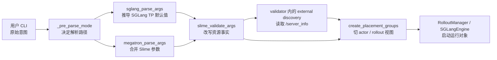
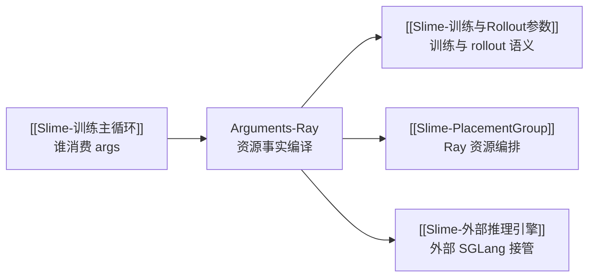

# Ray参数

## 你为什么要读

这组文档解决一个常见误区：Slime 的 Ray 资源不是 CLI 字段的简单相加。用户输入的 `--actor-num-*`、`--rollout-num-gpus`、`--colocate`、`--offload-*` 先进入多个 parser，再被 `slime_validate_args`、SGLang 参数适配和 external engine discovery 改写，最后才成为 placement group 和 rollout server 能消费的资源事实。

读完后，你应该能回答三类问题：

- 启动前：一个命令最终会申请多少 Ray GPU，actor/rollout/critic 是否共享。
- 排障时：为什么某些字段没传也变成 True，为什么 external 地址会改写 `rollout_num_gpus`。
- 改代码时：哪些字段只是原始意图，哪些字段已经是 validate 后的不变量。

## 主线地图



把这条链路当成一个“资源事实编译器”：CLI 是源码，parser 是前端，validate 是优化与合法性检查，placement group 是后端产物。

## 阅读顺序

| 文档 | 读者任务 |
|------|----------|
| [[Slime-Ray参数-核心概念]] | 建立 actor GPU、rollout GPU、engine GPU、colocate、offload 的心理模型 |
| [[Slime-Ray参数-源码走读]] | 沿一条 CLI 到 Ray layout 的主线读源码 |
| [[Slime-Ray参数-数据流]] | 用场景矩阵推导最终资源布局 |
| [[Slime-Ray参数-排障指南]] | 按症状定位参数改写、external、delta、debug 的失败模式 |
| [[Slime-Ray参数-学习检查]] | 用几个配置题检查自己是否能推导最终 args 和 PG layout |

## 源码范围

| 源码入口 | 本专题关注点 |
|----------|--------------|
| `slime/utils/arguments.py` L35-L105 | cluster 参数定义：actor、rollout、colocate、offload |
| `slime/utils/arguments.py` L1495-L1589 | provider 注册顺序、pre-parse、三阶段 parser 合并 |
| `slime/utils/arguments.py` L1844-L1909 | debug、external、critic、offload、colocate 的资源改写 |
| `slime/utils/arguments.py` L1980-L2002 | disk/delta weight sync 与 colocate 的互斥校验 |
| `slime/backends/sglang_utils/arguments.py` L141-L199 | `rollout_num_gpus_per_engine` 到 SGLang TP 的默认推导与校验 |
| `slime/backends/sglang_utils/external.py` L32-L131 | external engine 地址规范化、`/server_info` discovery、写回 args |
| `slime/ray/placement_group.py` L100-L137 | 最终 args 到 Ray placement group layout |
| `slime/utils/http_utils.py` L201-L210 | HTTP engine 数量的最终消费 |

刻意不展开：训练 batch、rollout batch、数据集、算法参数。这些属于 [[Slime-训练与Rollout参数]]。

## 本专题不变量

| 不变量 | 为什么重要 |
|--------|------------|
| `rollout_num_gpus=None` 不是最终事实 | colocate 会在 validate 中默认到 actor GPU，external 会由 discovery 写回；普通 decoupled 运行应显式给出数字 |
| `--colocate` 是资源视图重叠的语义 | rollout offset 为 0；两侧规模不等时重叠的是前缀，不代表双方使用完全相同数量的 GPU |
| `--offload` 是便利开关 | validate 后会删除 `offload` 字段，只留下 `offload_train` 与 `offload_rollout` |
| external engines 的 GPU 数来自远端 `/server_info` | 用户 CLI 不是 external GPU 拓扑的最终来源 |
| `rollout_num_gpus_per_engine` 同时影响 SGLang TP 默认值和 engine 数推导 | 改它会改变单 engine 并行度，也会改变 router 背后的 engine 数 |

## 运行验证入口

优先跑三类 CPU/单元测试；仍需安装各测试导入的 Ray、HTTP 等依赖：

```powershell
python -m pytest slime/tests/test_placement_group.py -q
python -m pytest slime/tests/test_megatron_argument_validation.py -q
python -m pytest slime/tests/test_external_sglang_engines.py -q
```

预期现象：

- placement group 测试能把 colocate、external、debug、zero rollout 的布局固定下来。
- argument validation 测试能证明 `rollout_num_gpus=0`、larger rollout、delta + colocate 的边界。
- external tests 能证明 `/server_info` 会写回 `rollout_num_gpus` 与 `rollout_num_engines`。

当前 Windows 轻量环境中，`test_megatron_argument_validation.py` 14 项通过；placement/external 两组在 collection 阶段分别缺 `ray`、`httpx`。缺依赖时只能静态核对测试矩阵，不能记为测试通过。

## 衔接



下一篇先读 [[Slime-Ray参数-核心概念]]。
