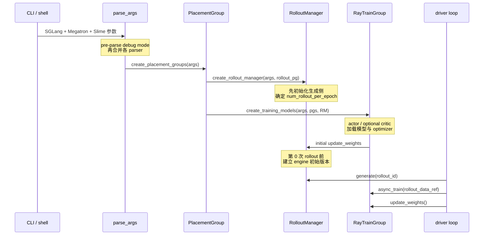

# 启动与入口

> **读者任务：** 从一条启动命令追到首批 rollout 之前，解释参数如何改变组件实例化、GPU 所有权与初始权重版本。

## 你为什么要读

Slime 的启动不是“parse 完参数就进入训练”。driver 必须先预订资源，再先创建 RolloutManager 以确定 rollout 规模，然后创建 actor/critic；权重加载完成后，actor 还会在第 0 次生成前主动把初始权重推给 rollout engine。debug、external engine、colocate 和 async mode 都会改变其中某些步骤。

数据转换工具属于运行前准备，不在 `train.py` 的运行时调用链中。把二者分开，才能判断错误来自 checkpoint 产物，还是来自 driver bootstrap。

## 启动链的心理模型



来源：`train.py` L9-L32、L55-L96；异步入口的 bootstrap 相同，但生成预取与更新节拍不同，见 `train_async.py` L10-L31、L65-L70。

## 本目录的四个视角

| 专题 | 它回答什么 | 不要混淆 |
|------|------------|----------|
| [[Slime-训练主循环]] | 同步/异步 driver 如何控制 generate、train、save、eval、update | driver 不执行模型 forward/backward |
| [[Slime-Ray参数]] | 节点、GPU、colocate、offload 如何约束拓扑 | 参数合法不等于资源一定可调度 |
| [[Slime-训练与Rollout参数]] | Megatron、SGLang、hook 参数怎样进入最终 `args` | pre-parse mode 会改变哪些 parser/validator 被调用 |
| [[Slime-数据准备工具]] | HF checkpoint 与 Megatron distributed checkpoint 如何准备 | 转换产物不是运行时权重同步 |

## 三个最容易漏掉的启动事实

1. **RolloutManager 先于 training models 创建。** 注释明确说需要先算 `num_rollout`；不要按“训练模型更核心”反推创建顺序。
2. **首次 update 不是第一轮训练后的 update。** actor 权重加载完成后就先推一次，保证第 0 批样本来自目标 checkpoint。
3. **mode 是结构开关。** `debug_train_only` / debug dump 会跳过 SGLang parser 与 server；`debug_rollout_only` 又会改变 Megatron validation、资源数量和 offload 设置。来源：`slime/utils/arguments.py` L1531-L1590、L1844-L1884。

## 推荐阅读顺序

| 顺序 | 文档 | 读者任务 |
|------|------|----------|
| 1 | [[Slime-训练主循环-核心概念]] | 先建立同步、one-step async 和 fully async 的区别 |
| 2 | [[Slime-训练主循环-源码走读]] | 沿 bootstrap → initial update → loop 全文阅读 |
| 3 | [[Slime-Ray参数-源码走读]] | 解释资源参数如何进入 placement group |
| 4 | [[Slime-训练与Rollout参数-数据流]] | 跟踪 parser、validation 和 `--*-path` |
| 5 | [[Slime-数据准备工具-源码走读]] | 单独验证运行前 checkpoint 转换 |

## 可执行的最小验证

在仓库根目录执行：

```powershell
rg -n "create_placement_groups|create_rollout_manager|create_training_models|update_weights" `
  slime/train.py slime/train_async.py

rg -n "_pre_parse_mode|skip_sglang|debug_rollout_only|debug_train_only" `
  slime/slime/utils/arguments.py
```

预期：两个入口都按 PG → RM → training models → initial update 启动；异步入口只在 loop 调度上提前下一轮 generate。第二条命令应证明 debug mode 改变解析与验证路径，而不是普通运行时 flag。

## 上下游衔接

| 方向 | 模块 | 交接对象 |
|------|------|----------|
| ← 阅读方法 | [[Slime-阅读方法]] | Git 基线与证据读法 |
| → Ray 编排 | [[Slime-Ray编排]] | `args` → placement groups / actor ranks |
| → Rollout | [[Slime-RolloutManager]] | rollout PG、DataSource、engine topology |
| → 训练 | [[Slime-Megatron-Actor初始化]] | actor/critic groups 与模型状态 |
| → 权重 | [[Slime-权重同步]] | 初始版本与后续版本发布 |

← [[Slime-阅读方法]] · → [[Slime-Ray编排]]
