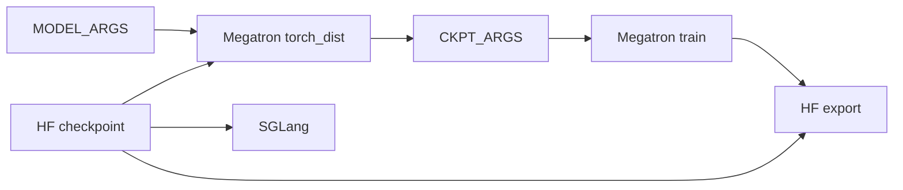

# 数据准备工具 · 学习检查

这篇检查你是否真的掌握了权重形态桥，而不是只记住了命令。验收标准是能画图、能选路径、能解释失败模式、能说出验证现象。

## 读者能做什么

- [ ] 能画出 HF checkpoint、Megatron `torch_dist`、SGLang 初始化、HF export 四个节点，以及 `MODEL_ARGS` 和 `CKPT_ARGS` 两组参数如何连接它们。
- [ ] 能解释为什么 `--hf-checkpoint` 不能替代 `--ref-load`。
- [ ] 能从一个训练脚本里指出 `MODEL_ARGS`、`--hf-checkpoint`、`--ref-load`、`--load`、`--save` 的消费者。
- [ ] 能说明 HF→torch_dist 转换不是文件改名，而是 Megatron 构图、AutoBridge 灌权重、Megatron `save_checkpoint`。
- [ ] 能说明 torch_dist→HF 时 `common.pt`、dist metadata、`--origin-hf-dir`、`--vocab-size` 各自解决什么问题。
- [ ] 能区分给 loader 的 checkpoint 根目录与给离线 converter 的具体版本目录。
- [ ] 能解释为什么 `--force` 不代表清空旧输出，以及为什么转换重跑应优先使用新目录。
- [ ] 能给出 3 个失败模式及其源码入口。
- [ ] 能运行或描述一个验证实验，并说出预期产物。

## 手画图验收

不打开正文，画出下面这条链：



合格答案必须包含：

- `MODEL_ARGS` 进入 HF→torch_dist 转换，而不是进入 SGLang。
- `--hf-checkpoint` 仍指 HF 目录，给 SGLang/tokenizer/AutoConfig。
- `--ref-load` 和 `--load` 指 Megatron checkpoint 根目录。
- HF export 需要从原始 HF 目录复制 assets，或显式提供 model name。

## 命令选择题

### 题 1：第一次训练 Qwen3-4B

你已经下载 `/root/Qwen3-4B`，还没有 Megatron checkpoint。应该先跑：

```bash
cd /root/slime
source scripts/models/qwen3-4B.sh
PYTHONPATH=/root/Megatron-LM python tools/convert_hf_to_torch_dist.py \
  ${MODEL_ARGS[@]} \
  --hf-checkpoint /root/Qwen3-4B \
  --save /root/Qwen3-4B_torch_dist
```

然后训练脚本中：

```bash
--hf-checkpoint /root/Qwen3-4B
--ref-load /root/Qwen3-4B_torch_dist
--load /root/Qwen3-4B_slime/
--save /root/Qwen3-4B_slime/
```

关键判断：`/root/Qwen3-4B_torch_dist` 是 Megatron checkpoint 根目录，`/root/Qwen3-4B` 仍保留给 HF 生态。

### 题 2：导出一个训练保存的 checkpoint

你要把 `/root/Qwen3-4B_slime/release` 导出成 HF。命令应包含：

```bash
python tools/convert_torch_dist_to_hf.py \
  --input-dir /root/Qwen3-4B_slime/release \
  --output-dir /root/Qwen3-4B_export_hf \
  --origin-hf-dir /root/Qwen3-4B \
  --vocab-size 151936
```

如果输出目录已经存在，首选换新目录。`-f` 只允许写入，不会清理旧 safetensors 或 assets；复用前必须由操作者确认目录已经清洁。

### 题 3：FP8 rollout

你想让 SGLang 用 `/root/Qwen3-4B-FP8` 初始化。训练 checkpoint 参数应该是：

```bash
--hf-checkpoint /root/Qwen3-4B-FP8
--ref-load /root/Qwen3-4B_torch_dist
```

关键判断：FP8 HF 目录不是 Megatron 训练 checkpoint。

## 失败模式验收

| 你看到的现象 | 合格解释 | 源码入口 |
|--------------|----------|----------|
| `--output-dir` 已存在时报错 | 导出脚本默认拒绝写入；`--force` 只跳过检查，不清空目录 | `tools/convert_torch_dist_to_hf.py` L209-L210 |
| 不传 `--origin-hf-dir` 也不传 `--model-name` 时报错 | converter 需要 model name 才能路由参数名转换 | `tools/convert_torch_dist_to_hf.py` L212-L219 |
| embedding 行数与 HF config 不符 | CLI 与 checkpoint `args.vocab_size` 是两级裁剪输入，需同时核对 | `save_tensors` L106-L117；`convert_to_hf` L25-L30 |
| 多卡转换 world size 大于层数时报错 | 脚本要求 world size 不超过 `num_layers` | `tools/convert_hf_to_torch_dist.py` L54-L57 |
| ROCm 环境转换要求 CPU 初始化 | HIP 分支显式断言 `args.use_cpu_initialization` | `tools/convert_hf_to_torch_dist.py` L117-L120 |
| resume 后像是从初始权重开始 | `--load` 目录无有效 tracker 时 actor 会从 `--ref-load` 初始化 | `docs/en/get_started/usage.md` L127-L145 |

## 运行验证

轻量验证：

```powershell
Set-Location slime
python -m py_compile tools/convert_hf_to_torch_dist.py tools/convert_torch_dist_to_hf.py
python -m pytest tests/test_megatron_argument_validation.py -q
```

完整转换验证需要真实 HF 模型、Megatron-LM、GPU 和分布式环境：

```bash
cd /root/slime
source scripts/models/qwen3-4B.sh
PYTHONPATH=/root/Megatron-LM python tools/convert_hf_to_torch_dist.py \
  ${MODEL_ARGS[@]} \
  --hf-checkpoint /root/Qwen3-4B \
  --save /root/Qwen3-4B_torch_dist
```

预期现象：

- 日志出现 `Model loaded: /root/Qwen3-4B`。
- 日志打印 pipeline model parallel size。
- `--save` 根目录有 Megatron tracker。
- 转换后的 checkpoint 以 release 形态被 `--ref-load` 消费。

## 通过标准

通过本专题的标准不是“看完五篇文档”，而是能完成这四件事：

1. 给一个 Slime 训练脚本，指出每个 checkpoint 参数的消费者和目录形态。
2. 给一个 HF 模型目录，写出正确的 HF→torch_dist 转换命令。
3. 给一个 Megatron checkpoint，先区分根目录与具体 step/release 目录，再写出 torch_dist→HF 导出命令，并说明 `--vocab-size`、`--origin-hf-dir`、`-f` 的真实边界。
4. 遇到路径、padding、PP、ROCm、FP8 任一问题，能回到 [[Slime-数据准备工具-排障指南]] 找到源码入口。

下一组建议读 [[Slime-PlacementGroup]]，把训练前的权重形态准备接到运行时资源布局。
