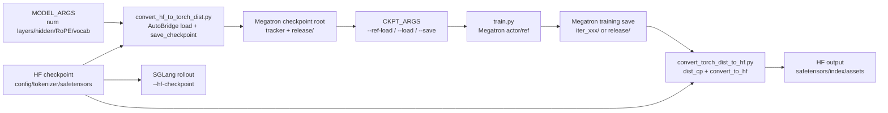

# 数据准备工具 · 数据流

## 你为什么要读

这篇解决一个实际问题：当训练脚本里同时出现 `--hf-checkpoint`、`--ref-load`、`--load`、`--save`、`--origin-hf-dir` 时，读者要能判断每个路径给谁消费、里面应该长什么样、错指以后会在哪个阶段爆。

本专题的“数据”不是 prompt JSONL，而是模型权重在三个生态之间换形态：HF 目录、Megatron `torch_dist`、HF 导出目录。

## 总览图



读图时先抓住两条独立加载线：

- Megatron 训练线：`MODEL_ARGS + --ref-load/--load/--save`。
- HF 生态线：`--hf-checkpoint/--origin-hf-dir`，给 tokenizer、SGLang、AutoConfig 和导出 assets。

## 路径矩阵

| 参数或目录 | 谁消费 | 期望形态 | 错指时的典型症状 |
|------------|--------|----------|------------------|
| `--hf-checkpoint` | SGLang、tokenizer、AutoConfig、HF→Megatron converter | HF 模型目录，含 `config.json`、tokenizer、safetensors | SGLang 初始化失败、tokenizer/config 缺失、误以为能给 Megatron 训练加载 |
| `--ref-load` | Megatron reference 和 actor fallback | Megatron checkpoint 根目录，含 tracker 与 `release/` 或有效 step | actor/reference 无法初始化，或从错误初始权重启动 |
| `--load` | Megatron actor resume | Megatron checkpoint 根目录，含 `latest_checkpointed_iteration.txt` 或可被 Megatron loader 识别 | resume 失败后回退到 `--ref-load`，训练从初始权重开始 |
| `--save` | Megatron actor 保存 | checkpoint 根目录 | 训练保存位置不符合预期，后续导出找不到 step |
| `--input-dir` | `convert_torch_dist_to_hf.py` | 单个 Megatron checkpoint 目录，含 `common.pt` 和 dist metadata | 导出脚本找不到 `common.pt` 或 metadata |
| `--output-dir` | HF 导出脚本 | 最好是全新目录；`--force` 仅允许写入既有目录 | 默认报 output exists；强制重跑可能遗留旧分片/assets |
| `--origin-hf-dir` | HF 导出脚本 | 原始 HF 目录 | 无法推导 model name，或导出目录缺 tokenizer/config |
| `--save-hf` | 训练中 actor 保存路径模板 | 可格式化 `{rollout_id}` 的输出路径 | 训练保存 Megatron checkpoint 但没有同步产出 HF 目录 |

usage 文档明确把 Megatron checkpoint 与 SGLang HF checkpoint 分开：

```text
来源：docs/en/get_started/usage.md L127-L145
When using slime, there are three parameters for loading and saving checkpoints:

  - `--ref-load`: The Megatron checkpoint for the reference model.
  - `--load`: The Megatron checkpoint for the actor. If `--load` is not set, or if the specified directory does not exist or does not contain `latest_checkpointed_iteration.txt`, the actor will be initialized from the `--ref-load` checkpoint.
  - `--save`: The path where the actor's checkpoints are saved.

Note:

  - Regardless of the checkpoint storage method (i.e., however `--ckpt-format` is set), Megatron can load both `torch` and `torch_dist` formats.

### Loading SGLang

Loading SGLang is very simple. You only need:

  - `--hf-checkpoint`: The Hugging Face checkpoint used to initialize SGLang.

Note:

  - Before the first training step, slime will synchronize the parameters from Megatron to SGLang. Therefore, the `--hf-checkpoint` does not need to contain the latest training parameters, and you do not need to change the HF checkpoint when resuming training.
```

## 入口脚本如何把路径接起来

`scripts/run-qwen3-4B.sh` 先 source model args，再声明 checkpoint args，最后一起传给 `train.py`。

```bash
# 来源：scripts/run-qwen3-4B.sh L37-L47
SCRIPT_DIR="$(cd -- "$(dirname -- "${BASH_SOURCE[0]}")" &>/dev/null && pwd)"
source "${SCRIPT_DIR}/models/qwen3-4B.sh"

CKPT_ARGS=(
   --hf-checkpoint /root/Qwen3-4B
   #--hf-checkpoint /root/Qwen3-4B-FP8
   --ref-load /root/Qwen3-4B_torch_dist
   --load /root/Qwen3-4B_slime/
   --save /root/Qwen3-4B_slime/
   --save-interval 20
)
```

```bash
# 来源：scripts/run-qwen3-4B.sh L146-L155
ray job submit --address="http://127.0.0.1:8265" \
   --runtime-env-json="${RUNTIME_ENV_JSON}" \
   -- python3 train.py \
   --actor-num-nodes 1 \
   --actor-num-gpus-per-node ${NUM_GPUS} \
   --colocate \
   ${MODEL_ARGS[@]} \
   ${CKPT_ARGS[@]} \
   ${ROLLOUT_ARGS[@]} \
   ${OPTIMIZER_ARGS[@]} \
```

这一段的读法是：`MODEL_ARGS` 不属于 checkpoint，但它决定 Megatron 如何解释 checkpoint；`CKPT_ARGS` 不只是一组路径，而是把训练侧和 rollout 侧接到不同权重形态上。

## HF 到 torch_dist 的产物生命周期

转换脚本在 `--save` 根目录下先保存一个 step checkpoint，然后把 tracker 写成 `release`，并把 step 目录移动成 release 目录。

```python
# 来源：tools/convert_hf_to_torch_dist.py L137-L148
save_checkpoint(1, model, None, None, 0)

if dist.get_rank() == 0:
    # change to release ckpt
    tracker_filename = get_checkpoint_tracker_filename(args.save)
    with open(tracker_filename, "w") as f:
        f.write("release")
    source_dir = get_checkpoint_name(args.save, 1, False, return_base_dir=True)
    target_dir = get_checkpoint_name(args.save, -1, True, return_base_dir=True)
    shutil.move(source_dir, target_dir)
dist.barrier()
dist.destroy_process_group()
```

可观测产物：

| 位置 | 应该看到什么 | 含义 |
|------|--------------|------|
| `--save/latest_checkpointed_iteration.txt` 或 Megatron tracker 文件 | 内容指向 `release` | loader 会按 release checkpoint 处理 |
| `--save/release/` | dist checkpoint shard、metadata、`common.pt` | 这是 `--ref-load` 应该间接加载的权重形态 |
| `--save/release/common.pt` | Megatron args 快照 | 反向导出用它恢复层数、MoE 等结构事实 |

注意：实际 tracker 文件名由 Megatron `get_checkpoint_tracker_filename(args.save)` 决定，不要在文档里硬编码推断。

同样不要把该转换当成可幂等重跑：目标 `release/` 若已存在，代码不会清理它。稳妥做法是为每次转换使用全新 `--save` 根目录。

## 训练中的保存与离线导出

训练 actor 保存时，先走 Megatron `save()`；如果配置了 `--save-hf`，再导出 HF。

```python
# 来源：slime/backends/megatron_utils/actor.py L558-L577
def save_model(self, rollout_id: int, force_sync: bool = False) -> None:
    if self.args.debug_rollout_only:
        return

    # torch dist may trigger nccl communication during saving.
    if self.args.offload_train:
        self.wake_up()

    if self.args.async_save:
        from megatron.training.async_utils import maybe_finalize_async_save

        maybe_finalize_async_save(blocking=True)

    save(rollout_id, self.model, self.optimizer, self.opt_param_scheduler)

    if force_sync and self.args.async_save:
        maybe_finalize_async_save(blocking=True)

    if self.args.save_hf is not None and self.role == "actor":
        save_hf_model_to_path(self.args, Path(self.args.save_hf.format(rollout_id=rollout_id)), self.model)
```

这说明有两条 HF 导出路径：

| 路径 | 触发方式 | 适合场景 |
|------|----------|----------|
| 离线导出 | `python tools/convert_torch_dist_to_hf.py --input-dir <checkpoint>` | 已有 Megatron checkpoint，要发布或本地验证 HF 权重 |
| 训练中导出 | `--save-hf` | 保存 actor checkpoint 时顺手产出 HF 目录 |

## torch_dist 到 HF 的输出生命周期

反向脚本先确认 output 是否允许写入，再确定 model name，再直接从 `--input-dir/common.pt` 和同目录 dist metadata 加载，最后写 safetensors 与 assets。这里的 `--input-dir` 是具体版本目录，不是带 tracker 的根目录。

```python
# 来源：tools/convert_torch_dist_to_hf.py L209-L244
if os.path.exists(args.output_dir) and not args.force:
    raise ValueError(f"Output directory {args.output_dir} already exists. Use --force to overwrite it.")

if args.model_name is None and args.origin_hf_dir is None:
    raise ValueError(
        "Either --model-name or --origin-hf-dir must be provided, so that we can know the name of the params."
    )

if args.model_name is None:
    hf_config = AutoConfig.from_pretrained(args.origin_hf_dir, trust_remote_code=True)
    args.model_name = type(hf_config).__name__.lower()

state_dict = {}
print(f"loading model from {args.input_dir}")
t = time.time()
megatron_args = torch.load(os.path.join(args.input_dir, "common.pt"), weights_only=False)["args"]
dist_cp.state_dict_loader._load_state_dict(
    state_dict,
    storage_reader=WrappedStorageReader(args.input_dir),
    planner=EmptyStateDictLoadPlanner(),
    no_dist=True,
)
print(f"model loaded in {time.time()-t:.2f} sec.")

save_tensors(
    megatron_args,
    args.model_name,
    state_dict,
    args.output_dir,
    args.chunk_size,
    args.vocab_size,
    args.origin_hf_dir if args.add_missing_from_origin_hf else None,
)

if args.origin_hf_dir:
    copy_assets(args.origin_hf_dir, args.output_dir)
```

输出目录应该包含：

| 文件 | 来源 | 用途 |
|------|------|------|
| `model.safetensors.index.json` | `save_tensors` 生成 | HF 权重分片索引 |
| `model-xxxxx-of-yyyyy.safetensors` | `save_tensors` 写出 | 转换后的模型权重 |
| `config.json`、tokenizer 文件、generation config | `copy_assets(origin_hf_dir, output_dir)` | 让输出目录能被 HF/SGLang 生态直接消费 |

`copy_assets()` 只复制原 HF 目录顶层的普通非权重文件；子目录不会递归复制。`--force` 也不会预清理旧输出，因此发布前应校验 index 中每个 shard 存在，并确认目录没有来自旧版本的额外权重分片。

## 与 RL 热路径的交互边界

Tools-DataPrep 不在每轮 `generate → train → update_weights` 热路径里。它只在训练前和保存后介入。

| 阶段 | 是否经过本专题工具 | 解释 |
|------|--------------------|------|
| 训练冷启动 | 是 | HF→torch_dist 产物作为 `--ref-load` |
| SGLang 初始化 | 间接 | `--hf-checkpoint` 给 SGLang/tokenizer，但之后会被 Megatron 首次同步权重覆盖 |
| 每轮 rollout | 否 | 数据走 SGLang HTTP、Sample、RM/filter |
| 每轮 train | 否 | 数据走 Megatron train step |
| `update_weights` | 否 | 训练权重在线同步给 SGLang，不调用离线 conversion 脚本 |
| checkpoint 保存 | 间接 | Megatron 写 `--save`，可后续离线导出 HF |

## 验证抓手

最小静态验证：

```powershell
Set-Location slime
python -m py_compile tools/convert_hf_to_torch_dist.py tools/convert_torch_dist_to_hf.py
```

完整转换验证：

```bash
cd /root/slime
source scripts/models/qwen3-4B.sh
PYTHONPATH=/root/Megatron-LM python tools/convert_hf_to_torch_dist.py \
  ${MODEL_ARGS[@]} \
  --hf-checkpoint /root/Qwen3-4B \
  --save /root/Qwen3-4B_torch_dist
```

预期现象：

- 日志打印 `Model loaded: /root/Qwen3-4B`。
- 日志打印 pipeline model parallel size。
- `--save` 根目录出现 tracker 和 `release/`。
- 训练脚本把 `--ref-load` 指向这个根目录，而不是原始 HF 目录。

下一篇 [[Slime-数据准备工具-排障指南]] 按症状反查这些路径。
