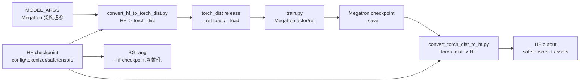
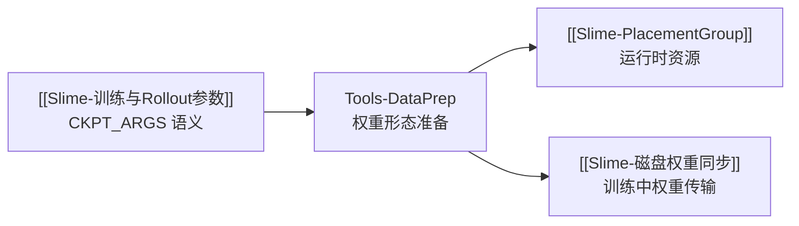

# 数据准备工具

## 你为什么要读

这组文档讲的不是 prompt 数据预处理，而是训练前后的**权重形态准备**：Hugging Face 目录如何变成 Megatron 能加载的 `torch_dist` checkpoint，训练保存的 Megatron checkpoint 又如何导回 HF safetensors。

读完后，你应该能解释五件事：

- 为什么 `--hf-checkpoint` 不能直接替代 `--ref-load`。
- 为什么 conversion 命令必须带 `MODEL_ARGS`。
- `convert_hf_to_torch_dist.py` 输出的 `release/` 和 tracker 文件如何被 Megatron 加载。
- 导出 HF 时为什么要关心 vocab padding、`origin_hf_dir` 和 missing tensors。
- 为什么 checkpoint 根目录与具体 `release/iter_xxx` 目录不能互换，以及 `--force` 为什么不等于“清空后重建”。

## 主线地图



这张图的关键是：Slime 同时需要两种权重形态。Megatron 训练读 `torch_dist`，SGLang 和 tokenizer 读 HF 目录；训练前会把 Megatron 权重同步到 SGLang，所以 HF 目录不必保存最新训练参数。

## 阅读顺序

| 文档 | 读者任务 |
|------|----------|
| [[Slime-数据准备工具-核心概念]] | 建立 HF 目录、Megatron `torch_dist`、MODEL_ARGS、CKPT_ARGS 的心理模型 |
| [[Slime-数据准备工具-源码走读]] | 沿 HF→torch_dist→训练→HF 导出主线读源码 |
| [[Slime-数据准备工具-数据流]] | 对照路径、目录布局、转换产物如何进入训练闭环 |
| [[Slime-数据准备工具-排障指南]] | 排查 vocab padding、多卡转换、ROCm、FP8 HF、导出覆盖等问题 |
| [[Slime-数据准备工具-学习检查]] | 用命令和目录推导题验证自己是否掌握 |

## 源码范围

| 源码入口 | 本专题关注点 |
|----------|--------------|
| `tools/convert_hf_to_torch_dist.py` L21-L41 | 转换脚本专属参数：`hf_checkpoint`、custom provider、mode、padding |
| `tools/convert_hf_to_torch_dist.py` L44-L84 | 复用 Megatron parser、注入默认值、自动推导 PP |
| `tools/convert_hf_to_torch_dist.py` L87-L148 | 初始化分布式、AutoBridge load、save checkpoint、rename release |
| `tools/convert_torch_dist_to_hf.py` L34-L63 | 自定义 metadata reader 与 empty state dict planner |
| `tools/convert_torch_dist_to_hf.py` L106-L164 | 转 HF safetensors、vocab padding、missing weights |
| `tools/convert_torch_dist_to_hf.py` L178-L244 | CLI 参数、output 覆盖、model name 推导、copy assets |
| `slime/backends/megatron_utils/megatron_to_hf/__init__.py` L24-L68 | 按 model name 路由 converter、padding、quant hook |
| `slime/backends/megatron_utils/megatron_to_hf/processors/padding_remover.py` L6-L12 | embedding/output layer 去 padding |
| `scripts/models/qwen3-4B.sh` L1-L17 | `MODEL_ARGS` 示例 |
| `scripts/run-qwen3-4B.sh` L37-L47 | `CKPT_ARGS` 示例 |

## 不变量

| 不变量 | 为什么重要 |
|--------|------------|
| `MODEL_ARGS` 必须和 HF config 对齐 | Megatron 不能只靠 checkpoint 目录恢复模型结构 |
| `--hf-checkpoint` 用于 HF 元数据、tokenizer、SGLang 初始化 | 它不是训练 actor 的 Megatron checkpoint |
| `--ref-load` 和 `--load` 指向 Megatron checkpoint 根目录 | 不要直接指到 `iter_xxx` 子目录 |
| 离线导出的 `--input-dir` 恰好相反：指向具体 `release/iter_xxx` | 脚本会直接读取该目录下的 `common.pt` 与 `.metadata` |
| HF→torch_dist 输出会写 tracker 并把 step 目录改成 `release` | 这是 Megatron release checkpoint 约定 |
| 转换输出目录应使用全新目录 | HF→torch_dist 的 move 与反向导出的 `--force` 都不会替你可靠清理旧产物 |
| torch_dist→HF 要核对 embedding padding 的两级裁剪 | CLI `--vocab-size` 与 checkpoint 内 `args.vocab_size` 都可能参与裁剪 |

## 运行验证入口

轻量环境很难完整跑权重转换，因为它依赖 Megatron、GPU、模型权重和分布式环境。可验证的最小门禁是：

```powershell
Set-Location slime
python -m py_compile tools/convert_hf_to_torch_dist.py tools/convert_torch_dist_to_hf.py
python -m pytest tests/test_megatron_argument_validation.py -q
```

完整验证需要真实模型目录，例如 quick start 的转换命令：

```bash
cd /root/slime
PYTHONPATH=/root/Megatron-LM python tools/convert_hf_to_torch_dist.py \
  ${MODEL_ARGS[@]} \
  --hf-checkpoint /root/Qwen3-4B \
  --save /root/Qwen3-4B_torch_dist
```

预期产物是 Megatron checkpoint 根目录，包含 tracker 文件和 `release/` 目录。

## 衔接



下一篇先读 [[Slime-数据准备工具-核心概念]]。
