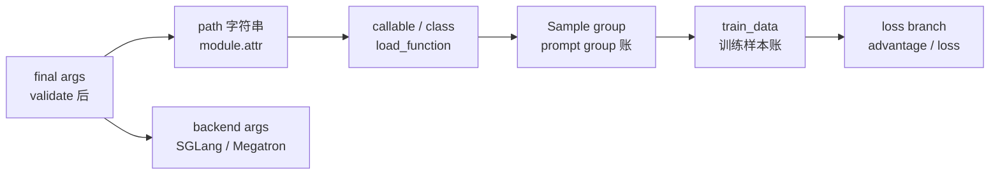
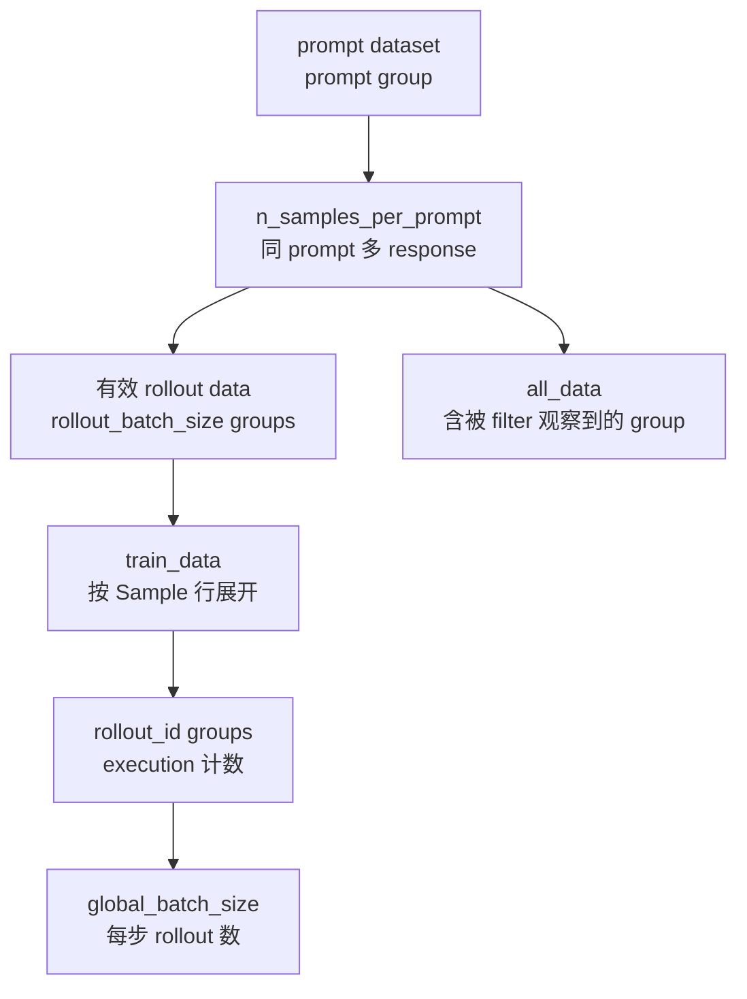

# 训练与Rollout参数 · 数据流

## 你为什么要读

这篇把参数流压成几张表。读完后，你应该能把一个字段从 CLI 追到运行对象，而不是只知道它在哪个 `add_argument` 里定义。

## 总体对象流



`04` 的关键交互是：一部分字段会变成 callable，一部分字段会改变样本账，一部分字段只是在进入 SGLang/Megatron 前做透传或校验。

## Path 参数矩阵

| 参数 | 加载点 | 运行职责 | 失败现象 |
|------|--------|----------|----------|
| `data_source_path` | RolloutManager 初始化 | 构造 `data_source_cls(args)` | Ray actor 初始化时 import 或签名失败 |
| `rollout_function_path` | RolloutManager 初始化 | 接管整条 rollout/eval 生成函数 | generate 阶段返回对象不符合契约 |
| `eval_function_path` | validate 继承或 RolloutManager 初始化 | eval 专用 rollout 函数 | eval 走错生成逻辑 |
| `custom_generate_function_path` | `generate_and_rm` per sample | 替换默认 SGLang 单样本 generate | 工具调用、多轮生成逻辑不生效 |
| `dynamic_sampling_filter_path` | 默认 rollout 循环内 | 决定 prompt group 是否进入有效 batch | batch 补样或 drop metric 异常 |
| `rollout_sample_filter_path` | 默认 rollout 生成后 | 修改 `Sample.remove_sample`，影响 loss 参与 | 数据生成了但不训练或 loss mask 异常 |
| `custom_advantage_function_path` | Megatron loss | 填写 `advantages` / `returns` | loss 前缺 advantages |
| `custom_loss_function_path` | Megatron loss | 替换 loss function | `loss_type=custom_loss` 后训练报签名或返回值错误 |
| `custom_megatron_*_path` | Megatron init/logprob/train callsite | 训练后端 hook | hook 不执行或 rank 行为不一致 |

RolloutManager 的装配点证明了前几类 path 不是“文档承诺”，而是 actor 初始化时就被加载：

```python
# 来源：slime/ray/rollout.py L437-L449
data_source_cls = load_function(self.args.data_source_path)
self.data_source = data_source_cls(args)

self.generate_rollout = load_function(self.args.rollout_function_path)
self.eval_generate_rollout = load_function(self.args.eval_function_path)
self.custom_reward_post_process_func = None
if self.args.custom_reward_post_process_path is not None:
    self.custom_reward_post_process_func = load_function(self.args.custom_reward_post_process_path)
self.custom_convert_samples_to_train_data_func = None
if self.args.custom_convert_samples_to_train_data_path is not None:
    self.custom_convert_samples_to_train_data_func = load_function(
        self.args.custom_convert_samples_to_train_data_path
    )
```

## 样本账流



核心公式：

| 字段组合 | 解释 |
|----------|------|
| `rollout_batch_size` | 本轮要保留多少 prompt group |
| `n_samples_per_prompt` | 每个 prompt group 内生成多少 response |
| `rollout_batch_size * n_samples_per_prompt` | 默认路径预期的 rollout execution 数；通常也是 Sample 行数，但 compact 时不是 |
| `num_steps_per_rollout` | 用几步训练消化本轮 rollout execution |
| `global_batch_size` | 每步训练消费的唯一 rollout id 数 |

validate 的公式是权威来源：

```python
# 来源：slime/utils/arguments.py L1911-L1919
if args.num_steps_per_rollout is not None:
    global_batch_size = args.rollout_batch_size * args.n_samples_per_prompt // args.num_steps_per_rollout
    if args.global_batch_size is not None:
        assert args.global_batch_size == global_batch_size, (
            f"global_batch_size {args.global_batch_size} is not equal to "
            f"rollout_batch_size {args.rollout_batch_size} * n_samples_per_prompt {args.n_samples_per_prompt} "
            f"// num_steps_per_rollout {args.num_steps_per_rollout}"
        )
    args.global_batch_size = global_batch_size
```

下表只适用于默认“一次 execution → 一条 Sample”的路径；compact/subagent 应保持同样的 rollout-id 计数，不能按展开行数重算：

| `rollout_batch_size` | `n_samples_per_prompt` | `num_steps_per_rollout` | `global_batch_size` |
|----------------------|------------------------|--------------------------|---------------------|
| 64 | 1 | 1 | 64 |
| 64 | 4 | 1 | 256 |
| 64 | 4 | 2 | 128 |
| 128 | 8 | 4 | 256 |

converter 在展平前验证 compact sibling 的 `rollout_id`，DP scheduler 再把相同 id 的所有 Sample 放在同一个训练 step；因此 Sample 行数可以变化，step 数仍由唯一 id 数决定。

## 生成流：整条 rollout 与 per-sample generate

整条 rollout 函数负责取样、并发、水位、filter、abort、返回契约。per-sample generate 只负责单个样本如何生成。

```python
# 来源：slime/rollout/sglang_rollout.py L249-L261
with state.dp_rank_context() as _:
    # Check sample.generate_function_path for per-sample custom_generate_function_path (e.g., from eval dataset config)
    custom_func_path = getattr(sample, "generate_function_path", None) or args.custom_generate_function_path

    if custom_func_path is not None:
        custom_generate_func = load_function(custom_func_path)
        # if signature has evaluation, pass evaluation
        if "evaluation" in inspect.signature(custom_generate_func).parameters:
            sample = await custom_generate_func(args, sample, sampling_params, evaluation=evaluation)
        else:
            sample = await custom_generate_func(args, sample, sampling_params)
    else:
        sample = await generate(args, sample, sampling_params)
```

交互边界：

- eval dataset 可以在 `Sample.generate_function_path` 上覆盖全局 custom generate。
- 如果 custom generate 签名包含 `evaluation`，默认路径会传入 eval 状态。
- custom generate 返回的 sample 仍要满足后续 RM、filter、train data 转换需要的字段。

## 过滤流：dynamic filter、sample filter、all-samples process

| 插件 | 看到的数据 | 作用 | 是否补样 |
|------|------------|------|----------|
| dynamic sampling filter | 一个 prompt group | 决定这个 group 是否进入有效 data | 会继续补足 `rollout_batch_size` |
| rollout sample filter | 已保留的有效 data | 修改 `remove_sample` 等字段 | 不补样 |
| all-samples process | 包含被观察到的所有 group | 记录、回灌、外部处理 | 不直接补样 |

源码中的三个位置是分开的：

```python
# 来源：slime/rollout/sglang_rollout.py L429-L439
dynamic_filter_output = call_dynamic_filter(dynamic_filter, args, group)
if not dynamic_filter_output.keep:
    metric_gatherer.on_dynamic_filter_drop(reason=dynamic_filter_output.reason)
    state.remaining_batch_size -= 1
    continue

# add the samples to the data
# NOTE: here we have not stored all the unused samples back to the data buffer.
if len(data) < target_data_size:
    data.append(group)
    pbar.update(args.n_samples_per_prompt)
```

```python
# 来源：slime/rollout/sglang_rollout.py L456-L467
# reset the global state to prevent effects on the next rollout or eval.
state.reset()
if args.rollout_sample_filter_path is not None:
    filter_func = load_function(args.rollout_sample_filter_path)
    filter_func(args, data)

# There can be circumstances where users want to process all samples including filtered ones.
if args.rollout_all_samples_process_path is not None:
    process_func = load_function(args.rollout_all_samples_process_path)
    process_func(args, all_samples, data_source)

return RolloutFnTrainOutput(samples=data, metrics=metric_gatherer.collect()), aborted_samples
```

## Reward 流

Reward 有三层优先级：

1. eval dataset 或 sample 上的 per-sample custom RM。
2. 全局 `custom_rm_path`。
3. 内置 `rm_type`，例如 remote、math、dapo、f1、gpqa。

```python
# 来源：slime/rollout/rm_hub/__init__.py L55-L96
async def async_rm(args, sample: Sample, **kwargs):
    # Per-sample custom_rm_path (from eval dataset config) takes priority
    if sample.custom_rm_path:
        rm_function = load_function(sample.custom_rm_path)
        return await rm_function(args, sample, **kwargs)

    if args.custom_rm_path is not None:
        rm_function = load_function(args.custom_rm_path)
        return await rm_function(args, sample, **kwargs)

    metadata = sample.metadata if isinstance(sample.metadata, dict) else {}
    rm_type = (metadata.get("rm_type") or args.rm_type or "").strip()
    response = sample.response
    label = sample.label
    if rm_type.startswith("boxed_"):
        response = extract_boxed_answer(response) or ""
        rm_type = rm_type[len("boxed_") :]

    # This function is intended for remote or time-consuming reward model evaluation.
    # Implement the actual logic as needed.
    if rm_type == "remote_rm":
        return await remote_rm(args, sample)
    elif rm_type == "deepscaler":
        return get_deepscaler_rule_based_reward(response, label)
    elif rm_type == "dapo":
        return compute_score_dapo(response, label)
    elif rm_type == "math":
        return 1 if grade_answer_verl(response, label) else 0
    elif rm_type == "f1":
        return f1_score(response, label)[0]
    elif rm_type == "gpqa":
        return compute_gpqa_reward(response, label, metadata=metadata)
    elif rm_type == "ifbench":
        from .ifbench import compute_ifbench_reward

        return compute_ifbench_reward(response, label, metadata=metadata)
    elif rm_type == "random":
        return random.randint(0, 1)
    elif rm_type:
        raise NotImplementedError(f"Rule-based RM for {rm_type} is not implemented.")
    else:
        raise NotImplementedError("Rule-based RM type is not specified.")
```

`group_rm=True` 会走 batched 形态，custom RM 签名也要变成 `(args, samples)`。

## 算法流

| 参数 | 最终消费点 | 作用 |
|------|------------|------|
| `advantage_estimator` | `compute_advantages_and_returns` | 选择 GRPO/GSPO/CISPO/PPO/REINFORCE++ 分支 |
| `custom_advantage_function_path` | `compute_advantages_and_returns` | KL 计算后接管 advantages/returns |
| `loss_type` | loss function dispatch | 选择 policy/value/SFT/custom loss |
| `custom_loss_function_path` | loss function dispatch | 替换 loss 函数 |
| `use_rollout_logprobs` | logprob 选择 | 使用 rollout 侧 logprob 而不是 actor 重新算 |

custom advantage 的优先级高于内置 estimator：

```python
# 来源：slime/backends/megatron_utils/loss.py L715-L724
if args.custom_advantage_function_path is not None:
    custom_adv_fn = load_function(args.custom_advantage_function_path)
    custom_adv_fn(args, rollout_data)
    advantages, returns = rollout_data["advantages"], rollout_data["returns"]

elif args.advantage_estimator in ["grpo", "gspo", "cispo"]:
    rewards = torch.tensor(rewards, dtype=torch.float32, device=kl[0].device)
    returns = get_grpo_returns(rewards, kl)
    # TODO: is the copy necessary?
    advantages = [r for r in returns]
```

## 后端透传流

SGLang 参数会变成 `args.sglang_*`，但 Slime 跳过了自己要管理的字段。

```python
# 定位骨架（据 `slime/backends/sglang_utils/arguments.py` L88-L115 删节）：
if isinstance(item_flag, str) and item_flag.startswith("-"):
    original_flag_stem = item_flag.lstrip("-")  # "foo-bar" from "--foo-bar", or "f" from "-f"
    prefixed_item = f"--sglang-{original_flag_stem}"
    new_name_or_flags_list.append(prefixed_item)
else:
    # Positional arguments or non-string items
    new_name_or_flags_list.append(item_flag)

# Prepare kwargs for the actual add_argument call.
# Make a copy to avoid modifying the original kwargs dict.
final_kwargs = kwargs.copy()

# If 'dest' is explicitly provided and is a string, prefix it.
# This ensures the attribute on the args namespace becomes, e.g., args.sglang_dest_name.
if "dest" in final_kwargs and isinstance(final_kwargs["dest"], str):
    original_dest = final_kwargs["dest"]
    # Avoid double prefixing if dest somehow already starts with sglang_
    if not original_dest.startswith("sglang_"):
        final_kwargs["dest"] = f"sglang_{original_dest}"
# If 'dest' is not explicitly provided (or is None/not a string),
# argparse will derive 'dest' from the (now prefixed) flag names.
# E.g., if the first flag is "--sglang-foo-bar", argparse sets dest to "sglang_foo_bar".

old_add_argument(*new_name_or_flags_list, **final_kwargs)

parser.add_argument = new_add_argument_wrapper
ServerArgs.add_cli_args(parser)
parser.add_argument = old_add_argument
```

Megatron 参数则会和 HF config 做结构对齐：

```python
# 来源：slime/backends/megatron_utils/arguments.py L114-L144
for hf_config_name, megatron_config_name, compare_fn in [
    ("hidden_size", "hidden_size", equal),
    ("num_attention_heads", "num_attention_heads", equal),
    ("num_hidden_layers", "num_layers", equal),
    ("intermediate_size", "ffn_hidden_size", equal),
    ("moe_intermediate_size", "moe_ffn_hidden_size", equal),
    ("shared_expert_intermediate_size", "moe_shared_expert_intermediate_size", equal),
    ("tie_word_embeddings", "untie_embeddings_and_output_weights", lambda x, y: not x == y),
    ("rms_norm_eps", "norm_epsilon", equal),
    ("rms_norm_eps", "layernorm_epsilon", equal),
]:
    if hf_config_name == "intermediate_size" and not validate_dense_ffn:
        continue

    if hasattr(hf_config, hf_config_name) and hasattr(args, megatron_config_name):
        if not compare_fn(getattr(hf_config, hf_config_name), getattr(args, megatron_config_name)):
            errors.append(
                f"{hf_config_name} in hf config {getattr(hf_config, hf_config_name)} is not equal to "
                f"{megatron_config_name} {getattr(args, megatron_config_name)}, please check the config."
            )

# Validate rope_theta separately using the resolved value
if _hf_rope_theta is not None:
    if not equal(_hf_rope_theta, getattr(args, "rotary_base", None)):
        errors.append(
            f"rope_theta in hf config {_hf_rope_theta} is not equal to "
            f"rotary_base {getattr(args, 'rotary_base', None)}, please check the config."
        )

if len(errors) > 0:
    raise AssertionError("hf_validate_args failed: " + "; ".join(errors))
```

## 验证流

| 验证 | 覆盖 |
|------|------|
| `tests/plugin_contracts/test_plugin_path_loading_contracts.py` | path 加载、签名、默认行为 |
| `tests/plugin_contracts/test_plugin_rollout_contracts.py` | `rollout_function_path` 整条函数契约 |
| `tests/plugin_contracts/test_plugin_generate_contracts.py` | per-sample custom generate 与 eval 覆盖 |
| `tests/plugin_contracts/test_plugin_runtime_hook_contracts.py` | runtime hook callsite 和签名 |
| `tests/test_dp_schedule.py` | rollout-id 分步、compact sibling、动态/静态 micro-batch 与尾部裁剪 |
| `tests/test_megatron_argument_validation.py` | HF/AllGather-CP 校验、zero rollout、delta/disk 约束；不覆盖 batch 公式或 eval 继承 |

contract tests 明确固定了 path 参数的签名：

```python
# 来源：slime/tests/plugin_contracts/test_plugin_path_loading_contracts.py L254-L296
SYNC_CASES = [
    SyncCase(
        "eval_function",
        "EVAL_FUNCTION_PATH",
        "slime.rollout.sglang_rollout.generate_rollout",
        check_eval_function_default,
        check_eval_function_path,
    ),
    SyncCase(
        "dynamic_filter",
        "DYNAMIC_SAMPLING_FILTER_PATH",
        "slime.rollout.filter_hub.dynamic_sampling_filters.check_reward_nonzero_std",
        check_dynamic_filter_default,
        check_dynamic_filter_path,
    ),
    SyncCase(
        "buffer_filter",
        "BUFFER_FILTER_PATH",
        "slime.rollout.data_source.pop_first",
        check_buffer_filter_default,
        check_buffer_filter_path,
    ),
    SyncCase(
        "data_source",
        "DATA_SOURCE_PATH",
        "plugin_contracts.test_plugin_path_loading_contracts.ReferenceDataSource",
        check_data_source_default,
        check_data_source_path,
    ),
    SyncCase(
        "rollout_sample_filter",
        "ROLLOUT_SAMPLE_FILTER_PATH",
        "plugin_contracts.test_plugin_path_loading_contracts.reference_rollout_sample_filter",
        check_rollout_sample_filter_default,
        check_rollout_sample_filter_path,
    ),
    SyncCase(
        "rollout_all_samples_process",
        "ROLLOUT_ALL_SAMPLES_PROCESS_PATH",
        "plugin_contracts.test_plugin_path_loading_contracts.reference_rollout_all_samples_process",
        check_rollout_all_samples_process_default,
        check_rollout_all_samples_process_path,
    ),
```

覆盖边界：runtime hook contract 目前只检查 custom converter 返回旧的最小字段集合，而当前 scheduler 还要求 `rollout_ids`。因此它证明“path 可加载、签名可调用”，不能单独证明自定义 converter 能走完整训练链。

下一篇 [[Slime-训练与Rollout参数-排障指南]] 按症状进入这些流。
