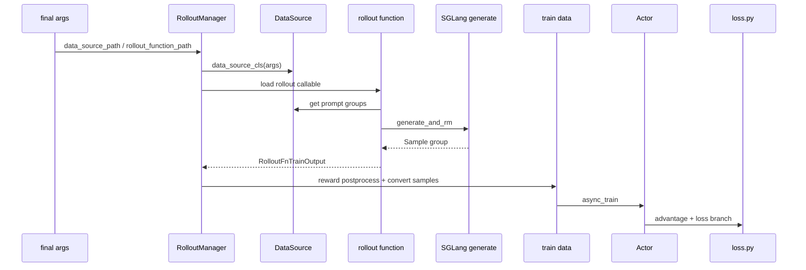

# 训练与Rollout参数 · 源码走读

这篇追踪一条真实主线：一次 rollout step 如何从配置字段走到数据源、生成函数、reward/filter、train data、advantage/loss 和权重同步。

读完后，你应该能定位这些问题：某个 `*-path` 到底在哪加载，`rollout_batch_size` 和 `global_batch_size` 为什么不是一个概念，custom generate 与 custom rollout 为什么不是同一个接口，`loss_type` 和 `advantage_estimator` 最终在哪里生效。

## 长文读法

这篇按“参数如何落到闭环中的真实对象”读：参数层先声明权重同步、HF 对齐、rollout 函数、数据源、filter、reward、loss 等入口；`validate_args` 把 batch 语义和模式约束补齐；`RolloutManager` 动态加载 data source、rollout callable 和后处理函数；训练侧再根据 advantage / loss 参数消费转换后的 `train_data`，最后按间隔推权。

| 读者任务 | 先读 | 要抓住的判断 |
|----------|------|--------------|
| 第一次建立参数到闭环的路径 | 贯穿场景、主线图、步骤一到四 | 参数不是静态配置，很多 `*-path` 会在 RolloutManager 初始化时变成 callable |
| 区分 custom rollout 和 custom generate | 步骤二、步骤六 | `rollout_function_path` 是整条生成协议；单次 SGLang generate 只是默认 rollout 内部的一环 |
| 排查 batch size 关系 | 贯穿场景、步骤三、步骤八 | 默认路径先形成 rollout execution；compact 可展开多条 Sample，scheduler 按唯一 `rollout_id` 而非行数分步 |
| 排查数据源和 buffer 入口 | 步骤四到五 | `data_source_path` 构造 DataSource，对 prompt group 游标、buffer 和 partial 回灌负责 |
| 排查 dynamic filter / sample filter | 步骤六到七 | dynamic filter 决定是否保留一组样本，sample filter 和 all-samples process 是生成后的出口 |
| 排查 reward / advantage / loss 生效点 | 步骤八到九 | reward postprocess 和 train data conversion 在 RolloutManager，advantage 和 loss 分支在 Megatron loss |
| 排查权重同步配置 | 步骤一、十到十一 | update interval 在训练循环里控制时机，full/delta、nccl/disk 的实现由 actor 初始化和参数校验决定 |

读的时候不要只盯 parser。真正的理解点是：哪个参数只参与校验，哪个参数会变成 callable，哪个参数最终改变 rollout 数据、训练 loss 或权重同步行为。

## 贯穿场景

假设一条训练命令包含：

```powershell
python train.py --rollout-batch-size 64 --n-samples-per-prompt 4 --num-steps-per-rollout 2 --rollout-function-path slime.rollout.sglang_rollout.generate_rollout --advantage-estimator grpo --loss-type policy_loss
```

主线推导：

- 一次 rollout 目标是 64 个 prompt group。
- 默认路径每个 prompt 发起 4 个 rollout execution，共 256 个；通常也返回 256 条 Sample。
- `num_steps_per_rollout=2` 会把 `global_batch_size` 推成每步 128 个唯一 rollout id。
- `rollout_function_path` 被 RolloutManager 加载为整条生成函数。
- `advantage_estimator=grpo` 在 Megatron loss 中决定 returns/advantages 分支。
- 同步 `train.py` 每轮训练后发布；只有流水异步 `train_async.py` 用 `update_weights_interval` 控制发布间隔，并在发布前 drain 在途 generation。

## 主线图



## 步骤一：train 参数埋下权重同步和 HF 对齐边界

系统压力：训练侧是 Megatron 权重，rollout 侧是 SGLang/HF 形态。参数层必须同时表达转换方式、权重同步载体和 delta 模式约束。

设计选择：train 参数段把 Megatron to HF、full/delta、nccl/disk 放在一起。

```python
# 来源：slime/utils/arguments.py L128-L155
parser.add_argument(
    "--megatron-to-hf-mode",
    choices=["raw", "bridge"],
    default="raw",
    help="The method to convert megatron weights to hugging face weights for SGLang.",
)
# Delta weight sync.
parser.add_argument(
    "--update-weight-mode",
    choices=["full", "delta"],
    default="full",
    help=(
        "Weight sync strategy. 'full' (default) broadcasts every parameter "
        "every sync. 'delta' diffs each sync against a pinned-CPU snapshot of the "
        "previous one and ships only the changed bytes (disk transport only)."
    ),
)
parser.add_argument(
    "--update-weight-transport",
    choices=["nccl", "disk"],
    default="nccl",
    help=(
        "Carrier for weight sync. In full mode, 'nccl' broadcasts chunks and "
        "'disk' writes a complete HF checkpoint under --update-weight-disk-dir "
        "before engines reload it. Delta mode is 'disk' only: each host applies the "
        "published deltas into its local checkpoint and reloads via update_weights_from_disk."
    ),
)
```

不变量：`update_weight_mode` 决定同步策略，`update_weight_transport` 决定载体；delta 不是 NCCL 的一个小优化，它只允许 disk。

## 步骤二：rollout 函数是整条生成协议，不是单个 HTTP 调用

系统压力：默认 rollout 不只是调用 SGLang，还要取数据、并发生成、打分、过滤、处理 abort、返回训练数据契约。替换整条函数必须承担这些责任。

设计选择：`rollout_function_path` 指向 `generate_rollout(args, rollout_id, data_source, evaluation=False)`。

```python
# 来源：slime/utils/arguments.py L304-L340
def add_rollout_arguments(parser):
    parser.add_argument(
        "--hf-checkpoint",
        type=str,
        default=None,
        help=(
            "The huggingface checkpoint of the trained model. "
            "This is used to initialize sglang and also provide the tokenizer. "
            "Note that, we will always update the parameters in sglang with that of megatron before training, "
            "so you only need to provide a huggingface checkpoint that has the same architecture as the model you want to train. "
            "It doesn't necessary need to contain the most up-to-date parameters."
        ),
    )
    parser.add_argument(
        "--model-name",
        type=str,
        default=None,
        help=(
            "The name of the model, this is used to convert the megatron weights into huggingface format. "
            "If not set, we will use `type(AutoConfig.from_pretrained(args.hf_checkpoint)).__name__.lower()` as model_name. "
            "Also, sometimes this will help alleviate the bug that transformers cannot find certain model."
        ),
    )
    parser.add_argument(
        "--rollout-function-path",
        type=str,
        default="slime.rollout.sglang_rollout.generate_rollout",
        help=(
            "Path to the rollout generation function."
            "You should use this model to create your own custom rollout function, "
            "and then set this to the path of your custom rollout function. "
            "The signature of the function should be "
            "`def generate_rollout(args, rollout_id, data_source, evaluation=False) -> RolloutFnTrainOutput | RolloutFnEvalOutput`"
            "and within the output sample, you should at least set `tokens`, `response_length`, `reward` "
            "and `status`."
        ),
    )
```

读者抓手：`hf_checkpoint` 在这里是 rollout/tokenizer/HF 架构基准，不表示训练权重永远来自它；训练前会推 Megatron 权重到 SGLang。

## 步骤三：validate 把 eval 和 batch 语义补成运行事实

系统压力：eval 可以复用 rollout 函数；用户也可以用 `num_steps_per_rollout` 表达“一个 rollout 产出的样本分几步训练”。这些不是 parser 默认值能完全表达的。

设计选择：validate 里补 `eval_function_path`，并用默认 rollout execution 规模反推 `global_batch_size`。这条公式不能解释成“每步裸 Sample 行数”。

```python
# 来源：slime/utils/arguments.py L1908-L1919
if args.eval_function_path is None:
    args.eval_function_path = args.rollout_function_path

if args.num_steps_per_rollout is not None:
    global_batch_size = args.rollout_batch_size * args.n_samples_per_prompt // args.num_steps_per_rollout
    if args.global_batch_size is not None:
        assert args.global_batch_size == global_batch_size, (
            f"global_batch_size {args.global_batch_size} is not equal to "
            f"rollout_batch_size {args.rollout_batch_size} * n_samples_per_prompt {args.n_samples_per_prompt} "
            f"// num_steps_per_rollout {args.num_steps_per_rollout}"
        )
    args.global_batch_size = global_batch_size
```

执行逻辑：

- `eval_function_path=None` 是“延迟到 validate 继承 rollout path”。
- `num_steps_per_rollout` 是训练侧 rollout-count 推导，不改变 rollout 生成与 compact 展开的 Sample 行数。
- 如果用户同时给了不一致的 `global_batch_size`，validate 直接 assert。

## 步骤四：RolloutManager 装配所有高层 callable

系统压力：真正运行前，字符串 path 必须变成 callable；如果推迟到 generate 中才 import，错误会拖到训练中途暴露。

设计选择：RolloutManager 初始化时加载数据源、rollout 函数、eval 函数、reward postprocess 和 samples to train data。

```python
# 来源：slime/ray/rollout.py L437-L449
data_source_cls = load_function(self.args.data_source_path)
self.data_source = data_source_cls(args)

self.generate_rollout = load_function(self.args.rollout_function_path)
self.eval_generate_rollout = load_function(self.args.eval_function_path)
self.custom_reward_post_process_func = None
if self.args.custom_reward_post_process_path is not None:
    self.custom_reward_post_process_func = load_function(self.args.custom_reward_post_process_path)
self.custom_convert_samples_to_train_data_func = None
if self.args.custom_convert_samples_to_train_data_path is not None:
    self.custom_convert_samples_to_train_data_func = load_function(
        self.args.custom_convert_samples_to_train_data_path
    )
```

不变量与失败模式：

- path import 失败会在 RolloutManager 初始化时暴露。
- data source path 必须加载到 class，并且 `__init__(args)` 可用。
- rollout/eval function 要符合 `RolloutFnTrainOutput` / `RolloutFnEvalOutput` 契约。

## 步骤五：DataSource 负责 prompt group 账

系统压力：rollout 不只是读 JSONL。它还要记录 epoch、sample group index、buffer、续训状态、partial rollout 回灌。

设计选择：默认 `RolloutDataSourceWithBuffer` 先从 buffer 取，再从全局 dataset 取；buffer filter 是独立插件点。

```python
# 来源：slime/rollout/data_source.py L168-L196
class RolloutDataSourceWithBuffer(RolloutDataSource):
    def __init__(self, args):
        super().__init__(args)
        self.buffer = []
        if self.args.buffer_filter_path is None:
            self.buffer_filter = pop_first
        else:
            self.buffer_filter = load_function(self.args.buffer_filter_path)

    def get_samples(self, num_samples: int) -> list[list[Sample]]:
        """
        Return num_samples samples
        """

        samples = self._get_samples_from_buffer(num_samples)
        num_samples -= len(samples)

        if num_samples == 0:
            return samples

        samples += super().get_samples(num_samples=num_samples)
        return samples

    def _get_samples_from_buffer(self, num_samples: int) -> list[list[Sample]]:
        if len(self.buffer) == 0 or num_samples == 0:
            return []

        samples = self.buffer_filter(self.args, None, self.buffer, num_samples)
        return samples
```

读者抓手：`buffer_filter_path` 不筛选刚生成的样本，它筛选 buffer 中的旧样本。

## 步骤六：默认 SGLang rollout 用 dynamic filter 维持有效 batch

系统压力：DAPO 风格过滤可能丢掉全对或全错的 prompt group，但训练仍需要 `rollout_batch_size` 个有效 group。生成函数必须边生成边补样。

设计选择：默认 rollout 维护 `data` 和 `all_data` 两本账；dynamic filter drop 后只减少剩余水位，不把 group 加入有效数据。

```python
# 来源：slime/rollout/sglang_rollout.py L394-L439
# instantiate data filters
dynamic_filter = (
    load_function(args.dynamic_sampling_filter_path) if args.dynamic_sampling_filter_path is not None else None
)

metric_gatherer = MetricGatherer()

# target_data_size is the total number of valid samples to get
target_data_size = args.rollout_batch_size

data = []
all_data = []
do_print = True
pbar = tqdm(total=target_data_size * args.n_samples_per_prompt, desc="Rollout generation")
while len(data) < target_data_size:
    while state.remaining_batch_size < target_data_size:
        # get samples from the buffer and submit the generation requests.
        samples = data_source(args.over_sampling_batch_size)
        state.submit_generate_tasks(samples)

    # wait for the generation to finish
    done, state.pendings = await asyncio.wait(state.pendings, return_when=asyncio.FIRST_COMPLETED)
    for task in done:
        group: list[Sample] = task.result()

        if do_print:
            sample = group[0][0] if isinstance(group[0], list) else group[0]
            logger.info(
                f"First rollout sample: {[str(sample.prompt) + sample.response]}, label: {str(sample.label)[:100]}, reward: {sample.reward}",
            )
            do_print = False

        assert len(group) == args.n_samples_per_prompt
        all_data.append(group)

        dynamic_filter_output = call_dynamic_filter(dynamic_filter, args, group)
        if not dynamic_filter_output.keep:
            metric_gatherer.on_dynamic_filter_drop(reason=dynamic_filter_output.reason)
            state.remaining_batch_size -= 1
            continue

        # add the samples to the data
        # NOTE: here we have not stored all the unused samples back to the data buffer.
        if len(data) < target_data_size:
            data.append(group)
            pbar.update(args.n_samples_per_prompt)
```

这张卡只展示“生成—过滤—保留”主干；后续代码还会 close progress、abort 在途请求并 assert `len(data) == rollout_batch_size`。`all_data` 可能更多，因为它包括被 filter 丢掉的 group。

## 步骤七：sample filter 和 all-samples process 是生成后的两个出口

系统压力：有的逻辑只想让某些 sample 不参与 loss，有的逻辑要观察所有生成结果，包括被 filter 的结果。

设计选择：默认 rollout 在生成完成、abort 收尾后调用两个不同 hook。

```python
# 来源：slime/rollout/sglang_rollout.py L456-L467
# reset the global state to prevent effects on the next rollout or eval.
state.reset()
if args.rollout_sample_filter_path is not None:
    filter_func = load_function(args.rollout_sample_filter_path)
    filter_func(args, data)

# There can be circumstances where users want to process all samples including filtered ones.
if args.rollout_all_samples_process_path is not None:
    process_func = load_function(args.rollout_all_samples_process_path)
    process_func(args, all_samples, data_source)

return RolloutFnTrainOutput(samples=data, metrics=metric_gatherer.collect()), aborted_samples
```

边界：

- `rollout_sample_filter_path` 修改保留下来的有效 data，常用于 loss mask。
- `rollout_all_samples_process_path` 看到 `all_samples` 和 `data_source`，适合记录或回灌。

## 步骤八：reward postprocess 和 train data conversion 接管样本到账本的转换

系统压力：rollout 输出是 `Sample`，训练需要 tensor/list 结构的 train data；reward 可能还要归一化或自定义重排。

设计选择：RolloutManager 先给 custom conversion 优先级；否则走默认 reward postprocess，再生成 train data。生成结果会先被展平；compact sibling 必须共享 rollout id，默认单行 execution 则可由 converter 补唯一 id。

```python
# 来源：slime/ray/rollout.py L686-L723
def _post_process_rewards(self, samples: list[Sample] | list[list[Sample]]):
    if self.custom_reward_post_process_func is not None:
        return self.custom_reward_post_process_func(self.args, samples)

    raw_rewards = [sample.get_reward_value(self.args) for sample in samples]
    if (
        self.args.advantage_estimator in ["grpo", "gspo", "cispo", "reinforce_plus_plus_baseline"]
        and self.args.rewards_normalization
    ):
        # group norm
        rewards = torch.tensor(raw_rewards, dtype=torch.float)
        if rewards.shape[-1] == self.args.n_samples_per_prompt * self.args.rollout_batch_size:
            rewards = rewards.reshape(-1, self.args.n_samples_per_prompt)
        else:
            # when samples count are not equal in each group
            rewards = rewards.view(-1, rewards.shape[-1])
        mean = rewards.mean(dim=-1, keepdim=True)
        rewards = rewards - mean

        if self.args.advantage_estimator in ["grpo", "gspo", "cispo"] and self.args.grpo_std_normalization:
            std = rewards.std(dim=-1, keepdim=True)
            rewards = rewards / (std + 1e-6)

        return raw_rewards, rewards.flatten().tolist()

    return raw_rewards, raw_rewards

def _convert_samples_to_train_data(self, samples: list[Sample] | list[list[Sample]]):
    """
    Convert inference generated samples to training data.
    """
    if self.custom_convert_samples_to_train_data_func is not None:
        return self.custom_convert_samples_to_train_data_func(self.args, samples)

    raw_rewards, rewards = self._post_process_rewards(samples)

    assert len(raw_rewards) == len(samples)
    assert len(rewards) == len(samples)
```

读者抓手：`custom_reward_post_process_path` 改 reward 两本账；`custom_convert_samples_to_train_data_path` 直接替换整个 sample 到 train_data 的转换。

随后 `_split_train_data_by_dp()` 把 `global_batch_size` 解释为每步唯一 rollout id 数。一个 id 下可以有多条 Sample，所有 sibling 保持在同一步，loss reducer 用整条 rollout 的 mask 总和归一化。

这里存在一个当前测试缺口：`test_plugin_runtime_hook_contracts.py` 的 reference converter 只返回 tokens/reward/mask 等旧最小字段，但 `_split_train_data_by_dp()` 现在无条件读取 `data["rollout_ids"]`。自定义 converter 若完全替换默认转换，必须自行提供 `rollout_ids` 及 scheduler 后续依赖的字段；现有 contract test 尚不能证明这一运行契约完整。

## 步骤九：训练侧再消费 advantage 和 loss 参数

系统压力：rollout 已经给出 rewards、log_probs、loss masks 等字段，但最终训练目标要在 Megatron 的 pipeline stage 上计算。

设计选择：custom advantage 在 KL 计算之后接管；loss type 在 loss function 中分派。

```python
# 来源：slime/backends/megatron_utils/loss.py L715-L726
if args.custom_advantage_function_path is not None:
    custom_adv_fn = load_function(args.custom_advantage_function_path)
    custom_adv_fn(args, rollout_data)
    advantages, returns = rollout_data["advantages"], rollout_data["returns"]

elif args.advantage_estimator in ["grpo", "gspo", "cispo"]:
    rewards = torch.tensor(rewards, dtype=torch.float32, device=kl[0].device)
    returns = get_grpo_returns(rewards, kl)
    # TODO: is the copy necessary?
    advantages = [r for r in returns]

elif args.advantage_estimator == "ppo":
```

```python
# 来源：slime/backends/megatron_utils/loss.py L1264-L1274
match args.loss_type:
    case "policy_loss":
        func = policy_loss_function
    case "value_loss":
        func = value_loss_function
    case "sft_loss":
        func = sft_loss_function
    case "custom_loss":
        func = load_function(args.custom_loss_function_path)
    case _:
        raise ValueError(f"Unknown loss type: {args.loss_type}")
```

不变量：如果 `loss_type=custom_loss`，`custom_loss_function_path` 必须能 import 且签名匹配训练侧调用。

## 步骤十：训练后才按间隔推权

系统压力：actor 训练后 rollout engine 需要新权重；但 async 场景允许按 interval 降低同步频率。同步主循环当前每步推权，async 主循环会检查 interval。

设计选择：参数层定义 interval；训练入口消费它。

```python
# 来源：slime/utils/arguments.py L523-L543
parser.add_argument(
    "--update-weights-interval",
    type=int,
    default=1,
    help="Interval for updating the weights",
)
parser.add_argument(
    "--keep-old-actor",
    action="store_true",
    help="Whether to keep the rollout model on training process",
)

parser.add_argument(
    "--rollout-data-postprocess-path",
    type=str,
    default=None,
    help=(
        "The called after we have all the rollout data including log_probs. "
        "It may be helpful for updating loss mask."
    ),
)
```

```python
# 来源：train_async.py L65-L69
if (rollout_id + 1) % args.update_weights_interval == 0:
    # sync generate before update weights to prevent update weight in the middle of generation
    rollout_data_curr_ref = ray.get(x) if (x := rollout_data_next_future) is not None else None
    rollout_data_next_future = None
    actor_model.update_weights()
```

同步 `train.py` 当前在每轮训练后调用 `actor_model.update_weights()`；不要把 async 的 interval 行为误套到同步路径。

## 步骤十一：权重同步实现由 actor 初始化选择

系统压力：同一个 `update_weights()` API 后面可能是 colocate tensor、distributed NCCL、full disk、delta disk。

设计选择：Megatron actor 初始化时根据 mode/transport 选 updater；validate 先挡掉非法组合。

```python
# 来源：slime/utils/arguments.py L1980-L2002
# disk-backed sync (full or delta) writes on the trainer and reads on the engines: needs a shared dir
if args.update_weight_transport == "disk" and not args.update_weight_disk_dir:
    raise ValueError(
        "--update-weight-transport=disk requires --update-weight-disk-dir to point at "
        "a filesystem shared between the trainer and the rollout engines."
    )
if args.update_weight_mode == "delta":
    if args.update_weight_transport != "disk":
        raise ValueError(
            "--update-weight-mode=delta requires --update-weight-transport=disk, "
            f"got {args.update_weight_transport!r}."
        )
    if args.colocate:
        raise ValueError(
            "--update-weight-mode=delta is not supported with --colocate. Colocate transfers "
            "weights via CUDA IPC (only a handle crosses processes), so the delta bookkeeping "
            "(snapshot + diff + encode) is pure overhead."
        )
    if not args.update_weight_local_checkpoint_dir:
        raise ValueError(
            "--update-weight-mode=delta requires --update-weight-local-checkpoint-dir "
            "(a rollout-host-local NVMe directory)."
        )
```

运行时的选择在 actor：

```python
# 来源：slime/backends/megatron_utils/actor.py L583-L620
def update_weights(self) -> None:
    if self.args.debug_train_only or self.args.debug_rollout_only:
        return

    if self.args.use_fault_tolerance:
        if dist.get_rank() == 0:
            ray.get(self.rollout_manager.recover_updatable_engines.remote())
        dist.barrier(group=get_gloo_group())

    (
        rollout_engines,
        rollout_engine_lock,
        num_new_engines,
        engine_gpu_counts,
        engine_gpu_offsets,
        all_engine_actors,
    ) = ray.get(self.rollout_manager.get_updatable_engines_and_lock.remote())

    reconnect_rollout_engines = self.args.offload_train and self.args.use_critic and not self.args.colocate

    if not rollout_engines and not reconnect_rollout_engines:
        if dist.get_rank() == 0:
            logger.info("No updatable SGLang engines are running; skip weight update.")
        return

    if reconnect_rollout_engines:
        self.wake_up()
    elif self.args.offload_train:
        reload_process_groups()

    if num_new_engines > 0 or reconnect_rollout_engines:
        self.weight_updater.connect_rollout_engines(
            rollout_engines,
            rollout_engine_lock,
            engine_gpu_counts=engine_gpu_counts,
            engine_gpu_offsets=engine_gpu_offsets,
            all_engine_actors=all_engine_actors,
        )
```

读者抓手：参数决定 updater，但 `update_weights()` 还要看当前是否有 updatable engines、是否 fault tolerance 恢复了新 engine、是否 offload 需要重连。

## 运行验证

从知识库根目录运行：

```powershell
python -m pytest slime/tests/test_dp_schedule.py -q
python -m pytest slime/tests/plugin_contracts -q
python -m pytest slime/tests/test_megatron_argument_validation.py -q
```

预期现象：

- path loading tests 验证 eval function、dynamic filter、buffer filter、data source、sample filter、all-samples process、custom RM 的签名。
- rollout contract tests 验证 `rollout_function_path` 的整条函数契约。
- generate contract tests 验证 per-sample `custom_generate_function_path` 及 eval 覆盖优先级。
- DP schedule tests 验证按唯一 rollout id 分步、compact sibling 同步归组、尾部不足一整步时裁剪等不变量。
- argument validation tests 当前验证 HF/AllGather-CP 与 disk/delta/zero-rollout 等边界；并未覆盖 `eval_function_path` 继承或 global-batch 公式。

当前轻量环境实测：DP schedule 9 passed，argument validation 14 passed；plugin contracts 因缺 `httpx` 在 collection 阶段失败。

## 复盘迁移

这组参数的读法可以迁移到其他大参数文件：

1. 先找最终消费点，再回头看 `add_argument`。
2. path 参数必须找 `load_function` 和 contract tests。
3. batch 参数必须画清 prompt group、rollout execution、Sample 行、train step 与 micro-batch 五本账。
4. 算法参数要看 loss 分支，不要只看 help text。
5. 后端透传要看 ownership 边界和 validate 互斥。

下一篇 [[Slime-训练与Rollout参数-数据流]] 用矩阵对照这些流向。
