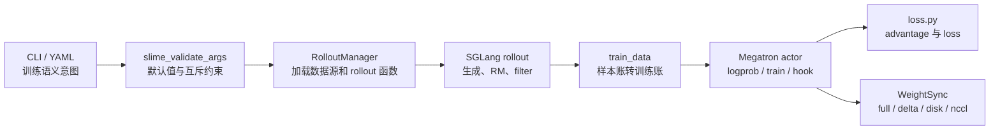

# 训练与Rollout参数

这组文档解决一个具体问题：Ray 资源事实已经由 [[Slime-Ray参数]] 收口，剩下这些 train、rollout、data、algo、reward、plugin 参数如何真正挂进 RL 闭环。

旧读法容易把 `arguments.py` 当成参数清单。更稳的读法是把它看成“运行契约编译器”：CLI 字段先表达意图，`slime_validate_args` 补默认值和互斥约束，RolloutManager、SGLang rollout、Megatron actor、loss 函数再把这些字段变成可调用对象、样本账、训练 batch、权重同步和插件 hook。

## 读完能解决什么

| 你遇到的问题 | 本专题给你的抓手 |
|--------------|------------------|
| 自定义 rollout 函数没生效 | 看 `rollout_function_path` 在 RolloutManager 初始化时如何被 `load_function` 加载 |
| `eval_function_path` 没传却有值 | 看 validate 如何继承 `rollout_function_path` |
| `global_batch_size` 和训练数据行数对不上 | 先区分默认 rollout execution 数与 compact/subagent 展开的 Sample 行，再看 DP scheduler 按 `rollout_id` 分步 |
| custom generate、dynamic filter、sample filter 混淆 | 区分 per-sample 生成钩子、组级采样过滤、loss 参与过滤 |
| custom loss / advantage 不生效 | 看 Megatron loss 中的 `load_function` 消费点 |
| disk/delta 权重同步启动失败 | 看 validate 对 shared dir、transport、colocate、本地 checkpoint 的约束 |

## 主线地图



这条链路的核心不是“有哪些参数”，而是“哪个参数在哪个运行点改变行为”。

## 阅读顺序

| 文档 | 读者任务 |
|------|----------|
| [[Slime-训练与Rollout参数-核心概念]] | 建立样本账、函数路径、算法开关、后端透传四类心理模型 |
| [[Slime-训练与Rollout参数-源码走读]] | 沿一次 rollout 到 train 的主线读参数消费点 |
| [[Slime-训练与Rollout参数-数据流]] | 对照 path 参数、batch 参数、算法参数如何流向运行时 |
| [[Slime-训练与Rollout参数-排障指南]] | 按症状排查自定义函数、batch 推导、loss/advantage、权重同步 |
| [[Slime-训练与Rollout参数-学习检查]] | 用推导题验证自己能从配置推出运行行为 |

## 源码范围

| 源码入口 | 本专题关注点 |
|----------|--------------|
| `slime/utils/arguments.py` L107-L155 | 训练环境、Megatron to HF、full/delta weight sync |
| `slime/utils/arguments.py` L304-L340 | `hf_checkpoint`、`model_name`、`rollout_function_path` |
| `slime/utils/arguments.py` L441-L562 | dynamic filter、partial rollout、custom generate、buffer filter、update interval、rollout data postprocess |
| `slime/utils/arguments.py` L592-L725 | data source、prompt dataset、rollout batch、global batch 推导入口 |
| `slime/utils/arguments.py` L766-L775 与 L1908-L1919 | eval function 默认值和 global batch validate |
| `slime/utils/arguments.py` L902-L967 与 L1796-L1835 | loss、custom advantage、算法互斥与默认修正 |
| `slime/utils/arguments.py` L1316-L1458 | reward、sample conversion、buffer/sample filters、Megatron hooks |
| `slime/ray/rollout.py` L424-L451 与 L686-L723 | RolloutManager 加载 callable、reward postprocess、samples to train data |
| `slime/rollout/sglang_rollout.py` L249-L261 与 L394-L467 | custom generate、dynamic filter、sample filter、all-samples process |
| `slime/backends/megatron_utils/loss.py` L715-L764 与 L1264-L1274 | custom advantage 与 custom loss 的实际消费 |
| `slime/backends/megatron_utils/actor.py` L180-L184 与 L583-L620 | rollout data postprocess 与 weight updater |

刻意不展开：每个 loss 的数学推导、RM 具体打分逻辑、DataSource 续训游标、WeightSync 传输细节。这些在对应专题深入。

## 本专题不变量

| 不变量 | 为什么重要 |
|--------|------------|
| path 参数都必须是 `module.attr` | `load_function` 只做 `rpartition(".")` 后 import module 再取 attribute |
| `rollout_function_path` 替换整条 rollout 函数 | 它返回 `RolloutFnTrainOutput` 或 eval 输出，不只是单 sample generate |
| `custom_generate_function_path` 只替换默认 rollout 内部的 per-sample generate | 它不接管 dynamic filter、abort、sample filter 等外层循环 |
| 默认 SGLang 路径中 `rollout_batch_size` 是有效 prompt group 目标 | 每组先发起 `n_samples_per_prompt` 个默认 rollout execution；full custom rollout 必须自行满足返回契约 |
| 当前 `global_batch_size` 的调度单位是唯一 `rollout_id`，不是展开后的 Sample 行 | compact/subagent 的多个 sibling 共享一个 id；`num_steps_per_rollout` 公式推导的是每步 rollout execution 数 |
| `update_weights_interval` 只被 `train_async.py` 消费 | 同步 `train.py` 当前每轮都发布，不能把 interval 套到同步入口 |
| `loss_type=custom_loss` 必须配 `custom_loss_function_path` | 实际 loss 选择发生在 Megatron loss 函数里 |

## 运行验证入口

优先跑 DP schedule、contract 与参数测试：

```powershell
python -m pytest slime/tests/test_dp_schedule.py -q
python -m pytest slime/tests/plugin_contracts -q
python -m pytest slime/tests/test_megatron_argument_validation.py -q
```

当前轻量环境中 DP schedule 9 项、argument validation 14 项通过；plugin contracts 因缺 `httpx` 在 collection 阶段失败。注意 argument validation 当前不覆盖 global-batch 推导或 eval path 继承，runtime hook contract 也未覆盖 custom converter 新增的 `rollout_ids` 调度字段，不能把测试覆盖写得比实际更大。

下一篇先读 [[Slime-训练与Rollout参数-核心概念]]。
