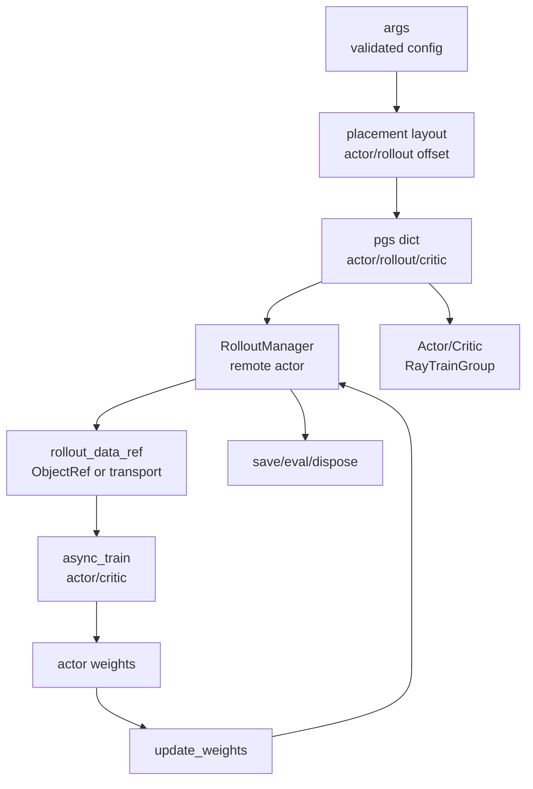
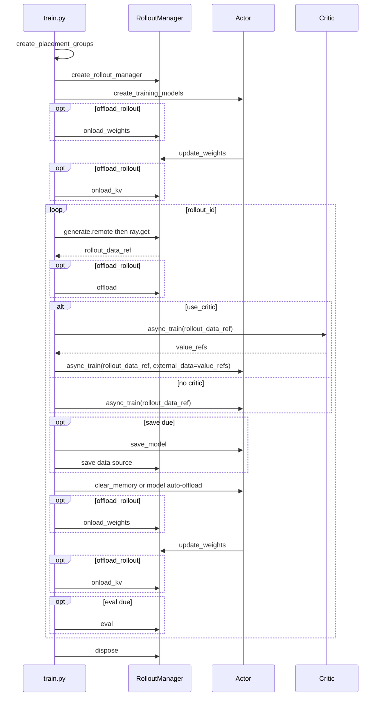
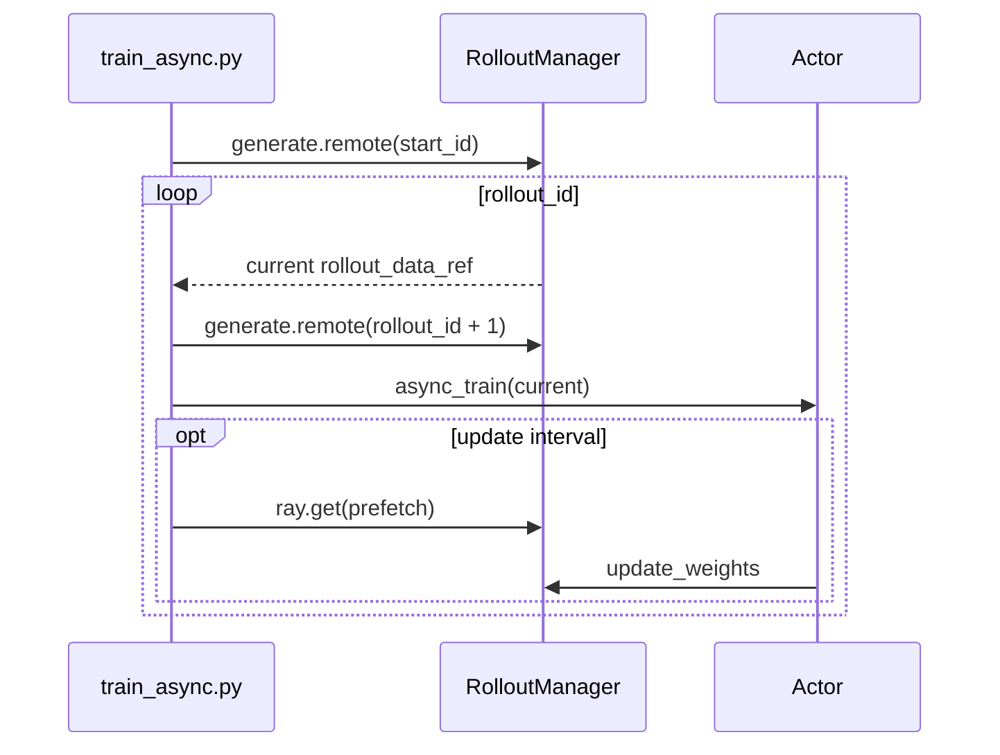

# 训练主循环 · 数据流

## 你为什么要读

这篇只关心对象如何跨边界变化：参数先变成资源布局，资源布局变成 Ray 角色，RolloutManager 生成 `rollout_data_ref`，Actor/Critic 消费它，训练后的权重再推回 SGLang。

## 对象生命周期



| 边界 | 对象 | 读者要盯住 |
|------|------|------------|
| 参数到资源 | `args -> pgs` | colocate/debug/external 改变 GPU 切片 |
| 资源到角色 | `pgs -> RolloutManager/Actor/Critic` | RolloutManager 先建，训练模型后建 |
| rollout 到训练 | `rollout_data_ref` | 当前 `rollout_id` 的训练数据引用 |
| critic 到 actor | `value_refs` | PPO actor 训练的 external data |
| 训练到 rollout | `actor_model.update_weights()` | 推送新 policy 到 SGLang |
| 周期动作 | `save/eval` | interval、epoch、最后一步语义不同 |

## Sync 全流程时序



## Placement group 数据流

`create_placement_groups` 输出的不是三套独立 placement group，而是同一个 `pg` 加不同 bundle index 视图。

```python
# 来源：slime/ray/placement_group.py L126-L135
    pg, actor_pg_reordered_bundle_indices, actor_pg_reordered_gpu_ids = _create_placement_group(num_gpus)
    rollout_pg_reordered_bundle_indices = actor_pg_reordered_bundle_indices[rollout_offset:]
    rollout_pg_reordered_gpu_ids = actor_pg_reordered_gpu_ids[rollout_offset:]

    result = {
        "actor": (pg, actor_pg_reordered_bundle_indices, actor_pg_reordered_gpu_ids),
        "rollout": (pg, rollout_pg_reordered_bundle_indices, rollout_pg_reordered_gpu_ids),
    }

    result["critic"] = result["actor"] if args.use_critic else None
```

解释：

- actor 和 rollout 的区别可能只是 bundle index 切片。
- critic 复用 actor 资源视图。
- 排查 GPU 分配时要看 layout，不要只看 `pg` 对象是否相同。

## rollout_data_ref 边界

主循环只看 `rollout_data_ref`，不直接处理 Sample 到 tensor 的转换。

```python
# 来源：train.py L67-L81
        rollout_data_ref = ray.get(rollout_manager.generate.remote(rollout_id))

        if args.offload_rollout:
            ray.get(rollout_manager.offload.remote())

        actor_trains_this_step = (not args.use_critic) or rollout_id >= args.num_critic_only_steps

        if args.use_critic:
            value_refs = critic_model.async_train(rollout_id, rollout_data_ref)
            if actor_trains_this_step:
                ray.get(actor_model.async_train(rollout_id, rollout_data_ref, external_data=value_refs))
            else:
                ray.get(value_refs)
        else:
            ray.get(actor_model.async_train(rollout_id, rollout_data_ref))
```

边界规则：

- RolloutManager 负责把 samples 转成训练侧可消费的数据引用。
- Actor/Critic 只通过 `rollout_data_ref` 和可选 `value_refs` 交互。
- `train.py` 不解释 batch 内 token layout；那是训练数据和 loss 专题的职责。
- critic-only 阶段不会发起 actor train，但 step 尾部仍调用 actor 的发布门面；训练消费与版本发布必须分开记账。

## 权重同步数据流

主循环只调用门面方法，真正的 NCCL、IPC、disk 或 delta 同步在下游模块实现。


```python
# 来源：train.py L86-L92
        offload_train(actor_trains_this_step)
        if args.offload_rollout:
            ray.get(rollout_manager.onload_weights.remote())
        actor_model.update_weights()

        if args.offload_rollout:
            ray.get(rollout_manager.onload_kv.remote())
```

读者抓手：如果现象是“训练 loss 变了但 rollout 行为没变”，主循环只证明调用时机；真正传输路径要去 [[Slime-分布式权重同步]]。

## Async 预取数据流



```python
# 来源：train_async.py L31-L39
    rollout_data_next_future = rollout_manager.generate.remote(args.start_rollout_id)
    for rollout_id in range(args.start_rollout_id, args.num_rollout):
        # Sync the last generation
        if rollout_data_next_future is not None:
            rollout_data_curr_ref = ray.get(rollout_data_next_future)

        # Start the next rollout early.
        if rollout_id + 1 < args.num_rollout:
            rollout_data_next_future = rollout_manager.generate.remote(rollout_id + 1)
```

这条数据流的核心是“一步 ahead 的 future”。它不是后台无限生成，也不是 fully-async worker。N+1 的 future 在 train N 之前发起，所以流水线即使每轮发布一次，也存在至少一拍生成侧 staleness。

## 周期动作数据流

save 和 eval 都调用同一个 helper，但传参不同。

```python
# 来源：train.py L83-L95
        if should_run_periodic_action(rollout_id, args.save_interval, num_rollout_per_epoch, args.num_rollout):
            save(rollout_id)

        offload_train(actor_trains_this_step)
        if args.offload_rollout:
            ray.get(rollout_manager.onload_weights.remote())
        actor_model.update_weights()

        if args.offload_rollout:
            ray.get(rollout_manager.onload_kv.remote())

        if should_run_periodic_action(rollout_id, args.eval_interval, num_rollout_per_epoch):
            ray.get(rollout_manager.eval.remote(rollout_id))
```

结果：

- save 知道 `num_rollout`，最后一步也会触发。
- eval 不知道 `num_rollout`，只按 interval 或 epoch 边界触发。
- 循环尾部 eval 位于发布调用之后；但在 async 入口中，若本轮未命中 `update_weights_interval`，周期 eval 看到的仍可能是上次发布的 policy。

## 参数校验对主循环的影响

很多主循环分支在进入 `train()` 前已经被参数校验改写。

```python
# 来源：slime/utils/arguments.py L1885-L1902
    # always true on offload for colocate at the moment.
    if args.colocate:
        if args.offload_train is None:
            args.offload_train = True
        if args.offload_rollout is None:
            args.offload_rollout = True
        if args.rollout_num_gpus is None:
            args.rollout_num_gpus = args.actor_num_gpus_per_node * args.actor_num_nodes
        elif args.rollout_num_gpus == 0:
            logger.info("rollout_num_gpus is 0 under colocate; no local SGLang engines will be launched.")

    if args.offload_train is None:
        args.offload_train = False
    if args.offload_rollout is None:
        args.offload_rollout = False

    if args.use_critic:
        args.offload_train = True
```

排障时不要只看命令行有没有写 `--offload-rollout`；colocate 和 PPO critic 会改写默认值。

## 运行验证

用两组检索把主循环拆开看：第一组确认 sync/async 的 rollout、train、update 顺序；第二组确认 placement group 与参数校验会怎样改写资源边界。

```powershell
rg -n 'def train\(|generate\.remote|async_train|update_weights|rollout_data_next_future|should_run_periodic_action' slime/train.py slime/train_async.py
rg -n 'create_placement_groups|colocate|offload_train|offload_rollout|use_critic' slime/slime/ray/placement_group.py slime/slime/utils/arguments.py
```

读输出时先顺着 `train.py` 看同步链路：`generate.remote -> async_train -> update_weights`。再对照 `train_async.py` 的 `rollout_data_next_future`，确认 async 只是把下一轮 rollout 提前发起，不改变训练消费的 Ray object ref 边界。最后看 `arguments.py`，确认 `colocate` 和 `use_critic` 会在进入主循环前改写 offload 默认值。
