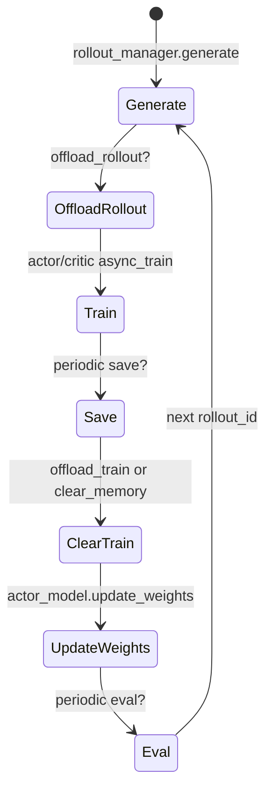

# 训练主循环 · 核心概念

## 你为什么要读

这篇建立七个模型：显式节拍器、资源拓扑、bootstrap、同步闭环、critic-only、step 间预取与周期动作。理解这些后，再读源码不会把 `async_train`、pipeline async、fully-async rollout 和 Ray remote future 混在一起。

## 模型一：主循环是节拍器，不是 Trainer 类

Slime 没有把 RL 闭环藏进深层 Trainer。`train.py` 的 `train(args)` 直接编排所有角色：资源、RolloutManager、Actor/Critic、generate、train、save、update、eval。

```python
# 来源：train.py L1-L6
import ray

from slime.ray.placement_group import create_placement_groups, create_rollout_manager, create_training_models
from slime.utils.arguments import parse_args
from slime.utils.logging_utils import configure_logger, finish_tracking, init_tracking
from slime.utils.misc import should_run_periodic_action
```

这组 import 就暴露了主循环职责：它只调度 Ray 角色和工具函数，不直接实现 rollout 或 loss。

## 模型二：资源拓扑先于角色启动

`create_placement_groups` 根据 debug、external、colocate、decoupled 等模式决定 actor 和 rollout 是否共享同一个 placement group，或者 rollout 从 actor GPU 后面切片。

```python
# 来源：slime/ray/placement_group.py L100-L117
def _get_placement_group_layout(args) -> tuple[int, int]:
    actor_num_gpus = args.actor_num_nodes * args.actor_num_gpus_per_node

    if args.debug_train_only:
        return actor_num_gpus, 0

    if args.rollout_external:
        if args.debug_rollout_only:
            return 0, 0
        return actor_num_gpus, actor_num_gpus

    if args.debug_rollout_only:
        return args.rollout_num_gpus, 0

    if args.colocate:
        return max(actor_num_gpus, args.rollout_num_gpus), 0

    return actor_num_gpus + args.rollout_num_gpus, actor_num_gpus
```

读法：

- colocate：actor 和 rollout 共享同一组 GPU，offset 为 0。
- decoupled：总 GPU 是 actor 加 rollout，rollout 从 actor 后面开始。
- debug rollout only：只给 rollout 侧资源。
- external rollout：本地可能不启动 SGLang engine，但 RolloutManager 仍存在。

## 模型三：bootstrap 是第一次 generate 的安全门

训练开始前，rollout 侧必须有 actor 的初始权重。offload 场景下，还要区分 weights 和 KV 的 onload 顺序。

```python
# 来源：train.py L22-L32
    if args.offload_rollout:
        ray.get(rollout_manager.onload_weights.remote())

    # Always push actor weights to rollout once weights are loaded.
    actor_model.update_weights()

    if args.check_weight_update_equal:
        ray.get(rollout_manager.check_weights.remote(action="compare"))

    if args.offload_rollout:
        ray.get(rollout_manager.onload_kv.remote())
```

心理模型：第一次 generate 前有一个闸门，必须先让 rollout 侧可接收权重，再推权，再恢复 KV 运行态。否则首次 rollout 可能使用旧权重或没有可用 KV cache。

## 模型四：sync step 是 generate/train/update 的闭环

同步模式下，一个 `rollout_id` 对应一轮完整闭环：生成当前数据，训练当前数据，保存和释放资源，再把新 actor 权重推回 rollout。



关键点：`async_train` 是 Ray 方法名，sync 主循环仍然用 `ray.get` 等它完成。

## 模型五：critic-only 改变 optimizer 消费者，不取消 actor 发布

PPO 会启用 critic。前 `num_critic_only_steps` 步只执行 critic 的训练，actor 不做 optimizer step，但 rollout 数据仍由同一个 generate 产生。

```python
# 来源：train.py L72-L81
        actor_trains_this_step = (not args.use_critic) or rollout_id >= args.num_critic_only_steps

        if args.use_critic:
            value_refs = critic_model.async_train(rollout_id, rollout_data_ref)
            if actor_trains_this_step:
                ray.get(actor_model.async_train(rollout_id, rollout_data_ref, external_data=value_refs))
            else:
                ray.get(value_refs)
        else:
            ray.get(actor_model.async_train(rollout_id, rollout_data_ref))
```

不变量：`actor_trains_this_step` 同时影响训练分支、保存分支和清显存分支，不能只在一个地方理解。它没有包住 step 尾部的 `actor_model.update_weights()`：同步入口仍会发布 actor 当前状态。因此“actor 没训练”不等于“没有发布调用”，版本序号也可能前进而参数数值不变。

## 模型六：`train_async.py` 是 step 间预取

`train_async.py` 不是 fully-async rollout。它让 `generate(N+1)` 和 `train(N)` 重叠，仍然通过 RolloutManager 生成完整 batch。因为 N+1 在 N 的 optimizer step/发布前已经启动，即使 `update_weights_interval=1`，它也天然使用较旧 policy；更大的 interval 会扩大多步不发布的窗口。

```python
# 来源：train_async.py L30-L39
    # async train loop.
    rollout_data_next_future = rollout_manager.generate.remote(args.start_rollout_id)
    for rollout_id in range(args.start_rollout_id, args.num_rollout):
        # Sync the last generation
        if rollout_data_next_future is not None:
            rollout_data_curr_ref = ray.get(rollout_data_next_future)

        # Start the next rollout early.
        if rollout_id + 1 < args.num_rollout:
            rollout_data_next_future = rollout_manager.generate.remote(rollout_id + 1)
```

为什么禁止 colocate：

```python
# 来源：train_async.py L9-L11
# The framework supports other asynchronous approaches such as fully async (which is shown in examples/full_async).
def train(args):
    assert not args.colocate, "Colocation is not supported for async training."
```

prefetch 假设 rollout GPU 在训练期间还能继续 generate；colocate 需要时间复用同一组 GPU，会破坏这个假设。

## 模型七：周期动作由 helper 统一

save 和 eval 不应在每个调用点手写条件。`should_run_periodic_action` 把 interval、epoch 边界和最后一步合并成一个语义。

```python
# 来源：slime/utils/misc.py L105-L126
def should_run_periodic_action(
    rollout_id: int,
    interval: int | None,
    num_rollout_per_epoch: int | None = None,
    num_rollout: int | None = None,
) -> bool:
    """
    Return True when a periodic action (eval/save/checkpoint) should run.

    Args:
        rollout_id: The current rollout index (0-based).
        interval: Desired cadence; disables checks when None.
        num_rollout_per_epoch: Optional epoch boundary to treat as a trigger.
    """
    if interval is None:
        return False

    if num_rollout is not None and rollout_id == num_rollout - 1:
        return True

    step = rollout_id + 1
    return (step % interval == 0) or (num_rollout_per_epoch is not None and step % num_rollout_per_epoch == 0)
```

注意：save 调用传了 `num_rollout`，最后一步强制触发；eval 调用没有传 `num_rollout`，所以 eval 不一定在最后一步触发。

## 常见误解

| 误解 | 正确模型 |
|------|----------|
| `async_train` 表示主循环异步 | sync `train.py` 会 `ray.get` 等训练完成 |
| RolloutManager 可以晚于 Actor 创建 | training models 需要绑定 rollout manager，且 rollout manager 负责步数推导 |
| `train_async.py` 可以配 colocate | 源码直接 assert 禁止 |
| `update_weights_interval=1` 就完全 on-policy | 预取的 N+1 在 train N 完成前启动，流水线本身已有 staleness；更大 interval 进一步扩大窗口 |
| eval-only 不需要 bootstrap | eval-only 仍先创建角色并推权，再 eval |

下一步读 [[Slime-训练主循环-源码走读]]，沿一次完整 step 把这些模型对齐到源码顺序。
