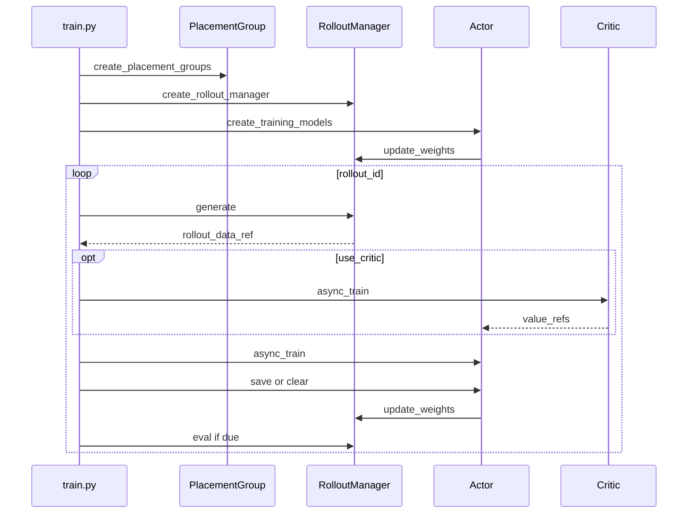

# 训练主循环 · 源码走读

这篇解决一个具体问题：一次 Slime 训练 step 如何从资源准备走到 rollout、训练、推权、保存和评测。读完后应能定位启动卡住、首次 rollout 权重不对、colocate 显存冲突、critic-only 行为异常、async 预取和权重更新冲突。

## 长文读法

这篇按训练生命周期读：`train.py` 先拿 placement group，再创建 `RolloutManager` 和 actor / critic；第一次 rollout 前先推 actor 权重；同步 step 是 generate、train、save / offload、update weights、eval；异步路径则让 generate N+1 和 train N 重叠，但 update weights 前必须 drain 正在生成的数据。

| 你的任务 | 先读 | 抓住什么 |
|----------|------|----------|
| 排查启动顺序 | 步骤一到四 | 资源、rollout manager、训练模型、manager 绑定有固定先后 |
| 排查 colocate / offload | 步骤二到三、步骤八 | placement group 决定共享 GPU，offload 决定 step 间显存交接 |
| 排查首次 rollout 权重 | 步骤五 | actor 初始化后总是先 `update_weights`，再允许第一轮 generate |
| 排查 eval-only | 步骤六 | `num_rollout == 0` 是主循环外出口，不会进入训练 step |
| 理解同步 step | 步骤七到八 | 同步路径严格先 generate 再 train，step 尾部再保存、清显存、推权 |
| 理解流水异步 step | 步骤九到十 | N+1 预取天然带来一拍 staleness；更新权重前必须等在途 generate 结束 |

## 贯穿场景

假设运行同步 `train.py`，配置使用 global dataset、SGLang rollout、actor 训练，可能开启 colocate/offload。主线是：



## 步骤一：先拿资源，再启动角色

系统压力：Ray actor 的调度要绑定 GPU placement group；如果先建角色再确认资源，失败会分散在后续 remote 调用里。

设计选择：`train(args)` 先配置 logger，创建 placement groups，再初始化 tracking。

```python
# 来源：train.py L9-L20
def train(args):
    configure_logger()
    # allocate the GPUs
    pgs = create_placement_groups(args)
    init_tracking(args)

    # create the rollout manager, with sglang engines inside.
    # need to initialize rollout manager first to calculate num_rollout
    rollout_manager, num_rollout_per_epoch = create_rollout_manager(args, pgs["rollout"])

    # create the actor and critic models
    actor_model, critic_model = create_training_models(args, pgs, rollout_manager)
```

执行逻辑：

- `create_placement_groups` 返回 actor/rollout/critic 的资源视图。
- RolloutManager 先创建，因为它负责 SGLang engine、DataSource 和 rollout 步数推导。
- training models 后创建，并接收 rollout manager。

不变量与失败模式：

- `pgs["rollout"]` 必须在 RolloutManager 创建前可用。
- 如果 `num_rollout` 由 epoch 推导，RolloutManager 必须先知道 dataset 规模。

## 步骤二：placement group 决定共享还是切分 GPU

系统压力：Slime 既支持 actor 和 rollout 共用同一组 GPU，也支持 rollout 独立 GPU，debug/external 模式还会改变本地资源需求。

设计选择：`_get_placement_group_layout` 返回总 GPU 数和 rollout 在 bundle 中的 offset；`create_placement_groups` 再按 offset 切出 actor 和 rollout 视图。

```python
# 来源：slime/ray/placement_group.py L100-L117
def _get_placement_group_layout(args) -> tuple[int, int]:
    actor_num_gpus = args.actor_num_nodes * args.actor_num_gpus_per_node

    if args.debug_train_only:
        return actor_num_gpus, 0

    if args.rollout_external:
        if args.debug_rollout_only:
            return 0, 0
        return actor_num_gpus, actor_num_gpus

    if args.debug_rollout_only:
        return args.rollout_num_gpus, 0

    if args.colocate:
        return max(actor_num_gpus, args.rollout_num_gpus), 0

    return actor_num_gpus + args.rollout_num_gpus, actor_num_gpus
```

```python
# 来源：slime/ray/placement_group.py L126-L133
    pg, actor_pg_reordered_bundle_indices, actor_pg_reordered_gpu_ids = _create_placement_group(num_gpus)
    rollout_pg_reordered_bundle_indices = actor_pg_reordered_bundle_indices[rollout_offset:]
    rollout_pg_reordered_gpu_ids = actor_pg_reordered_gpu_ids[rollout_offset:]

    result = {
        "actor": (pg, actor_pg_reordered_bundle_indices, actor_pg_reordered_gpu_ids),
        "rollout": (pg, rollout_pg_reordered_bundle_indices, rollout_pg_reordered_gpu_ids),
    }
```

读者抓手：

- colocate 的 offset 是 0，代表 actor/rollout 看同一组 bundle。
- decoupled 的 offset 是 actor GPU 数，代表 rollout 使用后半段 bundle。
- critic 复用 actor placement group。

## 步骤三：RolloutManager 负责步数和初始 offload

系统压力：`num_rollout` 可以由 `num_epoch` 和 dataset 规模推导；check weight equal 也要在真正训练前准备 snapshot。

设计选择：`create_rollout_manager` 创建 remote actor 后，必要时询问 `get_num_rollout_per_epoch`，并在 offload_rollout 下先 offload。

```python
# 来源：slime/ray/placement_group.py L220-L237
def create_rollout_manager(args, pg):
    from .rollout import RolloutManager

    rollout_manager_options = {
        "num_cpus": 1,
        "num_gpus": 0,
        "runtime_env": {"env_vars": add_default_ray_env_vars()},
    }
    if getattr(args, "rollout_data_transport", "object-store") == "nixl":
        rollout_manager_options["enable_tensor_transport"] = True
    rollout_manager = RolloutManager.options(**rollout_manager_options).remote(args, pg)

    # calculate num_rollout from num_epoch
    num_rollout_per_epoch = None
    if args.num_rollout is None:
        num_rollout_per_epoch = ray.get(rollout_manager.get_num_rollout_per_epoch.remote())
        args.num_rollout = num_rollout_per_epoch * args.num_epoch
        assert args.num_rollout > 0
```

不变量：如果用户只给 `num_epoch`，`args.num_rollout` 会在这里被写回；后续主循环读到的是最终步数。

## 步骤四：训练模型初始化后绑定 RolloutManager

系统压力：Actor/Critic 初始化可能从 checkpoint 恢复 `start_rollout_id`，并且训练 actor 后续要能调用 rollout manager 做权重同步。

设计选择：`create_training_models` 分别初始化 critic 和 actor，统一确认 start id，然后把 rollout manager 注入 train group。

```python
# 来源：slime/ray/placement_group.py L191-L212
    actor_start_rollout_ids = ray.get(
        actor_model.async_init(
            actor_args,
            role="actor",
            with_ref=actor_args.kl_coef != 0 or actor_args.use_kl_loss,
            with_opd_teacher=actor_args.use_opd and actor_args.opd_type == "megatron",
        )
    )
    # TODO how to decide rollout start id when critic is involved? For now we just require user to specify it via args.
    if args.use_critic:
        start_rollout_ids = critic_start_rollout_ids
    else:
        start_rollout_ids = actor_start_rollout_ids

    assert len(set(start_rollout_ids)) == 1

    if args.start_rollout_id is None:
        args.start_rollout_id = start_rollout_ids[0]

    actor_model.set_rollout_manager(rollout_manager)
    if args.use_critic:
        critic_model.set_rollout_manager(rollout_manager)
```

失败边界：如果各 rank 恢复出的 rollout id 不一致，会在这里 assert，而不是等训练中途才暴露。

## 步骤五：首次推权保护第一轮 generate

系统压力：SGLang rollout 侧启动后可能还没有 actor 当前权重；第一次 generate 必须和训练初始权重一致。

设计选择：进入主循环前执行 onload weights、`actor_model.update_weights()`、可选 compare、onload KV。

```python
# 来源：train.py L22-L32
    if args.offload_rollout:
        ray.get(rollout_manager.onload_weights.remote())

    # Always push actor weights to rollout once weights are loaded.
    actor_model.update_weights()

    if args.check_weight_update_equal:
        ray.get(rollout_manager.check_weights.remote(action="compare"))

    if args.offload_rollout:
        ray.get(rollout_manager.onload_kv.remote())
```

执行逻辑：

- offload rollout 时，权重先回到 rollout 侧可更新状态。
- `update_weights` 是首次 generate 的权重同步门。
- KV onload 在权重同步之后，准备真正生成。

## 步骤六：eval-only 是主循环外出口

系统压力：`num_rollout == 0` 时 `for rollout_id in range(args.start_rollout_id, args.num_rollout)` 不会执行，常规循环内 eval 没机会触发。

设计选择：bootstrap 后单独判断 eval-only。

```python
# 来源：train.py L34-L36
    # special case for eval-only
    if args.num_rollout == 0 and args.eval_interval is not None:
        ray.get(rollout_manager.eval.remote(rollout_id=0))
```

不变量：eval-only 仍然依赖前面角色创建和首次推权；它不是跳过 bootstrap 的快速路径。

## 步骤七：同步 step 先 generate，再 train

系统压力：当前训练 step 必须消费当前 `rollout_id` 的数据。colocate 下，generate 完还要释放 rollout 显存给训练。

设计选择：同步等待 `rollout_manager.generate`，可选 offload rollout，再根据 critic/actor 分支训练。

```python
# 来源：train.py L62-L81
    # train loop.
    for rollout_id in range(args.start_rollout_id, args.num_rollout):
        if args.eval_interval is not None and rollout_id == 0 and not args.skip_eval_before_train:
            ray.get(rollout_manager.eval.remote(rollout_id))

        rollout_data_ref = ray.get(rollout_manager.generate.remote(rollout_id))

        if args.offload_rollout:
            ray.get(rollout_manager.offload.remote())

        actor_trains_this_step = (not args.use_critic) or rollout_id >= args.num_critic_only_steps

        if args.use_critic:
            value_refs = critic_model.async_train(rollout_id, rollout_data_ref)
            if actor_trains_this_step:
                ray.get(actor_model.async_train(rollout_id, rollout_data_ref, external_data=value_refs))
            else:
                ray.get(value_refs)
        else:
            ray.get(actor_model.async_train(rollout_id, rollout_data_ref))
```

读者抓手：

- `rollout_data_ref` 是 RolloutManager 已经整理好的训练数据引用。
- critic 分支先产生 `value_refs`，actor 训练时把它作为 `external_data`。
- critic-only 阶段只等待 critic，不启动 actor。
- 但 step 尾部仍无条件调用 `actor_model.update_weights()`；这会发布 actor 当前状态，不能把“未训练”写成“未发布”。

## 步骤八：step 尾部先保存，再清显存，再推权

系统压力：训练完成后要决定是否保存，释放训练侧资源，把新 actor 权重推给 rollout，并在需要时 eval。顺序错了容易出现保存旧权重、显存冲突或 eval 使用旧 policy。

设计选择：保存 -> offload/clear train -> rollout onload weights -> update weights -> rollout onload KV -> eval。

```python
# 来源：train.py L83-L95
        if should_run_periodic_action(rollout_id, args.save_interval, num_rollout_per_epoch, args.num_rollout):
            save(rollout_id)

        offload_train(actor_trains_this_step)
        if args.offload_rollout:
            ray.get(rollout_manager.onload_weights.remote())
        actor_model.update_weights()

        if args.offload_rollout:
            ray.get(rollout_manager.onload_kv.remote())

        if should_run_periodic_action(rollout_id, args.eval_interval, num_rollout_per_epoch):
            ray.get(rollout_manager.eval.remote(rollout_id))
```

不变量与失败模式：

- `save` 在本轮训练后执行，保存的是训练后的状态。
- `update_weights` 在 eval 前执行，因此周期 eval 看到的是更新后的 actor 权重。
- offload rollout 时，weights 和 KV 的 onload 顺序不能颠倒。

## 步骤九：async 预取让 generate N+1 与 train N 重叠

系统压力：decoupled 资源下，rollout GPU 和训练 GPU 可以同时工作。同步等待会浪费一边资源。

设计选择：`train_async.py` 先启动一个 generate future；每轮取回当前 future 后，立即启动下一轮 generate，再训练当前数据。

```python
# 来源：train_async.py L30-L49
    # async train loop.
    rollout_data_next_future = rollout_manager.generate.remote(args.start_rollout_id)
    for rollout_id in range(args.start_rollout_id, args.num_rollout):
        # Sync the last generation
        if rollout_data_next_future is not None:
            rollout_data_curr_ref = ray.get(rollout_data_next_future)

        # Start the next rollout early.
        if rollout_id + 1 < args.num_rollout:
            rollout_data_next_future = rollout_manager.generate.remote(rollout_id + 1)

        if args.use_critic:
            actor_trains_this_step = rollout_id >= args.num_critic_only_steps
            value_refs = critic_model.async_train(rollout_id, rollout_data_curr_ref)
            if actor_trains_this_step:
                ray.get(actor_model.async_train(rollout_id, rollout_data_curr_ref, external_data=value_refs))
            else:
                ray.get(value_refs)
        else:
            ray.get(actor_model.async_train(rollout_id, rollout_data_curr_ref))
```

注意：这不是 [[Slime-其他Rollout路径]] 里的 fully-async rollout。这里仍是一轮一个完整 `generate.remote`，只是提前启动下一轮。正因为 N+1 在 train N 结束前启动，即使每轮都发布，N+1 也由较旧 policy 生成。

## 步骤十：async update 前必须 drain

系统压力：如果下一轮 generate 正在用旧权重，训练侧不能中途把新权重推给 rollout，否则一次生成可能跨权重边界。

设计选择：达到 `update_weights_interval` 时，先 `ray.get` 正在预取的 future，把 generate 收束，再 update weights。

```python
# 来源：train_async.py L65-L69
        if (rollout_id + 1) % args.update_weights_interval == 0:
            # sync generate before update weights to prevent update weight in the middle of generation
            rollout_data_curr_ref = ray.get(x) if (x := rollout_data_next_future) is not None else None
            rollout_data_next_future = None
            actor_model.update_weights()
```

失败边界：一步 ahead 预取本身就引入 policy staleness；`update_weights_interval > 1` 又增加连续训练多步才发布的窗口。这是吞吐和新鲜度的交换，不是无成本优化。

## 运行验证

| 验证目标 | 入口 | 预期 |
|----------|------|------|
| sync colocate 主线 | `python -m pytest slime/tests/test_qwen2.5_0.5B_short.py -q` | 配置包含 `--colocate`，走 `train.py` |
| async decoupled 主线 | `python -m pytest slime/tests/test_qwen2.5_0.5B_async_short.py -q` | `execute_train` 显式传入 `train_script="train_async.py"` |
| critic-only | `python -m pytest slime/tests/test_qwen3_4B_ppo_train_critic_only.py -q` | PPO 前若干 rollout 只训练 critic |

这些是端到端 smoke test，需要模型、数据、GPU 和下载环境。本地缺依赖时，静态阅读三个测试文件，确认 `--colocate`、`train_script="train_async.py"` 与 `--num-critic-only-steps` 分别覆盖对应分支；不能把未运行测试记为通过。
