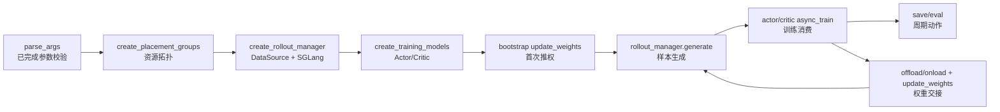

# 训练主循环

## 你为什么要读

训练主循环是 Slime RL 闭环的节拍器。它不实现 rollout、loss 或权重同步细节，而是决定这些角色什么时候启动、什么时候交接数据、什么时候释放显存、什么时候把新权重推给 SGLang、什么时候保存和评测。

读完本专题，读者应该能排查五类问题：启动卡在 Ray 资源分配、首次 rollout 用了旧权重、colocate 显存交接顺序错、PPO critic-only 阶段 actor 是否执行 optimizer step、`train_async.py` 预取与权重更新冲突。

## 主线模型



把 `train.py` 想成一个交通灯控制器：RolloutManager、Actor、Critic、SGLangEngine 都是路口上的车辆；主循环不搬运所有货物，但它决定谁先走、谁等待、哪里必须清空路口再放行。

| 阶段 | 源码入口 | 读者要抓住 |
|------|----------|------------|
| 资源规划 | `create_placement_groups` | actor/rollout GPU 是否共享或分离 |
| 角色启动 | `create_rollout_manager`、`create_training_models` | rollout 先于训练模型，训练模型再绑定 rollout manager |
| 冷启动同步 | `actor_model.update_weights()` | 第一次 generate 前必须把 actor 权重推到 rollout |
| 同步训练步 | `generate -> async_train -> update_weights` | 当前 rollout 数据训练完成后才推新权重 |
| 流水异步步 | `train_async.py` future 预取 | train N 与 generate N+1 重叠；N+1 天然先于 N 的新权重发布，update 前还必须 drain |
| 周期动作 | `should_run_periodic_action` | save/eval 由 interval、epoch 边界、最后一步共同决定 |

## 阅读顺序

| 文档 | 读者任务 |
|------|----------|
| [[Slime-训练主循环-核心概念]] | 建立闭环节拍器、资源拓扑、sync/async、offload、周期动作的模型 |
| [[Slime-训练主循环-源码走读]] | 沿一次同步训练 step 和一次异步预取 step 追源码 |
| [[Slime-训练主循环-数据流]] | 看清 Ray ObjectRef、Actor/Critic、RolloutManager、权重同步的对象边界 |
| [[Slime-训练主循环-排障指南]] | 按症状排查 colocate、eval-only、critic-only、async staleness、debug 模式 |
| [[Slime-训练主循环-学习检查]] | 用可执行清单验收自己是否能解释和排障主循环 |

## 源码范围

| 文件 | 作用 |
|------|------|
| `train.py` | 同步训练主循环、colocate/offload 交接、save/eval 周期 |
| `train_async.py` | 非 colocate 场景下 generate/train 预取重叠 |
| `slime/ray/placement_group.py` | placement group 布局、RolloutManager 创建、Actor/Critic 创建 |
| `slime/utils/misc.py` | `should_run_periodic_action` 周期触发语义 |
| `slime/utils/arguments.py` | colocate、offload、debug、critic、eval 等参数校验和默认值 |
| `tests/test_qwen2.5_0.5B_short.py` | sync colocate smoke test 配置 |
| `tests/test_qwen2.5_0.5B_async_short.py` | async decoupled smoke test 配置 |

## 核心入口

```python
# 来源：train.py L9-L32
def train(args):
    configure_logger()
    # allocate the GPUs
    pgs = create_placement_groups(args)
    init_tracking(args)

    # create the rollout manager, with sglang engines inside.
    # need to initialize rollout manager first to calculate num_rollout
    rollout_manager, num_rollout_per_epoch = create_rollout_manager(args, pgs["rollout"])

    # create the actor and critic models
    actor_model, critic_model = create_training_models(args, pgs, rollout_manager)

    if args.offload_rollout:
        ray.get(rollout_manager.onload_weights.remote())

    # Always push actor weights to rollout once weights are loaded.
    actor_model.update_weights()

    if args.check_weight_update_equal:
        ray.get(rollout_manager.check_weights.remote(action="compare"))

    if args.offload_rollout:
        ray.get(rollout_manager.onload_kv.remote())
```

这段证明三件事：

- 资源和 tracking 先于所有 Ray 角色。
- RolloutManager 先于 Actor/Critic，因为它要负责 rollout 步数和 SGLang 侧。
- 第一次 generate 前一定发生一次 `update_weights()`，offload 场景还要先 onload weights，再 onload KV。

## 上下游衔接

| 方向 | 模块 | 为什么相关 |
|------|------|------------|
| 上游 | [[Slime-Ray参数]] | `colocate`、debug、offload、num_rollout 在进入 `train()` 前已经校验 |
| 下游 | [[Slime-PlacementGroup]] | 解释 actor/rollout placement group 如何共享或切分 GPU |
| 下游 | [[Slime-RolloutManager]] | `generate/eval/offload/onload` 都是 RolloutManager remote 方法 |
| 下游 | [[Slime-Megatron-Actor初始化]] | `create_training_models` 如何初始化 Actor/Critic |
| 下游 | [[Slime-分布式权重同步]] | `actor_model.update_weights()` 如何真正推权 |
| 对照 | [[Slime-其他Rollout路径]] | fully-async rollout 是 train_async 之上的另一层异步 |

## 本专题的不变量

- `RolloutManager` 必须先于 training models 创建。
- 首次 `generate` 前必须完成一次 `actor_model.update_weights()`。
- sync `train.py` 中当前 `rollout_id` 的数据必须训练完，才保存、清显存、推新权重。
- colocate 下 `offload_train` 和 `offload_rollout` 默认打开，主循环要按权重/KV 顺序 onload。
- critic-only 阶段不执行 actor optimizer step，但同步循环仍调用 actor 权重发布；发布序号可能前进而参数数值不变。
- `train_async.py` 禁止 colocate；预取造成至少一拍 policy staleness，update weights 前还必须收束正在生成的 batch。
- `save` 传入 `num_rollout`，最后一步也会触发；eval 不传 `num_rollout`，只按 interval 或 epoch 边界触发。

## 验证抓手

```powershell
$env:PYTHONPATH='F:\源码阅读\slime'
python -m pytest slime/tests/test_qwen2.5_0.5B_short.py -q
python -m pytest slime/tests/test_qwen2.5_0.5B_async_short.py -q
```

预期现象：这两个是端到端 smoke test，需要模型、数据、GPU 和外部下载环境；本地轻量环境通常无法直接跑完。无法运行时，静态阅读测试配置：sync short 使用 `--colocate`，async short 使用 `train_script="train_async.py"` 和分离 rollout GPU。
