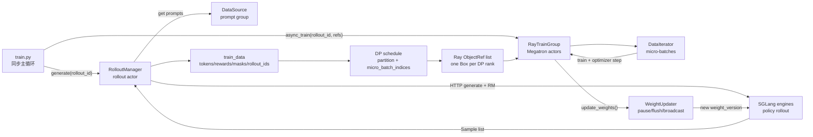

# Slime RL 训练全链路

本文追踪 Slime 同步 RL 主循环中 **一个 prompt group 经过 rollout、训练、权重同步，再影响下一轮 rollout** 的完整路径。

范围限定：

- 默认同步主循环 `train.py`
- 规则奖励 / SGLang rollout baseline
- Megatron actor 训练后端
- SGLang rollout engine 权重更新
- 不展开异步 prefetch、PD 分离、多模型 reward、Agent 多轮的内部细节，只标出扩展点

## 读者任务

读完本文，读者应该能做四件事：

1. 沿一次 `rollout_id` 复述对象如何变化：`Sample` → `train_data` → 每个 DP rank 的 Ray `ObjectRef` → `RolloutBatch` → Megatron micro-batches → SGLang 新权重。
2. 判断一次 RL 卡住、OOM、奖励异常或权重不同步发生在哪一段：rollout server、数据转换、DP 切分、训练后端、还是 update weights。
3. 解释为什么 Slime 不能只“把所有 sample 平均切给 GPU”：`rollout_id`、`global_batch_size`、`rollout_mask_sums` 和 micro-batch 对齐共同决定 loss 分母与 PP/DP 同步。
4. 用 debug 数据、日志、版本号、配置开关或断点验证自己的理解。

## 长文读法

首次阅读只看“读者任务”“先建立模型”“贯穿场景”和“复盘”；需要定位样本、训练或权重边界时再进入对应主线。连续入门请先读 [[RL训练闭环主线]]。

这篇是跨 Rollout、Ray、Megatron、SGLang 的全链路页，不适合从第一段源码一直线性读到最后。按任务跳读更稳：

| 读者任务 | 先读 |
|----------|------|
| 第一次建立闭环模型 | “先建立模型” → “贯穿场景” → 主线 1、4、8、11、12 |
| 排查 rollout 卡住 | 主线 3、4 → 运行验证 1 → 失败模式表第 2 行 |
| 排查 loss / advantage 异常 | 主线 5、6、7、10、11 → 运行验证 2 |
| 排查 DP/OOM | 主线 7、8、10 → 失败模式表中的 DP rank 与 static micro-batch 项 |
| 排查权重没更新 | 主线 1、12 → 运行验证 3、4 |
| 准备改代码 | 先看“源码阅读依据”，再按要改的对象回到对应主线小节 |

## 源码阅读依据

改写本文前已阅读下列 upstream 源码的相关函数和调用上下文；正文中的设计判断均回指这些源码。

| upstream 文件 | 本文使用方式 |
|---------------|--------------|
| `train.py` | 同步训练主循环、bootstrap weight update、save/eval/offload 时序 |
| `slime/ray/placement_group.py` | Ray placement group、RolloutManager 与 RayTrainGroup 的创建顺序 |
| `slime/ray/rollout.py` | rollout server 启动、`generate`、debug replay、Sample 转训练数据、DP 切分 |
| `slime/rollout/sglang_rollout.py` | 默认 rollout 函数如何接入 DataSource 与 SGLang |
| `slime/utils/types.py` | `Sample` 字段契约、response token metadata、weight version 记录 |
| `slime/utils/dp_schedule.py` | 按 `rollout_id` 保组、pack micro-batch、分发给 DP rank 的调度算法 |
| `slime/ray/actor_group.py` | RayTrainGroup 如何把同一份 rollout refs 广播给所有训练 actor |
| `slime/ray/train_actor.py` | 训练 actor 的分布式初始化与 RolloutManager 回连 |
| `slime/utils/data.py` | 每个 DP rank 如何从 Ray refs 中取自己的 partition |
| `slime/backends/megatron_utils/data.py` | `DataIterator` 如何按预计算 micro-batch schedule 取数据 |
| `slime/backends/megatron_utils/actor.py` | Megatron actor/critic 训练、advantage、权重同步入口 |
| `slime/backends/megatron_utils/model.py` | 一个 rollout 如何拆成多个 Megatron training step |
| `slime/backends/megatron_utils/loss.py` | advantage/return 计算的输入契约 |
| `slime/backends/megatron_utils/update_weight/update_weight_from_distributed.py` | NCCL 分布式权重更新屏障、pause/flush/continue |
| `slime/backends/sglang_utils/sglang_engine.py` | SGLang engine 暴露的 disk/distributed/tensor weight update API |

## 先建立模型

Slime 的 RL 闭环不是“先生成一批文本，再训练一下”。更准确的模型是：

> Rollout 侧生产带奖励和采样痕迹的 `Sample`；RolloutManager 把它改造成按 `rollout_id` 保组、按 DP rank 分片的训练包；Megatron actor 消费自己的分片并更新参数；权重 updater 暂停 SGLang generation，把 actor 新权重推回 rollout engine；下一轮 `generate` 才使用新策略。



五个核心对象：

| 对象 | 此时长什么样 | 谁持有 | 关键不变量 |
|------|--------------|--------|------------|
| prompt group | 一组待采样 prompt，通常按 `rollout_batch_size` 取出 | DataSource | 同一组 prompt 会产生 `n_samples_per_prompt` 条 rollout |
| `Sample` | prompt、tokens、response、reward、loss mask、`rollout_id`、采样 metadata | RolloutManager | response 相关字段长度必须对齐 |
| `train_data` | 字典：`tokens/rewards/loss_masks/rollout_ids/rollout_mask_sums/...` | RolloutManager | 同一 rollout 的多个 sample 共享 loss 分母 |
| Ray `ObjectRef` 列表 | 长度等于 `dp_size`，每个元素是一份 rank-local `RolloutBatch` | Ray object store / NIXL | 第 `dp_rank` 只取自己的 partition |
| weight version | actor 更新后推给 SGLang engine 的版本号 | WeightUpdater / SGLang engine | 下一轮 rollout 必须看到最新 actor 权重，除非显式跳过 |

## 贯穿场景

假设一次训练使用：

- `rollout_batch_size = 4`
- `n_samples_per_prompt = 2`
- `global_batch_size = 4`
- `dp_size = 2`

直觉上会得到 8 个 `Sample`。但训练侧真正关心的不是“8 行数据平均分两半”，而是：

1. 哪些 sample 来自同一次 rollout 执行。
2. 每个 rollout 的 loss 分母是多少。
3. 每个 training step 包含多少 rollout。
4. 每个 DP rank 在每个 step 里有多少 micro-batch。
5. SGLang rollout engine 的权重版本是否已经切到 actor 训练后的版本。

对象形态会这样变化：

| 阶段 | 对象形态 | 关键持有者 |
|------|----------|------------|
| prompt 取样 | prompt group + sample index | DataSource |
| rollout 生成 | `list[Sample]` 或嵌套 `list[list[Sample]]` | rollout fn / RolloutManager |
| 奖励后处理 | `raw_rewards` / normalized rewards | RolloutManager |
| 训练数据 | `train_data` dict | RolloutManager |
| DP 切分 | `partition` + `micro_batch_indices` | `build_dp_schedule` |
| Ray 传输 | `list[Box(ObjectRef)]`，每个 DP rank 一份 | Ray |
| 训练消费 | `RolloutBatch` + `DataIterator` | Megatron actor |
| 权重同步 | metadata by Ray + tensor by NCCL / disk / tensor | WeightUpdater + SGLangEngine |

## 主线走读

### 1. 主循环先搭环境，再进入 `generate → train → update_weights` 屏障

**系统压力：** RL 闭环要避免两类错位：训练 actor 还没初始化，rollout server 就开始生成；或者 actor 已训练完，但 SGLang 仍用旧权重继续采样。

**源码证据：**

```python
# 来源：train.py L15-L26
    # create the rollout manager, with sglang engines inside.
    # need to initialize rollout manager first to calculate num_rollout
    rollout_manager, num_rollout_per_epoch = create_rollout_manager(args, pgs["rollout"])

    # create the actor and critic models
    actor_model, critic_model = create_training_models(args, pgs, rollout_manager)

    if args.offload_rollout:
        ray.get(rollout_manager.onload_weights.remote())

    # Always push actor weights to rollout once weights are loaded.
    actor_model.update_weights()
```

训练循环的顺序是同步的：

```python
# 来源：train.py L67-L89
        rollout_data_ref = ray.get(rollout_manager.generate.remote(rollout_id))

        if args.offload_rollout:
            ray.get(rollout_manager.offload.remote())

        actor_trains_this_step = (not args.use_critic) or rollout_id >= args.num_critic_only_steps

        if args.use_critic:
            value_refs = critic_model.async_train(rollout_id, rollout_data_ref)
            if actor_trains_this_step:
                ray.get(actor_model.async_train(rollout_id, rollout_data_ref, external_data=value_refs))
            else:
                ray.get(value_refs)
        else:
            ray.get(actor_model.async_train(rollout_id, rollout_data_ref))

        if should_run_periodic_action(rollout_id, args.save_interval, num_rollout_per_epoch, args.num_rollout):
            save(rollout_id)

        offload_train(actor_trains_this_step)
        if args.offload_rollout:
            ray.get(rollout_manager.onload_weights.remote())
        actor_model.update_weights()
```

**执行逻辑：**

- `create_rollout_manager` 先建 rollout 侧，因为 `num_rollout` 可能依赖数据集长度。
- `create_training_models` 再建 actor/critic，并把 `rollout_manager` 句柄回连给训练 actor。
- bootstrap 阶段先 `actor_model.update_weights()`，让 SGLang 初始权重与 Megatron actor 对齐。
- 每个 `rollout_id` 内，`ray.get(rollout_manager.generate.remote(...))` 是第一道屏障；训练拿到的是已经切好 DP 的 refs。
- 训练完成后再 `actor_model.update_weights()`，这是下一轮 rollout 使用新策略的屏障。

**不变量与失败模式：**

- 如果 bootstrap weight update 被跳过，第一轮 rollout 可能不是当前 actor 权重。
- `debug_rollout_only` 和 `debug_train_only` 会改写这条闭环：前者只生成不训练，后者跳过 SGLang 只 replay 训练数据。
- offload 模式下权重和 KV 的 onload/offload 顺序是显存管理的一部分，不能把 `onload_kv` 提前到 update 前。

### 2. PlacementGroup 决定 actor、critic、rollout 是否共用 GPU 池

**系统压力：** Slime 同时跑 SGLang rollout engine 和 Megatron training actor。colocate、debug、external rollout 会改变 GPU 布局；如果资源边界不清，后续 offload 和权重更新都很难解释。

**源码证据：**

```python
# 来源：slime/ray/placement_group.py L120-L135
def create_placement_groups(args):
    """Create placement groups for actor, critic, and rollout engines."""

    num_gpus, rollout_offset = _get_placement_group_layout(args)

    logger.info(f"Creating placement group with {num_gpus} GPUs...")
    pg, actor_pg_reordered_bundle_indices, actor_pg_reordered_gpu_ids = _create_placement_group(num_gpus)
    rollout_pg_reordered_bundle_indices = actor_pg_reordered_bundle_indices[rollout_offset:]
    rollout_pg_reordered_gpu_ids = actor_pg_reordered_gpu_ids[rollout_offset:]

    result = {
        "actor": (pg, actor_pg_reordered_bundle_indices, actor_pg_reordered_gpu_ids),
        "rollout": (pg, rollout_pg_reordered_bundle_indices, rollout_pg_reordered_gpu_ids),
    }

    result["critic"] = result["actor"] if args.use_critic else None
```

训练 actor 创建后，会把并行配置传回 RolloutManager：

```python
# 来源：slime/ray/placement_group.py L191-L208
    actor_start_rollout_ids = ray.get(
        actor_model.async_init(
            actor_args,
            role="actor",
            with_ref=actor_args.kl_coef != 0 or actor_args.use_kl_loss,
            with_opd_teacher=actor_args.use_opd and actor_args.opd_type == "megatron",
        )
    )
    # TODO how to decide rollout start id when critic is involved? For now we just require user to specify it via args.
    if args.use_critic:
        start_rollout_ids = critic_start_rollout_ids
    else:
        start_rollout_ids = actor_start_rollout_ids

    assert len(set(start_rollout_ids)) == 1

    if args.start_rollout_id is None:
        args.start_rollout_id = start_rollout_ids[0]
```

```python
# 来源：slime/ray/placement_group.py L210-L217
    actor_model.set_rollout_manager(rollout_manager)
    if args.use_critic:
        critic_model.set_rollout_manager(rollout_manager)

    if args.rollout_global_dataset:
        ray.get(rollout_manager.load.remote(args.start_rollout_id - 1))

    return actor_model, critic_model
```

**执行逻辑：**

- placement group 返回同一个 Ray PG 以及不同的 bundle slice。
- colocate 时 actor 和 rollout 可共用同一组物理 GPU，后面就必须靠 offload 切换显存占用。
- critic 默认共享 actor PG；这解释了 critic-only step 为什么会改变训练和显存清理时序。
- `set_rollout_manager` 不是简单存句柄，它会让 rank 0 把训练并行配置写回 RolloutManager，供 DP split 使用。

### 3. RolloutManager 是边界对象：一边连 SGLang，一边连训练数据

**系统压力：** rollout 侧既要启动或连接 SGLang server，又要加载数据源、自定义 rollout 函数、reward 后处理和 debug replay。把这些聚在 RolloutManager 里，训练主循环只需要拿到一个 `rollout_data_ref`。

**源码证据：**

```python
# 来源：slime/ray/rollout.py L430-L449
        rollout_init_handles: list[Any] = []
        if self.args.debug_train_only:
            self.servers: dict[str, Any] = {}
        else:
            init_http_client(args)
            self.servers, rollout_init_handles = start_rollout_servers(args, pg)

        data_source_cls = load_function(self.args.data_source_path)
        self.data_source = data_source_cls(args)

        self.generate_rollout = load_function(self.args.rollout_function_path)
        self.eval_generate_rollout = load_function(self.args.eval_function_path)
        self.custom_reward_post_process_func = None
        if self.args.custom_reward_post_process_path is not None:
            self.custom_reward_post_process_func = load_function(self.args.custom_reward_post_process_path)
        self.custom_convert_samples_to_train_data_func = None
        if self.args.custom_convert_samples_to_train_data_path is not None:
            self.custom_convert_samples_to_train_data_func = load_function(
                self.args.custom_convert_samples_to_train_data_path
            )
```

```python
# 来源：slime/ray/rollout.py L453-L462
        if rollout_init_handles:
            ray.get(rollout_init_handles)

        init_tracking(args, primary=False)
        self.rollout_engine_lock = Lock.options(
            num_cpus=1,
            num_gpus=0,
            runtime_env={"env_vars": add_default_ray_env_vars()},
        ).remote()
        self.rollout_id = -1
```

**执行逻辑：**

- `debug_train_only` 下不启动 SGLang，只让后续训练 replay 数据。
- `data_source_path` 和 `rollout_function_path` 都是可替换函数，因此“rollout 内部怎么生成”是扩展点。
- `rollout_engine_lock` 在权重更新时会复用，避免多个 engine 同时参与 NCCL broadcast 导致死锁。

**读者抓手：** RolloutManager 不是“一个生成函数包装器”。它是 rollout server、数据源、转换逻辑、debug 数据和权重更新锁的交界处。

### 4. `generate(rollout_id)` 先产出 `Sample`，再转成训练包

**系统压力：** rollout 输出可能来自真实 SGLang，也可能来自 debug 文件；可能是一层 list，也可能是 prompt × rollout 的嵌套 list。训练侧需要统一成平坦的 `Sample` 列表。

**源码证据：**

```python
# 来源：slime/ray/rollout.py L546-L559
    def generate(self, rollout_id):
        start_time = time.time()
        self.rollout_id = rollout_id
        self.health_monitoring_resume()
        if self.args.ci_test and self.args.use_fault_tolerance and rollout_id >= 2:
            self._try_ci_fault_injection()
        data, metrics = self._get_rollout_data(rollout_id=rollout_id)
        self._save_debug_rollout_data(data, rollout_id=rollout_id, evaluation=False)
        _log_rollout_data(rollout_id, self.args, data, metrics, time.time() - start_time)
        if self.args.debug_rollout_only:
            # if debug rollout only, we don't convert samples to train data and directly return
            return
        data = self._convert_samples_to_train_data(data)
        return self._split_train_data_by_dp(data)
```

获取 rollout 数据的入口：

```python
# 定位骨架（非逐行摘录）：来源 slime/ray/rollout.py L635-L653
    def _get_rollout_data(self, rollout_id):
        if self.args.load_debug_rollout_data:
            data = torch.load(
                self.args.load_debug_rollout_data.format(rollout_id=rollout_id),
                weights_only=False,
            )["samples"]
            data = [Sample.from_dict(sample) for sample in data]
            if (ratio := self.args.load_debug_rollout_data_subsample) is not None:
                original_num_rows = len(data)
                rough_subsample_num_rows = int(original_num_rows * ratio)
                data = data[: rough_subsample_num_rows // 2] + data[-rough_subsample_num_rows // 2 :]
            metrics = None
        else:
            data = call_rollout_fn(self.generate_rollout, self.args, rollout_id, self.data_source, evaluation=False)
            metrics = data.metrics
            data = data.samples
```

真实 rollout 路径还会在 flatten 前校验 compact/subagent 输出的 `rollout_id`：

```python
# 来源：slime/ray/rollout.py L654-L663
            # Enforce the rollout_id contract before flattening: any list[Sample]
            # encountered in the nested output must have rollout_id set on every
            # element. Default rollouts inherit it from the data source; compact /
            # subagent paths that split one rollout into N training samples must
            # set the same rollout_id on every sibling so the loss reducer counts
            # the rollout once instead of N times.
            _validate_rollout_id_annotated(data)
            # flatten the data if it is a list of lists
            while isinstance(data[0], list):
                data = list(itertools.chain.from_iterable(data))
```

默认 SGLang rollout 函数：

```python
# 来源：slime/rollout/sglang_rollout.py L618-L637
def generate_rollout(
    args: Namespace, rollout_id: int, data_source: Any, evaluation: bool = False
) -> RolloutFnTrainOutput | RolloutFnEvalOutput:
    """An example to implement the generate_rollout function for an rule based rm rollout generation.

    Args:
        args: the whole args
        rollout_id: int, the id of the rollout, used for deterministic data generation
        data_source: the data source to get and store samples
        evaluation: bool, whether the rollout is for evaluation or not

    Returns:
        RolloutFnTrainOutput | RolloutFnEvalOutput: the output of the rollout
    """
    assert args.rollout_global_dataset
    if evaluation:
        output, _ = run(eval_rollout(args, rollout_id))
        return output

    output, aborted_samples = run(generate_rollout_async(args, rollout_id, data_source.get_samples))
```

**执行逻辑：**

- `generate` 先设置当前 `rollout_id`，恢复 health monitor，再调用 `_get_rollout_data`。
- `load_debug_rollout_data` 是训练 replay 入口，能绕过 SGLang 复现训练问题。
- 默认路径调用可替换的 `generate_rollout`，后者从 DataSource 取 prompt 并调用异步 rollout。
- 嵌套输出会被 flatten，但 compact/subagent 场景必须提前标注 `rollout_id`。

**不变量与失败模式：**

- `debug_rollout_only` 返回 `None`，后续不应进入训练。
- compact rollout 如果不设置 sibling `rollout_id`，loss reducer 会把一次 rollout 拆成多次 rollout 计数。
- aborted samples 会被放回 DataSource，避免数据源和 rollout 计数悄悄漂移。

### 5. `Sample` 是训练语义的最小记录，不只是文本

**系统压力：** RL 训练需要的不只是 response 文本，还要 token、reward、loss mask、采样时 logprob、top-p replay、路由专家、weight version 等训练和排障字段。

**源码证据：**

```python
# 来源：slime/utils/types.py L97-L120
    group_index: int | None = None
    index: int | None = None
    # Id of the rollout this sample came from. Defaults to ``None`` and the
    # downstream pipeline falls back to ``index`` (so the default rollout
    # path, where one execution = one training sample, sees rollout_id ==
    # index). Compact / subagent paths that split one rollout execution into
    # multiple training samples should set the same ``rollout_id`` on every
    # sibling, so loss aggregation averages within the rollout instead of
    # over-counting it.
    rollout_id: int | None = None
    # prompt
    prompt: str | list[dict[str, str]] = ""
    tokens: list[int] = field(default_factory=list)
    multimodal_inputs: dict[str, Any] | None = None  # raw multimodal data, e.g. images, videos, etc.
    multimodal_train_inputs: dict[str, Any] | None = None  # processed multimodal data, e.g. pixel_values, etc.
    multimodal_train_input_id: str | None = None
    apply_chat_template_kwargs: dict = field(default_factory=dict)
    # response
    response: str = ""
    response_length: int = 0
    label: str | None = None
    reward: float | dict[str, Any] | None = None
    loss_mask: list[int] | None = None
    weight_versions: list[str] = field(default_factory=list)
```

追加 response token 时会维护训练 metadata：

```python
# 来源：slime/utils/types.py L272-L292
        tokens = _to_int_list(tokens)
        log_probs = _to_float_list(log_probs)
        if log_probs is not None and len(log_probs) != len(tokens):
            raise ValueError(f"log_probs length {len(log_probs)} != tokens length {len(tokens)}")
        if tokens and trainable and log_probs is None:
            raise ValueError("trainable response tokens require rollout log probabilities.")
        if tokens and not trainable:
            if log_probs is not None:
                raise ValueError("non-trainable response tokens should not pass rollout log probabilities.")
            log_probs = [0.0] * len(tokens)

        if text is not None:
            self.response += text

        previous_response_length = self.response_length
        if tokens:
            self.tokens += tokens
            self.response_length += len(tokens)
            if self.loss_mask is None:
                self.loss_mask = [1] * previous_response_length
            self.loss_mask += [1 if trainable else 0] * len(tokens)
```

```python
# 来源：slime/utils/types.py L294-L314
        if log_probs is not None:
            if self.rollout_log_probs is None:
                if trainable and previous_response_length:
                    raise ValueError(
                        "Cannot append trainable rollout log probabilities to a sample with existing response "
                        "tokens but no existing rollout_log_probs."
                    )
                self.rollout_log_probs = [0.0] * previous_response_length
            self.rollout_log_probs += log_probs

        should_pad_top_p = bool(tokens and not trainable)
        if meta_info is not None or should_pad_top_p:
            self._apply_meta_info(
                args,
                meta_info or {},
                new_token_count=len(tokens),
                pad_missing_top_p=should_pad_top_p,
                update_terminal_info=update_terminal_info,
            )

        self._validate_response_metadata_lengths()
```

**执行逻辑：**

- `Sample.tokens` 是 prompt + response token 的训练输入载体。
- `loss_mask` 决定哪些 response token 参与 loss，工具调用或环境 token 可以设为 0。
- SGLang 的 `meta_info` 会进入 top-p replay、routing replay、prefix cache、finish reason、weight version 等字段。
- `Sample` 的字段契约决定后面 `_convert_samples_to_train_data` 能不能构造出完整训练包。

### 6. Sample 转 `train_data`：这里固定 loss 分母和 rollout 分组

**系统压力：** 一个 rollout 可能拆出多个训练 sample；如果按 sample 直接平均，长短不一或 compact rollout 会改变优化目标。Slime 在转换阶段预计算每个 rollout 的 mask 总量，后续 micro-batch 即使拆散也能用同一个分母。

**源码证据：**

```python
# 来源：slime/ray/rollout.py L713-L724
    def _convert_samples_to_train_data(self, samples: list[Sample] | list[list[Sample]]):
        """
        Convert inference generated samples to training data.
        """
        if self.custom_convert_samples_to_train_data_func is not None:
            return self.custom_convert_samples_to_train_data_func(self.args, samples)

        raw_rewards, rewards = self._post_process_rewards(samples)

        assert len(raw_rewards) == len(samples)
        assert len(rewards) == len(samples)
```

```python
# 定位骨架（非逐行摘录）：来源 slime/ray/rollout.py L725-L745
        rollout_ids = [sample.rollout_id for sample in samples]
        existed_rollout_id_values = set(rid for rid in rollout_ids if rid is not None)
        tmp_id = 0
        for i in range(len(rollout_ids)):
            if rollout_ids[i] is None:
                while tmp_id in existed_rollout_id_values:
                    tmp_id += 1
                rollout_ids[i] = tmp_id
                existed_rollout_id_values.add(tmp_id)

        train_data = {
            "tokens": [sample.tokens for sample in samples],
            "response_lengths": [sample.response_length for sample in samples],
            "rewards": rewards,
            "raw_reward": raw_rewards,
            "truncated": [1 if sample.status == Sample.Status.TRUNCATED else 0 for sample in samples],
            "sample_indices": [sample.index for sample in samples],
            "rollout_ids": rollout_ids,
```

loss mask 与 rollout 分母：

```python
# 来源：slime/ray/rollout.py L747-L761
        # loss mask
        # TODO: compress the loss mask
        loss_masks = []
        for sample in samples:
            # always instantiate loss_mask if not provided
            if sample.loss_mask is None:
                sample.loss_mask = [1] * sample.response_length

            assert (
                len(sample.loss_mask) == sample.response_length
            ), f"loss mask length {len(sample.loss_mask)} != response length {sample.response_length}"
            if sample.remove_sample:
                sample.loss_mask = [0] * sample.response_length
            loss_masks.append(sample.loss_mask)
        train_data["loss_masks"] = loss_masks
```

```python
# 来源：slime/ray/rollout.py L773-L779
        rollout_id_list = train_data["rollout_ids"]
        mask_sums_per_sample = [sum(m) for m in loss_masks]
        rollout_total_mask: dict[int, int] = {}
        for rid, ms in zip(rollout_id_list, mask_sums_per_sample, strict=True):
            rollout_total_mask[rid] = rollout_total_mask.get(rid, 0) + ms
        train_data["rollout_mask_sums"] = [rollout_total_mask[rid] for rid in rollout_id_list]
```

compact rollout 的契约检查：

```python
# 来源：slime/ray/rollout.py L915-L925
    if node and isinstance(node[0], Sample):
        if depth >= 2 and len(node) > 1:
            rids = [s.rollout_id for s in node]
            missing = [i for i, r in enumerate(rids) if r is None]
            assert not missing, (
                f"Compact rollout returned {len(node)} samples but rollout_id is unset on "
                f"positions {missing}. Set Sample.rollout_id on every sibling so the loss "
                "reducer can aggregate them as one rollout instead of N."
            )
            assert len(set(rids)) == 1, f"Sibling samples from one compact rollout must share rollout_id; got {rids}."
        return
```

**执行逻辑：**

- 缺失的 `rollout_id` 会回退成临时 id；这兼容“一次 rollout 对应一个训练 sample”的默认路径。
- compact/subagent 输出如果在更深层出现多个 sibling sample，就必须显式设置同一个 `rollout_id`。
- `rollout_mask_sums` 让后续 micro-batch 可以拆开 sample，但 loss 分母仍回到完整 rollout。

**不变量与失败模式：**

- `len(loss_mask) == response_length` 不成立会在转换阶段失败。
- `remove_sample=True` 会把 loss mask 清零，但 sample 仍可保留在 batch 中。
- reward normalization 是按当前 samples 计算的；如果自定义 rollout 改变分组，必须确认 normalization 语义仍正确。

### 7. DP schedule：先按 rollout 保组，再 pack，再分给 rank

**系统压力：** 训练后端需要所有 DP rank 在同一个 step 中拥有可同步的 micro-batch 数；但 rollout 样本长度不等，compact rollout 又会让一个 rollout 对应多个 sample。Slime 把 schedule 写成纯 Python 函数，先保语义，再做分配。

**源码证据：**

```python
# 定位骨架（非逐行摘录）：来源 slime/utils/dp_schedule.py L82-L105
def build_dp_schedule(
    args: Any,
    train_parallel_config: dict,
    total_lengths: list[int],
    *,
    global_batch_size: int,
    rollout_indices: list[int],
) -> tuple[list[list[int]], list[list[list[int]]], list[int], list[int]]:
    """Compute the per-rank DP partition and micro-batch schedule.

    See module docstring for the pack-first-distribute-second strategy.

    Args:
        total_lengths: token count per sample, indexed globally.
        global_batch_size: number of rollouts (NOT training samples) per
            training step. Number of training steps =
            ``num_rollouts // global_batch_size``; trailing rollouts whose
            samples don't fit are dropped.
        rollout_indices: rollout id for each sample (``samples[i].index``).
            Samples sharing the same id are kept together in one step.
```

先按 `rollout_id` 保组：

```python
# 来源：slime/utils/dp_schedule.py L127-L150
    # Group samples by rollout id (preserve first-occurrence order). All
    # samples from one rollout stay in a single step so the per-rollout loss
    # reducer is well-defined.
    rollout_id_to_samples: dict[int, list[int]] = {}
    for sample_pos, rid in enumerate(rollout_indices):
        rollout_id_to_samples.setdefault(rid, []).append(sample_pos)
    rollout_ids = list(rollout_id_to_samples.keys())

    num_steps = len(rollout_ids) // global_batch_size
    assert num_steps >= 1, (
        f"num_rollouts ({len(rollout_ids)}) < global_batch_size ({global_batch_size}); "
        f"need at least one rollout per step."
    )

    partitions: list[list[int]] = [[] for _ in range(dp_size)]
    micro_batch_indices: list[list[list[int]]] = [[] for _ in range(dp_size)]
    num_microbatches: list[int] = []
    global_batch_sizes: list[int] = []

    for step_i in range(num_steps):
        step_rollouts = rollout_ids[step_i * global_batch_size : (step_i + 1) * global_batch_size]
        sample_indices = [pos for rid in step_rollouts for pos in rollout_id_to_samples[rid]]
        step_lengths = [total_lengths[i] for i in sample_indices]
        global_batch_sizes.append(global_batch_size)
```

再把每个 step pack 成 micro-batch，并分给 DP rank：

```python
# 来源：slime/utils/dp_schedule.py L156-L165
        # 1. Pack samples in this step into mbs with one global pass.
        # ``step_mbs`` indices are LOCAL into ``sample_indices``.
        step_mbs = _pack_step_into_mbs(
            step_lengths,
            args=args,
            use_dynamic_batch_size=args.use_dynamic_batch_size,
            max_per_bin=max_per_bin,
            micro_batch_size=getattr(args, "micro_batch_size", None),
            balance_by_flops=args.balance_by_flops,
        )
```

```python
# 定位骨架（非逐行摘录）：来源 slime/utils/dp_schedule.py L187-L207
        K = len(step_mbs)
        num_mbs_per_rank = K // dp_size
        num_microbatches.append(num_mbs_per_rank)

        if args.balance_data:
            step_workloads = _calculate_workloads(step_lengths, args)
            mbs_weights = [sum(step_workloads[i] for i in bin_) for bin_ in step_mbs]
            rank_mbs_idx = get_seqlen_balanced_partitions(mbs_weights, dp_size, equal_size=True)
        else:
            rank_mbs_idx = [list(range(r, K, dp_size)) for r in range(dp_size)]

        # 4. Build per-rank partitions (global sample indices) and micro_batch_indices
        # (local indices into partitions[r]).
        for r in range(dp_size):
            for mbs_idx in rank_mbs_idx[r]:
                mbs_locals = step_mbs[mbs_idx]  # local indices into sample_indices
                local_start = len(partitions[r])
                partitions[r].extend(sample_indices[i] for i in mbs_locals)
                micro_batch_indices[r].append(list(range(local_start, local_start + len(mbs_locals))))
```

**执行逻辑：**

- `rollout_indices` 是 `train_data["rollout_ids"]`，不是样本位置。
- 一个 training step 的单位是 rollout 数，而不是 sample 数。
- dynamic batch 时先用 token 长度 pack micro-batch，再把 micro-batch 数补齐到 `dp_size * mb_group` 的倍数。
- rank 分配可以 round-robin，也可以按 FLOPs 平衡。

**不变量与失败模式：**

- `num_rollouts < global_batch_size` 会直接 assert，没有半个 step。
- static micro-batch 如果不能整除 DP/VPP 对齐要求，会 assert，让用户改配置。
- `balance_by_flops` 只平衡 FLOPs，不保证 token cap；显存紧张时不能盲开。

### 8. `_split_train_data_by_dp` 把全局数据封装成每个 rank 的 Ray 对象

**系统压力：** RayTrainGroup 会把同一个 `rollout_data_ref` 列表发给所有训练 actor；每个 actor 必须能从中取到自己的 rank-local 数据，同时还保留全局 `total_lengths/raw_reward` 等需要训练侧再切的字段。

**源码证据：**

```python
# 定位骨架（非逐行摘录）：来源 slime/ray/rollout.py L841-L856
    def _split_train_data_by_dp(self, data):
        dp_size = self.train_parallel_config["dp_size"]
        total_lengths = [len(t) for t in data["tokens"]]
        data["total_lengths"] = total_lengths

        partitions, micro_batch_indices, num_microbatches, global_batch_sizes = build_dp_schedule(
            self.args,
            self.train_parallel_config,
            total_lengths,
            global_batch_size=self.args.global_batch_size,
            rollout_indices=data["rollout_ids"],
        )

        # Package per-rank rollout_data
        rollout_data_refs = []
        for r in range(dp_size):
            partition = partitions[r]
```

放进 Ray object store 或 NIXL：

```python
# 来源：slime/ray/rollout.py L875-L895
            ]:
                if key not in data:
                    continue
                rollout_data[key] = [data[key][j] for j in partition]
            # keys that need to be splited at train side
            for key in ["raw_reward", "total_lengths"]:
                if key not in data:
                    continue
                rollout_data[key] = data[key]
            rollout_data["global_batch_sizes"] = global_batch_sizes
            rollout_data["num_microbatches"] = num_microbatches
            rollout_data["micro_batch_indices"] = micro_batch_indices[r]
            _tensorize_rollout_data_for_training(rollout_data)
            transport = getattr(self.args, "rollout_data_transport", "object-store")
            if transport == "nixl":
                rollout_data_refs.append(Box(ray.put(rollout_data, _tensor_transport="nixl")))
            elif transport == "object-store":
                rollout_data_refs.append(Box(ray.put(rollout_data)))
            else:
                raise ValueError(f"Unsupported rollout data transport: {transport!r}")
        return rollout_data_refs
```

训练侧按 `dp_rank` 取自己的对象：

```python
# 来源：slime/utils/data.py L292-L303
def process_rollout_data(args, rollout_data_ref, dp_rank, dp_size):
    assert len(rollout_data_ref) == dp_size
    rollout_data = ray.get(rollout_data_ref[dp_rank].inner)

    partition = rollout_data.pop("partition")
    total_lengths = rollout_data["total_lengths"]

    # save the seqlen of the whole rollout batch
    Timer().seq_lens = total_lengths
    rollout_data["total_lengths"] = [total_lengths[i] for i in partition]

    return rollout_data
```

**执行逻辑：**

- `rollout_data_refs` 的长度必须等于训练 DP size。
- 大多数字段在 RolloutManager 侧已经按 partition 切好。
- `raw_reward` 和全局 `total_lengths` 保留全局形态，再由训练侧按 partition 处理。
- 传输方式可选 object store 或 NIXL，但上层语义都是 `Box(ObjectRef)`。

**不变量与失败模式：**

- `set_train_parallel_config` 没有先完成，`dp_size` 就不可用，split 无法正确执行。
- 如果 `rollout_data_transport` 两端配置不一致，Ray actor 可能拿不到 tensor transport 数据。
- rank-local `micro_batch_indices` 必须对应 partition 后的局部下标，不是全局 sample index。

### 9. RayTrainGroup 把同一组 refs 分发给 actor/critic

**系统压力：** Megatron world size 可能包含 TP/PP/DP 多个 rank。主循环不能逐 rank 理解并行拓扑，只能把 `rollout_data_ref` 广播给 RayTrainGroup，让每个 actor 在自己进程内按 DP rank 取数据。

**源码证据：**

```python
# 来源：slime/ray/actor_group.py L131-L149
    def async_train(self, rollout_id, rollout_data_ref, external_data=None):
        """Do one rollout training. Returns a list of Ray refs (one per worker).

        For critics, each ref resolves to ``{"values": [cpu tensors...]}`` (or ``{}``
        for non-last-PP-stage workers). Actor refs resolve to ``None``.

        ``external_data`` may be a list (one item per worker) or a single dict
        broadcast to all workers.
        """
        if isinstance(external_data, list):
            assert len(external_data) == len(self._actor_handlers)
            return [
                actor.train.remote(rollout_id, rollout_data_ref, external_data=ed)
                for actor, ed in zip(self._actor_handlers, external_data, strict=False)
            ]
        return [
            actor.train.remote(rollout_id, rollout_data_ref, external_data=external_data)
            for actor in self._actor_handlers
        ]
```

```python
# 来源：slime/ray/actor_group.py L151-L155
    def save_model(self, rollout_id, force_sync=False):
        """Save actor model"""
        return ray.get([actor.save_model.remote(rollout_id, force_sync=force_sync) for actor in self._actor_handlers])

    def update_weights(self):
```

训练 actor 初始化分布式环境：

```python
# 来源：slime/ray/train_actor.py L50-L70
    def init(self, args, role, with_ref=False, with_opd_teacher=False):
        self.args = args
        self.role = role
        self.with_ref = with_ref
        self.with_opd_teacher = with_opd_teacher

        torch.serialization.add_safe_globals([slime.utils.eval_config.EvalDatasetConfig])

        local_rank = int(os.environ.get("LOCAL_RANK", 0))
        torch.cuda.set_device(f"cuda:{local_rank}")

        backend = args.distributed_backend

        dist.init_process_group(
            backend=backend,
            timeout=timedelta(minutes=args.distributed_timeout_minutes),
        )
        init_gloo_group()

        args.rank = dist.get_rank()
        args.world_size = dist.get_world_size()
```

**执行逻辑：**

- `async_train` 返回 Ray refs，主循环用 `ray.get(...)` 形成训练屏障。
- critic 先训练并返回 `values`，actor 可把它作为 `external_data` 合入 advantage。
- 每个 Ray actor 都已经在 `TrainRayActor.init` 中加入 torch distributed world。

### 10. Megatron actor 消费 rank-local `RolloutBatch`

**系统压力：** RolloutManager 已经做了全局切分，但训练 actor 还要把 CPU/Ray 数据转为 GPU tensor，并按 PP/DP/VPP 需要迭代 micro-batch。

**源码证据：**

```python
# 来源：slime/backends/megatron_utils/actor.py L380-L400
    def train(self, rollout_id: int, rollout_data_ref: Box, external_data=None):
        if self.args.debug_rollout_only:
            return None

        if self.args.offload_train:
            self.wake_up()

        with timer("data_preprocess"):
            rollout_data = self._get_rollout_data(rollout_data_ref)

        if self.role == "critic":
            result = self.train_critic(rollout_id, rollout_data)
        else:
            self.train_actor(rollout_id, rollout_data, external_data=external_data)
            result = None

        if self.args.offload_train:
            del rollout_data
            self.sleep()

        return result
```

取数据时移动关键 tensor 到 GPU：

```python
# 来源：slime/backends/megatron_utils/actor.py L222-L241
    def _get_rollout_data(self, rollout_data_ref: Box) -> RolloutBatch:
        # Fetch data through ray on CPU, not sure if this will be performance bottleneck.
        # Both first pp stage and the last pp stage will receive the data.
        rollout_data = process_rollout_data(
            self.args,
            rollout_data_ref,
            mpu.get_data_parallel_rank(with_context_parallel=False),
            mpu.get_data_parallel_world_size(with_context_parallel=False),
        )
        # TODO: this is ugly, move to somewhere else?
        # move tokens to GPU in advance
        device = torch.cuda.current_device()
        rollout_data["tokens"] = [
            t.to(device=device, dtype=torch.long, non_blocking=True) for t in rollout_data["tokens"]
        ]
        rollout_data["loss_masks"] = [
            t.to(device=device, dtype=torch.int, non_blocking=True) for t in rollout_data["loss_masks"]
        ]
        if "rollout_mask_sums" in rollout_data:
            # Promote precomputed per-rollout mask totals to GPU tensors here
```

DataIterator 按预计算 schedule 取 micro-batch：

```python
# 来源：slime/backends/megatron_utils/data.py L201-L217
class DataIterator:
    """Iterator over a rollout dict following an explicit micro-batch index schedule."""

    def __init__(
        self,
        rollout_data: RolloutBatch,
        micro_batch_indices: list[list[int]],
    ) -> None:
        """Initialize an iterator over ``rollout_data``.

        Args:
            rollout_data: Dict of per-sample fields for this DP rank.
            micro_batch_indices: List of mbs, each mbs being the local sample indices to select.
        """
        self.rollout_data = rollout_data
        self.micro_batch_indices = micro_batch_indices
        self.offset = 0
```

```python
# 来源：slime/backends/megatron_utils/data.py L219-L227
    def get_next(self, keys: Sequence[str]) -> dict[str, list[object] | None]:
        """Return the next micro-batch for the requested keys.

        Returns a dict mapping each key to a list subset (or None if absent).
        """
        batch = {}
        indices = self.micro_batch_indices[self.offset]
        for key in keys:
            vals = self.rollout_data.get(key, None)
```

```python
# 来源：slime/backends/megatron_utils/data.py L241-L245
def get_data_iterator(rollout_data: RolloutBatch) -> list[DataIterator]:
    """Build one ``DataIterator`` per VPP stage from the pre-computed schedule in ``rollout_data``."""
    vpp_size = mpu.get_virtual_pipeline_model_parallel_world_size() or 1
    micro_batch_indices = rollout_data["micro_batch_indices"]
    return [DataIterator(rollout_data, micro_batch_indices) for _ in range(vpp_size)]
```

**执行逻辑：**

- `process_rollout_data` 根据 DP rank 取自己的 `Box(ObjectRef)`。
- tokens/loss masks 先搬到当前 GPU；`rollout_mask_sums` 也转成 GPU float。
- `DataIterator` 不重新决策 batch，它只执行 RolloutManager 预先算好的 `micro_batch_indices`。

**不变量与失败模式：**

- PP 中间 stage 可能没有完整 logprob/value 输出，所以 advantage 计算要检查 pipeline stage。
- `DataIterator.offset` 会随 micro-batch 前进；训练前要 reset。
- 如果 rank-local fields 和 `micro_batch_indices` 不一致，会在取 batch 时越界或得到错样本。

### 11. Actor training：先补齐 logprob/value，再算 advantage，最后 optimizer step

**系统压力：** PPO/GRPO 等方法不仅要 reward，还可能需要 old logprob、ref logprob、critic values、teacher logprob、routing replay。训练前必须把这些字段补齐，否则 loss 不是同一个目标。

**源码证据：**

```python
# 来源：slime/backends/megatron_utils/actor.py L430-L451
    def train_actor(self, rollout_id: int, rollout_data: RolloutBatch, external_data=None) -> None:
        # Create data iterator for log_probs and train.
        data_iterator = get_data_iterator(rollout_data)
        num_microbatches = rollout_data["num_microbatches"]
        global_batch_sizes = rollout_data["global_batch_sizes"]

        if self.args.use_rollout_routing_replay:
            self.fill_routing_replay(data_iterator, num_microbatches, rollout_data)

        with inverse_timer("train_wait"), timer("train"):
            if self.args.compute_advantages_and_returns:
                if "ref" in self.weights_backuper.backup_tags:
                    if self.args.use_routing_replay:
                        os.environ["ROUTING_REPLAY_STAGE"] = "fallthrough"
                    self._switch_model("ref")
                    rollout_data.update(
                        self.compute_log_prob(
                            data_iterator,
                            num_microbatches,
                            store_prefix="ref_",
                        )
                    )
```

critic values 和 advantage 在真正训练前合入：

```python
# 来源：slime/backends/megatron_utils/actor.py L497-L510
                if self.args.use_critic:
                    if external_data is not None and mpu.is_pipeline_last_stage():
                        values = external_data.get("values")
                        if values is not None:
                            from slime.backends.megatron_utils.data import tensors_to_gpu

                            rollout_data["values"] = tensors_to_gpu(values)
                if self._active_model_tag != "actor":
                    self._switch_model("actor")

                # Calculate adv and returns. Need to performed before training (instead of on the fly),
                # because we may need normalize the whole rollout.
                compute_advantages_and_returns(self.args, rollout_data)
```

```python
# 来源：slime/backends/megatron_utils/actor.py L511-L532
            if self.rollout_data_postprocess is not None:
                self.rollout_data_postprocess(self.args, rollout_id, rollout_data)

            log_rollout_data(
                rollout_id,
                self.args,
                rollout_data,
            )

            # Train
            if self.args.use_routing_replay:
                os.environ["ROUTING_REPLAY_STAGE"] = "replay_backward"
            with timer("actor_train"):
                train(
                    rollout_id,
                    self.model,
                    self.optimizer,
                    self.opt_param_scheduler,
                    data_iterator,
                    num_microbatches,
                    global_batch_sizes,
                )
```

advantage 计算入口：

```python
# 来源：slime/backends/megatron_utils/loss.py L661-L676
def compute_advantages_and_returns(args: Namespace, rollout_data: RolloutBatch) -> None:
    """Compute advantages and returns in-place based on `args.advantage_estimator`.

    This function extracts rewards, log-probs, values, and masks from
    `rollout_data`, computes KL divergences, then applies the chosen advantage
    estimator. Supported methods: "grpo", "gspo", "cispo", "ppo",
    "reinforce_plus_plus", and "reinforce_plus_plus_baseline". When
    `args.normalize_advantages` is True, advantages are whitened across the
    data-parallel group using masked statistics.

    Early returns if both `log_probs` and `values` are None (intermediate
    pipeline stages).

    If ``args.custom_advantage_function_path`` is set, it is called after KL computation
    and must populate ``rollout_data["advantages"]`` and
    ``rollout_data["returns"]``.
```

Megatron training step 消费 `num_microbatches/global_batch_sizes`：

```python
# 来源：slime/backends/megatron_utils/model.py L704-L712
def train(
    rollout_id: int,
    model: Sequence[DDP],
    optimizer: MegatronOptimizer,
    opt_param_scheduler: OptimizerParamScheduler,
    data_iterator: Sequence[DataIterator],
    num_microbatches: Sequence[int],
    global_batch_sizes: Sequence[int],
) -> None:
```

```python
# 来源：slime/backends/megatron_utils/model.py L810-L824
    num_steps_per_rollout = len(num_microbatches)
    microbatch_pbar = tqdm(
        total=sum(num_microbatches),
        desc=f"{getattr(model[0], 'role', 'actor')} train",
        unit="microbatch",
        dynamic_ncols=True,
        leave=False,
        disable=_disable_tqdm_for_non_main_rank(),
    )

    # Run training iterations till done.
    for step_id in range(num_steps_per_rollout):

        # Run training step.
        loss_dict, grad_norm = train_one_step(
```

```python
# 来源：slime/backends/megatron_utils/model.py L825-L835
            args,
            rollout_id,
            step_id,
            data_iterator,
            model,
            optimizer,
            opt_param_scheduler,
            num_microbatches[step_id],
            global_batch_sizes[step_id],
            microbatch_pbar=microbatch_pbar,
        )
```

**执行逻辑：**

- actor 根据配置决定是否用 ref/teacher/old_actor 补 logprob。
- critic 场景下，critic 的 `values` 通过 `external_data` 合入 actor 的 `rollout_data`。
- `compute_advantages_and_returns` 在训练前执行，因为某些 advantage normalization 需要看完整 rollout。
- `train(...)` 会遍历一个 rollout 内的多个 step，每个 step 使用对应的 `num_microbatches[step_id]` 和 `global_batch_sizes[step_id]`。
- 训练结束后 `weights_backuper.backup("actor")` 更新 CPU 侧 actor 备份，供后续 ref/old_actor/weight update 使用。

**不变量与失败模式：**

- `num_microbatches` 和 `global_batch_sizes` 长度必须一致。
- PP 中间 stage 不做完整 advantage；只在有 logprob/value 的 stage 上生成字段。
- 如果 `use_rollout_logprobs`、`use_critic`、`keep_old_actor` 等开关改变，训练前补字段路径会分叉，不能只看 policy loss 那一段。

### 12. 权重同步：先暂停 generation，再推权重，再恢复

**系统压力：** SGLang 正在 serving rollout；Megatron actor 正在更新参数。权重同步不能和 generation 并发写同一套模型状态，也不能让不同 SGLang engine 看到不同版本。

**源码证据：**

```python
# 来源：slime/backends/megatron_utils/actor.py L583-L606
    def update_weights(self) -> None:
        if self.args.debug_train_only or self.args.debug_rollout_only:
            return

        if self.args.use_fault_tolerance:
            if dist.get_rank() == 0:
                ray.get(self.rollout_manager.recover_updatable_engines.remote())
            dist.barrier(group=get_gloo_group())

        (
            rollout_engines,
            rollout_engine_lock,
            num_new_engines,
            engine_gpu_counts,
            engine_gpu_offsets,
            all_engine_actors,
        ) = ray.get(self.rollout_manager.get_updatable_engines_and_lock.remote())

        reconnect_rollout_engines = self.args.offload_train and self.args.use_critic and not self.args.colocate

        if not rollout_engines and not reconnect_rollout_engines:
            if dist.get_rank() == 0:
                logger.info("No updatable SGLang engines are running; skip weight update.")
            return
```

拿到 engine 后，先连接需要新建的 NCCL 组，再执行 updater：

```python
# 来源：slime/backends/megatron_utils/actor.py L613-L628
        if num_new_engines > 0 or reconnect_rollout_engines:
            self.weight_updater.connect_rollout_engines(
                rollout_engines,
                rollout_engine_lock,
                engine_gpu_counts=engine_gpu_counts,
                engine_gpu_offsets=engine_gpu_offsets,
                all_engine_actors=all_engine_actors,
            )
            dist.barrier(group=get_gloo_group())
            if dist.get_rank() == 0:
                ray.get(self.rollout_manager.clear_updatable_num_new_engines.remote())

        with torch_memory_saver.disable() if self.args.offload_train else nullcontext():
            print_memory("before update_weights")
            self.weight_updater.update_weights()
            print_memory("after update_weights")
```

distributed updater 的 pause/flush/broadcast/continue：

```python
# 来源：slime/backends/megatron_utils/update_weight/update_weight_from_distributed.py L102-L123
    @torch.no_grad()
    def update_weights(self) -> None:
        """
        Pause → flush → _send_weights → continue. Progress on PP source.
        """
        self.weight_version += 1

        if dist.get_rank() == 0:
            ray.get([engine.pause_generation.remote() for engine in self.rollout_engines])
            ray.get([engine.flush_cache.remote() for engine in self.rollout_engines])

            # int4/fp4 pre_process
            if self.quantization_config and self.quantization_config["quant_method"] in ["compressed-tensors"]:
                post_process_weights(
                    restore_weights_before_load=True,
                    post_process_quantization=False,
                    rollout_engines=self.rollout_engines,
                )
        dist.barrier(group=get_gloo_group())

        pbar = tqdm(desc=f"[{self._group_name}] Update weights", total=0) if self._is_pp_src_rank else None
        self._send_weights(pbar)
```

```python
# 来源：slime/backends/megatron_utils/update_weight/update_weight_from_distributed.py L125-L134
        if dist.get_rank() == 0:
            # int4/fp4 post_process
            if self.quantization_config and self.quantization_config["quant_method"] in ["compressed-tensors"]:
                post_process_weights(
                    restore_weights_before_load=False,
                    post_process_quantization=True,
                    rollout_engines=self.rollout_engines,
                )
            ray.get([engine.continue_generation.remote() for engine in self.rollout_engines])
        dist.barrier(group=get_gloo_group())
```

每个 bucket 的锁和分布式广播：

```python
# 来源：slime/backends/megatron_utils/update_weight/update_weight_from_distributed.py L240-L264
    def _update_bucket_weights_from_distributed(
        self,
        converted_named_tensors: list[tuple[str, torch.Tensor]],
        pbar: tqdm | None = None,
        load_format: str | None = None,
    ) -> None:
        """
        Lock → broadcast → clear → unlock → pbar++. Lock prevents NCCL deadlock.
        """
        # lock the rollout engines to prevent dead lock on broadcast.
        while not ray.get(self.rollout_engine_lock.acquire.remote()):
            time.sleep(0.1)

        refs = update_weights_from_distributed(
            self._group_name,
            self._model_update_groups,
            self.weight_version,
            self.rollout_engines,
            converted_named_tensors,
            load_format=load_format,
        )

        ray.get(refs)
        converted_named_tensors.clear()
        ray.get(self.rollout_engine_lock.release.remote())
```

SGLang engine 侧 API：

```python
# 来源：slime/backends/sglang_utils/sglang_engine.py L464-L488
    def update_weights_from_distributed(
        self,
        names,
        dtypes,
        shapes,
        group_name,
        flush_cache=False,
        weight_version: str | None = None,
        load_format: str | None = None,
    ):
        payload = {
            "names": names,
            "dtypes": [str(dtype).replace("torch.", "") for dtype in dtypes],
            "shapes": shapes,
            "group_name": group_name,
            "flush_cache": flush_cache,
        }
        if weight_version is not None:
            payload["weight_version"] = weight_version
        if load_format is not None:
            payload["load_format"] = load_format
        return self._make_request(
            "update_weights_from_distributed",
            payload,
        )
```

```python
# 来源：slime/backends/sglang_utils/sglang_engine.py L490-L493
    def pause_generation(self):
        response = requests.post(f"http://{self.server_host}:{self.server_port}/pause_generation", json={})
        response.raise_for_status()
        return response
```

**执行逻辑：**

- 训练 actor 通过 RolloutManager 拿到可更新的 SGLang engines 和 lock。
- fault tolerance 场景会先 recover engine，再用 barrier 对齐训练 rank。
- distributed 模式下，Ray 发送 metadata，NCCL broadcast tensor。
- SGLang generation 先 pause，并 flush cache；所有 bucket 更新完成后再 continue。
- `weight_version` 随 updater 增加，可用于检查 rollout sample 的 `meta_info["weight_version"]`。

**不变量与失败模式：**

- `debug_train_only/debug_rollout_only` 下 update 直接返回。
- 如果没有 updatable engine，update 会跳过；这对 external rollout 或某些 debug 场景正常，对真实训练则要警惕。
- lock 释放失败或某个 engine 卡在 update API，可能造成后续 bucket 或下一轮 rollout 卡住。

## 运行验证

### 验证 1：用 debug 数据切开 rollout 和 train

操作思路：

1. 正常跑一小轮，打开 `save_debug_rollout_data`，保存 `rollout_id=0` 的 samples。
2. 用 `load_debug_rollout_data` 加 `debug_train_only` replay 同一批数据。
3. 在 `RolloutManager._convert_samples_to_train_data` 和 `MegatronTrainRayActor._get_rollout_data` 设断点或日志。

预期：

- `debug_train_only` 不启动 SGLang servers。
- `_get_rollout_data` 从磁盘 `Sample.from_dict` 恢复数据。
- `train_data["rollout_ids"]`、`loss_masks`、`rollout_mask_sums` 与原 rollout 一致。

对应源码：`RolloutManager._get_rollout_data`、`Sample`、`process_rollout_data`。

### 验证 2：检查 DP split 是否按 rollout 保组

操作思路：

- 在 `_split_train_data_by_dp` 打印或断点查看：
  - `data["rollout_ids"]`
  - `partitions`
  - `micro_batch_indices`
  - `global_batch_sizes`
- 改变 `global_batch_size`、`micro_batch_size`、`use_dynamic_batch_size` 对比结果。

预期：

- 同一 `rollout_id` 的 sample 不会跨 training step。
- 每个 DP rank 的 `num_microbatches` 对齐。
- static 配置不满足整除要求时会 assert，而不是悄悄丢数据。

对应源码：`build_dp_schedule` 与 `_split_train_data_by_dp`。

### 验证 3：确认权重同步不是空跑

操作思路：

- 打开 `check_weight_update_equal` 或查看 SGLang `get_weight_version`。
- 观察 update 阶段日志：pause generation、flush cache、update weights、continue generation。
- 在 rollout sample 的 `weight_versions` 或 SGLang engine `get_weight_version` 上确认版本递增。

预期：

- bootstrap 后 SGLang weight version 与 actor updater 对齐。
- 每次 actor 训练完成后，`update_weights` 至少执行一次，除非 debug/external/no-updatable-engine 场景。
- 下一轮 rollout 的 sample metadata 能看到新的 weight version。

对应源码：`MegatronTrainRayActor.update_weights`、`UpdateWeightFromDistributed.update_weights`、`SGLangEngine.update_weights_from_distributed`。

### 验证 4：定位显存 offload 顺序问题

操作思路：

- 对比 `offload_rollout=True/False` 与 `offload_train=True/False`。
- 看 `rollout_manager.offload/onload_weights/onload_kv`、actor `wake_up/sleep` 的日志。

预期：

- `generate` 后 rollout 可 offload，训练前 actor 可 wake up。
- 更新权重前先 `onload_weights`，更新完成后再 `onload_kv`。
- 如果顺序错，常见现象是 SGLang engine API 失败、NCCL 组重连异常或训练后 rollout OOM。

## 失败模式与排障入口

| 症状 | 可能原因 | 源码入口 | 验证方法 |
|------|----------|----------|----------|
| 第一轮 rollout 像旧模型 | bootstrap `actor_model.update_weights()` 没真正更新，或 no updatable engine | `train.py`、`MegatronTrainRayActor.update_weights` | 查 SGLang `get_weight_version` 与 bootstrap 日志 |
| 训练 replay 能跑，真实 rollout 卡住 | SGLang rollout server、DataSource 或 rollout fn 问题 | `RolloutManager._get_rollout_data`、`generate_rollout` | 用 `save_debug_rollout_data` 切开生成和训练 |
| advantage/loss 数值异常 | `rollout_id` 分组错、`loss_mask` 长度错、reward normalization 语义变了 | `_convert_samples_to_train_data`、`compute_advantages_and_returns` | 打印 `rollout_ids/loss_masks/rollout_mask_sums/rewards` |
| DP rank 数据不均或 OOM | dynamic pack、FLOPs balance 或 max token cap 配置不合适 | `build_dp_schedule` | 查看 partitions、micro-batch token lengths |
| static micro-batch assert | step sample 数不能满足 `dp_size * micro_batch_size * mb_group` 对齐 | `build_dp_schedule` | 调整 `global_batch_size/micro_batch_size/dp_size/vpp` |
| actor 等 critic values 卡住 | critic refs 数量或 PP last stage 返回值不符合预期 | `RayTrainGroup.async_train`、`train_critic` | 检查 `external_data` 是否是每 worker 一份 |
| update weights 卡住 | rollout engine lock、NCCL group、engine update API 或 pause/continue 失败 | `UpdateWeightFromDistributed._update_bucket_weights_from_distributed` | 看 lock acquire/release、engine HTTP、NCCL 日志 |
| 下一轮 rollout 仍是旧版本 | update skip、engine 未加入 updatable set、weight_version 未递增 | `get_updatable_engines_and_lock`、`SGLangEngine.get_weight_version` | 对比 sample `weight_versions` 和 updater `weight_version` |

## 复盘

这条 RL baseline 链路可以压缩成以下关键结论：

1. `train.py` 是同步屏障主循环：先 `generate`，再 `async_train`，最后 `update_weights`。
2. `Sample` 承载训练语义，不只是文本；`tokens/reward/loss_mask/rollout_id/weight_versions` 都会影响后续训练或排障。
3. RolloutManager 的关键工作是把样本从“生成结果”变成“按 rollout 语义保组、按 DP rank 分发”的训练包。
4. `build_dp_schedule` 的单位是 rollout，不是裸 sample；它先保组，再 pack micro-batch，再让 DP/VPP 同步可行。
5. Megatron actor 不重新决定数据切分，只消费自己的 Ray `ObjectRef` 和预计算 `micro_batch_indices`。
6. 权重发布是闭环成立的屏障。本篇展开的 distributed updater 采用 pause generation、flush cache、推新权重、递增版本、continue generation；full/delta disk、tensor colocate 与 external 路径必须分别核对，不能套用同一时序。

下一步阅读：

- Rollout 侧入口：[[Slime-RolloutManager]]
- SGLang rollout：[[Slime-SGLang-Rollout-源码走读]]
- 训练执行：[[Slime-训练步骤]]
- loss 与 advantage：[[Slime-Advantage计算-源码走读]]
- 权重同步总览：[[Slime-权重同步]]；本篇主线对应 [[Slime-分布式权重同步]]
- SGLang 请求链路：[[SGLang-HTTP请求全链路]]
