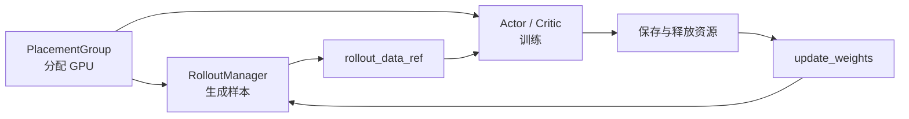
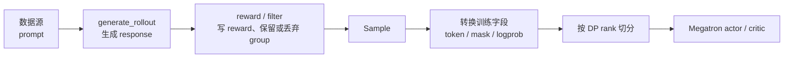
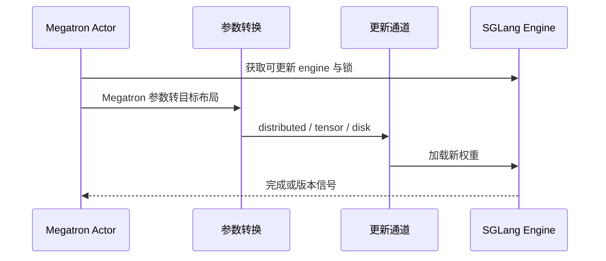

# Slime 业务流程

## 你为什么要读

如果只看 `train.py`，Slime 很像一个短循环；如果把 Ray actor、rollout、reward、训练和权重同步全部展开，它又像一张交通图。真正好用的读法，是始终跟着四样东西走：`rollout_id`、`Sample`、Ray object ref 和当前权重版本。

读完本篇，你应该能回答：一轮训练由谁发车，样本在哪些边界换形，异步模式究竟重叠了什么，以及新权重什么时候才允许进入下一轮生成。

## 先建立心理模型

把 Slime 想成一家前店后厂的餐厅，但类比只用到这里：

- rollout engine 是前台，按当前策略生成候选回答。
- reward 与 filter 是质检，不负责反向传播。
- Megatron actor/critic 是后厂，消费整理好的训练数据并更新参数。
- 权重同步是换菜单。菜单没换完就接新单，得到的不是“创新菜”，而是新旧策略混在一锅里的数据污染。

源码里的准确对象对应如下：

| 心理模型 | 源码对象 | 不能混淆的边界 |
|----------|----------|----------------|
| 一轮节拍 | `rollout_id` | 它是编排标识，不是单条 sample id |
| 样本护照 | `Sample` | 记录 prompt、response、reward、mask 等语义字段 |
| 取件凭证 | Ray object ref | 它指向远端对象，不等于训练 tensor 本身 |
| 新菜单 | actor 参数与 rollout engine 权重 | optimizer step 完成不等于推理侧已经更新 |

## 同步主循环：一轮做完再开下一轮

同步路径的主线是：创建资源与角色，先把 actor 权重推给 rollout engine，然后反复执行生成、训练、保存/卸载、权重更新和评估。



关键代码不长，但顺序很有分量：

```python
# 来源：train.py L63-L89
    for rollout_id in range(args.start_rollout_id, args.num_rollout):
        if args.eval_interval is not None and rollout_id == 0 and not args.skip_eval_before_train:
            ray.get(rollout_manager.eval.remote(rollout_id))

        rollout_data_ref = ray.get(rollout_manager.generate.remote(rollout_id))

        if args.offload_rollout:
            ray.get(rollout_manager.offload.remote())

        actor_trains_this_step = (not args.use_critic) or rollout_id >= args.num_critic_only_steps

        if args.use_critic:
            value_refs = critic_model.async_train(rollout_id, rollout_data_ref)
            if actor_trains_this_step:
                ray.get(actor_model.async_train(rollout_id, rollout_data_ref, external_data=value_refs))
            else:
                ray.get(value_refs)
        else:
            ray.get(actor_model.async_train(rollout_id, rollout_data_ref))

        if should_run_periodic_action(rollout_id, args.save_interval, num_rollout_per_epoch, args.num_rollout):
            save(rollout_id)

        offload_train(actor_trains_this_step)
        if args.offload_rollout:
            ray.get(rollout_manager.onload_weights.remote())
        actor_model.update_weights()
```

这里最容易误读的是 `async_train` 这个名字。外层常常紧接着 `ray.get(...)`，因此“远端异步提交”不自动等于“整轮训练与生成并行”。判断是否真的重叠，要看 future 在哪里创建、在哪里等待。

继续下钻：[[Slime-训练主循环-数据流]] · [[Slime-RL训练全链路]]

## 异步主循环：训练当前批时预取下一批

`train_async.py` 的核心不是把所有步骤都放飞，而是提前提交下一轮 generate，让它和当前轮 train 重叠。到了权重更新边界，代码会先等待正在生成的 future，避免一批生成到一半时被换权重。

```python
# 来源：train_async.py L30-L39
    # async train loop.
    rollout_data_next_future = rollout_manager.generate.remote(args.start_rollout_id)
    for rollout_id in range(args.start_rollout_id, args.num_rollout):
        # Sync the last generation
        if rollout_data_next_future is not None:
            rollout_data_curr_ref = ray.get(rollout_data_next_future)

        # Start the next rollout early.
        if rollout_id + 1 < args.num_rollout:
            rollout_data_next_future = rollout_manager.generate.remote(rollout_id + 1)
```

权重更新处再显式收口正在生成的 future：

```python
# 来源：train_async.py L65-L69
        if (rollout_id + 1) % args.update_weights_interval == 0:
            # sync generate before update weights to prevent update weight in the middle of generation
            rollout_data_curr_ref = ray.get(x) if (x := rollout_data_next_future) is not None else None
            rollout_data_next_future = None
            actor_model.update_weights()
```

这段代码给出两个不变量：

1. train 消费的是已经完成的当前 rollout。
2. 更新权重前，正在使用旧权重的下一轮生成必须收口。

异步提升的是流水线利用率，不是把一致性约束取消。更多边界见 [[Slime-其他Rollout路径-数据流]]。

## 一组 prompt 如何变成训练数据

主循环拿到的不是原始 `Sample` 列表，而是 `RolloutManager.generate` 整理并按 data parallel 切分后的结果。

```python
# 来源：slime/ray/rollout.py L546-L559
    def generate(self, rollout_id):
        start_time = time.time()
        self.rollout_id = rollout_id
        self.health_monitoring_resume()
        if self.args.ci_test and self.args.use_fault_tolerance and rollout_id >= 2:
            self._try_ci_fault_injection()
        data, metrics = self._get_rollout_data(rollout_id=rollout_id)
        self._save_debug_rollout_data(data, rollout_id=rollout_id, evaluation=False)
        _log_rollout_data(rollout_id, self.args, data, metrics, time.time() - start_time)
        if self.args.debug_rollout_only:
            # if debug rollout only, we don't convert samples to train data and directly return
            return
        data = self._convert_samples_to_train_data(data)
        return self._split_train_data_by_dp(data)
```

沿对象生命周期展开：



`Sample` 是这条链的语义中心。前半程围绕文本、消息和 reward 工作，后半程才逐渐转成训练所需的 token、mask 和 batch。过早把所有东西都叫“tensor”，会让你在排障时连对象在哪一层变形都说不清。

继续下钻：[[Slime-Sample数据契约-数据流]] · [[Slime-Reward与过滤-数据流]] · [[Slime-训练数据-数据流]]

## Agent 轨迹只是更复杂的样本生产者

多轮工具调用会让生成阶段更复杂，但它最终仍要交付满足 Slime 契约的 `Sample`。`TrajectoryManager` 可以管理 tool call、环境返回和多轮消息；进入训练侧之前，轨迹仍要明确哪些 token 属于 response、哪些位置参与 loss、reward 写在哪里。

因此自定义 agent 的自由发生在“怎么生产轨迹”，而不是“可以随意改变训练数据语义”。见 [[Slime-Agent轨迹-数据流]] 与 [[Slime-自定义扩展-源码走读]]。

## 新权重怎样回到 rollout engine

optimizer step 只更新训练侧参数。要让下一批样本来自新策略，还要经过模型格式转换、选择同步通道、推送到各 rollout engine，并在必要时处理 pause、offload、engine lock 和版本检查。



源码入口 `MegatronActor.update_weights` 会先处理容错恢复和可更新 engine 集合，再决定后续同步工作。来源：slime/backends/megatron_utils/actor.py L583-L623

具体通道见 [[Slime-分布式权重同步-数据流]]、[[Slime-磁盘权重同步-核心概念]] 与 [[Slime-SGLang-Engine-数据流]]。通道可以不同，一致性目标不变：下一轮生成开始前，相关 engine 必须知道自己装的是哪一版参数。

## 症状应该落在哪一段

| 现象 | 第一检查段 | 先看什么 |
|------|------------|----------|
| rollout 一直等不到足够样本 | 数据源、生成、reward/filter | 有效样本率与 group 丢弃原因 |
| trainer 收到字段缺失或 shape 错 | Sample 转训练数据 | token、mask、response length 的契约 |
| GPU 空转但 Ray task 很多 | 同步/异步等待点 | future 在哪里被 `ray.get` 阻塞 |
| loss 在变，生成行为长期不变 | 权重同步 | engine 集合、同步完成与权重版本 |
| 更新权重时生成报错 | 异步屏障 | 是否在 active generation 中途换权重 |

## 最小验证闭环

**操作：** 在仓库根目录执行以下静态检索，并按“主循环 → 样本转换 → 权重同步”的顺序打开命中位置：

```powershell
rg -n "rollout_manager.generate|async_train|update_weights" slime/train.py slime/train_async.py
rg -n "def generate|_get_rollout_data|_convert_samples_to_train_data|_split_train_data_by_dp" slime/slime/ray/rollout.py
rg -n "def update_weights" slime/slime/backends/megatron_utils/actor.py slime/slime/backends/megatron_utils/update_weight
```

**预期：** 你能从命中结果证明三件事：同步与异步循环的等待点不同；`RolloutManager.generate` 在返回前完成样本转换和 DP 切分；训练侧更新参数后仍需独立的 rollout 权重同步步骤。

## 复盘

Slime 的宏观闭环可以压成一句话：用当前策略生成可训练样本，用 reward 赋予方向，用 actor/critic 更新参数，再把新参数可靠地送回生成侧。微观排障时则始终问四个问题：现在是哪一个 `rollout_id`，手里是什么对象，谁在等待谁，rollout engine 装的是哪一版权重。

下一步按需求进入 [[Slime-模块依赖图]]、[[Slime-架构分层]] 或 [[Slime-RL训练全链路]]。
