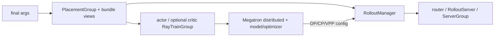
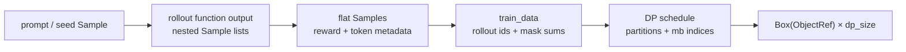
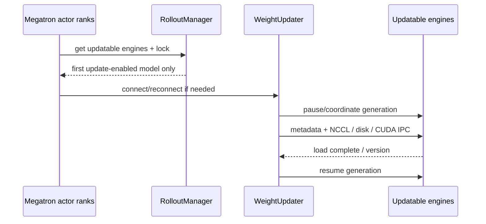

# Slime 业务流程

## 你为什么要读

`generate → train → update_weights` 只描述了三个动作，没有说明动作何时算完成、对象在哪一刻定型、下一步究竟能观察到什么。本篇用六道门描述 Slime 业务流程：资源门、初始权重门、样本门、训练门、发布门、下一轮可见门。同步与流水异步的差别，就体现在这些门是否允许相邻轮次重叠。

## 六道门与四个贯穿身份

| 门 | 通过条件 | 失败时常见表象 |
|----|----------|----------------|
| 资源门 | PG 已调度，RolloutManager 与 training actors 初始化完成 | 一直等 GPU、rank/GPU 错位、server 不健康 |
| 初始权重门 | actor 已加载参数并发布到 updatable rollout engines | 第一轮行为像错误 checkpoint |
| 样本门 | rollout 完成，samples 已校验、转换、按 DP 封装 | reward/mask/shape 错，trainer 拿不到 refs |
| 训练门 | critic（可选）与 actor 远程任务按本轮要求完成 | loss 卡住、某些 PP/DP worker 不返回 |
| 发布门 | 新 actor 参数经 updater 完成 engine reload | 生成行为长期不变、部分 engine 版本漂移 |
| 可见门 | 下一次 generation 在允许的版本边界后开始/继续 | 同一批生成混用版本或产生超预期陈旧度 |

贯穿检查四个身份：outer `rollout_id`、`Sample.rollout_id`、DP rank、weight version。前两个不是同一编号，后两个分别回答“谁训练”和“由哪版策略生成”。

## 阶段 0：资源与角色先建立



RolloutManager 必须先创建，因为 `num_rollout` 可能依赖 DataSource 长度；training models 初始化后又把并行配置回连给 RolloutManager，使其能按训练侧 DP 构造数据。

条件拓扑会改变主体：debug train-only 没有本地 SGLang servers；external rollout 不创建本地 engine actors；PPO 增加 critic；多模型/PD/EPD 会让一个 RolloutManager 持有多个 server/group。

## 阶段 1：第一轮之前先发布 actor 权重

```python
# 来源：train.py L15-L32
    # create the rollout manager, with sglang engines inside.
    # need to initialize rollout manager first to calculate num_rollout
    rollout_manager, num_rollout_per_epoch = create_rollout_manager(args, pgs["rollout"])

    # create the actor and critic models
    actor_model, critic_model = create_training_models(args, pgs, rollout_manager)

    if args.offload_rollout:
        ray.get(rollout_manager.onload_weights.remote())

    # Always push actor weights to rollout once weights are loaded.
    actor_model.update_weights()

    if args.check_weight_update_equal:
        ray.get(rollout_manager.check_weights.remote(action="compare"))

    if args.offload_rollout:
        ray.get(rollout_manager.onload_kv.remote())
```

`hf_checkpoint` 提供 rollout engine 的结构与启动基线，并不保证其中参数就是当前 Megatron actor。bootstrap update 才把训练侧已加载的 actor 参数发布过去。offload 模式先恢复 weights，更新后再恢复 KV/CUDA graph，体现二者不同的生命周期。

## 阶段 2：生成结果在 RolloutManager 边界定型

```python
# 来源：slime/ray/rollout.py L546-L559
    def generate(self, rollout_id):
        start_time = time.time()
        self.rollout_id = rollout_id
        self.health_monitoring_resume()
        if self.args.ci_test and self.args.use_fault_tolerance and rollout_id >= 2:
            self._try_ci_fault_injection()
        data, metrics = self._get_rollout_data(rollout_id=rollout_id)
        self._save_debug_rollout_data(data, rollout_id=rollout_id, evaluation=False)
        _log_rollout_data(rollout_id, self.args, data, metrics, time.time() - start_time)
        if self.args.debug_rollout_only:
            # if debug rollout only, we don't convert samples to train data and directly return
            return
        data = self._convert_samples_to_train_data(data)
        return self._split_train_data_by_dp(data)
```

对象依次变化：



需要特别区分“生成字段”和“转换字段”：tokens、response length、reward、rollout logprob 等应已存在于 `Sample`；默认 converter 负责校验、归一化/选择 reward、补 mask、建立 rollout 分组与 loss 分母，并重排成训练字段字典。它不是在此重新生成 token 或概率。

## 阶段 3：同步主循环逐轮关闭所有门

```python
# 定位骨架（非逐行摘录）：来源 train.py L63-L92
for rollout_id in ...:
    rollout_data_ref = ray.get(rollout_manager.generate.remote(rollout_id))
    if offload_rollout:
        rollout_manager.offload()
    if use_critic:
        value_refs = critic_model.async_train(...)
        actor_model.async_train(..., external_data=value_refs)  # critic-only 阶段可跳过
    else:
        actor_model.async_train(...)
    save_if_needed()
    offload_train(...)
    if offload_rollout:
        rollout_manager.onload_weights()
    actor_model.update_weights()
    if offload_rollout:
        rollout_manager.onload_kv()
```

同步语义不是来自 `async_train` 的名字，而是来自随后的 `ray.get`：主循环先等 generate，再等本轮所需训练，再发布权重，最后才进入下一次 loop iteration。

critic-only 初始阶段不更新 actor 参数，但主循环仍会调用 actor weight publication；因此版本号可能前进而参数数值不变。排障时不能把“版本递增”直接当作“发生过 actor optimizer step”。

## 阶段 4：流水异步只重叠相邻两段

`train_async.py` 明确拒绝 colocate。它先提交当前 generation，在循环内拿到已完成的当前 batch，再提前提交下一批，使下一批生成与当前训练重叠。

```python
# 来源：train_async.py L30-L39
    # async train loop.
    rollout_data_next_future = rollout_manager.generate.remote(args.start_rollout_id)
    for rollout_id in range(args.start_rollout_id, args.num_rollout):
        # Sync the last generation
        if rollout_data_next_future is not None:
            rollout_data_curr_ref = ray.get(rollout_data_next_future)

        # Start the next rollout early.
        if rollout_id + 1 < args.num_rollout:
            rollout_data_next_future = rollout_manager.generate.remote(rollout_id + 1)
```

达到更新间隔时，先收口在途 generation：

```python
# 来源：train_async.py L65-L69
        if (rollout_id + 1) % args.update_weights_interval == 0:
            # sync generate before update weights to prevent update weight in the middle of generation
            rollout_data_curr_ref = ray.get(x) if (x := rollout_data_next_future) is not None else None
            rollout_data_next_future = None
            actor_model.update_weights()
```

它保证单次在途 generation 不被中途换权，却不保证 rollout 永远使用刚训练出的最新参数。`update_weights_interval > 1` 与提前生成都会形成受控策略陈旧度；必须用 sample weight version 与训练时间线描述，而不是笼统称“异步但语义不变”。

## 阶段 5：训练侧不是单一 forward/backward

actor 训练可能经历：

1. 从 Ray refs 取 DP-local batch，并把关键 tensor 搬到 GPU。
2. 按配置切换 ref/teacher/old_actor/actor 参数快照。
3. 计算 ref、teacher 或 current logprob。
4. 合入 critic values。
5. 计算 advantage/returns 与自定义 postprocess。
6. 按预计算 micro-batch schedule 训练。
7. 备份最新 actor 参数，按周期更新 ref/old actor 状态。

critic 则先计算 values，再训练 value loss，并只从 pipeline last stage 返回 values。PP 中间 stage 返回空 dict 是正常拓扑行为，不应误判为 critic 丢数据。

## 阶段 6：权重发布是独立分布式事务边界



updater 路径由 colocate、full/delta mode 和 NCCL/disk transport 决定。多模型 server 中当前只更新第一个 `update_weights=True` 的 model；reference/reward model 可保持 frozen。fault tolerance 恢复出的新 engine 必须重新连接并补当前权重。

“事务边界”在这里表示 generation 不应观察半更新状态，不代表实现提供跨所有 engine 的数据库式回滚。某个 engine 失败时仍需通过日志、版本、健康监控与恢复路径判断是否出现部分成功。

## 典型症状定位

| 症状 | 最可能卡在哪道门 | 首查证据 |
|------|------------------|----------|
| 一直等资源 | 资源门 | PG pending、Ray cluster GPU、bundle placement |
| 第一轮像错误 checkpoint | 初始权重门 | bootstrap update、updatable engine 集合、weight equality check |
| reward 正常但 trainer shape 错 | 样本门 | `Sample` 长度契约、converter、DP partitions |
| critic 有任务但 actor 等不到 | 训练门 | PP last-stage values、每 worker external_data refs |
| loss 变化而行为不变 | 发布门 | updater skip、engine version、部分 model frozen |
| async 样本明显陈旧 | 可见门 | generation future 启动时刻、update interval、sample weight versions |
| offload 后 OOM/恢复失败 | 资源门 + 发布门 | weights/KV onload 顺序、group `needs_offload`、process-group reconnect |

## 最小验证

### 静态时间线

操作：分别给同步与异步入口列出每个 `generate.remote`、`ray.get`、`async_train`、`update_weights` 的顺序，并为 `update_weights_interval=2` 手工标注 rollout 使用的最近已发布版本。

预期：同步模式每轮训练后发布；流水异步模式下一批可在当前训练完成前启动，但更新前会等待在途 generation。

### debug replay 切割

操作：可运行时先保存一批 rollout data，再用 debug train-only replay；无环境时静态追踪 `_get_rollout_data` 的磁盘分支。

预期：replay 不启动本地 SGLang，却仍经过 converter、DP schedule 与训练；若 replay 正常、真实生成失败，问题在样本门之前。

## 复盘

Slime 业务流程的本质不是三个函数名，而是六道可观察的门。同步模式逐轮关闭全部门；流水异步允许下一批提前越过“开始生成”这一步，但在发布新权重前仍要收口在途 generation。沿 outer rollout id、sample rollout id、DP rank 和 weight version 四种身份追踪，才能同时解释正确性、吞吐与故障恢复。

继续深读：[[Slime-RL训练全链路]]、[[Slime-训练主循环-数据流]]、[[Slime-RolloutManager-数据流]]、[[Slime-分布式权重同步-数据流]]。
