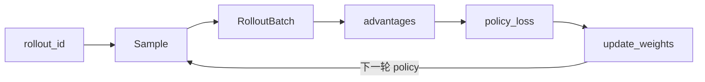

# Slime 关键概念

> 12 个核心概念 · 每节给出含义、源码锚点和继续阅读入口

---

## 你为什么要读

Slime 把 Ray、SGLang、Megatron 和 RL 算法放进同一个闭环，难点不是任一组件本身，而是对象跨边界后语义会变。本篇围绕 `rollout_id`、`Sample`、ObjectRef、weight version 等关键概念，说明谁创建、谁消费、谁负责一致性，让后续源码不再像四套系统临时拼桌。

## 1 · rollout_id

**含义：** 同步/异步主循环的外层迭代计数；贯穿 generate、train、save、eval 与 trace 归因。

**源码锚点：**

```python
## 来源：train.py L62-L67
    for rollout_id in range(args.start_rollout_id, args.num_rollout):
        if args.eval_interval is not None and rollout_id == 0 and not args.skip_eval_before_train:
            ray.get(rollout_manager.eval.remote(rollout_id))

        rollout_data_ref = ray.get(rollout_manager.generate.remote(rollout_id))
```

**读法：** `start_rollout_id` 支持 checkpoint 恢复；`num_rollout == 0` 可 eval-only。

→ [[Slime-训练主循环-核心概念]]

---

## 2 · Sample

**含义：** Rollout 产出的最小训练单元；含 tokens、loss_masks、rewards、rollout_log_probs 等字段。

**源码锚点：**

```python
## 来源：slime/utils/types.py L81-L120（节选）
@dataclass
class Sample:
    """The sample generated by the rollout."""

    prompt: str = ""
    response: str = ""
    tokens: list[int] = field(default_factory=list)
    loss_masks: list[int] = field(default_factory=list)
    rewards: float | list[float] = 0.0
    rollout_log_probs: list[float] = field(default_factory=list)
    status: SampleStatus = SampleStatus.PENDING
    metadata: dict[str, Any] = field(default_factory=dict)
```

**读法：** `loss_masks` 区分 prompt/response 哪些 token 参与 policy loss；`rollout_log_probs` 用于 off-policy 校正（TIS/ICEPOP）。

→ [[Slime-Sample数据契约-核心概念]]

---

## 3 · generate → train → update_weights

**含义：** Slime 同步训练每个 rollout_id 的三步节拍；异步版 prefetch generate 但语义不变。

**源码锚点：**

```python
## 来源：train.py L67-L89
        rollout_data_ref = ray.get(rollout_manager.generate.remote(rollout_id))

        if args.offload_rollout:
            ray.get(rollout_manager.offload.remote())

        actor_trains_this_step = (not args.use_critic) or rollout_id >= args.num_critic_only_steps
        if args.use_critic:
            value_refs = critic_model.async_train(rollout_id, rollout_data_ref)
            if actor_trains_this_step:
                ray.get(actor_model.async_train(rollout_id, rollout_data_ref, external_data=value_refs))
            else:
                ray.get(value_refs)
        else:
            ray.get(actor_model.async_train(rollout_id, rollout_data_ref))

        if should_run_periodic_action(rollout_id, args.save_interval, num_rollout_per_epoch, args.num_rollout):
            save(rollout_id)

        actor_model.update_weights()
```

→ [[Slime-阅读方法-核心概念]] · [[Slime-RL训练全链路]]

---

## 4 · PlacementGroup（colocate / offload）

**含义：** Ray PG 把 train GPU 与 rollout GPU 映射到物理节点；`colocate` 强制 offload 以时分复用显存。

**源码锚点：**

```python
## 来源：slime/ray/placement_group.py L42-L48
def _create_placement_group(num_gpus):
    if num_gpus == 0:
        return None, [], []
    bundles = [{"GPU": 1, "CPU": 1} for _ in range(num_gpus)]
    pg = placement_group(bundles, strategy="PACK")
```

→ [[Slime-Ray参数-核心概念]] · [[Slime-PlacementGroup-核心概念]]

---

## 5 · RolloutManager

**含义：** Rollout 三角的调度中枢；持有 DataSource、rollout fn、SGLang ServerGroup。

**源码锚点：** 见 [[Slime-架构分层#Layer 2 · Rollout 生成]] 中 `generate()` 片段。

→ [[Slime-RolloutManager]]

---

## 6 · RolloutBatch / train_data

**含义：** `_convert_samples_to_train_data` 将 Sample list 张量化为 Megatron 可消费的 dict（tokens、advantages、masks 等）。

**源码锚点：**

```python
## 来源：slime/rollout/base_types.py L1-L26（节选）
@dataclass
class RolloutFnTrainOutput:
    data: list[list[Sample]]
    metrics: dict[str, Any] = field(default_factory=dict)
```

→ [[Slime-训练数据-核心概念]]

---

## 7 · advantage_estimator（GRPO / PPO / GSPO）

**含义：** `compute_advantages_and_returns` 根据 `--advantage-estimator` 就地写 advantages/returns。

**源码锚点：**

```python
## 来源：slime/backends/megatron_utils/loss.py L661-L685
def compute_advantages_and_returns(args: Namespace, rollout_data: RolloutBatch) -> None:
    """Compute advantages and returns in-place based on `args.advantage_estimator`.

    This function extracts rewards, log-probs, values, and masks from
    `rollout_data`, computes KL divergences, then applies the chosen advantage
    estimator. Supported methods: "grpo", "gspo", "cispo", "ppo",
    "reinforce_plus_plus", and "reinforce_plus_plus_baseline". When
    `args.normalize_advantages` is True, advantages are whitened across the
    data-parallel group using masked statistics.

    Early returns if both `log_probs` and `values` are None (intermediate
    pipeline stages).

    If ``args.custom_advantage_function_path`` is set, it is called after KL computation
    and must populate ``rollout_data["advantages"]`` and
    ``rollout_data["returns"]``.

    Args:
        args: Configuration specifying estimator type, KL coefficient,
            normalization settings, and other hyperparameters.
        rollout_data: Dict containing input lists ("log_probs", "ref_log_probs",
            "rewards", "values", "response_lengths", "loss_masks",
            "total_lengths"). Modified in-place to add "advantages" and
            "returns" keys, each mapping to lists of tensors per sample.
    """
```

→ [[Slime-Advantage计算-核心概念]]

---

## 8 · policy_loss_function

**含义：** PPO/GSPO clipped policy gradient；可选 TIS、KL penalty。

**源码锚点：**

```python
## 来源：slime/backends/megatron_utils/loss.py L881-L896
def policy_loss_function(
    args: Namespace,
    batch: RolloutBatch,
    logits: torch.Tensor,
    sum_of_sample_mean: Callable[[torch.Tensor], torch.Tensor],
) -> tuple[torch.Tensor, dict[str, torch.Tensor]]:
    """Compute policy loss (PPO/GSPO) and metrics.
    Computes current log-probabilities and entropy from model logits, then
    calculates PPO-style clipped policy gradient loss.
    """
```

→ [[Slime-Policy-Loss-核心概念]]

---

## 9 · update_weights

**含义：** 训练后把 Megatron 权重推送到 SGLang engine；支持 NCCL broadcast、disk、delta、tensor 多路径。

**源码锚点：** 见 [[Slime-架构分层#Layer 5 · 权重同步]]。

→ [[Slime-分布式权重同步-核心概念]]

---

## 10 · customization hooks（--*-path）

**含义：** 17 类可插拔函数路径，由 `load_function` 动态 import；CLI 传入点分路径，如 `slime.rollout.sglang_rollout.generate_rollout`。

**源码锚点：**

```python
## 来源：slime/utils/misc.py L37-L45
def load_function(path):
    module_path, _, attr = path.rpartition(".")
    module = importlib.import_module(module_path)
    return getattr(module, attr)
```

→ [[Slime-自定义扩展-核心概念]] · [[Slime-训练与Rollout参数-核心概念]]

---

## 11 · TrajectoryManager（Agentic RL）

**含义：** 多轮 LLM 对话轨迹管理；adapters 对接 OpenAI/Anthropic API，最终转为 Sample。

→ [[Slime-Agent轨迹-核心概念]]

---

## 12 · trace / profile

**含义：** `trace_utils` 为 Sample 级 span 归因；`TrainProfiler` 包装 PyTorch profiler 与 memory snapshot。

**源码锚点：**

```python
## 来源：slime/utils/trace_utils.py L16-L24
TRACE_VERSION = 1
TRACE_CHILDREN_KEY = "_trace_children"
SGLANG_TRACE_META_KEYS = (
    "prompt_tokens",
    "completion_tokens",
    "cached_tokens",
    "queue_time",
    "e2e_latency",
    "decode_throughput",
)
```

→ [[Slime-可观测性与CI]]

---

## 概念关系图



---

## 导航

- [[Slime-术语表]] — 完整术语索引
- [[Slime-学习路径]]
