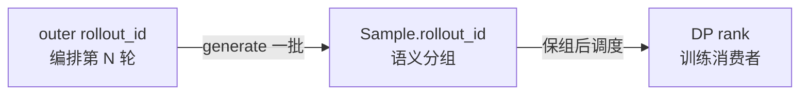
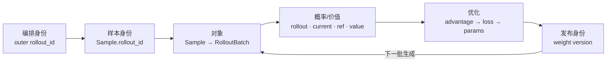

# Slime 关键概念

## 你为什么要读

Slime 最难的不是术语多，而是同一个词常跨越不同层级：`actor` 既可能指 RL policy，也可能指 Ray 进程；`rollout_id` 既出现在主循环，也出现在单条 `Sample`；“batch”可能指生成结果、DP 分片或 Megatron micro-batch。本篇不按字母表背名词，而是建立五组不会互相替代的概念：身份、对象、概率、资源和权重版本。

## 一、三种身份：迭代、样本组、训练消费者

### 1. 主循环 `rollout_id`：编排时间轴

`train.py` 中的 `rollout_id` 是外层迭代索引，用于调用 generate/train、决定 save/eval 周期并支持 checkpoint 恢复。它回答的是“现在推进到第几轮编排”，不是“这条训练样本来自哪次生成执行”。

```python
# 来源：train.py L63-L67
    for rollout_id in range(args.start_rollout_id, args.num_rollout):
        if args.eval_interval is not None and rollout_id == 0 and not args.skip_eval_before_train:
            ray.get(rollout_manager.eval.remote(rollout_id))

        rollout_data_ref = ray.get(rollout_manager.generate.remote(rollout_id))
```

### 2. `Sample.rollout_id`：loss 聚合身份

一轮主循环可以生成很多 `Sample`，一次 compact/subagent rollout 还可能拆成多个 sibling samples。`Sample.rollout_id` 用来声明哪些 siblings 属于同一次 rollout 执行，使它们共享 loss 聚合分母；缺失时，转换层会为默认“一次执行一条 sample”路径分配临时身份。

因此不要写出 `outer rollout_id == every Sample.rollout_id` 这样的无条件等式。前者是时间轴，后者是样本分组键。

### 3. DP rank：训练消费者身份

RolloutManager 根据训练侧回传的 `dp_size` 建立 partitions；返回值是长度等于 DP world size 的引用列表。每个 Megatron worker 根据自己的 DP rank 取其中一份。DP rank 决定“谁消费哪份数据”，不决定样本原本属于哪个 rollout。



## 二、四次对象换形

### 1. `Sample`：生成与训练之间的语义护照

`Sample` 不是旧版笔记中写的 `loss_masks/rewards` 复数字段。当前 baseline 的核心字段是 `reward`、`loss_mask`、`rollout_log_probs`、`weight_versions`，并包含 response 长度、状态、top-p/routing replay、multimodal 与训练 metadata。

```python
# 来源：slime/utils/types.py L97-L120
    group_index: int | None = None
    index: int | None = None
    # Id of the rollout this sample came from. Defaults to ``None`` and the
    # downstream pipeline falls back to ``index`` (so the default rollout
    # path, where one execution = one training sample, sees rollout_id ==
    # index). Compact / subagent paths that split one rollout execution into
    # multiple training samples should set the same ``rollout_id`` on every
    # sibling, so loss aggregation averages within the rollout instead of
    # over-counting it.
    rollout_id: int | None = None
    # prompt
    prompt: str | list[dict[str, str]] = ""
    tokens: list[int] = field(default_factory=list)
    multimodal_inputs: dict[str, Any] | None = None  # raw multimodal data, e.g. images, videos, etc.
    multimodal_train_inputs: dict[str, Any] | None = None  # processed multimodal data, e.g. pixel_values, etc.
    multimodal_train_input_id: str | None = None
    apply_chat_template_kwargs: dict = field(default_factory=dict)
    # response
    response: str = ""
    response_length: int = 0
    label: str | None = None
    reward: float | dict[str, Any] | None = None
    loss_mask: list[int] | None = None
    weight_versions: list[str] = field(default_factory=list)
```

三个关键不变量：

- `len(loss_mask) == response_length`；
- 存在 rollout logprob 时，其长度也等于 `response_length`；
- top-p replay offsets 的长度等于 `response_length + 1`。

### 2. `RolloutFnTrainOutput`：rollout 插件返回契约

```python
# 来源：slime/rollout/base_types.py L7-L10
@dataclass
class RolloutFnTrainOutput:
    samples: list[list[Sample]]
    metrics: dict[str, Any] = None
```

它只承诺 `samples` 与 `metrics`，还不是 Megatron 可直接消费的训练 batch。兼容层允许旧 rollout 函数直接返回 samples，但会包装成这个类型。

### 3. `train_data` / `RolloutBatch`：转换后的字段字典

RolloutManager flatten/校验 samples，处理 reward，再构造 `tokens`、`response_lengths`、`rollout_ids`、`loss_masks`、`rollout_mask_sums` 等字段。`RolloutBatch` 在类型层只是 dict alias；真正可用字段由转换、DP split 和训练预处理逐步补齐。

这意味着“`RolloutBatch` 是一个固定 dataclass”是错的，“rollout 函数直接返回 advantages”也不是默认主线。advantages 通常在 actor 训练前计算并写回 batch。

### 4. micro-batch：执行切片，不是新语义对象

DP schedule 已经决定 rank-local partition 和 `micro_batch_indices`；Megatron `DataIterator` 只是按计划取字段。micro-batch 改变执行粒度，但不应改变 rollout 分组和 loss 分母。

## 三、四种概率/价值信号

| 信号 | 生产者 | 回答的问题 | 典型用途 |
|------|--------|------------|----------|
| rollout logprob | SGLang 生成时 | 采样策略当时给已生成 token 多大概率？ | mismatch、TIS、直接作 old policy |
| train/current logprob | Megatron actor forward | 当前训练模型给同一 token 多大概率？ | policy gradient、KL、诊断生成/训练差异 |
| ref logprob | reference 权重 forward | 参考策略给 token 多大概率？ | KL reward 或 KL loss |
| value | critic | 从当前位置继续的预期回报是多少？ | PPO advantage/return |

`reward` 是样本结果信号，`advantage` 是结合 estimator、KL、value、mask 后得到的优化信号。两者不能互换。

### Advantage estimator 不是算法标签的全部

`compute_advantages_and_returns` 当前支持 GRPO、GSPO、CISPO、PPO、REINFORCE++ 及 baseline 变体，也允许 custom advantage function。它还可能执行 KL 计算、OPD 修正和跨 DP 的 masked normalization。

```python
# 来源：slime/backends/megatron_utils/loss.py L661-L676
def compute_advantages_and_returns(args: Namespace, rollout_data: RolloutBatch) -> None:
    """Compute advantages and returns in-place based on `args.advantage_estimator`.

    This function extracts rewards, log-probs, values, and masks from
    `rollout_data`, computes KL divergences, then applies the chosen advantage
    estimator. Supported methods: "grpo", "gspo", "cispo", "ppo",
    "reinforce_plus_plus", and "reinforce_plus_plus_baseline". When
    `args.normalize_advantages` is True, advantages are whitened across the
    data-parallel group using masked statistics.

    Early returns if both `log_probs` and `values` are None (intermediate
    pipeline stages).

    If ``args.custom_advantage_function_path`` is set, it is called after KL computation
    and must populate ``rollout_data["advantages"]`` and
    ``rollout_data["returns"]``.
```

注意源码注释与可执行逻辑存在一处漂移：docstring 写“`log_probs` 与 `values` 都为空时返回”，当前函数体真正的早退条件是“不是 pipeline last stage”。作实现判断应以函数体为准。

### `loss_type` 与 `advantage_estimator` 是两层选择

`loss_type` 可分派到 policy、value、SFT 或 custom loss；只有 policy loss 路径才继续讨论 PPO/GSPO clipping、TIS、OPSM、entropy 与 KL loss。不要用“Slime 的 loss 就是 PPO/GSPO”概括整个训练后端。

## 四、三种 actor 与两套并行

### Ray Actor、RL actor、critic

| 名称 | 所在层 | 含义 |
|------|--------|------|
| Ray Actor | 分布式运行时 | 远程 Python 进程/对象 |
| RL actor / policy | 算法层 | 被优化、用于生成的策略模型 |
| critic | 算法层 | 可选 value model |

`RayTrainGroup.async_train()` 返回一组 Ray refs；“async”表示远程提交接口。同步主循环随即 `ray.get` 时，并不会因此自动与下一轮 generation 重叠。

### Ray 资源布局与 Megatron 并行拓扑

PlacementGroup 只预订 bundle 并决定 actor/rollout 的 slice；TP、PP、DP、CP、EP 由 PyTorch Distributed/Megatron 建组。当前实现通常创建一个 PG，再为 actor 与 rollout 使用不同或重叠的 bundle slices；critic 复用 actor 的 PG 描述。不能说“Slime 分别为 train/rollout/critic 创建三个 PG”。

colocate 只表示资源重叠，需要 offload/onload 错峰；它不等于 Megatron 与 SGLang 在同一 Python 进程共享参数对象。`train_async.py` 还明确拒绝 colocate。

## 五、同步、流水异步与权重版本

### 同步 baseline

`generate(N) → train(N) → update_weights → generate(N+1)`。每轮更新是下一轮生成前的屏障；critic-only 阶段可能不训练 actor，但同步主循环仍会调用 actor weight update，因此可能把未变化的 actor 参数再次发布并推进 updater 的版本号。版本递增只能证明发布动作发生，不能单独证明参数数值已经改变。

### 流水异步

`train_async.py` 会让 `generate(N+1)` 与 `train(N)` 重叠。达到更新间隔时先等待在途 generation，再发布新权重。因此它保留“单次 generation 不被中途换权”的一致性，但不保证每批样本都来自训练刚完成的最新版本。

### weight version

optimizer step 只改变训练侧参数。发布层还要选择 updater、转换参数布局、暂停或协调 generation、传输 tensor/文件并让各 engine 完成 reload。SGLang 返回的 `weight_version` 可被追加到 `Sample.weight_versions`，它是诊断策略陈旧度与部分 engine 漂移的重要证据，不是参数 checksum。

## 六、扩展与 trace 的边界

### `--*-path` hook

自定义函数通过 `load_function` 动态 import。hook 数量会随参数版本变化，不应把“17 类”当稳定协议；真正契约是具体参数、函数签名、输入输出对象与调用时机。

```python
# 来源：slime/utils/misc.py L37-L45
def load_function(path):
    """
    Load a function from a module.
    :param path: The path to the function, e.g. "module.submodule.function".
    :return: The function object.
    """
    module_path, _, attr = path.rpartition(".")
    module = importlib.import_module(module_path)
    return getattr(module, attr)
```

### trace carrier

trace 工具会为 `Sample` 动态绑定 carrier，记录 trace id、sample/group id、attempt、span/event，并可把 SGLang timing metadata 展开成子 span。它是尽力而为的诊断面：大量操作捕获异常并降级为 debug 日志，不能把“没有 trace”直接解释为“业务函数没有执行”。

## 概念关系图



## 自测

- 为什么 outer `rollout_id=7` 不代表这一批每条 `Sample.rollout_id` 都等于 7？
- `RolloutFnTrainOutput`、`train_data`、Ray refs、`RolloutBatch` 和 micro-batch 分别在哪个边界出现？
- rollout/current/ref logprob 与 critic value 各由谁产生？
- colocate 为什么不等于同进程共享参数？
- 流水异步为什么既能避免 generation 中途换权，又仍然存在策略陈旧度？

答不清时依次进入 [[Slime-RL训练全链路]]、[[Slime-Sample数据契约]]、[[Slime-训练数据]]、[[Slime-Advantage计算]] 与 [[Slime-分布式权重同步]]。
