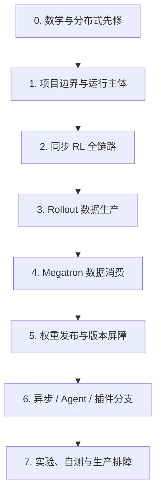

# Slime 导读与总览

> 这里不是文件目录，而是进入 Slime 的任务地图。代码基线 `22cdc6e1`。

## 你为什么要读

Slime 的文件分属编排、生成、训练和权重发布，却共同参与同一轮 RL。这里先帮你选对观察层和运行模式，避免一上来按目录堆函数，或把同步、流水异步与 fully async 的一致性规则混在一起。

## 先判断你在研究哪一层

Slime 把 RL 算法闭环落实成四类运行时责任；同一个故障常会跨层传播，但应先找到最早破坏不变量的那一层。

| 层 | 核心对象 | 主要责任 | 典型问题 |
|----|----------|----------|----------|
| 编排层 | Ray PlacementGroup、Actor、ObjectRef | 预订 GPU、启动主体、跨进程传对象、建立同步点 | 资源排不到、rank/GPU 错位、某个 future 永远不返回 |
| 生成层 | DataSource、RolloutManager、SGLang engine、`Sample` | 取 prompt、生成、奖励、过滤、记录采样 metadata | rollout 卡住、奖励错、样本版本不一致 |
| 训练层 | Megatron actor/critic、`RolloutBatch`、micro-batch | logprob/value/advantage、forward/backward、optimizer step | loss 异常、PP/DP 不一致、OOM |
| 发布层 | weight converter/updater、NCCL/disk/tensor API | 把 Megatron 参数安全发布到 SGLang | update 卡死、部分 engine 旧权重、cache 与权重不一致 |

贯穿四层的是三种身份：`rollout_id` 标识样本分组，DP rank 标识训练消费者，`weight_version` 标识生成策略版本。阅读任何专题时都问：这三个身份在哪里产生、在哪里传播、在哪里校验？

## 第一次阅读主线

| 顺序 | 阅读 | 本阶段必须形成的判断 |
|-----:|------|----------------------|
| 0 | [[Slime-零基础先修]] | Ray 管运行主体与资源，Megatron 管训练并行；二者不是同一种“分布式” |
| 1 | [[Slime-项目总览]] · [[Slime-架构分层]] | 区分编排、生成、训练、权重发布四类责任 |
| 2 | [[Slime-RL训练全链路]] | 沿一个同步 `rollout_id` 走通对象与版本生命周期 |
| 3 | [[Slime-Rollout生成]] | `Sample` 不只是文本，而是训练语义与采样证据的载体 |
| 4 | [[Slime-训练后端]] | DP schedule 先定分片，Megatron actor 只消费 rank-local 计划 |
| 5 | [[Slime-权重同步]] | optimizer step 不会自动影响 rollout；必须显式完成发布屏障 |
| 6 | [[Slime-高级特性]] · [[Slime-扩展与生态]] | 分清 pipeline async、fully async、Agent 与自定义 hook 改变的边界 |
| 7 | [[Slime闭环实验]] · [[Slime-综合学习检查]] · [[Slime-总结复盘]] | 能通过可观察事实定位，而非只复述架构图 |

## 按当前任务选入口

| 当前任务 | 先读 | 再读 |
|----------|------|------|
| 完全不懂 Ray/Megatron | [[Slime-零基础先修]] | [[Slime-项目总览]] |
| 想在一小时内建立全局模型 | [[Slime学习指南]] | [[Slime-RL训练全链路]] 的“先建立模型、贯穿场景、复盘” |
| 查 CLI 参数为何没生效 | [[Slime-训练与Rollout参数]] | [[Slime-Ray参数]] · [[Slime-训练与Rollout参数-源码走读]] |
| 查 GPU 为什么排不到或放错 | [[Slime-PlacementGroup]] | [[Slime-RayTrainGroup]] · [[Slime-引擎拓扑]] |
| 查 rollout/reward/数据污染 | [[Slime-RolloutManager]] | [[Slime-SGLang-Rollout]] · [[Slime-数据源]] |
| 查 advantage/loss | [[Slime-训练数据]] | [[Slime-Advantage计算]] · [[Slime-Policy-Loss]] |
| 查 OOM 或 DP 不均 | [[Slime-RL训练全链路]] 的 DP schedule 小节 | [[Slime-训练数据]] · [[Slime-上下文并行与路由重放]] |
| 查下一轮还是旧模型 | [[Slime-分布式权重同步]] | [[Slime-Megatron到HF转换]] · [[Slime-SGLang-Engine]] |
| 改 rollout 或 reward | [[Slime-自定义扩展]] | [[Slime-Agent轨迹]] · [[Slime-插件与示例]] |
| 对照 SGLang 内部实现 | [[Slime与SGLang-阅读对照]] | 对应 SGLang 专题 |

## 三种主循环不要混读

| 模式 | 入口 | 生成与训练关系 | 权重一致性抓手 |
|------|------|----------------|----------------|
| 同步 baseline | `train.py` | `generate(N) → train(N) → update → generate(N+1)` | 每轮 update 是下一轮生成前的屏障 |
| 流水异步 | `train_async.py` | `generate(N+1)` 与 `train(N)` 重叠 | 更新前等待在途 generation；存在受控陈旧度 |
| fully async 示例 | `examples/full_async` | 生成、缓冲、训练可独立推进 | 必须显式设计版本、陈旧度与样本消费策略 |

第一次学习优先同步 baseline。流水异步入口明确不支持 colocate；fully async 是另一套系统设计，不是 `train_async.py` 的别名。

## 查阅型地图

| 需要什么 | 文档 |
|----------|------|
| 顶层文件与类定位 | [[Slime-源码地图]] |
| RL / Ray / Megatron 术语 | [[Slime-术语表]] |
| 模块 import 与依赖 | [[Slime-模块依赖图]] |
| 端到端业务步骤 | [[Slime-业务流程]] |
| 按学习目标选路线 | [[Slime-学习路径]] |
| 复杂度、FAQ、可观测与复盘 | [[Slime-总结复盘]] |

## 本目录的边界

本目录负责建立全局模型和选择阅读路径，不替代专题源码走读。入口页中的图是认知压缩，不表示所有配置都走同一路径：critic、colocate、external rollout、debug-only、offload、磁盘权重同步、异步和 Agent 都会改变局部时序。需要作实现判断时，必须回到对应 walkthrough 的源码证据与运行验证。
