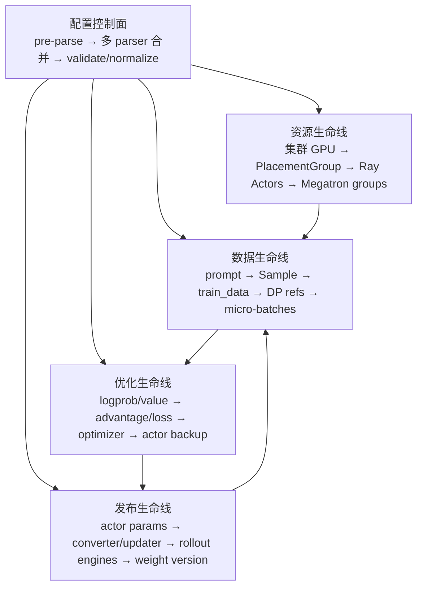

# Slime 架构分层

## 你为什么要读

Slime 不能用一条“入口 → rollout → train → update”流水线概括。配置在启动前改写拓扑，Ray 与 Megatron 分别管理两套分布式身份，RolloutManager 同时拥有 server、data source、转换和诊断边界，权重发布又有 tensor、NCCL、全量磁盘和 delta 磁盘多条路线。本篇用“控制面 + 四条对象生命线”分层：每一层都明确所有者、输入、输出和不能越界的判断。

## 总览：一张控制面，四条生命线



这不是目录层级：同一个文件可能参与多条生命线。例如 `actor.py` 同时参与训练数据搬运、模型切换、optimizer、offload 和权重发布；`rollout.py` 同时参与 server 生命周期、样本转换、DP schedule、debug replay、metrics 与故障恢复。

## 一、配置控制面：最终 `args` 是派生事实

### 所有者

- `slime/utils/arguments.py`
- SGLang 参数 parser/validator
- Megatron 参数 parser/validator
- role-specific YAML 与 custom config

### 真实过程

1. `_pre_parse_mode()` 先读会改变解析路径的 debug/backend 参数。
2. 非 train-only 路径独立解析 SGLang 参数。
3. Megatron parser 注入 Slime 参数并忽略已由其他 parser 消费的未知项。
4. 合并 pre-parsed 与 SGLang namespace。
5. `slime_validate_args()` 不只检查，还会派生和改写大量字段。
6. 条件执行 Megatron 与 SGLang validator。
7. actor/critic 还可能从 role-specific YAML 派生各自的 args 副本。

```python
# 来源：slime/utils/arguments.py L1546-L1561
def parse_args(add_custom_arguments=None):
    # Users may call `parse_args` very early, thus we ensure logger is configured here
    configure_logger()

    add_slime_arguments = get_slime_extra_args_provider(add_custom_arguments)

    pre = _pre_parse_mode()
    skip_sglang = pre.debug_train_only or pre.load_debug_rollout_data is not None

    # Phase 1: Parse sglang args independently (separate parser, parse_known_args).
    # Skipped when sglang servers are not needed.
    sglang_ns = None
    if not skip_sglang:
        sglang_ns = sglang_parse_args()

    # Phase 2: Parse megatron + slime args.
```

“validate”之后可能发生的关键派生包括：

| 输入事实 | 派生/改写 |
|----------|-----------|
| `load_debug_rollout_data` | 强制 `debug_train_only`，不实例化 SGLang |
| external engine addresses | 设置 `rollout_external`，并把外部拓扑写回 args |
| `advantage_estimator == ppo` | 派生 `use_critic=True`，critic GPU 数跟 actor 对齐 |
| `colocate` | 默认打开 train/rollout offload，并补 rollout GPU 数 |
| debug rollout-only | 重算 actor/rollout 资源，随后关闭 colocate/offload |
| `num_steps_per_rollout` | 反推并校验 global batch size |
| `custom_config_path` | 在大部分校验之后继续覆盖或新增字段 |

最后一项尤其危险：custom config 是晚期覆盖，不能假设所有覆盖值都重新经过前面的全部语义校验。

## 二、资源生命线：Ray 决定在哪里，Megatron 决定怎样并行

### PlacementGroup 与 bundle slices

Slime 通常创建一个 Ray PlacementGroup，再把有序 bundle indices/GPU ids 作为 actor 与 rollout 的不同或重叠视图。critic 使用 actor 的 PG 描述。debug、external 与 colocate 会改变总 GPU 数和 rollout offset。

```python
# 来源：slime/ray/placement_group.py L120-L135
def create_placement_groups(args):
    """Create placement groups for actor, critic, and rollout engines."""

    num_gpus, rollout_offset = _get_placement_group_layout(args)

    logger.info(f"Creating placement group with {num_gpus} GPUs...")
    pg, actor_pg_reordered_bundle_indices, actor_pg_reordered_gpu_ids = _create_placement_group(num_gpus)
    rollout_pg_reordered_bundle_indices = actor_pg_reordered_bundle_indices[rollout_offset:]
    rollout_pg_reordered_gpu_ids = actor_pg_reordered_gpu_ids[rollout_offset:]

    result = {
        "actor": (pg, actor_pg_reordered_bundle_indices, actor_pg_reordered_gpu_ids),
        "rollout": (pg, rollout_pg_reordered_bundle_indices, rollout_pg_reordered_gpu_ids),
    }

    result["critic"] = result["actor"] if args.use_critic else None
```

### 两套分布式身份

| 层 | 身份 | 由谁建立 | 用途 |
|----|------|----------|------|
| Ray | actor handle、bundle index、物理 GPU id | placement group / scheduling strategy | 进程落点与资源占用 |
| torch distributed / Megatron | global/TP/PP/DP/CP/EP rank | `TrainRayActor.init` 与 Megatron init | collective、模型切分和训练语义 |

PlacementGroup 不会自动创建 TP/PP/DP；Megatron 也不负责让 Ray actor 被调度到哪台机器。

### Rollout server 不是固定单组

当前 `RolloutManager` 可以持有多模型 `servers`；每个 `RolloutServer` 有自己的 router，并包含一个或多个 `ServerGroup`。组可以是 regular、prefill、decode、encoder 或 placeholder，TP 与 GPU 数也可不同。EPD 甚至需要先同步启动 encoder、收集 URL，再启动 language-only worker。

因此“一个 RolloutManager = 一组同构 SGLang engines”只适用于最简单默认配置。

## 三、数据生命线：RolloutManager 是变形边界，不是生成算法本身

### 所有者变化

| 阶段 | 对象 | 所有者 |
|------|------|--------|
| prompt/buffer | dataset rows、`Sample` seeds | DataSource |
| rollout 输出 | `RolloutFnTrainOutput.samples` | 可替换 rollout function |
| 训练语义 | reward、mask、rollout id、mask sums | RolloutManager conversion |
| 调度结果 | partitions、micro-batch indices | DP schedule |
| 远程数据 | `Box(ObjectRef)` × DP size | Ray object store/NIXL |
| rank-local batch | `RolloutBatch` | Megatron actor |

```python
# 来源：slime/ray/rollout.py L546-L559
    def generate(self, rollout_id):
        start_time = time.time()
        self.rollout_id = rollout_id
        self.health_monitoring_resume()
        if self.args.ci_test and self.args.use_fault_tolerance and rollout_id >= 2:
            self._try_ci_fault_injection()
        data, metrics = self._get_rollout_data(rollout_id=rollout_id)
        self._save_debug_rollout_data(data, rollout_id=rollout_id, evaluation=False)
        _log_rollout_data(rollout_id, self.args, data, metrics, time.time() - start_time)
        if self.args.debug_rollout_only:
            # if debug rollout only, we don't convert samples to train data and directly return
            return
        data = self._convert_samples_to_train_data(data)
        return self._split_train_data_by_dp(data)
```

`generate()` 是主循环调用的 Ray API，但不是“唯一生成入口”：真实样本生产由动态加载的 rollout function 完成，eval 使用独立函数，debug train-only 可以从磁盘恢复 samples，custom converter 还能完全替换默认字段转换。

### 数据层的核心不变量

- compact siblings 必须共享 `Sample.rollout_id`；
- `loss_mask` 与 response length 对齐；
- `rollout_mask_sums` 在全局可见时预计算，micro-batch 拆分不改变分母；
- DP refs 数量等于 DP size，rank 只取自己的 partition；
- object-store 与 NIXL 改变传输实现，不改变上层 batch 语义。

## 四、优化生命线：actor.py 是模型状态机

### actor/critic 分流

`MegatronTrainRayActor.train()` 先处理 wake-up 与 rank-local 数据，再按 role 分流。critic 计算 values、advantage/return 并训练 value loss；actor 可能切换 ref、teacher、old_actor、actor 多份备份，补齐 logprob/value，计算 advantage，再执行配置的 loss。

```python
# 来源：slime/backends/megatron_utils/actor.py L380-L400
    def train(self, rollout_id: int, rollout_data_ref: Box, external_data=None):
        if self.args.debug_rollout_only:
            return None

        if self.args.offload_train:
            self.wake_up()

        with timer("data_preprocess"):
            rollout_data = self._get_rollout_data(rollout_data_ref)

        if self.role == "critic":
            result = self.train_critic(rollout_id, rollout_data)
        else:
            self.train_actor(rollout_id, rollout_data, external_data=external_data)
            result = None

        if self.args.offload_train:
            del rollout_data
            self.sleep()

        return result
```

actor 训练完成后会把最新参数备份到 `weights_backuper`；reference 更新、old actor 队列和 rollout actor 版本又有各自节拍。所谓“一个 actor 模型”在运行时可能实际包含多个可切换参数快照。

## 五、发布生命线：同步模式由配置与资源关系共同决定

### updater 选择

| 条件 | updater | 主要载体 |
|------|---------|----------|
| colocate | `UpdateWeightFromTensor` | CUDA IPC/tensor 路径，仍是跨进程协议 |
| full + NCCL | `UpdateWeightFromDistributed` | Ray metadata + collective tensor |
| full + disk | `UpdateWeightFromDisk` | 完整 HF checkpoint 目录 |
| delta + disk | `UpdateWeightFromDiskDelta` | 本地基线 + 版本 delta |

delta 不支持 colocate，且要求共享发布目录与 rollout-host-local checkpoint。不能再用“NCCL / disk / megatron_to_hf”三个名词覆盖所有边界。

### 发布时序

```python
# 来源：slime/backends/megatron_utils/actor.py L583-L599
    def update_weights(self) -> None:
        if self.args.debug_train_only or self.args.debug_rollout_only:
            return

        if self.args.use_fault_tolerance:
            if dist.get_rank() == 0:
                ray.get(self.rollout_manager.recover_updatable_engines.remote())
            dist.barrier(group=get_gloo_group())

        (
            rollout_engines,
            rollout_engine_lock,
            num_new_engines,
            engine_gpu_counts,
            engine_gpu_offsets,
            all_engine_actors,
        ) = ray.get(self.rollout_manager.get_updatable_engines_and_lock.remote())
```

RolloutManager 只返回第一个 `update_weights=True` 的 model；当前多模型场景还不支持同时更新多个 model。frozen reference/reward servers 会被排除。fault tolerance、offload_train + critic、动态恢复的新 engine 都会改变连接和 barrier 时序。

weight version 是发布序号，不是 checksum；版本一致也不能单独证明参数数值正确，仍需 `check_weight_update_equal` 或目标 workload 行为验证。

## 六、横切面：扩展、可观测与故障恢复

这些能力不是最末一层，而是穿过前述生命线：

| 横切面 | 插入位置 | 风险 |
|--------|----------|------|
| custom hooks | model、rollout、reward、converter、advantage、loss、logging、delta publish/read 等 | 动态 import 使静态依赖图不完整 |
| debug replay | rollout 数据获取与训练数据 dump | replay 能切开生成/训练，但不证明真实 server 路径正确 |
| trace/metrics | Sample carrier、rollout log、train log | 诊断面可能尽力而为降级，缺记录不等于缺执行 |
| health/fault tolerance | server group monitor、recover、weight reconnect | 恢复后的 engine 必须重新纳入权重发布 |
| offload | rollout groups 与 training actor | 只有与 Megatron GPU 重叠的 server group 才需要 offload |

## 条件拓扑速查

| 模式 | 本地 SGLang | actor | 资源重叠 | 关键变化 |
|------|-------------|-------|----------|----------|
| 默认分离 | 有 | 有 | 否 | actor 与 rollout 使用 PG 的不同 slices |
| colocate | 有或 router-only | 有 | 是 | 默认双侧 offload；tensor updater；同步入口使用 |
| external rollout | 外部 | 有 | 否 | 本地不创建 engine actors，拓扑由外部地址派生 |
| debug train-only | 无 | 有 | — | 跳过 SGLang parser/server/update，磁盘 replay samples |
| debug rollout-only | 有 | 无 | — | validator 重写资源并关闭 colocate/offload |
| PPO critic | 有 | actor + critic | critic 复用 actor PG | 强制 train offload；critic values 回传 actor |
| pipeline async | 有 | 有 | 不支持 | generation future 与当前训练重叠，更新前收口在途生成 |

## 怎样用这张架构图排障

1. 先问最终 args 是怎样派生的，不直接相信 CLI 原值。
2. 再问故障属于资源、数据、优化还是发布生命线。
3. 标出对象当前所有者与身份：Ray actor、DP rank、rollout id、weight version。
4. 找到最近一次跨层交接，检查其输入、输出和同步点。
5. 最后才进入具体 backend；不要从最终 loss 或 HTTP 500 反向猜整条链。

继续阅读：[[Slime-模块依赖图]] 看依赖类型，[[Slime-业务流程]] 看时序，[[Slime-RL训练全链路]] 看一个同步 rollout 的完整对象生命线。
