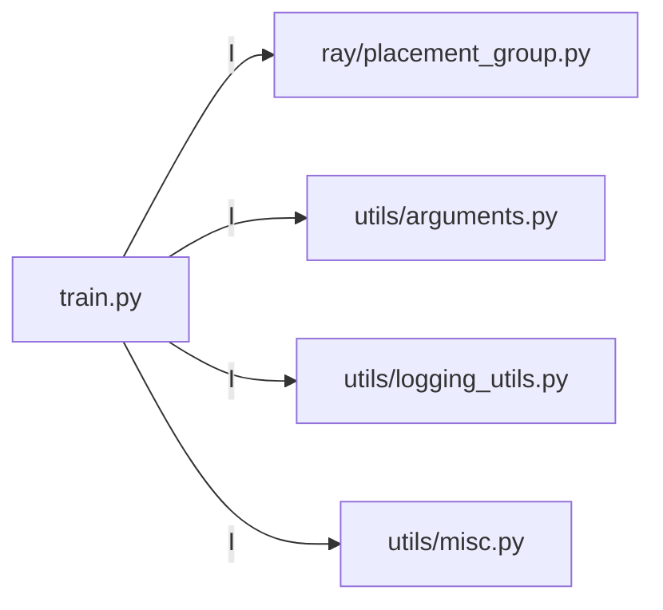
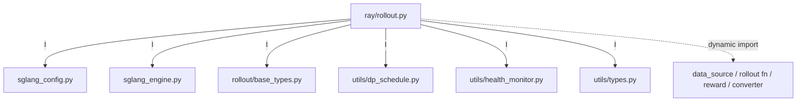
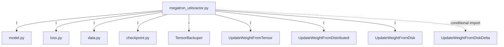
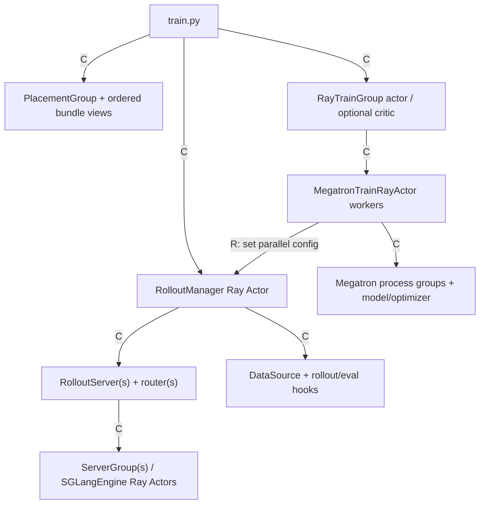
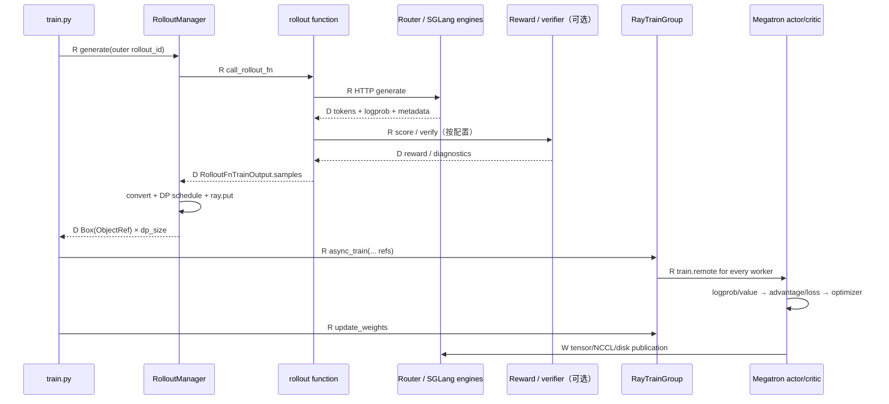
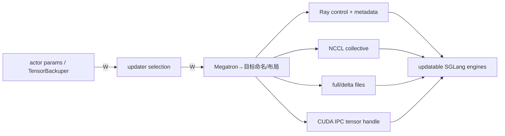

# Slime 模块依赖图

## 你为什么要读

“A 依赖 B”至少可能表示五件不同的事：Python 静态 import、启动时创建对象、Ray 远程调用、数据对象流动、权重/状态回写。旧图把它们都画成实线箭头，会误导出 `train.py` 直接 import `actor_group.py`、RolloutManager 静态依赖所有自定义 rollout、SGLang 只靠 subprocess 启动等结论。本页先给箭头分型，再分别画初始化与稳态闭环。

## 图例：五种依赖不能混用

| 记号 | 依赖类型 | 能证明什么 | 不能证明什么 |
|------|----------|------------|----------------|
| `I` | static import | 模块加载时需要符号 | 运行时一定调用 |
| `C` | construction | A 创建/配置 B | B 的稳态数据一定经过 A |
| `R` | remote/control call | A 通过 Ray/HTTP/collective 驱动 B | 数据必定复制到 A 进程 |
| `D` | data ownership transfer | 对象/引用从 A 流向 B | Python import 方向 |
| `W` | state/weight publication | B 的新状态影响 A 后续行为 | 两者共享同一参数对象 |

## 一、静态 import 骨架

### 根入口刻意保持薄

```python
# 来源：train.py L1-L6
import ray

from slime.ray.placement_group import create_placement_groups, create_rollout_manager, create_training_models
from slime.utils.arguments import parse_args
from slime.utils.logging_utils import configure_logger, finish_tracking, init_tracking
from slime.utils.misc import should_run_periodic_action
```

`train.py` 不直接 import `actor_group.py`、Megatron actor 或 SGLang engine；这些实现通过 `placement_group.py` 的工厂延迟进入。薄入口降低顶层依赖，但也意味着只看入口 import 无法知道真正启动了什么。



### Rollout hub 的静态依赖

`ray/rollout.py` 静态连接 SGLang config/engine、rollout return contract、DP schedule、health monitor、types 与 Ray utilities。默认 rollout function 和 DataSource 则由字符串路径动态加载，不构成固定 import 边。



### Megatron actor 是训练侧聚合点

`actor.py` 静态依赖 model、loss、data、checkpoint、offload/process-group、profile、parameter backup 与三类基本 updater；delta updater 只在对应配置分支内延迟 import。



## 二、启动时 construction graph



关键顺序：RolloutManager 先创建以确定 epoch/rollout 数；training workers 初始化后再把 DP/CP/VPP 配置写回 RolloutManager。两者不是单向父子关系，而是在启动后形成回连。

条件分支：

- debug train-only：RM 存在，但没有本地 servers；DataSource 与 replay 路径仍存在。
- external rollout：RM 连接外部 engine/router 描述，不创建本地 SGLangEngine actors。
- multi-model/PD/EPD：一个 RM 下可以有多个 RolloutServer 和多类 ServerGroup。
- PPO：另建 critic RayTrainGroup，但使用 actor PG 视图。

## 三、稳态控制与数据闭环



`D` 边上不一定发生 Python 对象复制：Ray object store/NIXL 传的是引用和 tensor transport；权重 distributed 路径又是 Ray metadata + collective tensor。判断内存所有权必须进入具体 transport，不能只凭箭头。

## 四、权重发布依赖



只有第一个 `update_weights=True` 的 RolloutServer 会进入当前 updater；其他 model 可作为 frozen reference/reward 服务存在。`megatron_to_hf` 是参数命名/布局转换的一部分，不是独立 transport。

## 五、动态依赖：静态图故意看不全

```python
# 来源：slime/utils/misc.py L37-L45
def load_function(path):
    """
    Load a function from a module.
    :param path: The path to the function, e.g. "module.submodule.function".
    :return: The function object.
    """
    module_path, _, attr = path.rpartition(".")
    module = importlib.import_module(module_path)
    return getattr(module, attr)
```

以下边不能仅靠 import graph 找到：rollout/eval function、DataSource、reward postprocess、sample converter、model provider、advantage/loss/TIS reducer、logging、delta publish/read hook 等。改动这些扩展点时必须同时检查 CLI 参数、函数签名、调用时机和返回契约。

## 六、与 SGLang upstream 的真实边界

| Slime 侧 | 交接方式 | SGLang 侧 |
|----------|----------|-----------|
| `SGLangEngine` Ray actor | Python multiprocessing 启动 server，HTTP 控制生命周期 | HTTP server / scheduler runtime |
| rollout function | 经 router 发送 HTTP generation 请求 | TokenizerManager/Scheduler 请求链 |
| updater | HTTP/Ray 控制 + NCCL/disk/IPC 数据通道 | engine weight-update API |
| 参数系统 | 独立 SGLang parser 后合并 namespace | `ServerArgs` 等配置 |

Slime 不把 SGLang 请求调度或 KV cache 逻辑复制到自身，但它确实直接 import SGLang Python 包和常量、启动函数、router；因此“完全只通过外部 CLI/subprocess 解耦”也不准确。

## 使用方法

- 查 import error：看静态 import 骨架与条件 import。
- 查启动卡住：看 construction graph 和 Ray refs 的等待点。
- 查字段/OOM：看数据闭环与 transport。
- 查旧权重：看 `W` 发布图，不看普通 import 方向。
- 查自定义 hook 未生效：从参数值追到 `load_function` 与调用点。

下一步：[[Slime-架构分层]] 提供责任边界，[[Slime-业务流程]] 提供时间顺序，[[Slime-源码地图]] 提供具体文件入口。
