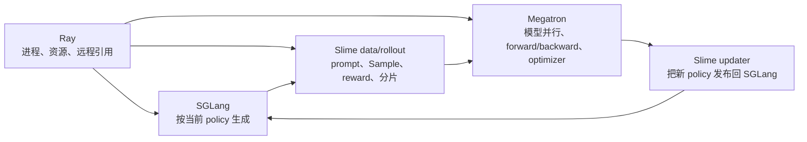

# Slime 零基础先修

## 你为什么要读

Slime 同时使用 Ray、SGLang、Megatron 和 RL 后训练。新手最容易犯的错误不是不懂某个公式，而是把四套系统的名词混在一起：把 Ray Actor 当成 policy actor，把 PlacementGroup 当成模型并行，把 `.remote()` 当成已经完成，把 optimizer step 当成 rollout engine 已换权。本篇只建立七个足够进入源码的心理模型，并明确每个类比在哪里失效。

## 先看全局：四套系统各管什么



| 系统 | 核心问题 | 不负责什么 |
|------|----------|------------|
| Ray | 哪个进程占哪些资源，远程任务何时返回 | TP/PP/DP 的数学通信语义 |
| SGLang | 一次生成怎样调度、执行、使用 KV cache | reward、advantage、optimizer |
| Slime | 把生成、样本、训练与权重发布编成闭环 | 重写 Megatron/SGLang 内核 |
| Megatron | 大模型怎样切到多卡训练并更新参数 | 下一轮 rollout 自动换权 |

## 问题一：一轮 Slime 到底发生什么

同步 baseline 的最小闭环是：

1. 根据最终 args 预订 GPU 并创建运行主体。
2. 创建 RolloutManager，它启动/连接 SGLang 并持有 DataSource。
3. 创建 Megatron actor/可选 critic，并把训练并行配置回传给 RolloutManager。
4. 第一轮前先把 actor 已加载的参数发布给 rollout engine。
5. 生成 samples，转换并按 DP rank 封装。
6. critic/actor 训练，更新训练侧参数。
7. 显式发布新权重，下一轮生成才可能观察到新 policy。

```python
# 来源：train.py L9-L20
def train(args):
    configure_logger()
    # allocate the GPUs
    pgs = create_placement_groups(args)
    init_tracking(args)

    # create the rollout manager, with sglang engines inside.
    # need to initialize rollout manager first to calculate num_rollout
    rollout_manager, num_rollout_per_epoch = create_rollout_manager(args, pgs["rollout"])

    # create the actor and critic models
    actor_model, critic_model = create_training_models(args, pgs, rollout_manager)
```

这段代码只证明启动顺序；真实拓扑还受 debug、external、colocate、PPO、PD/EPD、多模型等参数影响。

## 问题二：Ray 的 `.remote()` 和 ObjectRef 是什么

可以先把 Ray 理解成“跨进程 Python 调用 + 资源调度”：

| 本地 Python | Ray | 准确含义 |
|-------------|-----|----------|
| `Class()` | `Class.remote()` | 在被调度的 Ray worker 进程中创建 actor |
| `obj.method()` | `obj.method.remote()` | 提交远程调用 |
| 返回值 | `ObjectRef` | 远程结果的引用/未来值 |
| 直接继续 | `ray.get(ref)` | 等待并解析远程结果 |

两个边界：

- `.remote()` 只表示提交，不表示任务完成。
- `ray.get` 是同步点，但数据是否复制到当前进程还取决于 object store/NIXL 与对象内容。

`RayTrainGroup.async_train()` 返回每个 training worker 一份 ref；同步主循环随后 `ray.get`，所以函数名里的 async 不等于整轮 generate 与 train 已经重叠。真正的相邻轮次重叠要看 `train_async.py` 的 future 启动和等待位置。

## 问题三：PlacementGroup 与模型并行有什么区别

### PlacementGroup：先占座

每个 bundle 通常声明 1 GPU + 1 CPU。Slime 创建一个 PG，并把有序 bundle 视图交给 actor 与 rollout；colocate 时二者视图重叠，分离部署时 rollout 视图从 actor GPU 之后开始。

```python
# 来源：slime/ray/placement_group.py L100-L117
def _get_placement_group_layout(args) -> tuple[int, int]:
    actor_num_gpus = args.actor_num_nodes * args.actor_num_gpus_per_node

    if args.debug_train_only:
        return actor_num_gpus, 0

    if args.rollout_external:
        if args.debug_rollout_only:
            return 0, 0
        return actor_num_gpus, actor_num_gpus

    if args.debug_rollout_only:
        return args.rollout_num_gpus, 0

    if args.colocate:
        return max(actor_num_gpus, args.rollout_num_gpus), 0

    return actor_num_gpus + args.rollout_num_gpus, actor_num_gpus
```

### Megatron 并行：入座后建通信拓扑

| 并行 | 切什么 | 主要目的 |
|------|--------|----------|
| DP | 不同数据/rollout partitions | 扩大吞吐并同步梯度 |
| TP | 一层内的矩阵/张量 | 单层跨卡 |
| PP | 不同网络层 | 模型按 stage 切分 |
| CP | 序列/context 维 | 长上下文训练 |
| EP | MoE experts | 专家跨 rank 分布 |
| VPP | 一个 PP stage 的多个 model chunks | 交错流水、减少空泡 |

Ray 只决定 worker 被调度到哪里；Megatron 才调用 `initialize_model_parallel` 建立 TP/CP/EP/DP/PP 等 group。PG 不会自动做模型切分。

## 问题四：为什么有这么多 rank

一个训练 worker 至少同时拥有：

- Ray actor/world rank：创建进程时分配；
- `LOCAL_RANK`：选择当前进程可见的本地 GPU；
- torch distributed global rank；
- Megatron 的 TP、PP、DP、CP、EP rank。

```python
# 来源：slime/ray/train_actor.py L28-L48
class TrainRayActor(RayActor):
    def __init__(self, world_size, rank, master_addr, master_port):
        configure_logger()

        self._world_size = world_size
        self._rank = rank
        if master_addr:
            self.master_addr, self.master_port = master_addr, master_port
        else:
            self.master_addr, self.master_port = self._get_current_node_ip_and_free_port(
                start_port=random.randint(20000, 21000)
            )

        os.environ["MASTER_ADDR"] = self.master_addr
        os.environ["MASTER_PORT"] = str(self.master_port)
        os.environ["WORLD_SIZE"] = str(self._world_size)
        os.environ["RANK"] = str(self._rank)
        # TODO: currently this doesn't work as ray has already set torch.cuda.device_count().
        # os.environ.pop("CUDA_VISIBLE_DEVICES", None)
        # os.environ["LOCAL_RANK"] = str(ray.get_gpu_ids()[0])
        os.environ["LOCAL_RANK"] = str(get_local_gpu_id())
```

示例：8 张 GPU、TP=2、PP=2、DP=2 时，可粗略理解为两个 DP 副本；每个副本有两个 PP stage，每个 stage 用两张 TP 卡。但 CP/EP、VPP、不同 group order 与模型特殊拓扑会让简单乘法不足以描述全部通信关系。

## 问题五：Sample、rollout、batch、micro-batch 怎么区分

| 词 | 当前语义 |
|----|----------|
| outer rollout id | 主循环第几轮编排 |
| `Sample.rollout_id` | 一次 rollout 执行的样本分组身份，compact siblings 共享 |
| prompt group | 一个 prompt 复制出 `n_samples_per_prompt` 条生成种子 |
| `Sample` | tokens、response、reward、mask、logprob、weight version 等语义护照 |
| train data / `RolloutBatch` | Sample 转成的字段字典 |
| DP partition | 某个 DP rank 应消费的样本集合 |
| micro-batch | 一次 forward/backward 可承载的执行切片 |
| training step global batch size | 当前 step 中 rollout 执行的全局数量；默认一 rollout 一 sample 时等于样本数 |

最后一行是当前实现最容易被旧文档讲错的地方：compact/subagent 路径可能让一次 rollout 执行产生多条训练 sample，因此 `global_batch_size` 的调度/归一化语义不能永远解释成“裸 sample 行数”。

一个 outer rollout 可以包含多个 training steps，每个 step 又包含多个 micro-batches。micro-batch 是执行粒度，不能改变 `Sample.rollout_id` 分组和 `rollout_mask_sums` 定义的 loss 分母。

## 问题六：RL 训练至少要认清哪些信号

| 信号 | 直觉 | 产生位置 |
|------|------|----------|
| reward | 结果得分 | rule/RM/custom reward |
| rollout logprob | 生成时 policy 对已采 token 的概率 | SGLang rollout |
| current/train logprob | 训练模型重新看同一 token 的概率 | Megatron forward |
| ref logprob | reference policy 的概率 | ref 参数快照 forward |
| value | critic 对未来回报的估计 | critic forward |
| advantage | 相对基线后应强化/抑制多少 | estimator + KL/value/reward/mask |
| policy/value/SFT/custom loss | 真正参与反向传播的目标 | Megatron loss dispatch |

“生成答案、打分、按分数调模型”只能作为第一层直觉。源码中 reward 不会直接等于每个 token 的梯度；advantage estimator、mask、KL、loss reducer 和并行归一化都会改变优化信号。

## 问题七：为什么 optimizer step 后还要 `update_weights`

Megatron actor 与 SGLang engine 是不同运行主体：

```text
optimizer.step()
  只改变训练侧参数
      ↓
转换命名/layout + 选择 tensor/NCCL/full-disk/delta-disk updater
      ↓
SGLang engine 完成 reload
      ↓
后续 rollout 才可能使用新 policy
```

colocate 只是 GPU bundle 重叠，通常仍是不同进程；tensor/CUDA IPC updater 也不是同一个 Python 参数对象。weight version 是发布序号，不是 checksum。critic-only 阶段甚至可能发布未变化的 actor 参数并推进版本，因此还要结合 optimizer 日志或数值 equality check 判断参数是否真的改变。

## offload 的准确直觉

offload 不是“把所有东西统一搬到 CPU”一个动作：

- training actor 的 sleep/wake 还会销毁/重建 process groups，并由 `torch_memory_saver` 管理显存状态；
- rollout server group 只有与 Megatron GPU 范围重叠且 `needs_offload=True` 时才实际 release/resume；
- rollout weights 与 KV/CUDA graph 分开恢复；
- PPO critic 强制打开 train offload，连接时序比普通 actor-only 更复杂。

因此 OOM 排障必须问“哪个主体、哪类 GPU memory、哪个时刻”，不能只看一个 `offload=True`。

## 常见混淆

| 错误理解 | 准确说法 |
|----------|----------|
| Ray Actor 就是 RL actor | Ray Actor 是进程抽象；RL actor 是 policy 模型 |
| `.remote()` 后任务已完成 | 只提交；是否等待看 `ray.get`/依赖链 |
| PG 会自动建立 TP/PP/DP | PG 只预订资源；Megatron 建并行 group |
| rollout id 就是一条 batch id | outer id 与 Sample grouping id 是两层身份 |
| global batch 永远等于 sample 行数 | compact rollout 下按 rollout 执行计数 |
| optimizer step 自动影响 SGLang | 必须显式发布权重 |
| colocate 表示同进程共享参数 | 表示 GPU 资源重叠与跨进程更新协议 |
| async_train 表示 generation 与 train 重叠 | 只是 Ray 远程接口；重叠由 future 时间线决定 |

## 学习路线与验收

1. [[Slime-项目总览]]：建立四类运行时责任。
2. [[Slime-关键概念]]：区分身份、对象、概率、资源和版本。
3. [[Slime-业务流程]]：用六道门理解同步/流水异步。
4. [[Slime-RL训练全链路]]：沿一个同步 rollout 深入。
5. [[Slime-PlacementGroup]]、[[Slime-训练数据]]、[[Slime-训练步骤]]、[[Slime-分布式权重同步]]：按问题下钻。

读完本篇应能独立回答：

- Ray rank、DP rank 与 `Sample.rollout_id` 为什么不能互换？
- 8 GPU、TP=2、PP=2、DP=2 的粗略拓扑是什么，类比在哪些条件下失效？
- 一个 outer rollout、training step、micro-batch 的包含关系是什么？
- rollout/current/ref logprob 和 critic value 分别由谁产生？
- 为什么版本号递增不能单独证明 actor 参数已训练改变？

如果答案仍含糊，先回到对应表格和源码卡，再进入专题；不要用背诵缩写代替对象与所有权推理。
