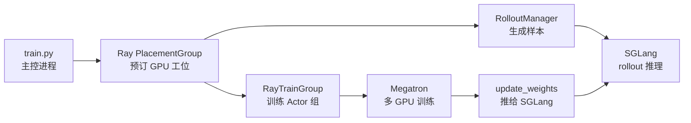
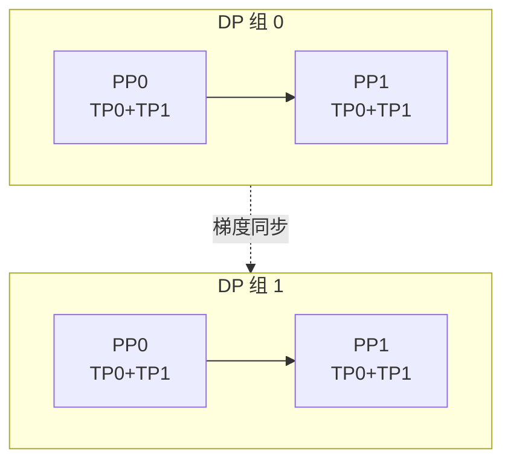

# Slime 零基础先修

> 面向**不熟悉分布式训练 / RL 后训练**的读者  
> 读完本篇，再进入 [[Slime-项目总览]]、[[Slime-RL训练全链路]] 与 [[Slime-学习路径]]  
> 内嵌代码对应 slime Git commit `22cdc6e1`

---

## 这篇文档解决什么问题

Slime 不是单纯的“训练脚本”，而是一套把 **Rollout 生成、Reward 打分、Megatron 训练、权重同步** 串成闭环的后训练系统。新手最容易卡在两个基础层：

| 基础层 | 它解决什么 | 在 Slime 里出现在哪里 |
|--------|------------|------------------------|
| **Ray** | 多机多 GPU 上怎么启动进程、占资源、远程调用 | `create_placement_groups`、`RayTrainGroup`、`RolloutManager` |
| **Megatron** | 一个大模型怎么切到多张 GPU 上训练 | `MegatronTrainRayActor`、`initialize_model_parallel`、`train_one_step` |

先建立这两层直觉，再看 `generate → train → update_weights` 就不会迷路：Ray 像“集群调度中心”，Megatron 像“训练车间里的并行生产线”，SGLang 像“负责生成样本的推理车间”。



---

## 0. Slime 的最小心智模型

### 读法
把一次 Slime 训练想成一个循环车间：

1. **Ray 先排工位**：哪些 GPU 给训练，哪些 GPU 给 rollout。
2. **RolloutManager 去出题**：从数据源拿 prompt，用 SGLang 生成回答并打 reward。
3. **Megatron Actor 去改卷和补课**：把 rollout 样本转成训练 batch，算 advantage / loss，更新模型。
4. **update_weights 把新模型发回推理侧**：下一轮 rollout 用更新后的权重。

这个循环就是 Slime 文档里反复出现的：

```text
generate -> train -> update_weights
```

### 源码锚点
```python
## 来源：train.py L9-L20
def train(args):
    configure_logger()
    # allocate the GPUs
    pgs = create_placement_groups(args)
    init_tracking(args)

    # create the rollout manager, with sglang engines inside.
    rollout_manager, num_rollout_per_epoch = create_rollout_manager(args, pgs["rollout"])

    # create the actor and critic models
    actor_model, critic_model = create_training_models(args, pgs, rollout_manager)
```

### 要点
- `pgs` 是 Ray 资源布局，不是训练数据。
- `rollout_manager` 负责生成样本；`actor_model` / `critic_model` 是训练侧 Ray Actor 组。
- 之后的主循环见 [[Slime-RL训练全链路]]，入口专题见 [[Slime-训练主循环]]。

---

## 1. Ray 是什么：把多机多卡变成可调用对象

### 读法
Ray 可以先理解成“分布式 Python 运行时”：

| 普通 Python | Ray 版本 | 含义 |
|-------------|----------|------|
| `obj = Class()` | `obj = Class.remote()` | 在集群某个进程里创建对象 |
| `obj.method()` | `obj.method.remote()` | 远程调用方法 |
| 返回值 | `ObjectRef` | 结果还在远端，先拿到引用 |
| 直接使用结果 | `ray.get(ref)` | 等远端算完，把结果取回来 |

Slime 不希望你手写 SSH 到每台机器起进程；它让 Ray 按资源声明创建 Actor，再用 `.remote()` 调用训练或 rollout 方法。

### 源码锚点
```python
## 来源：slime/ray/actor_group.py L131-L142
def async_train(self, rollout_id, rollout_data_ref, external_data=None):
    """Do one rollout training. Returns a list of Ray refs (one per worker).

    For critics, each ref resolves to ``{"values": [cpu tensors...]}`` (or ``{}``
    for non-last-PP-stage workers). Actor refs resolve to ``None``.

    ``external_data`` may be a list (one item per worker) or a single dict
    broadcast to all workers.
    """
    if isinstance(external_data, list):
        assert len(external_data) == len(self._actor_handlers)
```

### 要点
- `async_train` 名字里的 async 指 **Ray ObjectRef 异步**，不是 Megatron 内部异步训练。
- `ray.get(actor_model.async_train(...))` 才会等待所有远程训练 Actor 完成。
- 深读：[[Slime-RayTrainGroup-核心概念]]。

---

## 2. PlacementGroup：先预订 GPU 工位

### 读法
Ray PlacementGroup（PG）是一组资源 bundle。Slime 里最常见的 bundle 是：

```text
1 个 GPU + 1 个 CPU
```

你可以把它看成训练车间里的一个“工位”。Slime 会根据配置决定：

- actor 训练要多少工位；
- rollout 推理要多少工位；
- actor 与 rollout 是否 colocate 共用工位；
- rollout 是否外部部署，不由本 Ray 集群管理。

### 源码锚点
```python
## 来源：slime/ray/placement_group.py L42-L48
def _create_placement_group(num_gpus):
    """Create a placement group with the specified number of GPUs."""
    if num_gpus == 0:
        return None, [], []

    bundles = [{"GPU": 1, "CPU": 1} for _ in range(num_gpus)]
    pg = placement_group(bundles, strategy="PACK")
```

```python
## 来源：slime/ray/placement_group.py L100-L117
def _get_placement_group_layout(args) -> tuple[int, int]:
    actor_num_gpus = args.actor_num_nodes * args.actor_num_gpus_per_node

    if args.debug_train_only:
        return actor_num_gpus, 0

    if args.rollout_external:
        if args.debug_rollout_only:
            return 0, 0
        return actor_num_gpus, actor_num_gpus

    if args.debug_rollout_only:
        return args.rollout_num_gpus, 0

    if args.colocate:
        return max(actor_num_gpus, args.rollout_num_gpus), 0

    return actor_num_gpus + args.rollout_num_gpus, actor_num_gpus
```

### 要点
| 模式 | GPU 布局直觉 |
|------|--------------|
| 分离部署 | 前半段给训练，后半段给 rollout |
| colocate | 训练和 rollout 共用同一批 GPU，通过 offload/sleep 错峰 |
| rollout_external | 训练侧只管 Megatron，SGLang 在外部 |
| debug_train_only | 只跑训练链路，不创建 rollout GPU |

深读：[[Slime-PlacementGroup-核心概念]]、[[Slime-引擎拓扑-核心概念]]。

---

## 3. Ray Actor：每张 GPU 一个训练工人

### 读法
在 Slime 训练侧，Ray Actor 不是“模型里的 actor 网络”那个概念，而是 **Ray 远程进程**。为了避免混淆：

| 名称 | 所在层 | 含义 |
|------|--------|------|
| Ray Actor | Ray 运行时 | 一个远程 Python 对象 / 进程 |
| Actor model | RL 算法 | 被训练的 policy 模型 |
| MegatronTrainRayActor | Slime 类 | 一个 GPU 上的训练 worker |

每个 `MegatronTrainRayActor` 进程都要知道自己在分布式训练里的 rank、world size、master 地址和本地 GPU。Slime 在 Ray Actor 构造时写入这些环境变量。

### 源码锚点
```python
## 来源：slime/ray/train_actor.py L28-L48
class TrainRayActor(RayActor):
    def __init__(self, world_size, rank, master_addr, master_port):
        configure_logger()

        self._world_size = world_size
        self._rank = rank
        if master_addr:
            self.master_addr, self.master_port = master_addr, master_port
        else:
            self.master_addr, self.master_port = self._get_current_node_ip_and_free_port(
                start_port=random.randint(20000, 21000)
            )

        os.environ["MASTER_ADDR"] = self.master_addr
        os.environ["MASTER_PORT"] = str(self.master_port)
        os.environ["WORLD_SIZE"] = str(self._world_size)
        os.environ["RANK"] = str(self._rank)
        os.environ["LOCAL_RANK"] = str(get_local_gpu_id())
```

### 要点
- Ray 负责“进程在哪里起”；PyTorch Distributed / Megatron 负责“这些进程怎么通信”。
- `MASTER_ADDR` / `MASTER_PORT` 是 PyTorch 分布式组的会合点。
- `LOCAL_RANK` 决定该进程绑定本机哪张 GPU。
- 深读：[[Slime-RayTrainGroup-核心概念]]、[[Slime-Megatron-Actor初始化-核心概念]]。

---

## 4. Megatron 是什么：把一个大模型切到多张 GPU

### 读法
Megatron-LM 是大模型训练框架。它最重要的能力是：**把一个单卡放不下、算不动的模型，切给很多 GPU 一起训练**。

先记住这几种并行：

| 并行方式 | 简写 | 小白解释 | 常见影响 |
|----------|------|----------|----------|
| Data Parallel | DP | 多组 GPU 各训练一份 batch，最后同步梯度 | 提高吞吐 |
| Tensor Parallel | TP | 把一层里的矩阵切到多卡 | 单层太大时必需 |
| Pipeline Parallel | PP | 把不同层切到不同卡，像流水线 | 模型层数多时省显存 |
| Context Parallel | CP | 把长序列维度切开 | 长上下文训练 |
| Expert Parallel | EP | MoE 专家分到不同卡 | MoE 模型 |
| Virtual Pipeline | VPP | 把 PP stage 再切小块交错执行 | 减少流水线空泡 |

Slime 自己不重写这些并行机制，而是在 Megatron 初始化时把参数交给 `mpu.initialize_model_parallel`。

### 源码锚点
```python
## 来源：slime/backends/megatron_utils/initialize.py L37-L45
mpu.initialize_model_parallel(
    args.tensor_model_parallel_size,
    args.pipeline_model_parallel_size,
    args.virtual_pipeline_model_parallel_size,
    pipeline_model_parallel_comm_backend=args.pipeline_model_parallel_comm_backend,
    context_parallel_size=args.context_parallel_size,
    hierarchical_context_parallel_sizes=args.hierarchical_context_parallel_sizes,
    expert_model_parallel_size=args.expert_model_parallel_size,
    num_distributed_optimizer_instances=args.num_distributed_optimizer_instances,
)
```

### 要点
- `mpu` 是 Megatron 的 parallel state 工具，后续代码通过它查询 TP/PP/DP/CP rank。
- Ray rank 是“进程编号”；Megatron rank 是在这些进程上划出的并行拓扑。
- 参数专题：[[Slime-Ray参数]]、[[Slime-训练与Rollout参数]]。

---

## 5. DP / TP / PP 的入门例子

### 读法
假设有 8 张 GPU，设置：

```text
tensor_model_parallel_size = 2
pipeline_model_parallel_size = 2
data_parallel_size = 2
```

可以粗略理解成：

```text
8 GPUs = DP 2 组 × PP 2 段 × TP 2 卡
```

每个 DP 组里有一个完整模型副本；每个副本再被拆成 2 个 pipeline stage；每个 stage 内的矩阵再由 2 张 TP 卡共同计算。



### 源码锚点
```python
## 来源：slime/backends/megatron_utils/actor.py L87-L98
vpp_size = mpu.get_virtual_pipeline_model_parallel_world_size() or 1
if vpp_size > 1:
    from megatron.core.utils import get_model_config

    microbatch_group_size_per_vp_stage = get_model_config(self.model[0]).microbatch_group_size_per_vp_stage
else:
    microbatch_group_size_per_vp_stage = 1
self.train_parallel_config = {
    "dp_size": mpu.get_data_parallel_world_size(with_context_parallel=False),
    "cp_size": mpu.get_context_parallel_world_size(),
    "vpp_size": vpp_size,
```

### 要点
- Slime 会把 `train_parallel_config` 推给 RolloutManager，帮助 rollout 数据按训练侧 DP/CP/VPP 对齐。
- 新手先掌握 DP/TP/PP 即可；CP/EP/VPP 可以等读 [[Slime-上下文并行与路由重放]]、[[Slime-模型初始化]] 时再深入。

---

## 6. Microbatch / Global batch：为什么训练一步会被切碎

### 读法
大模型训练不能把一个巨大 batch 一次塞进 GPU，通常要切成很多 **microbatch**：

| 术语 | 直觉 |
|------|------|
| microbatch | 一小份可以放进 GPU 的训练数据 |
| global batch | 所有 DP 组加起来的一次训练总样本数 |
| gradient accumulation | 多个 microbatch 累积梯度后再 optimizer step |
| rollout_id | Slime 中一次 generate/train/update 闭环的编号 |

Megatron 的 PP 流水线尤其依赖 microbatch：不同 pipeline stage 像生产线上的不同工序，microbatch 越多，流水线越容易填满。

### 源码锚点
```python
## 来源：slime/backends/megatron_utils/model.py L704-L731
def train(
    rollout_id: int,
    model: Sequence[DDP],
    optimizer: MegatronOptimizer,
    opt_param_scheduler: OptimizerParamScheduler,
    data_iterator: Sequence[DataIterator],
    num_microbatches: Sequence[int],
    global_batch_sizes: Sequence[int],
) -> None:
    """Run training over a rollout consisting of multiple steps.

    The model is switched to train mode, training hooks are configured, and
    ``train_one_step`` is invoked for each step in the rollout.
```

### 要点
- Slime 的一个 `rollout_id` 里可能有多个 train step。
- `num_microbatches` 和 `global_batch_sizes` 长度对齐：每个 step 对应自己的 microbatch 数和全局样本数。
- 深读：[[Slime-训练步骤-核心概念]]、[[Slime-训练数据-核心概念]]。

---

## 7. RL 后训练最小术语

### 读法
读 Slime 不需要一开始就推 PPO 公式，但要认清数据怎么流：

| 术语 | 小白解释 | Slime 里的位置 |
|------|----------|----------------|
| prompt | 题目 / 用户输入 | DataSource 产出 |
| rollout | 模型对 prompt 的一次或多次回答 | SGLang Rollout 生成 |
| reward | 回答得分 | RM / rule / custom function |
| logprob | 模型认为某个 token 有多可能 | SGLang 或 Megatron 计算 |
| advantage | 这次回答比基线好多少 | loss.py 计算 |
| policy loss | 让好回答更可能、坏回答更不可能 | Megatron 训练 |
| critic | 估计 value 的辅助模型 | PPO 场景可选 |

可以先把 RL 后训练理解成“生成答案、打分、按分数调模型”。Slime 的复杂度在于：生成在 SGLang 侧，训练在 Megatron 侧，中间要靠 Ray 编排和权重同步串起来。

### 源码锚点
```python
## 来源：slime/backends/megatron_utils/actor.py L380-L394
def train(self, rollout_id: int, rollout_data_ref: Box, external_data=None):
    if self.args.debug_rollout_only:
        return None

    if self.args.offload_train:
        self.wake_up()

    with timer("data_preprocess"):
        rollout_data = self._get_rollout_data(rollout_data_ref)

    if self.role == "critic":
        result = self.train_critic(rollout_id, rollout_data)
    else:
        self.train_actor(rollout_id, rollout_data, external_data=external_data)
```

### 要点
- `rollout_data_ref` 是 Ray ObjectRef，真正数据从远端取回后才进入 Megatron 训练。
- `critic` 和 `actor` 共用 Ray/Megatron 基础设施，但训练目标不同。
- 深读：[[Slime-Advantage计算-核心概念]]、[[Slime-Policy-Loss-核心概念]]。

---

## 8. update_weights：为什么训练完还要推权重

### 读法
Slime 的 rollout 由 SGLang 执行，训练由 Megatron 执行。训练完以后，如果不把新权重推给 SGLang，下一轮 rollout 仍然用旧模型生成样本，RL 闭环就断了。

所以每轮训练后都要：

```text
Megatron 新权重 -> 转成 SGLang 可加载/接收的格式 -> SGLang engine reload
```

这就是 `update_weights` 专题覆盖的内容。

### 源码锚点
```python
## 来源：slime/backends/megatron_utils/actor.py L583-L590
def update_weights(self) -> None:
    if self.args.debug_train_only or self.args.debug_rollout_only:
        return

    if self.args.use_fault_tolerance:
        if dist.get_rank() == 0:
            ray.get(self.rollout_manager.recover_updatable_engines.remote())
        dist.barrier(group=get_gloo_group())
```

### 要点
- NCCL 路径见 [[Slime-分布式权重同步]]。
- 磁盘路径见 [[Slime-磁盘权重同步]]。
- Megatron checkpoint 转 HF 见 [[Slime-Megatron到HF转换]]。

---

## 9. 常见混淆

| 混淆点 | 正确理解 |
|--------|----------|
| Ray Actor = RL Actor | 不是。Ray Actor 是远程进程；RL Actor 是被训练的 policy 模型。 |
| `.remote()` 之后训练已经完成 | 不一定。`.remote()` 返回 ObjectRef，`ray.get` 才等待结果。 |
| PlacementGroup 会自动做模型并行 | 不会。PG 只预订资源；Megatron 初始化并行组。 |
| DP/TP/PP 都是 Ray 的功能 | 不是。它们是 Megatron/PyTorch Distributed 的训练拓扑。 |
| update_weights 是 optimizer step | 不是。optimizer step 改 Megatron 权重；update_weights 把权重同步到 SGLang。 |
| rollout_id 是 batch id | 不准确。它是一轮 RL 闭环编号，一轮里可能包含多个 train step 和 microbatch。 |

---

## 10. 读 Slime 的建议顺序

### 读法
如果你是零基础读者，建议按下面的顺序读，不要一开始就钻进 loss 公式：

```text
Slime 零基础先修（本篇）
  ↓
Slime 项目总览
  ↓
RL 训练全链路
  ↓
Slime 学习路径：启动、参数、Ray 与 Rollout
  ↓
PlacementGroup / RayTrainGroup
  ↓
Megatron Actor 初始化 / 训练步骤
  ↓
Advantage / Policy Loss / 分布式权重同步
```

| 学习任务 | 目标 | 文档 |
|----------|------|------|
| 基础先修 | 建立 Ray/Megatron 直觉 | 本篇 |
| 1 | 看懂 Slime 三角架构 | [[Slime-项目总览]] |
| 2 | 串起 RL 闭环 | [[Slime-RL训练全链路]] |
| 3 | 看 Ray 如何排 GPU | [[Slime-PlacementGroup]]、[[Slime-RayTrainGroup]] |
| 4 | 看 Megatron 如何训练 | [[Slime-Megatron-Actor初始化]]、[[Slime-训练步骤]] |
| 5 | 看 loss 与权重同步 | [[Slime-Advantage计算]]、[[Slime-分布式权重同步]] |

### 要点
- 如果你还不熟悉 SGLang 推理侧，先读 [[SGLang-零基础先修]] 与 [[SGLang-HTTP请求全链路]]。
- 如果只想跑通 Slime 主流程，本篇 + [[Slime-RL训练全链路]] + [[Slime-学习路径]] 足够建立全局地图。

---

## 下一步

→ 从零读 Slime：[[Slime-项目总览]]  
→ 想看一轮训练怎么跑：[[Slime-RL训练全链路]]  
→ 想先补 Ray：[[Slime-PlacementGroup]]、[[Slime-RayTrainGroup]]  
→ 想先补 Megatron：[[Slime-Megatron-Actor初始化]]、[[Slime-训练步骤]]
