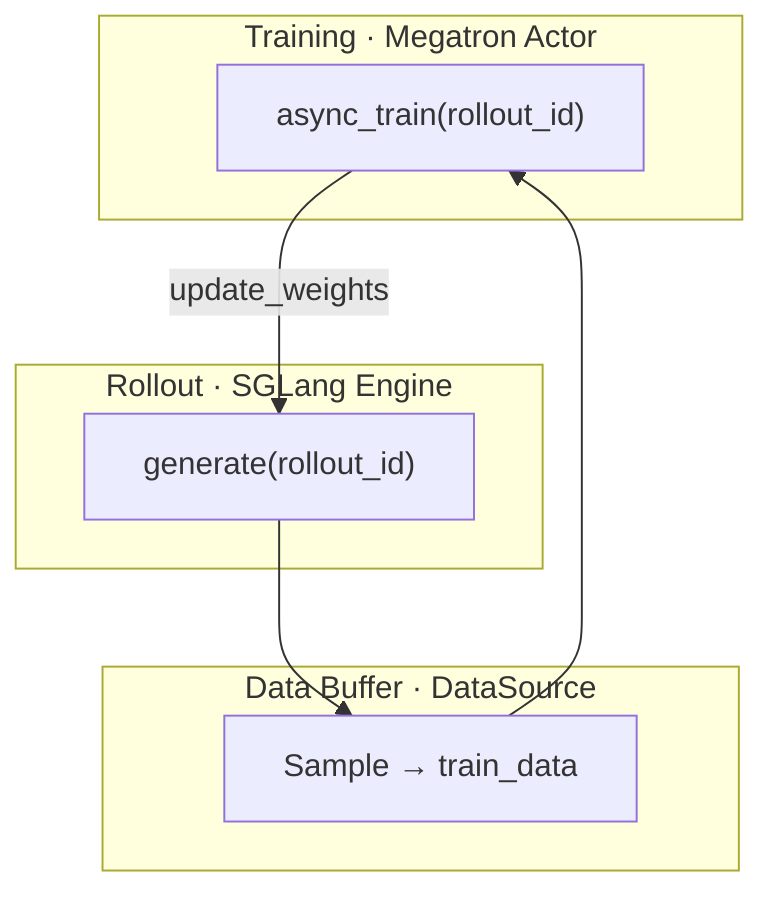

# Slime 项目总览

> 索引层 · 对应 slime Git commit `22cdc6e1`

---

## 你为什么要读

Slime 的仓库把训练主循环、rollout、插件、示例和权重工具放在一起，初看像一间同时卖发动机和说明书的仓库。本篇先区分核心闭环、可选扩展和训练前工具，再把它们连回 `generate → train → update_weights`，帮助你判断一份代码究竟在生产样本、消费样本还是搬运权重。

## Slime 是什么

Slime 是面向 **RL scaling** 的 LLM post-training 框架，由 Z.ai / THUDM 团队维护。它把 **Megatron 训练**与 **SGLang 推理**接到同一条 RL 数据通路上，避免 trainer、rollout service、agent framework 三套系统各自为政。

运行主线：日常 RL 训练执行 `python train.py <参数>`，Ray 分配 GPU，RolloutManager 用 SGLang 生成样本，Megatron Actor 算 PPO/GRPO loss，最后 `update_weights` 把新 policy 推回推理引擎。

**源码锚点：**

```python
## 来源：README_zh.md L9-L16
# slime 是为 RL scaling 设计的 LLM post‑training 框架，提供两大核心能力：
# 1. 高性能训练：通过连接 Megatron 与 SGLang，支持各种模式的高效训练；
# 2. 灵活的数据生成：通过自定义数据生成接口以及 server-based engine，
#    实现任意训练数据生成流程。
```

读法：这里的「完整闭环验证」指 GLM-4.5–5.2 等发布级模型训练；正确性优先，支持 `--debug-rollout-only` / `--debug-train-only` 分离调试。

---

## 与 verl / OpenRLHF 的差异

| 维度 | Slime | 典型框架 |
|------|-------|----------|
| 训练后端 | 原生 Megatron 参数透传 | 常需 HF 权重中转 |
| Rollout 后端 | 原生 SGLang + sgl-router | 常需 vLLM 适配层 |
| 定制入口 | 17 类 `--*-path` hook | 插件体系各异 |

读法：Slime 不重新发明 trainer/rollout engine，而是用 **Ray 编排层**把两套成熟系统接到同一条 `generate → train → update_weights` 闭环上。详见 [[Slime-阅读方法-核心概念]]。

---

## 仓库顶层结构

| 目录 | 职责 | 阅读专题 |
|------|------|----------|
| `train.py`, `train_async.py` | 同步/异步 RL 主循环 | [[Slime-训练主循环]] |
| `slime/` | 核心 Python 包 | [[Slime-架构分层]] |
| `slime_plugins/` | 可选插件（buffer、模型扩展） | [[Slime-插件与示例]] |
| `examples/` | search-r1、multi_agent 等 | [[Slime-插件与示例]] |
| `tools/` | HF↔Megatron 权重转换 | [[Slime-数据准备工具]] |
| `tests/` | CI 与契约测试 | [[Slime-可观测性与CI]] |
| `docs/` | 官方文档 | 相关专题 |

---

## 安装与包结构

包边界：`setup.py` 将 `slime` 与 `slime_plugins` 一并打包；依赖见 `requirements.txt`（Megatron、SGLang、Ray 等）。

**源码锚点：**

```python
## 来源：setup.py L32-L40
setup(
    author="slime Team",
    name="slime",
    version="0.3.0",
    packages=find_packages(include=["slime*", "slime_plugins*"]),
    include_package_data=True,
    install_requires=_fetch_requirements("requirements.txt"),
    extras_require={},
    python_requires=">=3.10",
```

读法：pip 安装后 import `slime`；训练入口是仓库根目录 `train.py`，非 console_scripts。

---

## 训练入口 train.py

入口主线：`parse_args()` 解析 Megatron + Slime + SGLang 三组参数；`train()` 完成 PG 分配、RolloutManager/Actor 创建、主循环。

**源码锚点：**

```python
## 来源：train.py L9-L20
def train(args):
    configure_logger()
    # allocate the GPUs
    pgs = create_placement_groups(args)
    init_tracking(args)

    # create the rollout manager, with sglang engines inside.
    # need to initialize rollout manager first to calculate num_rollout
    rollout_manager, num_rollout_per_epoch = create_rollout_manager(args, pgs["rollout"])

    # create the actor and critic models
    actor_model, critic_model = create_training_models(args, pgs, rollout_manager)
```

读法：

- RolloutManager **先于** Actor 创建，因为 `num_rollout` 依赖 dataset 与 batch size 计算。
- 首次 `update_weights()` 在 bootstrap 末尾执行，确保 SGLang 与 Megatron 权重一致。

```python
## 来源：train.py L101-L103
if __name__ == "__main__":
    args = parse_args()
    train(args)
```

---

## Slime 三角（Training / Rollout / Data Buffer）



| 角 | 运行时主体 | 职责 |
|----|-----------|------|
| **Training** | Megatron Actor（+ 可选 Critic） | 从 buffer 读 rollout 数据，算 loss / 梯度 |
| **Rollout** | SGLang Engine + sgl-router | 在线采样、RM/verifier、多轮 agent |
| **Data Buffer** | DataSource + RolloutManager | prompt 管理、sample→train_data 转换 |

---

## 同步 vs 异步主循环

| 模式 | 入口 | 特点 |
|------|------|------|
| 同步 | `train.py` | generate(N) → train(N) → update_weights，逐步串行 |
| 异步 | `train_async.py` | prefetch generate(N+1) ∥ train(N) | 

详见 [[Slime-训练主循环-数据流]]、[[Slime-其他Rollout路径-核心概念]]。

---

## 怎么继续阅读

1. 从 [[Slime-阅读方法]] 建立 Slime 的三角闭环读法
2. 按 [[Slime-学习路径]] 的闭环职责路线阅读
3. 遇到术语查 [[Slime-术语表]]；需要全局定位查 [[Slime-源码地图]]
4. 追踪端到端 RL 闭环见 [[Slime-RL训练全链路]]
5. 已有 SGLang 阅读基础时，查 [[Slime与SGLang-阅读对照]] 快速跳转

---

## 导航

- [[Slime-导读与总览|导读与总览]]
- [[Slime-架构分层]]
- [[Slime-RL训练全链路]]
