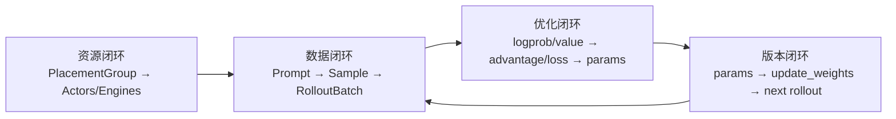

# Slime 项目总览

> 用运行时责任而不是目录树认识 Slime。对应 slime Git commit `22cdc6e1`。

---

## 你为什么要读

Slime 的仓库把训练主循环、rollout、插件、示例和权重工具放在一起。只按目录阅读，很容易把“算法对象”“分布式运行主体”和“数据容器”混成一层。本篇先回答三个高阶问题：谁拥有 GPU，谁生产或消费 `Sample`，谁把 Megatron 的新参数发布给 SGLang；随后再把目录和源码入口放回这张运行时地图。

## Slime 是什么

Slime 是面向 **RL scaling** 的 LLM post-training 框架。它用 Ray 编排 **Megatron 训练**与 **SGLang rollout**，并提供可替换的数据源、rollout、reward、advantage、loss 与权重转换入口。它的核心价值不是重新实现 Megatron 或 SGLang，而是为二者规定资源、数据与权重版本的交接协议。

同步运行主线：执行 `python train.py <参数>` 后，Ray 预订 GPU，RolloutManager 启动或连接 SGLang 并生产样本，Megatron actor/可选 critic 消费按 DP 分片的数据，最后显式 `update_weights` 把新 policy 发布给 rollout engine。具体 loss 并不固定为 PPO/GRPO，而由 advantage estimator、loss 配置和自定义 hook 共同决定。

**源码锚点：**

```python
# 定位骨架（非逐行摘录）：来源 README_zh.md L9-L16
# slime 是为 RL scaling 设计的 LLM post‑training 框架，提供两大核心能力：
# 1. 高性能训练：通过连接 Megatron 与 SGLang，支持各种模式的高效训练；
# 2. 灵活的数据生成：通过自定义数据生成接口以及 server-based engine，
#    实现任意训练数据生成流程。
```

这段 README 只能证明项目定位，不能证明任意模型、硬件和 workload 下的性能。理解控制流要回到 `train.py`，理解效果与吞吐则必须查看具体实验配置和结果。

---

## 四类运行时责任

| 责任 | 主要主体 | 输入 | 输出 | 最重要的不变量 |
|------|----------|------|------|----------------|
| 资源编排 | Ray PlacementGroup、Ray Actor | 节点/GPU 数与 colocate、debug、external 配置 | actor/critic/rollout 的可调度位置 | 逻辑并行 rank 必须稳定映射到预订资源 |
| 样本生产 | DataSource、RolloutManager、SGLang | prompt、policy 版本、rollout 配置 | 带 reward/mask/metadata 的 `Sample` | response 字段长度、`rollout_id`、weight version 可追踪 |
| 样本消费 | Megatron actor/critic | rank-local `RolloutBatch` 与 micro-batch schedule | value、logprob、advantage、梯度和新参数 | DP/PP/CP 看到一致的 step 语义 |
| 权重发布 | converter、weight updater、SGLang engine API | Megatron 参数与目标格式 | rollout engine 上的新 policy | generation 不得观察到半更新状态 |

这四类责任比“三个组件连一条线”更适合排障：最终表现为 loss 异常的问题，根因可能早在 rollout 分组或 DP schedule 阶段已经产生。

---

## 仓库顶层结构

| 目录 | 职责 | 阅读专题 |
|------|------|----------|
| `train.py`, `train_async.py` | 同步/异步 RL 主循环 | [[Slime-训练主循环]] |
| `slime/` | 核心 Python 包 | [[Slime-架构分层]] |
| `slime_plugins/` | 可选插件（buffer、模型扩展） | [[Slime-插件与示例]] |
| `examples/` | search-r1、multi_agent 等 | [[Slime-插件与示例]] |
| `tools/` | HF↔Megatron 权重转换 | [[Slime-数据准备工具]] |
| `tests/` | CI 与契约测试 | [[Slime-可观测性与CI]] |
| `docs/` | 官方文档 | 相关专题 |

---

## 安装与包结构

包边界：`setup.py` 将 `slime` 与 `slime_plugins` 一并打包；依赖见 `requirements.txt`（Megatron、SGLang、Ray 等）。

**源码锚点：**

```python
# 来源：setup.py L32-L40
setup(
    author="slime Team",
    name="slime",
    version="0.3.0",
    packages=find_packages(include=["slime*", "slime_plugins*"]),
    include_package_data=True,
    install_requires=_fetch_requirements("requirements.txt"),
    extras_require={},
    python_requires=">=3.10",
```

读法：pip 安装后 import `slime`；训练入口是仓库根目录 `train.py`，非 console_scripts。

---

## 训练入口 train.py

入口主线：`parse_args()` 解析 Megatron + Slime + SGLang 三组参数；`train()` 完成 PG 分配、RolloutManager/Actor 创建、主循环。

**源码证据：**

```python
# 来源：train.py L9-L20
def train(args):
    configure_logger()
    # allocate the GPUs
    pgs = create_placement_groups(args)
    init_tracking(args)

    # create the rollout manager, with sglang engines inside.
    # need to initialize rollout manager first to calculate num_rollout
    rollout_manager, num_rollout_per_epoch = create_rollout_manager(args, pgs["rollout"])

    # create the actor and critic models
    actor_model, critic_model = create_training_models(args, pgs, rollout_manager)
```

这里确定了两个不能颠倒的事实：

- RolloutManager **先于** actor/critic 创建，因为 `num_rollout` 可能要由 DataSource 的 epoch 长度计算。
- training models 初始化后会把训练并行配置回连给 RolloutManager，后者才能正确构造 DP partitions。

初始化后的第一次权重发布：

```python
# 来源：train.py L22-L32
    if args.offload_rollout:
        ray.get(rollout_manager.onload_weights.remote())

    # Always push actor weights to rollout once weights are loaded.
    actor_model.update_weights()

    if args.check_weight_update_equal:
        ray.get(rollout_manager.check_weights.remote(action="compare"))

    if args.offload_rollout:
        ray.get(rollout_manager.onload_kv.remote())
```

这不是一次可省略的“优化同步”：它规定第一轮 rollout 应观察到 actor 已加载的权重。offload 模式还明确区分 weights 与 KV 的恢复时机。

```python
# 来源：train.py L101-L103
if __name__ == "__main__":
    args = parse_args()
    train(args)
```

---

## 资源、数据与版本三条闭环



资源环回答“在哪里运行”，数据环回答“训练吃到什么”，优化环回答“参数为何改变”，版本环回答“下一批样本由哪版策略产生”。四环中任意一环断裂，`generate → train → update_weights` 仍可能在日志上看似执行完毕，却不再代表正确的 RL 闭环。

---

## 同步 vs 异步主循环

| 模式 | 入口 | 特点 |
|------|------|------|
| 同步 baseline | `train.py` | `generate(N) → train(N) → update → generate(N+1)`；版本关系最清晰 |
| 流水异步 | `train_async.py` | 预取 `generate(N+1)` 与 `train(N)` 重叠；更新前等待在途生成完成；不支持 colocate |
| fully async | `examples/full_async` | 独立推进生成与训练，需要额外定义样本陈旧度和消费策略 |

`train_async.py` 并不保证每批 rollout 都由训练刚产生的最新权重生成；它保证的是换权不会发生在一次在途 generation 中间。详见 [[Slime-训练主循环-数据流]]、[[Slime-其他Rollout路径-核心概念]]。

---

## 怎么继续阅读

1. 从 [[Slime学习指南]] 建立五本账与三种时序模型。
2. 用 [[Slime-RL训练全链路]] 沿一个同步 rollout 完整追踪对象生命周期。
3. 按 [[Slime-学习路径]] 进入 rollout、训练、loss 或权重专题。
4. 遇到术语查 [[Slime-术语表]]；需要全局定位查 [[Slime-源码地图]]。
5. 已有 SGLang 基础时，用 [[Slime与SGLang-阅读对照]] 区分 Slime 编排层与 SGLang engine 内部。

## 边界与证据等级

- 本篇证明仓库在 baseline 下的主要责任边界，不穷举所有参数组合。
- `debug_train_only`、`debug_rollout_only`、external rollout、colocate、critic、offload 和不同 weight update method 都会改变局部拓扑。
- 源码证据能证明控制流与接口，不能单独证明算法收敛、数值正确或性能优越。
- 跨框架比较必须固定版本、模型、硬件、并行配置和 workload；本篇不作无条件排名。

---

## 导航

- [[Slime-导读与总览|导读与总览]]
- [[Slime-架构分层]]
- [[Slime-RL训练全链路]]
