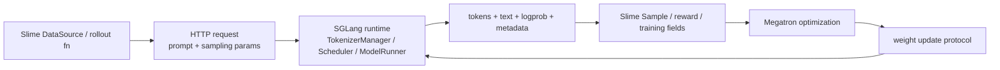

# Slime 与 SGLang 阅读对照

## 你为什么要读

Slime 调用 SGLang，却不拥有 SGLang 的请求调度、KV cache 或 attention kernel；SGLang 接收 Slime 发布的权重，却不拥有 Ray rollout 数据、advantage 或 optimizer。跨库阅读的关键不是找“同名模块”，而是识别四份交接协议：请求协议、采样证据、资源所有权、权重发布。

## 一句话边界

> Slime 决定为什么生成、生成哪些训练样本、怎样优化以及何时发布新策略；SGLang 决定一次推理请求怎样排队、分配 KV、执行模型并返回 token/metadata。

## 四份交接协议

| 协议 | Slime 所有 | SGLang 所有 | 交接失败时 |
|------|------------|-------------|------------|
| 请求 | prompt 选择、rollout/agent 逻辑、sampling 配置、router/model 选择 | API 校验、tokenization、调度、推理执行、输出回程 | HTTP 错误、字段不兼容、路由到错误 model |
| 采样证据 | 把返回值写入 `Sample`，维护 mask、reward、rollout id | 生成 token、logprob、finish reason、weight version、cache/perf metadata | logprob 长度错、版本不可追踪、训练/生成概率失配 |
| 资源 | Ray PG、engine actor/server group、colocate/offload/external 拓扑 | server 内部 TP/PP/DP/PD、KV/graph/worker 资源 | GPU 重叠、offload 顺序错、server group 配置不一致 |
| 权重发布 | Megatron→目标布局、updater 选择、锁/barrier、发布节拍 | update API、参数装载、cache/生成协调、版本报告 | 部分 engine 旧权重、更新卡住、下一批仍用旧策略 |

## 请求链对照

### Slime 侧

`RolloutManager` 动态调用 rollout function；默认路径经 router 向一个或多个 SGLang server 发送请求。Agent、streaming、external engine、PD/EPD、多模型和 fully async 都可能改变外层生产逻辑。

### SGLang 侧

请求进入 HTTP/gRPC 等入口后，由 TokenizerManager/Scheduler/ModelRunner 等逻辑角色处理。具体进程数和回程路径由启动参数、API、DP/PP/PD、skip-tokenizer、embedding、overlap 等条件决定，不能概括为固定“推理三进程”。

| Slime 阅读入口 | SGLang 阅读入口 | 关注交接点 |
|----------------|-----------------|------------|
| [[Slime-SGLang-Rollout]] | [[SGLang-OpenAI-API]] · [[SGLang-HTTP请求全链路]] | payload、streaming、logprob、finish reason |
| [[Slime-RolloutManager]] | [[SGLang-TokenizerManager]] | 谁提交请求，谁拥有跨请求状态 |
| [[Slime-引擎拓扑]] | [[SGLang-PD分离]] · [[SGLang-分布式]] | router、server group、PD/DP 拓扑 |
| [[Slime-SGLang-Engine]] | [[SGLang-启动链路]] · [[SGLang-HTTP-Server]] | server 进程、health、pause/offload/update API |

## `Sample` 与 SGLang 输出不是同一个对象

SGLang 返回推理结果；Slime 才把它组织成训练语义：

| SGLang 返回/产生 | Slime 中的落点 | 后续用途 |
|-----------------|----------------|----------|
| output token ids/text | `Sample.tokens/response/response_length` | 训练输入与展示 |
| token logprob | `Sample.rollout_log_probs` | old policy、mismatch、TIS |
| top-p kept ids/offsets | top-p replay fields | 训练侧概率空间重放 |
| routed experts | routing replay field | MoE 路由重放 |
| finish reason | `Sample.status` | truncated/aborted/completed |
| weight version | `Sample.weight_versions` | 策略陈旧度与 engine 漂移诊断 |
| cache/spec/perf metadata | Sample stats/trace attrs | 可观测与性能归因 |

reward、loss mask、rollout grouping、advantages 和 returns 不是 SGLang Scheduler 的职责。多轮工具/环境 token 还可能由 Slime/Agent 追加，并将对应 loss mask 设为 0。

## 权重更新对照

### Slime 发布侧

- 从 Megatron actor/backup 读取参数；
- 转成目标命名与 layout；
- 按 colocate/full/delta、NCCL/disk 选择 updater；
- 获取 updatable engines 与 lock，处理 offload/reconnect/recovery；
- 发布并检查 weight version/可选数值一致性。

### SGLang 装载侧

- 接收 distributed、disk 或 tensor 等更新请求；
- 暂停/协调 generation 与 cache；
- 把新参数写入实际 model workers；
- 返回结果与版本。

Slime 的 updater 使用 SGLang weight-update API，但不能无条件称为“SGLang CheckpointEngine”。CheckpointEngine 是 SGLang 自身的一套热更新/外部参数服务专题；Slime 当前的 distributed/disk/tensor 路线应按实际 endpoint、worker adapter 和 transport 分别追踪。

| Slime 专题 | SGLang 专题 | 对照问题 |
|------------|-------------|----------|
| [[Slime-分布式权重同步]] | [[SGLang-CheckpointEngine]] · [[SGLang-ModelLoader]] | metadata/tensor 怎样进入 worker，cache 是否 flush |
| [[Slime-磁盘权重同步]] | [[SGLang-ModelLoader]] | 文件版本、可见性、完整/增量装载 |
| [[Slime-Megatron到HF转换]] | [[SGLang-通用模型]] · [[SGLang-专用模型]] | 参数名、shape、TP/PP/MoE layout |

## colocate 的准确含义

colocate 表示 actor 与 rollout 的 Ray actors 使用重叠的 PG bundle/GPU，靠 offload/onload 时分复用显存；它们通常仍是不同 Python 进程。当前 colocate 选择 tensor/CUDA IPC updater，只跨进程传 handle/metadata 并由 consumer 访问 tensor，不等于双方共享同一个 Python 参数对象。流水异步入口明确不支持 colocate。

## 阅读路线

### 先读 Slime，再下钻 SGLang

1. [[Slime-RL训练全链路]]：找到一次 SGLang 请求在 RL 闭环中的位置。
2. [[Slime-SGLang-Rollout-源码走读]]：确认 payload、返回字段和 Sample 写入。
3. [[SGLang-HTTP请求全链路]]：沿入口、调度、执行和回程追踪。
4. 按问题进入 [[SGLang-Scheduler]]、[[SGLang-KV-Cache]]、[[SGLang-Sampling]] 或 [[SGLang-PD分离]]。

### 从推理故障回到训练系统

1. 先在 SGLang 确认请求/engine 的行为与 weight version。
2. 回 Slime 检查 rollout function、Sample metadata 和 updatable engine 集合。
3. 若只有生成概率与训练概率不一致，进入 [[Slime-Advantage计算]] 与 [[Slime-Policy-Loss]]，不要继续只查 Scheduler。

## 常见错误对照

| 错误说法 | 准确边界 |
|----------|----------|
| Slime rollout 就是 SGLang Scheduler | rollout 包含数据、Agent、reward/filter；Scheduler 只负责推理调度 |
| SGLang 返回 `Sample` | SGLang 返回推理结果，Slime 构造/维护 `Sample` |
| Slime 的所有更新都走 CheckpointEngine | updater 有 tensor、distributed、full disk、delta disk 多路 |
| colocate 是同进程共享权重 | 是 GPU 资源重叠与跨进程 tensor/IPC 协议 |
| SGLang 固定三进程 | 进程和逻辑角色受 API、DP/PP/PD 等配置影响 |
| weight version 相同就证明参数正确 | 它是发布序号；数值一致还需 equality check/行为验证 |

更多三库横向关系见 [[knowledge_maps/三框架知识地图|跨库专题对照]] 与 [[knowledge_maps/AI-Infra联合学习路径|联合学习路径]]。
