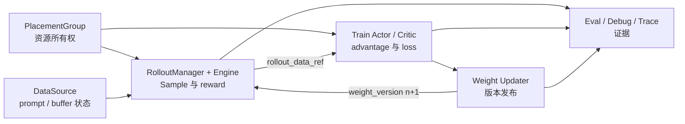

# Slime 总结复盘

> **Slime 阅读收尾层** | Git：`22cdc6e1`
> **读者任务：** 不再按模块背函数，而是用状态、版本和证据回答：一次 RL 迭代为什么成立，出错时哪一层应该负责。

## 你为什么要读

Slime 的难点不是某一个算法，而是四条时间线必须同时正确：资源何时可用、样本何时完整、训练何时消费、推理引擎何时切到新权重。只会复述 `generate → train → update_weights`，还不足以判断异步陈旧、fan-out 错组、半次权重更新或恢复后版本漂移。

本目录用于完成三件事：

- 把全库知识压缩成一组可检查的闭环不变量。
- 知道 trace、profile、CPU contract 和 GPU e2e 分别能证明什么。
- 遇到“慢、错、挂、漂移”时，从症状回到真正的复杂度汇点。

## 一张图收住全闭环

同步主循环的基本因果链是：第 `n` 次 rollout 产出样本，actor/critic 消费这些样本，训练后的 actor 权重再发布给 rollout engine。异步主循环会把下一轮生成提前，因此必须额外记录“样本由哪个权重版本产生”。资源共置、更新间隔、故障恢复和外部 buffer 都只是在改变这条链上的等待与失败方式，没有取消版本账。

## 收官时必须能守住的六个不变量

| 不变量 | 你要能证明什么 | 首选入口 |
|--------|----------------|----------|
| 资源所有权 | actor、critic、rollout engine 的 GPU 放置和 offload/onload 时序没有冲突 | [[Slime-PlacementGroup]]、[[Slime-引擎拓扑]] |
| 样本完整性 | token、response length、loss mask、logprob、reward、group 身份彼此对齐 | [[Slime-Sample数据契约]]、[[Slime-RolloutManager]] |
| 信用分配 | reward 经 estimator、KL、normalization 后形成的 advantage 与 loss mask 同空间 | [[Slime-Advantage计算]]、[[Slime-Policy-Loss]] |
| 批次所有权 | `Sample` 拍平、转换、DP split、micro-batch 切分发生在正确边界 | [[Slime-训练数据]]、[[Slime-训练步骤]] |
| 权重版本 | engine 只在允许的屏障后观察到完整的新版本；失败时没有统一 rollback 幻觉 | [[Slime-权重同步]] |
| 证据强度 | 静态引用、CPU contract、单机动态复现和 GPU e2e 不互相冒充 | [[Slime-可观测性与CI]] |

## 文档地图

| 文档 | 什么时候打开 | 产出 |
|------|--------------|------|
| [[Slime-复杂度热点]] | 不知道 bug 应归到参数、rollout、loss 还是权重同步 | 热点函数与排障路由 |
| [[Slime-可观测性与CI]] | 需要观察时间线、显存、恢复或选择测试层级 | 证据矩阵与运行边界 |
| [[Slime-补充主题]] | 遇到 teacher server、异步主循环、critic-only、Megatron FSDP 等旁支 | 补读决策表 |
| [[Slime-综合学习检查]] | 要判断自己是否真正理解闭环 | 可执行验收与书面交付物 |

## 按症状使用本目录

| 症状 | 先问什么 | 第一站 |
|------|----------|--------|
| 训练吞吐下降 | 时间花在生成、等待 ObjectRef、forward/backward 还是 offload | [[Slime-可观测性与CI]] |
| reward 正常但 loss 异常 | group、mask、old/current logprob、normalizer 是否同口径 | [[Slime-复杂度热点]] |
| rollout 仍像旧模型 | 样本生成版本、更新间隔、engine reload 与恢复顺序是什么 | [[Slime-权重同步]] |
| actor 或 engine 卡住 | 是资源互斥、collective、队列无截止时间还是恢复边界未触发 | [[Slime-复杂度热点]] |
| 想接 teacher 或外部轨迹服务 | 它替换单样本生成、整批 rollout，还是只计算 logprob | [[Slime-补充主题]] |

## 复盘的正确产物

读完后，至少留下三样东西：

1. 一张带对象和版本号的迭代时序图，而不是只有模块名的架构图。
2. 一张故障表：症状、最可能失效的不变量、源码入口、操作、预期。
3. 一份证据声明：哪些只做了静态核对，哪些跑过 CPU 测试，哪些在真实 GPU/模型环境中验证。

如果这三样还写不出来，应回到对应专题补读；“所有链接都点过”不等于理解闭环。

## 返回入口

[[Slime-导读与总览]] · [[Slime学习指南]] · [[AI-Infra联合学习路径]]
