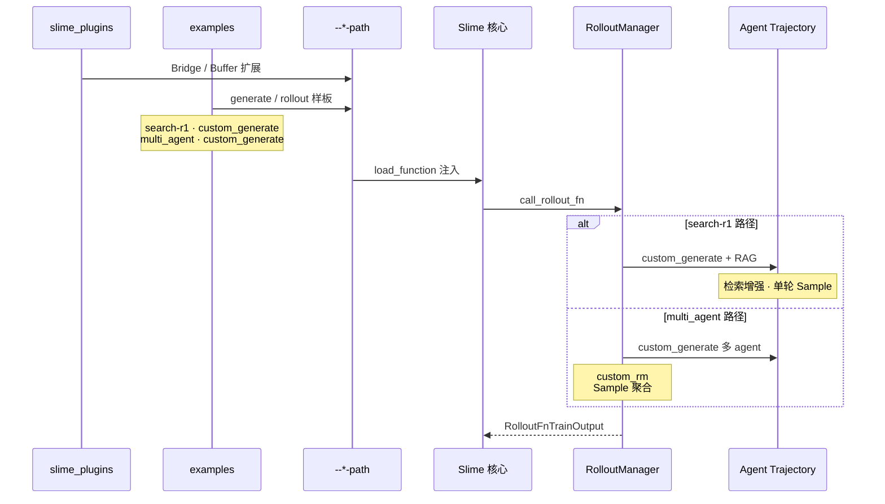

# 扩展与生态

> **你只需阅读本目录，不必打开 `slime/` 源码。**
> 内嵌代码对应 slime Git commit `22cdc6e1`。
> 前置：[[Slime-自定义扩展]]（17 类 `--*-path` 接口）。

---

## 本目录解决什么问题

高级特性部分讲清了扩展接口如何挂载。本目录回答：**`slime_plugins/` 与 `examples/` 如何分工？search-r1 与 multi_agent 这类样板工程如何通过 `custom_generate` 等接口接入默认闭环？**

一个专题覆盖生态扩展全链路：

| 模块 | 角色 | 一句话 |
|------|------|--------|
| [[Slime-插件与示例]] | 插件与样板 | slime_plugins Bridge/Buffer、examples 可运行 RL 工作流 |

---

## 端到端时序

这张图用于检查是否能对比 search-r1 与 multi_agent 的接入点和 `--*-path` 组合。

这张图的读法是：`slime/` 核心是闭环；**slime_plugins/** 放可选模型 Bridge 与算子；**examples/** 放端到端可运行样板。二者都通过自定义扩展定义的 `--*-path` 接入，不改核心 train 循环；当前 multi_agent 样板使用的是 `--custom-generate-function-path`，不是 `--rollout-function-path`。

---

## 零基础一句话

**像「官方 SDK + 示例 App Store」：** slime_plugins 是可选配件库，examples 是完整 Demo（搜题 R1、多 Agent 协作），自定义扩展的 CLI 插槽像 USB 口，按契约接入即可运行。

---

## 推荐阅读顺序

读完 [[Slime-自定义扩展]] 后，按以下顺序深入本阶段唯一专题：

| 顺序 | 文档 | 必读理由 |
|------|------|----------|
| 1 | [[Slime-插件与示例-核心概念]] | plugins vs examples 分工 |
| 2 | [[Slime-插件与示例-源码走读]] | search-r1 与 multi_agent 目录结构 |
| 3 | [[Slime-插件与示例-数据流]] | custom_generate 接入层与 rollout_function 边界 |
| 4 | [[Slime-插件与示例-排障指南]] | 选型：何时 fork example vs 写 plugin |
| 5 | [[Slime-插件与示例-学习检查]] | 能力与实验验收 |

---

## 阶段衔接

| 方向 | 模块 | 衔接点 |
|------|------|--------|
| ← 高级特性 | [[Slime-自定义扩展]] · [[Slime-Agent轨迹]] | `--*-path` 接口 → plugins/examples 实现 |
| → 总结复盘 | [[Slime-总结复盘]] | 全链路回顾与 cross-library 对照 |
| → Rollout | [[Slime-SGLang-Rollout]] · [[Slime-其他Rollout路径]] | custom_generate / rollout_function / alt rollout 替换点 |
| → Agent | [[Slime-Agent轨迹]] | search-r1 等多轮 generate 样板 |
| → 双库 | [[knowledge_maps/三框架知识地图]] | Slime rollout ↔ SGLang serving 对照 |

---

## 验证建议（零基础可试）

1. **接入点对比：** 对照 [[Slime-插件与示例-数据流]]，说明 search-r1 与 multi_agent 为什么都可以走 `--custom-generate-function-path`，以及它们和整段 `--rollout-function-path` 替换的边界差异。
2. **目录浏览：** 在笔记 [[Slime-插件与示例-源码走读]] 中定位 `examples/search-r1/run.sh` 与 `examples/multi_agent/run.sh` 的 CLI 差异。
3. **plugin 边界：** 列举 slime_plugins 中一项 Bridge 扩展及其对应的 Megatron/SGLang 对接点（见 [[Slime-插件与示例-核心概念]]）。

---

## 模块导航

| 目录 | 状态 |
| ------ | ------ |
| [[Slime-插件与示例|Plugins-Examples]] | ✅ |

← [[Slime-高级特性|高级特性]] · → [[Slime-总结复盘|总结复盘]]
