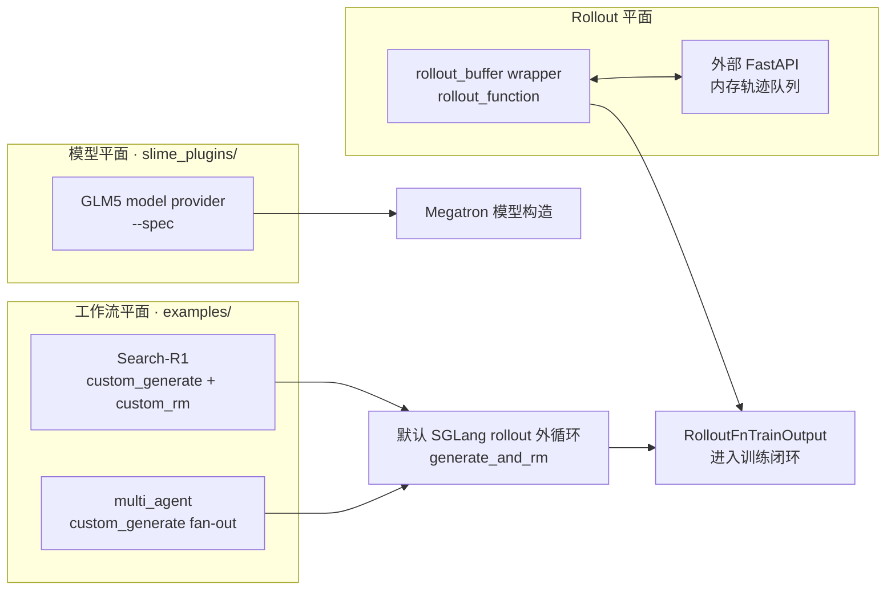

# 扩展与生态

> **Slime 扩展与生态入口** | Git：`22cdc6e1`
> **前置：** [[Slime-自定义扩展]]
> **本页任务：** 判断一个现成实现究竟是工作流样板、rollout 替换件，还是模型插件，并找到它真正接入 Slime 的边界。

## 你为什么要读

知道 `--*-path` 参数还不够。真正迁移一个示例时，最容易犯的错误，是把“目录位置”当成“运行时角色”：`examples/` 中既有单样本生成 hook，也有完整 rollout 替换脚本；`slime_plugins/` 中既有模型 provider，也有通过 HTTP 接回训练的 rollout buffer。它们不能用同一套返回值、异步模型和故障恢复假设。

读完本目录后，你应该能回答：

- 代码是被 `--custom-generate-function-path`、`--rollout-function-path` 还是 `--spec` 加载？
- 它替换的是单个 prompt 的生成、整批 rollout，还是 Megatron 模型结构？
- 它最终必须交付 `Sample`、`list[Sample]`，还是完整的 rollout 输出？
- 示例中哪些行为可以迁移，哪些只是当前实验脚本的前提或缺口？

## 先建立的模型：一个生态，三个接入平面



这三条路径的共同点只有“通过可加载实现扩展 Slime”；它们的调用者、对象形状和失败域并不相同：

| 接入平面 | 代表实现 | 调用边界 | 主要交付物 |
|----------|----------|----------|------------|
| 单样本生成 | Search-R1、multi_agent | 默认 rollout 外循环内部 | `Sample` 或 `list[Sample]` |
| 整批 rollout | rollout_buffer wrapper | `call_rollout_fn` 外层 | 训练或评估 rollout 输出 |
| 模型结构 | GLM5 provider | Megatron model provider | layer spec 与模型模块 |

来源：`examples/search-r1/run_qwen2.5_3B.sh` L115-L120、`examples/multi_agent/run-qwen3-30B-A3B-multi-agent.sh` L38-L45、`slime_plugins/rollout_buffer/rollout_buffer_example.sh` L49-L54、`scripts/models/glm5-744B-A40B.sh` L13-L15。

## 本专题覆盖什么，不覆盖什么

`examples/README.md` 还列出 fully async、VLM、on-policy distillation、Retool、Tau-bench、训练—推理偏差修正等工作流。本专题不按目录逐项复述，而选四个能代表不同接入边界的样板做深读：

| 样板 | 为什么选它 | 读完应抓住的边界 |
|------|------------|------------------|
| Search-R1 | 单样本多轮检索生成 | token/logprob 对齐、observation mask、RM label 契约 |
| multi_agent | 一个输入产生可变数量 sibling | fan-out、阶段 reward、默认 normalization 退化 |
| rollout_buffer | 外部服务替换整批 rollout | HTTP/队列协议、超时、幂等、严格 group size |
| GLM5 | rollout 之外的模型插件 | `--spec`、packed sequence、PP stage 与自定义 kernel 前提 |

其他 example 应回到它自己的 README、启动脚本与实现核对；不能因为掌握这四个样板，就推断所有示例都使用相同 hook 或达到相同成熟度。

## `examples/` 与 `slime_plugins/` 怎样分工

可以把二者理解为“工作流配方”和“可 import 零件库”，但这个类比只用于导航：

- `examples/` 组织数据、服务、参数和启动脚本，展示如何完成一种 RL workflow；其中有些只是演示，有些才给出可验证结果。
- `slime_plugins/` 提供模型 provider、Bridge、attention 实现、rollout buffer 等可导入组件；它们不一定能独立运行，也不一定通过 `--*-path` 加载。
- 真正的运行时归属必须看调用点：Search-R1 与 multi_agent 走 `custom_generate`，rollout_buffer 走 `rollout_function`，GLM5 走 `--spec`。

类比的失效边界是：目录名不提供稳定性、兼容性或生产级保证。尤其 rollout_buffer 当前是进程内全局状态加内存队列，没有持久化、ack/lease、重启恢复和完整超时语义。

## 推荐阅读顺序

| 顺序 | 文档 | 读者任务 |
|------|------|----------|
| 1 | [[Slime-插件与示例]] | 先看四类样板的定位、生产缺口与选型 |
| 2 | [[Slime-插件与示例-核心概念]] | 区分 hook、对象形状、配置和环境前提 |
| 3 | [[Slime-插件与示例-源码走读]] | 沿 token、fan-out、HTTP group、model spec 生命周期读源码 |
| 4 | [[Slime-插件与示例-数据流]] | 对比 in-process generate、external rollout 与 model provider |
| 5 | [[Slime-插件与示例-排障指南]] | 按症状检查 path、reward、队列、并发与模型插件 |
| 6 | [[Slime-插件与示例-学习检查]] | 运行静态 smoke，并规划专用环境中的真实验收 |

## 迁移前的决策表

| 你的目标 | 优先复用 | 迁移前必须补的验证 |
|----------|----------|--------------------|
| 给每个 prompt 接 RAG 或工具调用 | Search-R1 的 `custom_generate` 结构 | partial/eval 支持、logprob 完整性、finish reason、label schema |
| 一个 prompt 交给多个 agent 协作 | multi_agent fan-out 结构 | 空结果、变量 sibling 数、reward 分组、filter/RM 兼容性 |
| 让独立集群持续生产轨迹 | rollout_buffer 的协议思路 | 持久化、租约、去重、总截止时间、worker 失败与严格等长 group |
| 接入新的 Megatron 模型结构 | GLM5 或其他 model provider | pipeline 切分、checkpoint 映射、依赖 kernel、目标硬件上的 forward/backward |

> [!warning] 示例是可检查的实现，不是生产承诺
> Search-R1 不支持 partial rollout；当前 multi_agent 脚本未启用 eval，fan-out 还会碰到默认闭环的组合风险；rollout_buffer 是内存实验原型；GLM5 依赖 Megatron、Apex、Transformer Engine 与自定义 kernel。迁移时应保留思想，重新证明契约。

## 可执行的最小验证

在仓库根目录执行：

```powershell
rg -n -- '--custom-generate-function-path|--custom-rm-path' `
  slime/examples/search-r1/run_qwen2.5_3B.sh `
  slime/examples/multi_agent/run-qwen3-30B-A3B-multi-agent.sh

rg -n -- '--rollout-function-path' `
  slime/slime_plugins/rollout_buffer/rollout_buffer_example.sh

rg -n -- '--spec' `
  slime/scripts/models/glm5-744B-A40B.sh `
  slime/scripts/models/glm5.2-744B-A40B.sh
```

预期：前两份 example 脚本命中 `custom_generate`；buffer 脚本命中 `rollout_function`；GLM5 脚本只命中模型 `--spec`。这一步只验证装配边界，不证明模型、检索服务、agent 服务或外部 buffer 全链路可运行。

## 阶段衔接

| 方向 | 模块 | 衔接点 |
|------|------|--------|
| ← 扩展契约 | [[Slime-自定义扩展]] | path 如何加载、签名和返回对象由谁消费 |
| ← 默认生成 | [[Slime-SGLang-Rollout]] | Search-R1 与 multi_agent 保留的外循环 |
| ← Agent 对象 | [[Slime-Agent轨迹]] | 使用 trajectory adapter 的 agent 工作流；不要反推 Search-R1 必经此层 |
| → 总结复盘 | [[Slime-总结复盘]] | 把扩展边界放回训练—生成—同步全闭环 |
| → 三框架对照 | [[三框架知识地图]] | Slime orchestration、SGLang serving 与 FlashAttention kernel 的职责边界 |

← [[Slime-高级特性|高级特性]] · → [[Slime-总结复盘|总结复盘]]
