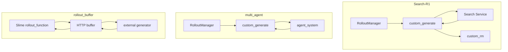
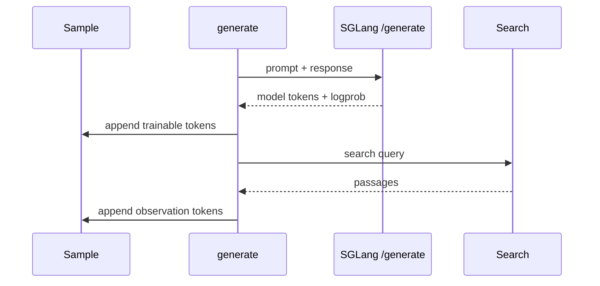
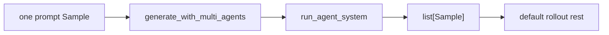
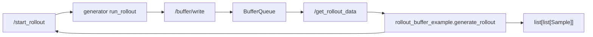
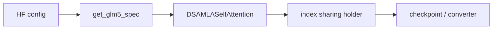

# 插件与示例 · 数据流

## 你为什么要读

本页把 Search-R1、multi_agent 和 rollout_buffer 三类示例放到同一张数据流图里。读完后，你应该能判断自己要复用的是 in-process `custom_generate`、fan-out sample，还是 external service 加 `rollout_function` wrapper。

这一篇把 29 的示例放到同一张数据流图里，帮助你判断自己要复制哪一层。

## 1. 三种 rollout 扩展路径

Search-R1 和 multi_agent 都是 in-process `custom_generate`；rollout_buffer 是 external service 加 `rollout_function` wrapper。这是 29 最重要的分界。

## 2. Search-R1 的 token 账

| token 来源 | 是否训练 | 为什么 |
|------------|----------|--------|
| 模型输出 `<search>` 或 `<answer>` | 是 | policy 真实采样 |
| 检索 observation | 否 | 外部环境返回，不是 policy 输出 |
| prompt token | 否 | 上下文输入，不属于 response loss |

源码依据：`examples/search-r1/generate_with_search.py` L179-L244。

## 3. multi_agent 的 fan-out 账

multi_agent 的特殊点不是外部服务，而是 fan-out。一个输入 sample 变成多个候选 sample 后，仍要交回默认 rollout 后续流程。

迁移时重点看三件事：

- `args` 被 generate 函数原地写入 tokenizer、sampling params 和 multi-agent 配置。
- 返回值是 `list[Sample]`，每个 sample 都要满足字段契约。
- 如果训练或 reward 依赖同 prompt group，要维护清晰的 group 或 `rollout_id` 语义。

源码依据：`examples/multi_agent/rollout_with_multi_agents.py` L8-L33。

## 4. rollout_buffer 的服务边界

buffer 服务端只认识 JSON item 和 group；训练侧 wrapper 才负责把 OpenAI messages 变成 `Sample`。这使外部 agent 生成集群可以和 Slime 训练进程解耦。

源码依据：`slime_plugins/rollout_buffer/buffer.py` L259-L329；`slime_plugins/rollout_buffer/rollout_buffer_example.py` L215-L307。

## 5. in-process 与 external buffer 对比

| 维度 | Search-R1 / multi_agent | rollout_buffer |
|------|-------------------------|----------------|
| 运行位置 | Slime rollout 进程内 | 独立 FastAPI 服务 |
| 接入点 | `custom_generate` | `rollout_function` |
| 数据返回 | `Sample` 或 `list[Sample]` | JSON records 到 `Sample` group |
| 并发控制 | Python semaphore 或 agent system 自管 | 外部 generator 与 HTTP buffer |
| 适用场景 | 单机或同集群工具调用 | 外部轨迹生成集群、长尾 agent rollout |
| 主要风险 | token/logprob、fan-out、loss mask | HTTP 可达性、group 攒样、schema 校验 |

## 6. plugins 与模型路径

GLM5 这类模型插件不经过 rollout 数据流。它的对象生命周期在 Megatron 模型内部：

源码依据：`slime_plugins/models/glm5/glm5.py` L37-L52 和 L145-L198。

模型插件的交互对象是 config、layer spec、Parameter 和 checkpoint；不要用 rollout hook 的排障方式处理它。
