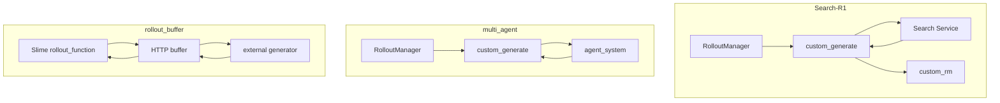
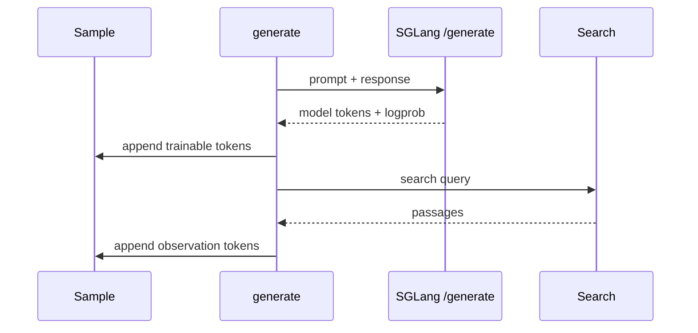
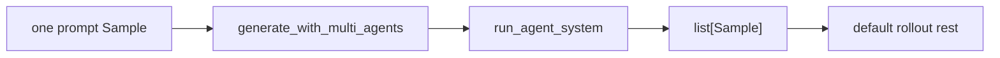
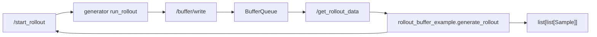
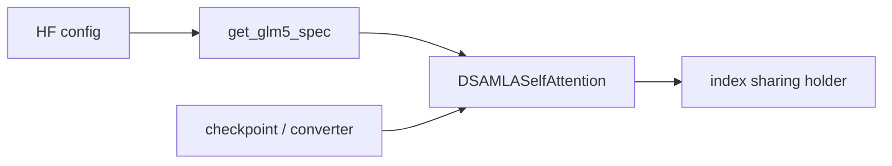

# 插件与示例 · 数据流

## 你为什么要读

本页把 Search-R1、multi_agent 和 rollout_buffer 三类示例放到同一张数据流图里。读完后，你应该能判断自己要复用的是 in-process `custom_generate`、fan-out sample，还是 external service 加 `rollout_function` wrapper。

这一篇把三类 rollout 示例放到同一张数据流图里，帮助你判断自己要复制哪一层。

## 1. 三种 rollout 扩展路径

Search-R1 和 multi_agent 都是 in-process `custom_generate`；rollout_buffer 是 external service 加 `rollout_function` wrapper。部署位置不同，但三者最终都必须交付 Slime 能消费的 `Sample` 字段和 reward 语义。

## 2. Search-R1 的 token 账

| token 来源 | 是否训练 | 为什么 |
|------------|----------|--------|
| 模型输出 `<search>` 或 `<answer>` | 是 | policy 真实采样 |
| 检索 observation | 否 | 外部环境返回，不是 policy 输出 |
| prompt token | 否 | 上下文输入，不属于 response loss |

源码依据：`examples/search-r1/generate_with_search.py` L179-L244。

## 3. multi_agent 的 fan-out 账

multi_agent 的特殊点不是外部服务，而是 fan-out。一个输入 sample 经过 solver、rewriter、selector 变成数量可变的训练 sample；reward 已在 agent system 内计算并缩放，外层 `generate_and_rm` 通常只会看到“reward 已填”的 sibling。来源：`examples/multi_agent/agent_system.py` L198-L296。

迁移时重点看五件事：

- `args` 被 generate 函数原地写入 tokenizer、sampling params 和 multi-agent 配置。
- 返回值是 `list[Sample]`，每个 sample 都要满足字段契约。
- agent system 用输入 `sample.index` 给 sibling 写共同 `rollout_id`，但阶段 RM 回填仍使用 `strict=False`。
- 变量 fan-out 拍平后不再满足固定 `n_samples_per_prompt` 形状；默认 reward normalization 会退化成整批单组，而不是按 rollout id 分组。
- solver 全部失败时可能返回空 list；selector 未匹配到 rewrite 时 reward 可能保持 `None`，这些失败态要在生产迁移中显式收口。

源码依据：`examples/multi_agent/rollout_with_multi_agents.py` L8-L33。

## 4. rollout_buffer 的服务边界

buffer 服务端只认识 JSON item 和 group；训练侧 wrapper 才负责把 OpenAI messages 变成 `Sample`。这使外部 agent 生成进程可以和 Slime 训练进程解耦，但当前实现的 buffer 是进程内全局内存对象，不具备跨进程共享或重启恢复。

源码依据：`slime_plugins/rollout_buffer/buffer.py` L259-L329；`slime_plugins/rollout_buffer/rollout_buffer_example.py` L215-L307。

## 5. in-process 与 external buffer 对比

| 维度 | Search-R1 / multi_agent | rollout_buffer |
|------|-------------------------|----------------|
| 运行位置 | Slime rollout 进程内 | 独立 FastAPI 服务 |
| 接入点 | `custom_generate` | `rollout_function` |
| 数据返回 | `Sample` 或 `list[Sample]` | JSON records 到 `Sample` group |
| 并发控制 | Python semaphore 或 agent system 自管 | 外部 generator 与 HTTP buffer |
| 适用场景 | 单机或同集群工具调用 | 外部轨迹生成集群、长尾 agent rollout |
| 主要风险 | token/logprob、变量 fan-out、normalization、loss mask | 阻塞 I/O、无限重试、全局状态竞争、超额 group、schema/持久化 |

rollout_buffer 还包含一条容易忽略的阻塞链：`generate_rollout_async` 先同步 `requests.post` 启动服务，获取数据时又在 async loop 内 `time.sleep(5)`；服务不可达时启动请求无退避无限重试，数据端也没有总截止时间。因此“外部异步生成”不等于“训练侧 wrapper 非阻塞”。来源：`slime_plugins/rollout_buffer/rollout_buffer_example.py` L138-L153、L173-L205、L207-L253。

## 6. plugins 与模型路径

GLM5 这类模型插件不经过 rollout 数据流。它的对象生命周期在 Megatron 模型内部：

源码依据：`slime_plugins/models/glm5/glm5.py` L37-L52 和 L145-L198。

模型插件的交互对象是 config、layer spec、Parameter、packed sequence holder 和 checkpoint；不要用 rollout hook 的排障方式处理它。index sharing 的 top-k holder 只活在单个 microbatch 的 `packed_seq_params` 上，不跨 pipeline stage。
