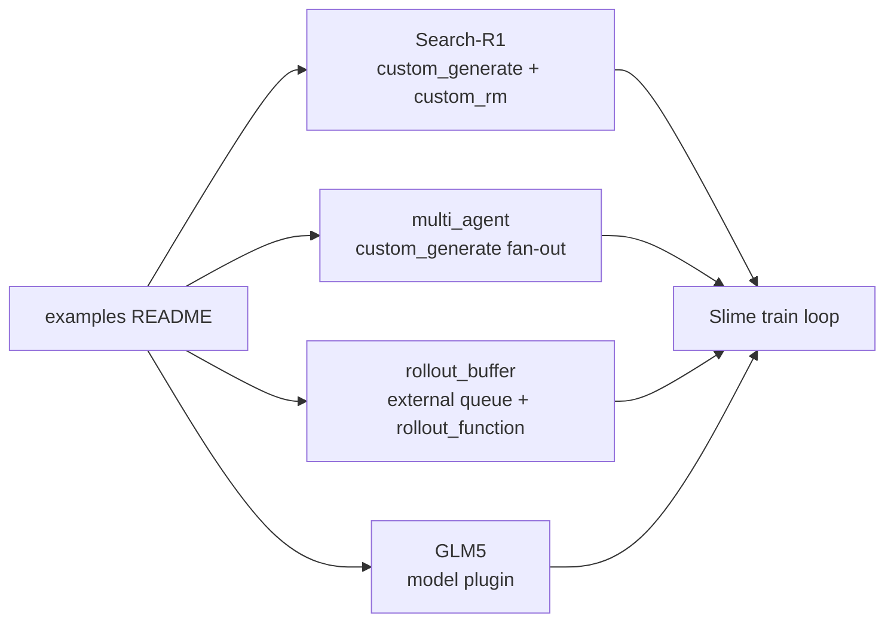

# 插件与示例 · 源码走读

本篇按一个索引与四类可迁移样板走读：examples README、Search-R1、multi_agent、rollout_buffer、GLM5。主线是“示例代码如何通过 [[Slime-自定义扩展]] 的扩展槽位接回 Slime 核心闭环”，同时区分演示代码已经证明什么、尚未提供什么生产保证。



## 长文读法

这篇按“示例改的是哪一层扩展槽位”读：examples README 先给 workflow 索引，Search-R1 展示 sample-level `custom_generate` 与 reward，multi_agent 展示一个样本 fan-out，rollout_buffer 展示外部队列和 rollout function，GLM5 展示模型插件边界。不要把这些样板混成同一种插件机制。

| 你的任务 | 先读 | 抓住什么 |
|----------|------|----------|
| 第一次选示例 | 1 | README 是 workflow 索引，不是运行时入口 |
| 接搜索或工具生成 | 2 | Search-R1 改的是生成和 reward，不重写训练闭环 |
| 接多 agent fan-out | 3 | 一个输入样本可能生成多个 agent sample，最后仍要回到 Sample 契约 |
| 接外部 rollout 服务 | 4 | rollout_buffer 改的是外部队列与 wrapper，不是单样本 generate |
| 接新模型族 | 5 | GLM5 属于模型插件边界，不走 rollout path |
| 排障示例选择 | 6 | 先判断样板层级，再看对应 hook 和字段契约 |

## 1. examples README 是 workflow 索引

examples 的 README 不是运行时代码，但它定义了读者应该从 workflow 选择入口，而不是从源码文件名选择入口。

```markdown
# 定位骨架（基于 examples/README.md L3-L20；只列本文讨论的四个 workflow）
These examples provide concrete examples to leverage slime in your own RL workflow. Some examples are just demonstrative, but most of them are verifiable with a concrete performance score.

## Directory Structure

- **[fully_async](./fully_async)**: Demonstrates fully asynchronous rollout generation for higher efficiency.
- **[multi_agent](./multi_agent)**: Example of running multi-agent RL with `slime`.
- **[search-r1](./search-r1)**: A minimal reproduction of Search-R1, featuring multi-turn conversation and tool-calling.
- **[tau-bench](./tau-bench)**: Training in an agentic multi-turn tool use environment (Tau-bench).
```

读法要点：

- `examples/` 是可复制 workflow，不是核心库。
- 同一个 customization 槽位可以承载不同 workflow。
- 可验证 example 通常会附带脚本、README 和任务依赖。

## 2. Search-R1：把多轮 search 放进 custom_generate

启动脚本只注册两个函数：generate 和 reward。

```bash
# 定位骨架（基于 examples/search-r1/run_qwen2.5_3B.sh L115-L122；只保留 generate/RM 参数）
CUSTOM_ARGS=(
   --custom-generate-function-path generate_with_search.generate
   --custom-rm-path generate_with_search.reward_func

   # TIS-related args, recommended to enable when using TIS
)
```

这说明 Search-R1 没有替换完整 rollout 外循环。脚本还把 `${SCRIPT_DIR}` 放进 Ray `PYTHONPATH`，所以短 path `generate_with_search.generate` 依赖运行环境；把它机械改成并不存在的 `examples.search_r1.*` 会 import 失败。

Search 配置集中在模块顶部。

```python
# 定位骨架（基于 examples/search-r1/generate_with_search.py L14-L41；省略分组注释）
SEARCH_R1_CONFIGS = {
    "max_turns": 2,
    "topk": 3,
    "search_concurrency": 256,
    "search_backend": "local",
    "local": {
        "search_url": "http://127.0.0.1:8000/retrieve",
        "proxy": None,
    },
    "google": {
        "api_key": "your_api_key_here",
        "snippet_only": True,
        "proxy": None,
    },
    "return_logprob": True,
    "format_score": 0.2,
}
```

配置、search semaphore 都是进程级全局对象，不是每个 rollout 独立实例。`generate` 还直接拒绝 partial rollout，且没有显式 `evaluation` 参数；训练与 eval 若复用它，会共享同一套 search 配置。

关键不变量是 token/logprob 对齐。源码注释明确：采集 logprob 时不能对 engine 返回字符串做 postprocess 后再 tokenize。来源：examples/search-r1/generate_with_search.py L93-L98

为了解决工具 tag 后继续生成的问题，Search-R1 把 `</search>` 和 `</answer>` 加进 sampling stop，而不是事后修字符串。来源：examples/search-r1/generate_with_search.py L145-L177

主循环按轮次交替追加两类 token。

```python
# 来源：examples/search-r1/generate_with_search.py L217-L226
        response += cur_response
        response_token_ids += cur_response_token_ids
        loss_mask += [1] * len(cur_response_token_ids)
        sample.append_response_tokens(
            args,
            tokens=cur_response_token_ids,
            log_probs=cur_response_log_probs if SEARCH_R1_CONFIGS["return_logprob"] else None,
            trainable=True,
            meta_info=output["meta_info"] if "output_token_logprobs" in output["meta_info"] else None,
        )
```

模型输出是可训练 token，`trainable=True`。检索 observation 随后以 `trainable=False` 追加，参与上下文但不参与 policy loss。

循环结束后，示例把统一字段写回 `Sample`，并只处理 `length/abort/stop` 三种 finish reason；未知值会让 status 保持原态。来源：examples/search-r1/generate_with_search.py L255-L274

reward 函数也保持在 custom RM 边界上，并硬编码要求 label 是带 `ground_truth` 的映射。

```python
# 来源：examples/search-r1/generate_with_search.py L284-L293
    if not isinstance(sample, Sample):
        raise TypeError("Sample must be an instance of Sample class.")

    score = compute_score_em(
        solution_str=sample.prompt + sample.response,
        ground_truth=sample.label["ground_truth"],
        format_score=SEARCH_R1_CONFIGS["format_score"],
    )

    return score
```

迁移时最重要的是保留两条边界：生成逻辑只管 `Sample`，reward 逻辑只管打分。

## 3. multi_agent：一个样本 fan-out 成多个 agent sample

multi_agent README 和脚本都指向 `--custom-generate-function-path`。

```bash
# 定位骨架（基于 examples/multi_agent/run-qwen3-30B-A3B-multi-agent.sh L38-L45；只保留 path 与数据字段）
ROLLOUT_ARGS=(
   --custom-generate-function-path examples.multi_agent.rollout_with_multi_agents.generate_with_multi_agents
   --prompt-data /root/dapo-math-17k/dapo-math-17k.jsonl
   --input-key prompt
   --label-key label
   --apply-chat-template
)
```

生成函数内部再加载真正的 agent system。

```python
# 来源：examples/multi_agent/rollout_with_multi_agents.py L8-L33
MULTI_AGENT_CONFIGS = {
    "custom_multi_agent_function_path": "examples.multi_agent.agent_system.run_agent_system",
    "num_parallel": 5,
    "incorrect_reward_weight": 0.8,
    "correct_reward_weight": 1.2,
}


async def generate_with_multi_agents(args, sample: Sample, sampling_params, evaluation=False) -> list[Sample]:

    tokenizer = AutoTokenizer.from_pretrained(args.hf_checkpoint, trust_remote_code=True)
    max_context_length = args.rollout_max_context_len if not evaluation else args.eval_max_context_len

    args.sampling_params = sampling_params
    args.rollout_max_context_len = max_context_length
    args.tokenizer = tokenizer

    for key, value in MULTI_AGENT_CONFIGS.items():
        setattr(args, key, value)

    custom_multi_agent_func = load_function(args.custom_multi_agent_function_path)
    samples = await custom_multi_agent_func(args, sample)

    random.shuffle(samples)

    return samples
```

读法要点：

- 这仍是 `custom_generate`，不是完整 rollout 替换。
- 返回 `list[Sample]` 表示 fan-out。
- tokenizer 每次 sample 调用都从 checkpoint 重新加载；`args` 被原地写入 sampling params、tokenizer 和 multi-agent 配置。
- 真正的 `run_agent_system` 会 deepcopy args，再并发运行 solver、rewriter、selector，并在每个阶段直接调用 batched RM。
- 阶段 RM 回填使用 `strict=False`；全失败可能返回空 list，selector 未找到匹配 rewrite 时 reward 可能保持 `None`。
- `_emit` 把 sibling `rollout_id` 统一写成输入 `sample.index`，但变量 fan-out 在默认 reward normalization 中仍会走“整批一组”的 fallback。
- 示例脚本注释明确 multi-agent 暂不支持 eval；不要因为 wrapper 有 `evaluation` 参数就推断 workflow 已验收 eval。

上述阶段 reward、失败分支和共同 `rollout_id` 的实际实现见下列源码。

来源：examples/multi_agent/agent_system.py L198-L296

## 4. rollout_buffer：外部服务与训练侧包装器

rollout_buffer 的 README 把它定义为独立组件：训练进程通过 HTTP API 与 buffer 交互，buffer 再驱动 agent framework 生成轨迹。这里的独立是部署边界，不是持久化队列承诺。来源：slime_plugins/rollout_buffer/README.md L3-L18

示例脚本把 Slime 的 rollout 函数替换为 `rollout_buffer_example.generate_rollout`。来源：slime_plugins/rollout_buffer/rollout_buffer_example.sh L51-L55

```bash
# 定位骨架（基于 slime_plugins/rollout_buffer/rollout_buffer_example.sh L51-L56；只保留 wrapper/RM/数据参数）
ROLLOUT_ARGS=(
   --rollout-function-path slime_plugins.rollout_buffer.rollout_buffer_example.generate_rollout
   --rm-type deepscaler
   --prompt-data /root/dapo-math-17k/dapo-math-17k.jsonl
)
```

### 4.1 服务端发现 generator

buffer 服务实际扫描 `generator/*.py`，要求每个 generator 有 `TASK_TYPE` 和 `run_rollout`；并不执行 README 所写的 `_generator.py` 后缀限制。

```python
# 来源：slime_plugins/rollout_buffer/buffer.py L54-L75
def discover_generators():
    """
    Automatically discover generator modules in the generator directory.
    Returns a dictionary mapping task_type to module with run_rollout function.
    """
    generator_map = {}
    generator_dir = pathlib.Path(__file__).parent / "generator"

    # Find all files within generator_dir
    for file_path in glob.glob(str(generator_dir / "*.py")):
        if file_path.endswith("__init__.py"):
            continue

        try:
            # Load the module
            spec = importlib.util.spec_from_file_location("generator_module", file_path)
            if spec is None or spec.loader is None:
                print(f"Warning: Could not load spec for {file_path}")
                continue

            module = importlib.util.module_from_spec(spec)
            spec.loader.exec_module(module)
```

可选函数只有 `transform_group`、`is_valid_group` 和 `get_group_data_meta_info` 三个。模板提供的函数却叫 `normalize_group_data`，不会被自动发现；重复 `TASK_TYPE` 则由后扫描模块静默覆盖。

### 4.2 BufferQueue 按 instance_id 攒 group

`BufferQueue` 同时维护 `data` 和 `temp_data`。前者用于实际消费，后者用于 meta 统计窗口。

```python
# 来源：slime_plugins/rollout_buffer/buffer.py L145-L160
    def append(self, item):
        instance_id = item["instance_id"]
        current_time = time.time()

        # Update timestamp for this group
        self.group_timestamps[instance_id] = current_time

        if instance_id not in self.temp_data:
            self.temp_data[instance_id] = [copy.deepcopy(item)]
        else:
            self.temp_data[instance_id].append(copy.deepcopy(item))

        if instance_id not in self.data:
            self.data[instance_id] = [item]
        else:
            self.data[instance_id].append(item)
```

读取时先计算 meta，再找有效 group，转换后从 `data` 中删除。默认有效性只要求 `len(group) >= group_size`，不会裁成恰好 group size；函数名中的 timeout 目前也没有实现，`timed_out_groups`/`finished_groups` 始终为空。来源：slime_plugins/rollout_buffer/buffer.py L162-L206

### 4.3 HTTP endpoint 是写入和读取边界

`/buffer/write` 接收 generator 写入的 JSON item。来源：slime_plugins/rollout_buffer/buffer.py L259-L274

`/get_rollout_data` 成功读出后清空 `temp_data` 窗口。来源：slime_plugins/rollout_buffer/buffer.py L277-L295

`/start_rollout` 用 background task 启动 generator，并根据 `num_repeat_per_sample` 重建进程级全局 buffer。并发或重复 start 可能覆盖正在使用的 buffer；该替换没有和读写锁共用临界区。来源：slime_plugins/rollout_buffer/buffer.py L298-L329

脚本直接运行时，服务默认监听 8889 端口。来源：slime_plugins/rollout_buffer/buffer.py L332-L340

### 4.4 训练侧 wrapper 拉取并转成 Sample

`rollout_buffer_example.py` 负责从外部 buffer 拉数据。它会一直轮询 `/get_rollout_data`，直到 response success，没有总截止时间。来源：slime_plugins/rollout_buffer/rollout_buffer_example.py L138-L170

启动外部 rollout 时，它把 SGLang router 地址、buffer 地址、task type、prompt 文件、repeat 数、sampling params、tokenizer path 和已完成 group 发给服务端。来源：slime_plugins/rollout_buffer/rollout_buffer_example.py L180-L205

真正的 `generate_rollout_async` 会：

- 首次 rollout 时调用 `/start_rollout`。
- 根据 `rollout_batch_size * n_samples_per_prompt` 计算缺口。
- 轮询 buffer 直到拿够样本。
- 用 `MultiTurnLossMaskGenerator` 从 messages 生成 token 和 loss mask。
- 构造 `Sample` group 后放回 `data_buffer`。

来源：slime_plugins/rollout_buffer/rollout_buffer_example.py L215-L307

这就是外部 buffer 的核心边界：外部系统负责产出 messages/reward，训练侧 wrapper 负责转成 Slime `Sample`。但 async 函数内部使用同步 `requests.post` 和 `time.sleep(5)`；启动失败无退避无限重试，拉取重试耗尽后也没有显式“数据不足”异常。wrapper 返回的是裸 group list，由 `call_rollout_fn` 的 legacy compatibility 包装。

模板 generator 也不是可靠消息生产者：worker 未用 finally 发送 `COMPLETE`，异常退出会让父进程永久等；buffer 写入只有两次无 timeout 尝试，最终失败会静默丢样本；每轮数据投递后固定 sleep 300 秒，包括最后一轮。

来源：slime_plugins/rollout_buffer/generator/base_generator.py L108-L140

来源：slime_plugins/rollout_buffer/generator/base_generator.py L177-L265

## 5. GLM5：模型插件不走 rollout path

GLM5 示例展示另一类插件：它不是 generate/RM hook，而是 Megatron 模型结构扩展。最小入口是 cross-layer top-k sharing 的判断。

```python
# 来源：slime_plugins/models/glm5/glm5.py L37-L52
def is_skip_topk_layer(layer_number: int, skip_topk_offset: int, topk_freq: int) -> bool:
    """Whether the (1-indexed) Megatron ``layer_number`` reuses a previous layer's top-k.

    Mirrors ``glm-train-prod``'s ``_get_skip_topk_flags``: a layer *computes* its
    own top-k when ``max(layer_number - offset, 0) % freq == 0``; otherwise it is a
    skip layer that reuses the most recent computing layer's indices.
    """
    return (max(layer_number - skip_topk_offset, 0) % topk_freq) != 0


def source_compute_layer(layer_number: int, skip_topk_offset: int, topk_freq: int) -> int:
    """The computing layer whose ``topk_indices`` a skip layer reuses."""
    layer = layer_number
    while is_skip_topk_layer(layer, skip_topk_offset, topk_freq):
        layer -= 1
    return layer
```

在 forward 中，skip layer 会从 `packed_seq_params` 上的 per-microbatch holder 取源计算层 top-k；计算层则运行 indexer 并写入 holder。holder 不跨 PP stage，所以 `get_glm5_spec` 主动拒绝 stage 从 skip layer 开始。forward 还要求 packed sequence，index top-k 固定为 2048。来源：slime_plugins/models/glm5/glm5.py L145-L198、L253-L299、L707-L750

这类插件的验收点不是 custom generate contract，而是模型初始化、pipeline stage 切分、checkpoint 参数集合和导出路径。

## 6. 最小验证：四类样板不要混用排障方式

**操作：** 先确定你复用的是 generate hook、fan-out、外部 buffer 还是模型插件，再只检查对应边界；不要拿另一类示例的成功条件来验收。

**预期：** 每个扩展都能落到下表唯一一行，并能说明它向 Slime 交付的对象或副作用。若一项改动同时跨多行，应拆开验证其契约。

| 样板 | 首先排查 |
|------|----------|
| Search-R1 | custom generate 是否返回完整 `Sample`，token/logprob 是否对齐 |
| multi_agent | fan-out 字段、阶段 RM、空/None 失败态、normalization 与 `args` 副作用 |
| rollout_buffer | HTTP 有界失败、全局状态、严格 group、messages→mask、持久化/幂等 |
| GLM5 | `--spec`、packed sequence、PP split、checkpoint 权重与自定义 kernel |

Examples 的价值在于给出可复制边界。迁移时保留边界，改内部逻辑；不要把整个 example 当黑盒搬进生产路径。
