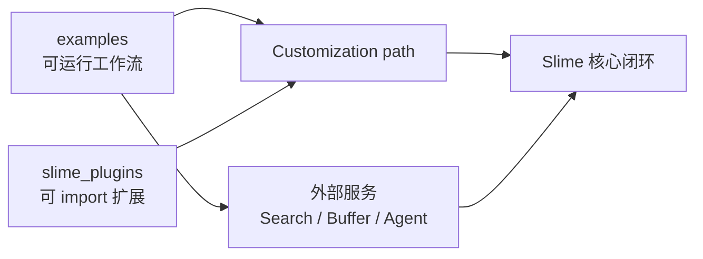

# 插件与示例

> **Slime 扩展与生态 · 插件与示例** | Git：`22cdc6e1`  
> **源码范围：** `examples/`、`slime_plugins/rollout_buffer/`、`slime_plugins/models/glm5/`

## 你为什么要读

读完 [[Slime-自定义扩展]] 以后，读者知道了 Slime 有哪些扩展槽位；本专题回答下一步：真实示例如何把这些槽位组合成可运行工作流。

本专题不把 `examples/` 当成目录清单，而把它们分成四类可迁移样板：

- Search-R1：用 `custom_generate + custom_rm` 做多轮 search tool rollout。
- multi_agent：仍用 `custom_generate`，但一个输入样本会产出数量可变的 agent sample，并在 agent system 内先算 reward。
- rollout_buffer：用独立 FastAPI 服务做外部轨迹队列，再通过 legacy-compatible `rollout_function` 拉回训练；当前实现更接近实验原型，不是具备持久化、租约与故障恢复的生产队列。
- GLM5 插件：不是 runnable rollout example，而是由 `--spec module function` 显式加载的 Megatron 模型结构插件。

## 先建立的模型

源码依据：`examples/README.md` L3-L20 把 examples 定位为可复用 RL workflow；`slime_plugins/rollout_buffer/README.md` L3-L18 把 rollout buffer 定位为独立 agent trajectory 生成组件。这里的“独立/异步”是部署拓扑，不等于服务端和 wrapper 内部全部使用非阻塞 I/O。

## 阅读顺序

| 顺序 | 文件 | 读者任务 |
|------|------|----------|
| 1 | [[Slime-插件与示例-核心概念]] | 区分 examples、plugins、外部服务和 customization path |
| 2 | [[Slime-插件与示例-源码走读]] | 沿四个样板看数据如何接回 Slime |
| 3 | [[Slime-插件与示例-数据流]] | 对比 in-process generate 与 external buffer |
| 4 | [[Slime-插件与示例-排障指南]] | 排查 path、token/logprob、group、buffer、插件注册问题 |
| 5 | [[Slime-插件与示例-学习检查]] | 用命令验收本专题和示例边界 |

## 选型速查

| 目标 | 看哪个样板 | 接入点 |
|------|------------|--------|
| 多轮工具调用或 RAG | Search-R1 | `--custom-generate-function-path` + `--custom-rm-path` |
| 一个 prompt 并行多个 agent | multi_agent | `--custom-generate-function-path`；额外审计 fan-out、reward normalization |
| 轨迹生成跑在外部集群 | rollout_buffer | `--rollout-function-path` + HTTP buffer |
| 新模型结构或 Bridge | GLM5 / megatron_bridge | `--spec` 指向 model spec provider |

> [!warning] 示例是证据，不是生产承诺
> Search-R1 明确拒绝 partial rollout；multi_agent 脚本关闭 eval 且变量 fan-out 会触发默认 reward normalization 的退化分支；rollout_buffer 使用进程级全局状态、无限轮询和内存队列。迁移时必须重做失败恢复、幂等、超时、并发与数据契约验证。

## 与上下游的关系

← [[Slime-自定义扩展]]：先理解 hook 选择和接口契约。
← [[Slime-SGLang-Rollout]]：默认 rollout 外循环仍是多数 example 的底座。
→ [[Slime-总结复盘]]：读完扩展生态后进入收官复盘。
