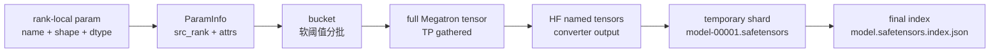

# Megatron到HF转换 · 数据流

## 你为什么要读

本篇只看对象如何变形：一个 Megatron rank-local 参数如何成为 HF shard 文件中的一条 `weight_map` 记录，以及这条链路如何被 actor save、disk sync、NCCL 权重同步共同使用。

## 总生命周期



| 阶段 | 持有者 | 关键字段 | 下一跳 |
|------|--------|----------|--------|
| rank-local param | Megatron model chunk | name、shape、dtype、TP attrs | `ParamInfo` |
| `ParamInfo` | `HfWeightIteratorDirect` | `src_rank`、`partition_dim`、`parallel_mode` | bucket |
| full param | CUDA tensor | TP/EP/PP 已重建 | `convert_to_hf` |
| HF named tensor | converter | HF tensor name、tensor | `_SafetensorShardWriter` |
| shard state | writer rank | `total_size`、`weight_map`、`shard_files` | `_finalize_shard_files` |

## 1. 入口交互：训练主循环只看到 actor 方法

训练主循环不直接接触 converter。它通过 actor 的 `save_model` 触发可选 HF 导出，通过 `update_weights` 触发在线或磁盘权重同步。

```python
# 定位骨架（基于 `slime/backends/megatron_utils/actor.py` L558-L578；省略 HF 导出尾部）
def save_model(self, rollout_id: int, force_sync: bool = False) -> None:
    if self.args.debug_rollout_only:
        return

    # torch dist may trigger nccl communication during saving.
    if self.args.offload_train:
        self.wake_up()

    if self.args.async_save:
        from megatron.training.async_utils import maybe_finalize_async_save

        maybe_finalize_async_save(blocking=True)

    save(rollout_id, self.model, self.optimizer, self.opt_param_scheduler)
```

交互边界：`save_model` 是训练侧持久化入口；`save_hf_model_to_path` 是 HF 产物入口；rollout engine 只在 disk sync reload 时看到最终 HF 目录。

## 2. 参数 metadata 如何达成全 rank 一致

`_get_megatron_local_param_infos` 先收集当前 rank 的参数，再通过 PP 和 EP group 交换，最后按名字排序并用 gloo group 做一致性校验。

```python
# 定位骨架（基于 `slime/backends/megatron_utils/update_weight/hf_weight_iterator_direct.py` L138-L211；只展示 metadata 构造入口）
def _get_megatron_local_param_infos(args: Namespace, model: Sequence[torch.nn.Module]) -> list[ParamInfo]:
    """
    Build global param metadata: collect -> exchange PP/EP -> resolve duplicates (MTP virtual PP)
    by min src_rank -> validate. Returns sorted ParamInfo identical across all ranks.
    """
    pp_size = mpu.get_pipeline_model_parallel_world_size()
    ep_size = mpu.get_expert_model_parallel_world_size()

    param_infos = {}
    rank = dist.get_rank()
    for name, param in named_params_and_buffers(args, model):
        param_infos[name] = ParamInfo(
            name=name,
            dtype=param.dtype,
            shape=param.shape,
```

数据不变量：同一个 bucket 在所有 rank 上必须有相同的参数顺序、shape 和 dtype；否则后续 broadcast、all-gather 和 writer 轮转都会错位。

## 3. bucket 用软阈值控制显存峰值

bucket 按 `update_weight_buffer_size` 切分。专家参数用 expert TP size 估算，其余参数用普通 TP size 估算，因为 full param 会在 gather 后展开。但这是软阈值：只有“当前 bucket 已非空”时才会在超限前换 bucket；单个 full param 本身大于阈值时，它仍会独占一个超限 bucket。

```python
# 定位骨架（基于 `slime/backends/megatron_utils/update_weight/hf_weight_iterator_direct.py` L108-L136；只展示估算主干）
def _get_megatron_local_param_info_buckets(args: Namespace, model: Sequence[torch.nn.Module]) -> list[list[ParamInfo]]:
    """
    Partition params into buckets <= update_weight_buffer_size (with TP replication).
    """
    param_infos = _get_megatron_local_param_infos(args, model)
    param_info_buckets = [[]]  # Start with one empty bucket
    buffer_size = 0  # Track current bucket size in bytes

    for info in param_infos:
        # Expert params use expert-TP size, others use regular-TP size
        if ".experts." in info.name:
            tp_size = mpu.get_expert_tensor_parallel_world_size()
        else:
            tp_size = mpu.get_tensor_model_parallel_world_size()
```

读者抓手：导出 OOM 时，不一定是 converter 错；先看 bucket size、最大单参数和 full param 重建峰值。不能把 `update_weight_buffer_size` 解读成硬性显存上限。

## 4. HF chunk 同时服务保存和权重同步

模式工厂把 `raw` 和 `bridge` 映射到两种 iterator，这是两条转换数据流的最小分界证据。

```python
# 来源：slime/backends/megatron_utils/update_weight/hf_weight_iterator_base.py L4-L15
class HfWeightIteratorBase(ABC):
    @staticmethod
    def create(args, model, **kwargs):
        from .hf_weight_iterator_bridge import HfWeightIteratorBridge
        from .hf_weight_iterator_direct import HfWeightIteratorDirect

        c = {
            "raw": HfWeightIteratorDirect,
            "bridge": HfWeightIteratorBridge,
        }[args.megatron_to_hf_mode]

        return c(args, model, **kwargs)
```

每个 bucket 重建为 full params 后，`_convert_to_hf_named_tensors` 调用 `convert_to_hf`。这一层与 [[Slime-分布式权重同步]] 的在线同步共享语义：Megatron 参数名先转为 HF tensor 名，再交给下游通道。

```python
# 定位骨架（基于 `slime/backends/megatron_utils/update_weight/hf_weight_iterator_direct.py` L24-L41；省略函数尾部）
def get_hf_weight_chunks(self, megatron_local_weights, progress_desc: str = "Update weights"):
    rank = dist.get_rank()

    for megatron_local_param_infos in tqdm(
        self.megatron_local_param_info_buckets, disable=rank != 0, desc=progress_desc
    ):
        megatron_full_params = _get_megatron_full_params(megatron_local_param_infos, megatron_local_weights)
        hf_named_tensors = self._convert_to_hf_named_tensors(megatron_full_params, megatron_local_param_infos)
        yield hf_named_tensors
        del megatron_full_params

def _convert_to_hf_named_tensors(self, megatron_full_params: Sequence[torch.Tensor], param_infos: list[ParamInfo]):
    hf_named_tensors = []
```

转换出口可以是一对多：例如 Qwen2 的 `linear_qkv.weight` 会产生三个 HF tensor；writer 因此必须检查重复 HF 名称。

## 5. 文件资产与权重文件分离

raw 保存的 HF 目录由两类文件组成：非权重资产从 `--hf-checkpoint` 复制，权重文件由当前 Megatron 参数重新生成。旧权重文件会被清理或跳过。

```python
# 定位骨架（基于 `slime/backends/megatron_utils/hf_checkpoint_saver.py` L323-L352；只展示 tensor 归一化与清理入口）
def _tensor_for_safetensors(tensor: torch.Tensor) -> torch.Tensor:
    tensor = tensor.detach()
    if not tensor.is_contiguous():
        tensor = tensor.contiguous()
    if tensor.device.type != "cpu":
        tensor = tensor.cpu()
    return tensor


def _clear_existing_hf_weights(path: Path) -> None:
    for item in path.iterdir():
        if item.is_file() and _is_hf_weight_file(item):
            item.unlink()
```

文件边界：`config.json`、tokenizer、generation config 是资产；`.safetensors`、`.bin`、权重 index 是由当前导出重写的内容。

这个分类只作用于顶层普通文件。嵌套 tokenizer 资产目录不会被递归复制；输出目录中的旧子目录也不会被 `_clear_existing_hf_weights` 清理。

## 6. 分布式写入如何收敛成一个目录

writer rank 只写自己负责的 chunk。每个 writer 返回一个 state，rank 0 汇总后做重复检查、重命名和 index 写入。

```python
# 定位骨架（基于 `slime/backends/megatron_utils/hf_checkpoint_saver.py` L255-L320；只展示分布式收集入口）
def _finalize_distributed_shards(path: Path, local_state: dict[str, Any]) -> None:
    import torch.distributed as dist

    if dist.is_available() and dist.is_initialized():
        states = [None] * dist.get_world_size()
        dist.all_gather_object(states, local_state)
    else:
        states = [local_state]

    if _is_global_rank_zero():
        _finalize_shard_files(path, states)
```

最终目录要满足两个条件：

- 每个 HF tensor name 在 `weight_map` 中只出现一次。
- 每个 `weight_map` 指向的 shard 文件都已被重命名为最终文件名。

writer 状态会从全部 rank 收集，非 writer rank 上报空 state。`total_size` 是 tensor 的逻辑字节数之和，不是 safetensors 文件在磁盘上的实际字节数。一个 iterator chunk 对应一个临时 shard；这里没有独立的“最大 shard 文件大小”分片器。

## 7. writer 布局和发布的真实边界

`_get_node_save_layout` 没有读 hostname、Ray node id 或真实节点拓扑。它用 `rank // gpus_per_node` 推断 node rank，并选择 `0, gpus_per_node, 2*gpus_per_node, ...` 为 writer。这要求全局 rank 按节点连续排列；若 launcher 的 rank 布局不满足这一前提，“每节点一 writer”的心理模型就会失效。`actor_num_nodes` 还会与由 world size 推导的节点数取 `min`，配置过大不会创造额外 writer，配置过小则会主动减少 writer。

finalize 是“在最终目录中逐文件改名，然后直接写 index”，不是原子的整体发布。任意一次 `os.replace` 或 JSON 写入失败，都可能留下部分 finalize 状态。消费者应以“index 存在且所有 `weight_map` 目标存在”作为最小完整性检查，而不是只看目录是否非空。

## 8. disk sync 的版本目录是同一条数据流的消费者

`UpdateWeightFromDisk` 在版本目录中调用同一个 saver，完成后通知 rollout engine 从磁盘 reload。它没有自己的 converter。

```python
# 定位骨架（基于 `slime/backends/megatron_utils/update_weight/update_weight_from_disk.py` L65-L96；省略方法上下文）
        save_hf_model_to_path(
            self.args,
            version_dir,
            self.model,
            model_name=self.model_name,
            quantization_config=self.quantization_config,
            progress_desc="Save HF  weights for update from disk",
        )
        dist.barrier(group=get_gloo_group())

        if dist.get_rank() == 0:
            refs = [
                engine.update_weights_from_disk.remote(
                    model_path=str(version_dir),
                    weight_version=str(self.weight_version),
                )
                for engine in self.rollout_engines
            ]
```

复用关系：

| 路径 | 复用的对象 | 不同点 |
|------|------------|--------|
| `--save-hf` | `save_hf_model_to_path`、converter、writer | 产物长期保留，供用户或外部工具消费 |
| full disk sync | `save_hf_model_to_path`、converter、writer | 产物是版本目录，engine reload 后可删除 |
| NCCL 在线同步 | `HfWeightIteratorDirect`、converter | 不落盘，HF tensor 直接进入通信通道 |

## 复盘

- `--hf-checkpoint` 在 raw 保存中是资产模板，不是权重来源。
- `ParamInfo` 是跨 rank 对齐的账本，没有它就无法安全重建 full param。
- converter 改动会同时影响保存、disk sync 和在线同步。
- writer 的职责不是转换语义，而是保证 HF 文件集合可加载、可索引、无重复。
