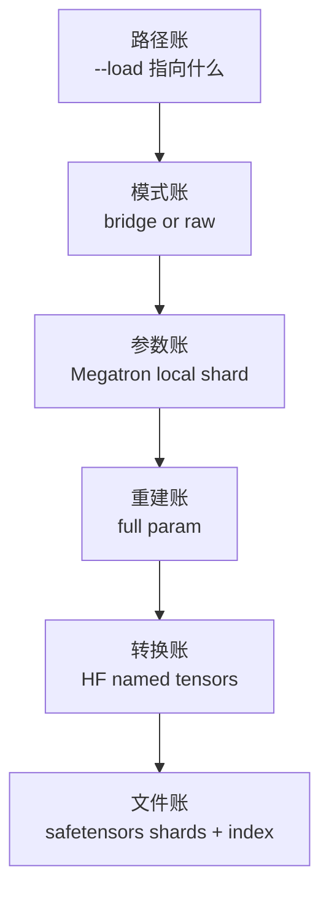

# Megatron到HF转换 · 核心概念

本篇先建立模型：Checkpoint M2HF 不是单个转换函数，而是 Slime 在训练侧维护的“双格式海关”。它要识别进来的路径是不是 Megatron checkpoint，也要把训练中的 Megatron shard 出口整理成标准 HF safetensors 目录。

## 先建立模型



读这个专题时始终抓三本账：

| 账本 | 问的问题 | 错了会怎样 |
|------|----------|------------|
| 路径账 | `--load` 是 Megatron checkpoint 还是 HF 目录 | 走错 loader，训练态恢复或 HF 初始化语义被混淆 |
| 转换账 | 一个 Megatron 参数应该变成哪些 HF tensor | HF 加载缺权重、shape 不匹配或 QKV 顺序错 |
| 文件账 | 多 rank 写出的 shard 如何合并成 HF index | 重复 tensor、缺 shard、旧权重混入输出目录 |

## bridge 与 raw 的能力边界

| 模式 | HF 加载 | HF 保存 | 主要依赖 | 适合场景 |
|------|---------|---------|----------|----------|
| `bridge` | 支持 | 支持 | Megatron Bridge + Slime patch | 从 HF 初始化训练，或 Bridge 已支持的模型导出 |
| `raw` | 不支持 | 支持 | `HfWeightIteratorDirect` + `megatron_to_hf` + safetensors writer | 与权重同步共用 converter，或需要 Slime 自己控制 shard 与量化 |

源码证据：`save_hf_model_to_path` 只看 `args.megatron_to_hf_mode` 做保存分派。

```python
# 来源：slime/backends/megatron_utils/hf_checkpoint_saver.py L22-L42
def save_hf_model_to_path(
    args,
    output_dir: str | Path,
    model,
    *,
    model_name: str | None = None,
    quantization_config: dict[str, Any] | None = None,
    progress_desc: str = "Save HF checkpoint",
) -> None:
    """Save a Megatron model as an HF checkpoint at a concrete directory."""
    if args.megatron_to_hf_mode == "bridge":
        save_hf_model_bridge_to_path(args, output_dir, model)
    else:
        save_hf_model_direct_to_path(
            args,
            output_dir,
            model,
            model_name=model_name,
            quantization_config=quantization_config,
            progress_desc=progress_desc,
        )
```

读者抓手：保存侧的 raw 能力很强，但加载侧不对称；HF 初始化训练只能走 bridge。

## `--load` 的路径账

`load_checkpoint` 先确认目录存在且非空，再根据 Megatron 标记分流。它不读完整权重文件，只看 tracker 文件或 `iter_0000000` 目录名。

```python
# 定位骨架（基于 `slime/backends/megatron_utils/checkpoint.py` L97-L126；省略两个 loader 的部分实参）
def load_checkpoint(ddp_model, optimizer, opt_param_scheduler, checkpointing_context, skip_load_to_model_and_opt):
    args = get_args()
    load_path = args.load

    assert Path(load_path).exists() and _is_dir_nonempty(
        load_path
    ), f"{args.load=} does not exist or is an empty directory. Did you specify the wrong folder?"

    if _is_megatron_checkpoint(load_path):
        return _load_checkpoint_megatron(
            ddp_model=ddp_model,
            optimizer=optimizer,
            opt_param_scheduler=opt_param_scheduler,
            checkpointing_context=checkpointing_context,
            skip_load_to_model_and_opt=skip_load_to_model_and_opt,
        )
    else:
        return _load_checkpoint_hf(
            ddp_model=ddp_model,
            optimizer=optimizer,
            args=args,
            load_path=load_path,
        )

def _is_megatron_checkpoint(path: str | Path) -> bool:
    return (Path(path) / "latest_checkpointed_iteration.txt").is_file() or bool(
        re.fullmatch(r"iter_\d{7}", Path(path).name)
    )
```

不变量：HF 目录不要命名成 `iter_0000001` 这类 Megatron 迭代目录；Megatron 根目录要保留 `latest_checkpointed_iteration.txt`。

这是一个“便宜的名称分类器”，不是 checkpoint 内容鉴定器。因此它有三个边界：

- 非空 HF 目录如果 basename 恰好是 `iter_` 加 7 位数字，会被当成 Megatron checkpoint。
- `_is_dir_nonempty` 直接调用 `os.scandir`；`--load` 若是普通文件，或目录无权访问，会在路径扫描处抛异常，而不是统一落入断言文案。
- 直接指向 Megatron `iter_XXXXXXX` 子目录可以命中；指向根目录则依赖 tracker 文件。

## HF 加载只是权重初始化

HF 目录没有 Megatron optimizer、scheduler、RNG 和 iteration 状态，所以 `_load_checkpoint_hf` 返回 iteration 0。半精度训练下，如果 optimizer 已存在，还要刷新 master params。

```python
# 定位骨架（基于 `slime/backends/megatron_utils/checkpoint.py` L129-L152；省略 upstream 注释）
def _load_checkpoint_hf(ddp_model, optimizer, args, load_path: str):
    assert args.megatron_to_hf_mode == "bridge", "Only bridge mode is supported for loading HF checkpoint"
    from megatron.bridge import AutoBridge

    import slime_plugins.megatron_bridge  # noqa: F401

    logger.info(f"Load checkpoint from HuggingFace model into Megatron (path={load_path})")

    with megatron_bridge_utils.patch_megatron_model(ddp_model):
        bridge = megatron_bridge_utils.patch_auto_bridge_hf_config(
            AutoBridge.from_hf_pretrained(load_path, trust_remote_code=True)
        )
        bridge.load_hf_weights(ddp_model)

    if (args.fp16 or args.bf16) and optimizer is not None:
        assert not args.load_main_params_from_ckpt
        optimizer.reload_model_params()

    iteration = 0
    num_floating_point_operations_so_far = 0
    return iteration, num_floating_point_operations_so_far
```

读者抓手：如果你想恢复训练进度，用 Megatron checkpoint；如果你只想从 HF 权重点火，用 bridge 模式加载 HF 目录。

还要看到函数签名之间的不对称：统一入口收到了 `opt_param_scheduler`、`checkpointing_context` 和 `skip_load_to_model_and_opt`，HF 分支却只传递 model、optimizer、args 和 path。这意味着 HF 分支不尊重 `skip_load_to_model_and_opt`，也不恢复 scheduler 或 checkpoint context。`optimizer.reload_model_params()` 只是在 fp16/bf16 且 optimizer 已存在时，把已灌入的模型参数同步到 optimizer 主参数；它不等于恢复 optimizer state。

`AutoBridge.from_hf_pretrained(..., trust_remote_code=True)` 会允许本地 HF 仓库中的自定义 Python 代码被加载。所以 `--load` 和 `--hf-checkpoint` 应当视为可信代码边界，不只是数据路径。

## raw 转换的三步

raw 模式把每个 Megatron 参数先裁掉 vocab padding，再按模型族转换命名和形状，最后做量化后处理。

```python
# 定位骨架（基于 `slime/backends/megatron_utils/megatron_to_hf/__init__.py` L25-L66；只展示路由前半段）
def convert_to_hf(args, model_name, name, param, quantization_config=None):
    param = remove_padding(name, param, args.vocab_size)

    converted_named_tensors = _convert_to_hf_core(args, model_name, name, param)

    return quantize_params(args, name, converted_named_tensors, quantization_config)

def _convert_to_hf_core(args, model_name, name, param):
    if "minimaxm2" in model_name or "minimax_m2" in model_name:
        converted_named_tensors = convert_minimax_m2_to_hf(args, name, param)
    elif "glm4moelite" in model_name or "deepseekv3" in model_name or "glmmoedsa" in model_name:
        converted_named_tensors = convert_deepseekv3_to_hf(args, name, param)
    elif "glm4moe" in model_name:
        converted_named_tensors = convert_glm4moe_to_hf(args, name, param)
    elif "glm4" in model_name:
        converted_named_tensors = convert_glm4_to_hf(args, name, param)
    elif "gpt_oss" in model_name or "gpt-oss" in model_name or "gptoss" in model_name:
        converted_named_tensors = convert_gpt_oss_to_hf(args, name, param)
    elif "qwen3moe" in model_name:
        converted_named_tensors = convert_qwen3moe_to_hf(args, name, param)
```

不变量：`model_name` 必须能命中路由；converter 必须返回唯一 HF tensor 名；`args.vocab_size` 要和目标 HF config 对齐。

## Qwen2 是典型的形状转换样例

Megatron 侧把 Q/K/V 融合成 `linear_qkv`，HF Qwen2 需要 `q_proj`、`k_proj`、`v_proj`。GQA 下 Q 的数量和 K/V 数量不同，所以 converter 先按 query group reshape，再按 `[Q, K, V]` 语义拆分。

```python
# 定位骨架（基于 `slime/backends/megatron_utils/megatron_to_hf/qwen2.py` L5-L36；截至 QKV split）
def convert_qwen2_to_hf(args, name, param):
    if name == "module.module.embedding.word_embeddings.weight":
        return [("model.embed_tokens.weight", param)]
    if name == "module.module.output_layer.weight":
        return [("lm_head.weight", param)]
    if name == "module.module.decoder.final_layernorm.weight":
        return [("model.norm.weight", param)]

    try:
        head_dim = args.kv_channels if args.kv_channels is not None else args.hidden_size // args.num_attention_heads
    except AttributeError:
        head_dim = args.hidden_size // args.num_attention_heads
    value_num_per_group = args.num_attention_heads // args.num_query_groups

    decoder_layers_pattern = r"module\.module\.decoder\.layers\.(\d+)\.(.+)"
    match = re.match(decoder_layers_pattern, name)
    if match:
        layer_idx, rest = match.groups()
        if rest == "self_attention.linear_proj.weight":
            return [(f"model.layers.{layer_idx}.self_attn.o_proj.weight", param)]
        elif rest == "self_attention.linear_qkv.weight":
            param = param.view(args.num_query_groups, -1, head_dim, args.hidden_size)
            q_param, k_param, v_param = torch.split(param, split_size_or_sections=[value_num_per_group, 1, 1], dim=1)
```

同一文件还处理 QKV bias、SwiGLU `gate/up` 拆分、norm 改名，并在未知参数名时直接失败。

```python
# 定位骨架（基于 `slime/backends/megatron_utils/megatron_to_hf/qwen2.py` L37-L71；省略后续 norm 分支）
        elif rest == "self_attention.linear_qkv.bias":
            param = param.view(args.num_query_groups, -1)
            q_bias, k_bias, v_bias = torch.split(
                param,
                split_size_or_sections=[value_num_per_group * head_dim, head_dim, head_dim],
                dim=1,
            )
            q_bias = q_bias.contiguous().flatten()
            k_bias = k_bias.contiguous().flatten()
            v_bias = v_bias.contiguous().flatten()
            return [
                (f"model.layers.{layer_idx}.self_attn.q_proj.bias", q_bias),
                (f"model.layers.{layer_idx}.self_attn.k_proj.bias", k_bias),
                (f"model.layers.{layer_idx}.self_attn.v_proj.bias", v_bias),
            ]
        elif rest == "mlp.linear_fc1.weight":
            gate_weight, up_weight = param.chunk(2, dim=0)
            return [
                (f"model.layers.{layer_idx}.mlp.gate_proj.weight", gate_weight),
                (f"model.layers.{layer_idx}.mlp.up_proj.weight", up_weight),
            ]
```

读者抓手：新增模型族时，先找 fused 参数和 HF 目标命名是否一一对应，再决定是拆分、拼接、转置还是直接改名。

## 不要被“导出成功”四个字骗了

raw saver 是直接在最终输出目录中清旧权重、复制资产、写临时 shard、逐个 `os.replace` 重命名，最后写 index。它没有“整目录 staging → 原子 rename”事务。中途失败时，最终目录可能同时存在新资产、已重命名 shard、未重命名 shard，或缺失 index。

`_copy_hf_assets` 只遍历模板目录顶层的普通文件：子目录不递归复制，目录 symlink 也不会作为文件资产处理。输出目录与模板目录只检查 resolve 后“完全相等”，没防止二者是父子目录；部署时应把模板与输出放到相互独立的目录树。

Qwen2 converter 使用整数除法计算 `num_attention_heads // num_query_groups`，没有先显式断言整除。配置错误通常会在 `view`/`split` 处以 shape 异常暴露，因此排查时应先验证 GQA 算术契约，不要只盯最后一条 PyTorch 报错。
