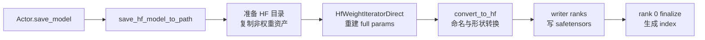

# Megatron到HF转换 · 源码走读

## 读者任务

这篇沿一条真实主线走：训练 actor 已经完成若干 rollout step，现在要把当前 Megatron 权重导出成 HuggingFace checkpoint。读完后你应该能回答三件事：

- 导出入口为什么挂在 `MegatronTrainRayActor.save_model`，而不是替代 Megatron 原生 checkpoint。
- raw 模式如何把 TP/PP/EP local 参数重建为 HF 命名 tensor。
- 多 rank 写出的临时 shard 如何收敛成标准 `model.safetensors.index.json`。

## 长文读法

这篇按“Megatron 训练态如何导出成 HF checkpoint”读：加载阶段先区分 Megatron checkpoint 和 HF bridge 点火；保存阶段仍先走 Megatron 原生 save；只有 actor 且配置了 `save_hf` 时才额外进入 HF saver；raw 模式再把 local shard 重建成 full param、转换成 HF named tensors，并由 writer ranks 分摊 safetensors 写入。

| 读者任务 | 先读 | 要抓住的判断 |
|----------|------|--------------|
| 第一次建立导出主线 | 读者任务、贯穿场景、1 到 3 | HF 导出是 Megatron 保存之外的附加路径，不替代训练恢复 checkpoint |
| 区分加载来源 | 1 | Megatron checkpoint 恢复训练状态，HF bridge 只是用 HF 权重点火模型 |
| 排查 save_hf 不生效 | 2 | 入口在 `MegatronTrainRayActor.save_model`，且只对 actor 角色额外导出 HF |
| 排查 bridge/raw | 3 | `megatron_to_hf_mode` 决定走 bridge saver 还是 raw direct saver |
| 排查 TP/PP/EP 重建 | 4 到 5 | raw iterator 先按 PP/EP 广播和 TP all-gather 重建 full param，再按模型转换规则命名 |
| 排查 shard/index | 6 | writer ranks 写临时 shard，rank 0 finalize 成标准 `model.safetensors.index.json` |
| 理解与 disk sync 关系 | 7 | full disk 权重同步复用同一个 HF saver，只是输出目录和后续 reload 目的不同 |

读的时候把“训练恢复格式”和“对外导出格式”分清。M2HF 关心的是对外 HF 目录，不是 Megatron optimizer/rng 状态。

## 贯穿场景



## 1. 加载入口先把训练恢复和 HF 初始化分开

虽然本文主线是导出，但保存前必须知道模型是如何进入 Megatron 的。`initialize_model_and_optimizer` 先构造 DDP model、optimizer、scheduler，然后才调用统一 `load_checkpoint`。这保证 Megatron checkpoint 能恢复 optimizer 状态，HF 目录也有现成 model 承接 bridge 灌权重。

```python
# 定位骨架（基于 `slime/backends/megatron_utils/model.py` L968-L1007；只展示函数签名与前置分支）
def initialize_model_and_optimizer(
    args: Namespace, role: str = "actor"
) -> tuple[list[DDP], MegatronOptimizer, OptimizerParamScheduler, int]:
    """Initialize model(s), optimizer, scheduler, and load from checkpoint.

    Args:
        args (Namespace): Runtime arguments.
        role (str): Logical role of the model (e.g., "actor", "critic").

    Returns:
        tuple[list[DDP], MegatronOptimizer, OptimizerParamScheduler, int]:
            DDP-wrapped model chunks, optimizer, scheduler, and iteration index.
    """

    if torch.version.hip:
        import megatron.core.dist_checkpointing.strategies.filesystem_async as filesystem_async_module
```

关键分支在 `checkpoint.py`。目录存在且非空后，Megatron checkpoint 走 upstream loader；非 Megatron 目录走 HF bridge loader。

```python
# 定位骨架（基于 `slime/backends/megatron_utils/checkpoint.py` L97-L120；省略 loader 实参尾部）
def load_checkpoint(ddp_model, optimizer, opt_param_scheduler, checkpointing_context, skip_load_to_model_and_opt):
    # ref: how megatron `load_checkpoint` gets directory
    args = get_args()
    load_path = args.load

    assert Path(load_path).exists() and _is_dir_nonempty(
        load_path
    ), f"{args.load=} does not exist or is an empty directory. Did you specify the wrong folder?"

    if _is_megatron_checkpoint(load_path):
        return _load_checkpoint_megatron(
            ddp_model=ddp_model,
            optimizer=optimizer,
            opt_param_scheduler=opt_param_scheduler,
            checkpointing_context=checkpointing_context,
            skip_load_to_model_and_opt=skip_load_to_model_and_opt,
        )
```

HF 加载只支持 bridge 模式，加载后返回 iteration 0。这里的语义是“用 HF 权重点火训练”，不是“恢复一次训练运行”。

```python
# 定位骨架（基于 `slime/backends/megatron_utils/checkpoint.py` L129-L152；只展示 bridge 灌权重入口）
def _load_checkpoint_hf(ddp_model, optimizer, args, load_path: str):
    assert args.megatron_to_hf_mode == "bridge", "Only bridge mode is supported for loading HF checkpoint"
    from megatron.bridge import AutoBridge

    import slime_plugins.megatron_bridge  # noqa: F401

    logger.info(f"Load checkpoint from HuggingFace model into Megatron (path={load_path})")

    with megatron_bridge_utils.patch_megatron_model(ddp_model):
        bridge = megatron_bridge_utils.patch_auto_bridge_hf_config(
            AutoBridge.from_hf_pretrained(load_path, trust_remote_code=True)
        )
        bridge.load_hf_weights(ddp_model)
```

读者抓手：`--load` 是模型进入训练态的入口；`--save-hf` 是训练中额外导出的产物，两者不要混在一起理解。

## 2. actor 保存时先保 Megatron checkpoint，再额外导出 HF

`save_model` 的顺序很清楚：offload 训练时先唤醒模型，必要时等待 async save，随后调用 Megatron `save`，最后只有 actor role 且配置了 `--save-hf` 时才导出 HF。

```python
# 定位骨架（基于 `slime/backends/megatron_utils/actor.py` L558-L578；省略最后的 offload 处理）
def save_model(self, rollout_id: int, force_sync: bool = False) -> None:
    if self.args.debug_rollout_only:
        return

    # torch dist may trigger nccl communication during saving.
    if self.args.offload_train:
        self.wake_up()

    if self.args.async_save:
        from megatron.training.async_utils import maybe_finalize_async_save

        maybe_finalize_async_save(blocking=True)

    save(rollout_id, self.model, self.optimizer, self.opt_param_scheduler)

    if force_sync and self.args.async_save:
        maybe_finalize_async_save(blocking=True)

    if self.args.save_hf is not None and self.role == "actor":
        save_hf_model_to_path(self.args, Path(self.args.save_hf.format(rollout_id=rollout_id)), self.model)
```

不变量：HF 导出失败会让这次 actor save 失败；它不是后台 best-effort 任务。`--save-hf` 必须能用 `rollout_id` 格式化成具体输出目录。

这里还有两个容易被“顺序很清楚”掩盖的失败语义：

- Megatron `save` 已成功后，HF saver 仍可失败；此时训练恢复产物和对外 HF 产物处于不同成功状态。
- offload 训练的 `wake_up()` 与 `sleep()` 之间没有 `try/finally`。Megatron save、async finalize 或 HF save 任一抛错，都可能跳过尾部 sleep。

这个顺序可由下面的连续原文直接证明：

```python
# 来源：slime/backends/megatron_utils/actor.py L571-L580
        save(rollout_id, self.model, self.optimizer, self.opt_param_scheduler)

        if force_sync and self.args.async_save:
            maybe_finalize_async_save(blocking=True)

        if self.args.save_hf is not None and self.role == "actor":
            save_hf_model_to_path(self.args, Path(self.args.save_hf.format(rollout_id=rollout_id)), self.model)

        if self.args.offload_train:
            self.sleep()
```

## 3. saver 用一个开关分成 bridge 和 raw

保存分派只由 `args.megatron_to_hf_mode` 决定。bridge 把事情交给 Megatron Bridge；raw 进入 Slime 自己的目录准备、参数迭代、converter、writer。

bridge 路径也直接对最终 `path` 调用 `save_hf_pretrained`，没有在 Slime 这一层提供 staging/原子发布。`patch_megatron_model` 是 context manager，会在 `finally` 中删除它临时添加的 `share_embeddings_and_output_weights`；但 `patch_auto_bridge_hf_config` 对 HF config 补入的 `rope_theta` 是对 config 对象的原地修改，没有对称恢复。Bridge 的模型支持范围也由 Megatron Bridge 及 Slime plugin 决定，不能因为分支存在就推导“所有 HF 模型都支持”。

```python
# 定位骨架（基于 `slime/backends/megatron_utils/hf_checkpoint_saver.py` L22-L42；省略 raw 调用尾部）
def save_hf_model_to_path(
    args,
    output_dir: str | Path,
    model,
    *,
    model_name: str | None = None,
    quantization_config: dict[str, Any] | None = None,
    progress_desc: str = "Save HF checkpoint",
) -> None:
    """Save a Megatron model as an HF checkpoint at a concrete directory."""
    if args.megatron_to_hf_mode == "bridge":
        save_hf_model_bridge_to_path(args, output_dir, model)
    else:
        save_hf_model_direct_to_path(
            args,
            output_dir,
            model,
```

raw 保存先保护输入模板目录：输出目录不能等于 `--hf-checkpoint`，且 `--hf-checkpoint` 必须是本地目录，因为 raw 需要复制 config/tokenizer 资产。

```python
# 定位骨架（基于 `slime/backends/megatron_utils/hf_checkpoint_saver.py` L45-L88；截至 metadata 分支）
def save_hf_model_direct_to_path(
    args,
    output_dir: str | Path,
    model,
    *,
    model_name: str | None = None,
    quantization_config: dict[str, Any] | None = None,
    progress_desc: str = "Save HF checkpoint",
) -> None:
    """Save a Megatron model as an HF safetensors checkpoint without Megatron Bridge."""
    path = Path(output_dir)
    hf_checkpoint = Path(args.hf_checkpoint).resolve()
    save_path = path.resolve()
    if hf_checkpoint == save_path:
        raise ValueError("HF save output path must not point to the same directory as --hf-checkpoint")
    if not hf_checkpoint.is_dir():
        raise ValueError(
            f"--hf-checkpoint must be a local directory when saving raw HuggingFace weights: {args.hf_checkpoint}"
        )
```

rank 0 负责创建输出目录、清理旧 HF 权重、复制非权重资产。model name 和量化配置随后广播给所有 rank，保证 converter 看到同一事实。

注意“准备目录”已在改动最终目录：它不先写一个隔离 staging 目录。`_clear_existing_hf_weights` 只删顶层普通权重文件，`_copy_hf_assets` 只复制模板顶层普通非权重文件。中途异常不会自动恢复被删的旧权重。

```python
# 定位骨架（基于 `slime/backends/megatron_utils/hf_checkpoint_saver.py` L90-L120；只展示广播后的 iterator 创建）
    if dist.is_available() and dist.is_initialized():
        dist.broadcast_object_list(payload, src=0)
    model_name, quantization_config = payload[0]

    hf_weight_iterator = HfWeightIteratorDirect(
        args=args,
        model=model,
        model_name=model_name,
        quantization_config=quantization_config,
    )
    megatron_local_weights = dict(named_params_and_buffers(args, model, convert_to_global_name=True))
    num_save_nodes, save_node_rank, is_writer_rank, writer_ranks = _get_node_save_layout(args)
```

## 4. raw iterator 把 Megatron local shard 重建成 full param

`HfWeightIteratorDirect` 的输出不是单个参数，而是一批 HF named tensors。每个 bucket 先重建 full Megatron params，再调用 converter。

```python
# 定位骨架（基于 `slime/backends/megatron_utils/update_weight/hf_weight_iterator_direct.py` L19-L41；省略转换方法尾部）
class HfWeightIteratorDirect(HfWeightIteratorBase):
    def __init__(self, *args, **kwargs):
        super().__init__(*args, **kwargs)
        self.megatron_local_param_info_buckets = _get_megatron_local_param_info_buckets(self.args, self.model)

    def get_hf_weight_chunks(self, megatron_local_weights, progress_desc: str = "Update weights"):
        rank = dist.get_rank()

        for megatron_local_param_infos in tqdm(
            self.megatron_local_param_info_buckets, disable=rank != 0, desc=progress_desc
        ):
            megatron_full_params = _get_megatron_full_params(megatron_local_param_infos, megatron_local_weights)
            hf_named_tensors = self._convert_to_hf_named_tensors(megatron_full_params, megatron_local_param_infos)
            yield hf_named_tensors
            del megatron_full_params
```

重建 full param 的关键是三段通信：source rank 放入本地参数，PP/EP group 内广播，最后按 TP attrs all-gather。

```python
# 定位骨架（基于 `slime/backends/megatron_utils/update_weight/hf_weight_iterator_direct.py` L44-L105；只展示参数初始化）
def _get_megatron_full_params(
    megatron_local_param_infos: Sequence[ParamInfo],
    megatron_local_weights,
) -> Sequence[torch.Tensor]:
    monkey_patch_torch_reductions()
    pp_size = mpu.get_pipeline_model_parallel_world_size()
    ep_size = mpu.get_expert_model_parallel_world_size()
    rank = dist.get_rank()
    # init params:
    params = []
    for info in megatron_local_param_infos:
        if dist.get_rank() == info.src_rank:
            params.append(
                torch.nn.Parameter(
                    megatron_local_weights[info.name].to(device=torch.cuda.current_device(), non_blocking=True),
                    requires_grad=False,
                )
            )
        else:
            params.append(torch.empty(info.shape, dtype=info.dtype, device=torch.cuda.current_device()))
```

参数 metadata 先在 PP/EP 维度交换，再按名字排序，并通过 gloo group 校验每个 rank 的 name、shape、dtype 一致。

```python
# 定位骨架（基于 `slime/backends/megatron_utils/update_weight/hf_weight_iterator_direct.py` L138-L211；只展示 metadata 构造入口）
def _get_megatron_local_param_infos(args: Namespace, model: Sequence[torch.nn.Module]) -> list[ParamInfo]:
    """
    Build global param metadata: collect -> exchange PP/EP -> resolve duplicates (MTP virtual PP)
    by min src_rank -> validate. Returns sorted ParamInfo identical across all ranks.
    """
    pp_size = mpu.get_pipeline_model_parallel_world_size()
    ep_size = mpu.get_expert_model_parallel_world_size()

    param_infos = {}
    rank = dist.get_rank()
    for name, param in named_params_and_buffers(args, model):
        param_infos[name] = ParamInfo(
            name=name,
            dtype=param.dtype,
            shape=param.shape,
```

不变量：所有 rank 必须以相同顺序遍历相同 `ParamInfo` 列表，否则 collective 或写 shard 会错位。

当前一致性校验逐项比较 name、shape 和 dtype，没有比较 `attrs`、`size` 或 `src_rank`；并且直接用 `infos[i]`，某 rank 的列表更短时可能以 `IndexError` 而非定制断言失败。PP 重名参数通过更小 global `src_rank` 决胜，主要服务 MTP/VPP 类重复；这不是“任意重名参数都可安全去重”。

bucket 也只是软阈值：单参数超过 `update_weight_buffer_size` 时仍会被放入一个超限 bucket。后续 `all_gather_params_async` 只断言 `partition_dim is not None`，没有像同步 helper 那样验证 `partition_stride` 只能是 1，或为 `linear_fc1` 允许的 2。遇到非标准 stride 时，不能假设异步路径与同步路径保持完全同等防护。

## 5. converter 把 full Megatron 参数变成 HF named tensors

iterator 调用 `convert_to_hf`，这里完成通用 padding 裁剪、模型路由和量化后处理。

```python
# 定位骨架（基于 `slime/backends/megatron_utils/megatron_to_hf/__init__.py` L25-L95；只展示转换入口和路由前半段）
def convert_to_hf(args, model_name, name, param, quantization_config=None):
    param = remove_padding(name, param, args.vocab_size)

    converted_named_tensors = _convert_to_hf_core(args, model_name, name, param)

    return quantize_params(args, name, converted_named_tensors, quantization_config)

def _convert_to_hf_core(args, model_name, name, param):
    if "minimaxm2" in model_name or "minimax_m2" in model_name:
        converted_named_tensors = convert_minimax_m2_to_hf(args, name, param)
    elif "glm4moelite" in model_name or "deepseekv3" in model_name or "glmmoedsa" in model_name:
        converted_named_tensors = convert_deepseekv3_to_hf(args, name, param)
```

Qwen2 展示了最容易出错的形状转换：fused QKV 不能直接三等分，而要按 query group 和 head dim 解释。

```python
# 定位骨架（基于 `slime/backends/megatron_utils/megatron_to_hf/qwen2.py` L5-L71；只展示 QKV 准备段）
def convert_qwen2_to_hf(args, name, param):
    if name == "module.module.embedding.word_embeddings.weight":
        return [("model.embed_tokens.weight", param)]
    if name == "module.module.output_layer.weight":
        return [("lm_head.weight", param)]
    if name == "module.module.decoder.final_layernorm.weight":
        return [("model.norm.weight", param)]

    try:
        head_dim = args.kv_channels if args.kv_channels is not None else args.hidden_size // args.num_attention_heads
    except AttributeError:
        head_dim = args.hidden_size // args.num_attention_heads
    value_num_per_group = args.num_attention_heads // args.num_query_groups
```

不变量：converter 未覆盖的新参数会触发 `ValueError`，这是正确的失败方式；生成一个缺权重的 HF 目录比显式失败更危险。

路由是有顺序的子串匹配，更具体的模型名必须放在更宽泛的子串之前，否则会被 shadow。`remove_padding` 在模型 converter 之前使用 Megatron 原名，`quantize_params` 也同时收到 Megatron 原名和已转换的 HF named tensors；排查量化后处理时要分清两套名称空间。

Qwen2 路径没有显式检查 `num_attention_heads % num_query_groups == 0`。错误配置会在 reshape/split 阶段间接爆出；应在进 converter 前先验证 head_dim、group 整除和 fused QKV 总元素数。

## 6. writer ranks 分摊 shard 写入，rank 0 统一 finalize

raw saver 不让所有 rank 写同一文件。它按 node 选择 writer rank，遍历 chunk 时用 `chunk_idx % num_save_nodes` 做轮转。

```python
# 定位骨架（基于 `slime/backends/megatron_utils/hf_checkpoint_saver.py` L122-L138；省略非 writer 分支一行）
    writer = _SafetensorShardWriter(path, enabled=is_writer_rank)
    pending_write = None

    for chunk_idx, hf_named_tensors in enumerate(
        hf_weight_iterator.get_hf_weight_chunks(megatron_local_weights, progress_desc=progress_desc)
    ):
        if is_writer_rank and chunk_idx % num_save_nodes == save_node_rank:
            pending_write = (chunk_idx, hf_named_tensors)
            hf_named_tensors = None
        else:
            del hf_named_tensors

        if (chunk_idx + 1) % num_save_nodes == 0:
            pending_write = _write_pending_chunk(writer, pending_write)
```

writer 在写入前检查重复 HF tensor 名和重复 shard 文件名，并把 tensor 转成 safetensors 可写的 CPU contiguous tensor。

```python
# 定位骨架（基于 `slime/backends/megatron_utils/hf_checkpoint_saver.py` L175-L240；只展示 writer 入口）
class _SafetensorShardWriter:
    def __init__(self, path: Path, *, enabled: bool) -> None:
        self.path = path
        self.enabled = enabled
        self.total_size = 0
        self.weight_map: dict[str, str] = {}
        self.shard_files: list[str] = []

    def write(self, named_tensors, shard_idx: int) -> None:
        if not self.enabled:
            return
        assert shard_idx is not None, "shard_idx must be set when writing HF shards"

        from safetensors.torch import save_file
```

所有 writer state 通过 `all_gather_object` 汇总，rank 0 排序临时 shard，重命名成 HF 常见格式，并写 index。

writer rank 不是通过真实节点身份发现的。`_get_node_save_layout` 假设 global rank 按节点连续排列，以 `node * gpus_per_node` 选 writer，并用 `rank // gpus_per_node` 得到 `save_node_rank`。多节点验收必须检查这个拓扑前提。

```python
# 定位骨架（基于 `slime/backends/megatron_utils/hf_checkpoint_saver.py` L255-L320；只展示收集与 barrier）
def _finalize_distributed_shards(path: Path, local_state: dict[str, Any]) -> None:
    import torch.distributed as dist

    if dist.is_available() and dist.is_initialized():
        states = [None] * dist.get_world_size()
        dist.all_gather_object(states, local_state)
    else:
        states = [local_state]

    if _is_global_rank_zero():
        _finalize_shard_files(path, states)

    if dist.is_available() and dist.is_initialized():
        dist.barrier()
```

输出目录的非权重资产来自 `--hf-checkpoint`，旧权重文件会被跳过或删除，避免 stale 权重混入新 index。

但 finalize 不是事务：它先逐个 `os.replace`，再直接写 `model.safetensors.index.json`。任一步失败都可留下部分 rename 的目录。index 中 `metadata.total_size` 是 tensor 逻辑字节数，不包含 safetensors header 等文件开销。

```python
# 定位骨架（基于 `slime/backends/megatron_utils/hf_checkpoint_saver.py` L323-L352；只展示 tensor 归一化与清理入口）
def _tensor_for_safetensors(tensor: torch.Tensor) -> torch.Tensor:
    tensor = tensor.detach()
    if not tensor.is_contiguous():
        tensor = tensor.contiguous()
    if tensor.device.type != "cpu":
        tensor = tensor.cpu()
    return tensor


def _clear_existing_hf_weights(path: Path) -> None:
    for item in path.iterdir():
        if item.is_file() and _is_hf_weight_file(item):
            item.unlink()
```

## 7. disk 权重同步复用同一个 HF saver

`UpdateWeightFromDisk` 不是另写一套格式转换。它生成版本目录后调用 `save_hf_model_to_path`，再让 rollout engine 从该目录 reload。

```python
# 定位骨架（基于 `slime/backends/megatron_utils/update_weight/update_weight_from_disk.py` L16-L91；只展示类声明与构造入口）
from ..hf_checkpoint_saver import save_hf_model_to_path

logger = logging.getLogger(__name__)


class UpdateWeightFromDisk:
    """Full-weight sync through a shared filesystem and SGLang disk reload."""

    def __init__(
        self,
        args: Namespace,
        model: Sequence[torch.nn.Module],
        weights_getter: Callable[[], Mapping[str, torch.Tensor]],
        *,
        model_name: str,
        quantization_config: dict[str, int | str | list[str]] | None,
    ) -> None:
        self.args = args
```

读者抓手：改 raw converter 会同时影响 `--save-hf`、full disk sync，以及 [[Slime-分布式权重同步]] 中共享的 HF tensor 流。

## 运行验证

最小验证是 raw saver 的单测：

```powershell
python -m pytest tests/utils/test_hf_checkpoint_saver.py
python -m pytest tests/utils/test_megatron_bridge_utils.py
```

预期现象：

- 资产复制测试保留 `config.json` 和 tokenizer 文件，跳过旧权重。
- 覆盖保护测试拒绝输出目录等于 `--hf-checkpoint`。
- shard writer 测试生成 `model-00001-of-xxxxx.safetensors` 和 `model.safetensors.index.json`。
- pending chunk 测试覆盖 chunk 数不能整除 writer node 数的场景。
- Bridge helper 测试覆盖 `rope_parameters`/`rope_scaling`、嵌套 `text_config`、wrapper config 与不覆盖已有 `rope_theta`。

覆盖边界：两个测试文件都不覆盖真实 multi-node collective、模型 converter 数值或完整 `from_pretrained` 加载。

源码入口：`tests/utils/test_hf_checkpoint_saver.py` L21-L133，`tests/utils/test_megatron_bridge_utils.py` L8-L64。
