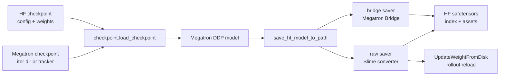

# Megatron到HF转换

本专题回答一个实际问题：训练侧 Megatron 权重如何在 Slime 中进入、离开，并变成 HuggingFace 目录供 SGLang、磁盘同步或外部工具消费。读完后，读者应该能判断 `--load`、`--hf-checkpoint`、`--save-hf`、`--megatron-to-hf-mode` 各自控制哪条路径，并能定位导出失败时该看 loader、converter 还是 shard writer。

## 读者任务

| 读者处境 | 先读 | 读完能做什么 |
|----------|------|--------------|
| 第一次理解权重同步闭环 | [[Slime-Megatron到HF转换-核心概念]] | 区分 HF 加载、Megatron 恢复、HF 导出三种动作 |
| 想追一次导出路径 | [[Slime-Megatron到HF转换-源码走读]] | 从 `Actor.save_model` 追到 safetensors index |
| 正在排查导出或加载失败 | [[Slime-Megatron到HF转换-排障指南]] | 按症状找到 `checkpoint.py`、converter 或 writer |
| 准备改模型转换 | [[Slime-Megatron到HF转换-数据流]] | 明确 `ParamInfo -> full param -> HF named tensor` 的生命周期 |
| 做验收 | [[Slime-Megatron到HF转换-学习检查]] | 跑测试和审计，确认没有断链或旧结构残留 |

## 两条方向

| 方向 | 入口 | 能力边界 | 主要源码 |
|------|------|----------|----------|
| 加载到 Megatron | `checkpoint.load_checkpoint` | Megatron checkpoint 可恢复训练态；HF 目录只通过 bridge 初始化权重 | `checkpoint.py`、`model.py` |
| 从 Megatron 导出 HF | `save_hf_model_to_path` | bridge 依赖 Megatron Bridge；raw 依赖 Slime converter 和分布式 writer | `hf_checkpoint_saver.py`、`megatron_to_hf/`、`hf_weight_iterator_direct.py` |

## 一页边界图

| 看似的承诺 | 源码真正保证 | 运行时还要验证 |
|----------------|------------------|--------------------|
| `--load` 自动识别格式 | tracker 文件或 `iter_`+7 位数 basename 的名称判定 | HF 目录不误命名，Megatron 根目录 tracker 完整 |
| buffer 控制峰值 | 新参数加入前的软阈值换 bucket | 最大单参数不会独自超限导致 OOM |
| 多节点分摊写盘 | 用 world size 和 GPUs-per-node 算术推导 writer ranks | global rank 按节点连续排列，共享目录真对所有 writer 可见 |
| HF 目录发布 | 重复名检查、逐 shard rename、index 生成 | 无整目录原子性；异常后要检查半成品 |
| Bridge 加载配置 | `trust_remote_code=True` 加载并 patch 部分 config | HF 目录必须可信，Bridge 对该模型族真正支持 |

## 源码范围

| 文件 | 负责什么 |
|------|----------|
| `slime/backends/megatron_utils/checkpoint.py` | 判断 `--load` 是 Megatron checkpoint 还是 HF 目录，并分派加载 |
| `slime/backends/megatron_utils/model.py` | 在模型与 optimizer 构造完成后调用统一 checkpoint loader |
| `slime/backends/megatron_utils/actor.py` | 在 actor 保存时额外触发 `--save-hf` 导出，也复用 loader 加载 ref/teacher |
| `slime/backends/megatron_utils/hf_checkpoint_saver.py` | bridge/raw 保存分派、目录准备、资产复制、safetensors shard 写入和 index 生成 |
| `slime/backends/megatron_utils/update_weight/hf_weight_iterator_direct.py` | 从 TP/PP/EP local 参数重建 full param，并转成 HF tensor chunk |
| `slime/backends/megatron_utils/megatron_to_hf/` | 模型族转换表，负责命名、形状、padding 和量化后处理 |
| `slime/utils/megatron_bridge_utils.py` | 为 Bridge 补 HF rope config，并用 context manager 临时补 Megatron model config |
| `tests/utils/test_hf_checkpoint_saver.py` | raw saver 的资产复制、拒绝覆盖、shard finalize 与 pending flush 测试 |
| `tests/utils/test_megatron_bridge_utils.py` | Bridge config patch 的嵌套 config、rope fallback 和不覆盖已有字段测试 |

## 阅读顺序

1. [[Slime-Megatron到HF转换-核心概念]]：先建立 bridge/raw、加载/保存、三本账的心理模型。
2. [[Slime-Megatron到HF转换-源码走读]]：沿一次 actor 导出 HF checkpoint 的主线读关键分支。
3. [[Slime-Megatron到HF转换-数据流]]：看参数、chunk、shard、index 如何跨 rank 和磁盘流动。
4. [[Slime-Megatron到HF转换-排障指南]]：用症状表排查模式选错、converter 缺失、QKV shape 错、writer 冲突。
5. [[Slime-Megatron到HF转换-学习检查]]：按命令和审计做专题验收。

## 前后衔接

- 上游：[[Slime-分布式权重同步]] 解释在线 NCCL 权重同步，raw 模式共享 HF tensor 迭代器和 converter。
- 上游：[[Slime-磁盘权重同步]] 解释磁盘版本目录，full disk sync 内部调用本专题的 HF saver。
- 下游：[[Slime-Agent轨迹]] 进入高级特性，权重格式不再是主线，但 checkpoint 产物仍是调试入口。
