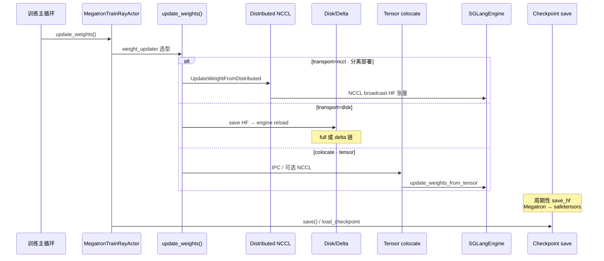

# 权重同步

> **你只需阅读本目录，不必打开 `slime/` 源码。**
> 内嵌代码对应 slime Git commit `22cdc6e1`。
> SGLang 交叉对照：[[SGLang-ModelLoader]]、[[SGLang-CheckpointEngine]]、[[Slime-SGLang-Engine]]。

---

## 本目录解决什么问题

训练后端部分讲清了 Megatron 如何完成一次 train step。本目录回答：**训练后的 actor 权重如何推送到 SGLang Rollout 引擎，nccl / disk / delta / tensor（colocate）四条路径各适用什么场景？**

三个专题覆盖权重同步与 checkpoint 全链路：

| 模块 | 角色 | 一句话 |
|------|------|--------|
| [[Slime-分布式权重同步]] | NCCL 广播 | `UpdateWeightFromDistributed`、PP source → engine GPU |
| [[Slime-磁盘权重同步]] | 磁盘 / tensor | full disk、delta disk、colocate IPC tensor |
| [[Slime-Megatron到HF转换]] | 存取与转换 | `load_checkpoint`、`save_hf`、Megatron→HF 管线 |

---

## 端到端时序

这张图用于检查是否能对比 nccl / disk / delta / tensor 四种权重同步路径的数据流。

这张图的读法是：`update_weights` 在 **每个 train step 末尾**（或 `update_weights_interval` 间隔）执行；transport 由 `--update-weight-transport` 与 colocate 状态共同决定，再与 [[Slime-磁盘权重同步]] 的 delta/tensor 模式组合出具体同步路径。

---

## 零基础一句话

**像「总部给分店换菜单」：** 分布式同步是实时对讲机（NCCL 直传），磁盘 full/delta 是快递包，tensor 路径是同机闪送（colocate IPC），Megatron 到 HF 转换负责存档和格式翻译。

---

## 推荐阅读顺序

建议先读分布式权重同步，再比较磁盘 full/delta 与 tensor colocate，最后理解 Megatron 到 HF 转换。时间紧时至少分清 NCCL 与磁盘路径的同步边界。

| 顺序 | 文档 | 必读理由 |
|------|------|----------|
| 1 | [[Slime-分布式权重同步-核心概念]] | NCCL 组命名、PP source rank |
| 2 | [[Slime-分布式权重同步-源码走读]] | `UpdateWeightFromDistributed` 主路径 |
| 3 | [[Slime-磁盘权重同步-核心概念]] | full / delta / tensor 模式矩阵 |
| 4 | [[Slime-磁盘权重同步-排障指南]] | delta 链与 colocate 分工 |
| 5 | [[Slime-Megatron到HF转换-源码走读]] | `save_hf` 与 megatron_to_hf 管线 |

---

## 阶段衔接

| 方向 | 模块 | 衔接点 |
|------|------|--------|
| ← 训练后端 | [[Slime-训练步骤]] | train 完成 → `update_weights` |
| → 高级特性 | [[Slime-Agent轨迹]] · [[Slime-自定义扩展]] | Agent/customization 不改变同步主路径 |
| → Rollout | [[Slime-SGLang-Engine]] | engine `init_weights_update_group` / reload |
| → 启动工具 | [[Slime-数据准备工具]] | HF ↔ torch_dist 与 `--load` / `--ref-load` |
| → SGLang 对照 | [[SGLang-CheckpointEngine]] | SGLang 侧 checkpoint 热更新 |

---

## 验证建议（零基础可试）

1. **transport 矩阵：** 对照 [[Slime-磁盘权重同步-核心概念]]，列出 colocate + nccl vs 分离 + disk 的组合。
2. **delta 约束：** 确认 `--update-weight-mode=delta` 必须 `--update-weight-transport=disk` 的原因（见 [[Slime-磁盘权重同步-排障指南]]）。
3. **save 路径：** 追踪 [[Slime-Megatron到HF转换-数据流]] 中 `--save-hf` 产出目录结构与 SGLang `--model-path` 的对应关系。

---

## 模块导航

| 目录 | 状态 |
| ------ | ------ |
| [[Slime-分布式权重同步|WeightSync-Dist]] | ✅ |
| [[Slime-磁盘权重同步|WeightSync-Disk]] | ✅ |
| [[Slime-Megatron到HF转换|Checkpoint-M2HF]] | ✅ |

← [[Slime-训练后端]] · → [[Slime-高级特性]]
