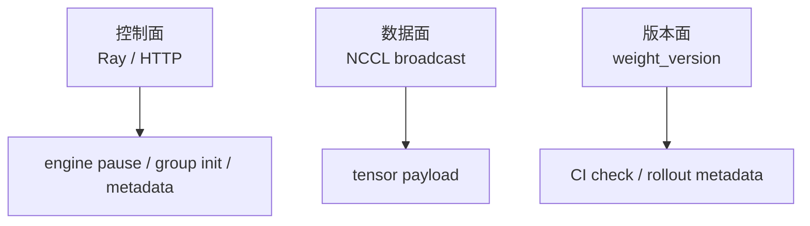
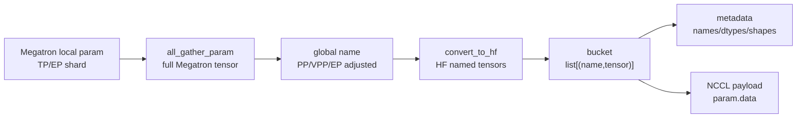
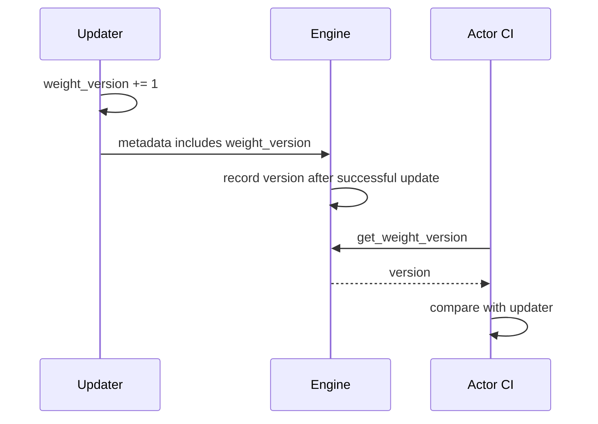

# 分布式权重同步 · 数据流

## 你为什么要读

本页沿一次分布式权重同步读控制面、数据面和版本面。读完后，你应该能判断一个 update hang 是 Ray/HTTP/lock 问题、NCCL broadcast 问题，还是 `weight_version` 没对齐导致的 rollout 混权重问题。

## 三条线同时发生

NCCL 权重同步有三条线，排障时要分开看：



| 线 | 承载内容 | 典型失败 |
|----|----------|----------|
| 控制面 | engine 列表、lock、metadata、pause/continue | HTTP 超时、lock 卡住、metadata 顺序错 |
| 数据面 | HF tensor payload | NCCL group 不一致、rank 数不匹配、broadcast hang |
| 版本面 | updater 和 engine 的 `weight_version` | 某个 engine 没完成更新，下一轮 rollout 混旧权重 |

## engine 拓扑从 RolloutManager 来

训练 actor 不直接维护 rollout engine 拓扑。RolloutManager 只返回可更新 server 的 node-0 engines、GPU count、GPU offset、完整 engine actors 和共享 lock。

源码入口：来源：slime/ray/rollout.py L511-L540

```python
# 定位骨架（基于 slime/ray/rollout.py L511-L540；拼接 server 选择与返回字段）
def _get_updatable_server(self) -> Any | None:
    """Return the server with ``update_weights=True``.

    When multiple updatable servers exist, returns the first one
    (multi-model weight update is not yet supported).
    """
    for srv in self.servers.values():
        if srv.update_weights:
            return srv
    return None

def get_updatable_engines_and_lock(self):
    """Return engines eligible for weight updates.

    Returns engines from the first model that has
    ``update_weights=True``.  Frozen models (reference, reward,
    etc.) are automatically excluded.
    """
    srv = self._get_updatable_server()
    engines = srv.engines if srv else []
    gpu_counts = srv.engine_gpu_counts if srv else []
    gpu_offsets = srv.engine_gpu_offsets if srv else []
    num_new = srv.num_new_engines if srv else 0
    all_engine_actors = srv.all_engines if srv else []
    return engines, self.rollout_engine_lock, num_new, gpu_counts, gpu_offsets, all_engine_actors
```

不变量：

- 冻结模型不应进入 actor 权重同步。
- `num_new_engines > 0` 表示 fault tolerance 后有新 engine，需要重新 connect。
- `rollout_engine_lock` 是所有 PP source 共用的顺序锁。

## NCCL group 的 rank 布局

每个 PP source 建一个 `slime-pp_{pp_rank}` group。训练侧永远是 group rank 0；engine GPU 从 rank 1 开始。

源码入口：来源：slime/backends/megatron_utils/update_weight/update_weight_from_distributed.py L268-L314

```python
# 定位骨架（基于 slime/backends/megatron_utils/update_weight/update_weight_from_distributed.py L281-L314；省略默认 GPU count 与注释）
if engine_gpu_counts is None:
    engine_gpu_counts = [args.rollout_num_gpus_per_engine] * len(rollout_engines)

master_address = ray._private.services.get_node_ip_address()
with socket.socket() as sock:
    sock.bind(("", 0))
    master_port = sock.getsockname()[1]
world_size = sum(engine_gpu_counts) + 1  # +1 for training rank 0

cumulative = [0]
for c in engine_gpu_counts:
    cumulative.append(cumulative[-1] + c)

refs = [
    engine.init_weights_update_group.remote(
        master_address=master_address,
        master_port=master_port,
        rank_offset=cumulative[i] + 1,
        world_size=world_size,
        group_name=group_name,
        backend="nccl",
    )
    for i, engine in enumerate(rollout_engines)
]
model_update_groups = init_process_group(
    backend="nccl",
    init_method=f"tcp://{_wrap_ipv6(master_address)}:{master_port}",
    world_size=world_size,
    rank=0,
    group_name=group_name,
)
ray.get(refs)
return model_update_groups
```

ASCII 示例：

```text
group slime-pp_0
rank 0    Megatron PP0 source
rank 1-2  Engine A GPUs
rank 3-6  Engine B GPUs
world_size = 7
```

`engine_gpu_counts` 错时，控制面看起来已经 init，但数据面会在 broadcast/recv 对不上时卡住。

`engine_gpu_offsets` 与 `all_engine_actors` 虽由 actor 一并传入 updater，但 distributed updater 当前没有消费这两个参数；本路径的 group rank layout 实际只由 node-0 engine 列表和 `engine_gpu_counts` 决定。

## 权重张量的形态变化



源码入口：来源：slime/backends/megatron_utils/update_weight/common.py L15-L50

源码入口：来源：slime/backends/megatron_utils/update_weight/common.py L160-L219

源码入口：来源：slime/backends/megatron_utils/update_weight/update_weight_from_distributed.py L153-L176

字段含义：

| 形态 | 谁持有 | 用途 |
|------|--------|------|
| local param | 每个 Megatron rank | 训练后的本地分片 |
| full Megatron tensor | collective 后各参与 rank | 还原 TP 分片 |
| HF named tensor | PP source | SGLang runtime loader 能识别 |
| bucket | PP source | 限制单次 broadcast 峰值 |
| metadata | engine HTTP handler | 分配 recv buffer |
| payload | NCCL group | 实际权重字节 |

这里的 bucket “限制”是软阈值：单个 HF conversion chunk 超过 buffer size 时不会再拆分，实际 bucket 仍可越过配置值。

## 非 expert 和 expert 的数据流不同

非 expert：

```text
named_params_and_buffers
→ skip .experts.
→ all_gather_param(TP)
→ convert_to_hf
→ bucket by update_weight_buffer_size
```

Expert：

```text
named_params_and_buffers(.experts.)
→ all_gather_param(expert TP)
→ batch until buffer_size × EP_size threshold
→ EP all_gather names + tensors
→ convert_to_hf
→ one HF chunk
```

源码入口：来源：slime/backends/megatron_utils/update_weight/update_weight_from_distributed.py L178-L238

```python
# 来源：slime/backends/megatron_utils/update_weight/update_weight_from_distributed.py L209-L238
names = [name for name, _ in named_tensors]
all_names = [None] * mpu.get_expert_model_parallel_world_size()
dist.all_gather_object(all_names, names, group=mpu.get_expert_model_parallel_group())

for names in all_names:
    assert len(named_tensors) == len(names), f"mismatch names length: {len(named_tensors)} != {len(names)}"

all_gathered_params = [[] for _ in range(mpu.get_expert_model_parallel_world_size())]
handles = []
for i, (_name, param) in enumerate(named_tensors):
    params = [
        torch.empty_like(param.data, device=torch.cuda.current_device())
        for _ in range(mpu.get_expert_model_parallel_world_size())
    ]
    handle = dist.all_gather(params, param.data, group=mpu.get_expert_model_parallel_group(), async_op=True)
    handles.append(handle)
    for ep_rank, names in enumerate(all_names):
        all_gathered_params[ep_rank].append((names[i], params[ep_rank]))
for handle in handles:
    handle.wait()

named_tensors.clear()
if not self._is_pp_src_rank:
    return []

all_gathered_params = sum(all_gathered_params, [])
converted_hf_tensors = []
for name, param in all_gathered_params:
    converted_hf_tensors += convert_to_hf(self.args, self.model_name, name, param, self.quantization_config)
return converted_hf_tensors
```

排障抓手：MoE hang 不能只看 TP group；还要看 EP group 的 names 对齐和 `expert_model_parallel_world_size`。

## bucket 的发送顺序

每个 bucket 的顺序是固定的：

1. 获取 `rollout_engine_lock`。
2. 通过 Ray 让每个 engine 进入 `update_weights_from_distributed`。
3. 在训练 rank 0 上对 bucket 内每个 tensor 做 NCCL broadcast。
4. 等 engine Ray refs 返回。
5. 清空 bucket，释放 lock，更新 progress。

源码入口：来源：slime/backends/megatron_utils/update_weight/update_weight_from_distributed.py L240-L265

源码入口：来源：slime/backends/megatron_utils/update_weight/update_weight_from_distributed.py L326-L355

```python
# 来源：slime/backends/megatron_utils/update_weight/update_weight_from_distributed.py L337-L353
refs = [
    engine.update_weights_from_distributed.remote(
        names=[name for name, _ in converted_named_tensors],
        dtypes=[param.dtype for _, param in converted_named_tensors],
        shapes=[param.shape for _, param in converted_named_tensors],
        group_name=group_name,
        weight_version=str(weight_version),
        load_format=load_format,
    )
    for engine in rollout_engines
]

handles = []
for _, param in converted_named_tensors:
    handles.append(dist.broadcast(param.data, 0, group=group, async_op=True))
for handle in handles:
    handle.wait()
```

关键不变量：metadata 对应的 `names/dtypes/shapes` 顺序必须和后续 broadcast tensor 顺序一致。

## engine 控制面接口

Slime 的 `SGLangEngine` 是 Ray actor 包装层，它把 Python 调用变成 SGLang HTTP 请求。

源码入口：来源：slime/backends/sglang_utils/sglang_engine.py L439-L488

源码入口：来源：slime/backends/sglang_utils/sglang_engine.py L490-L517

| 方法 | 作用 |
|------|------|
| `init_weights_update_group` | 让 engine GPU 加入 NCCL group |
| `destroy_weights_update_group` | 销毁 engine 侧 group |
| `update_weights_from_distributed` | 发送 metadata，请 engine recv NCCL payload |
| `pause_generation` | 暂停 generation |
| `continue_generation` | 恢复 generation |
| `post_process_weights` | compressed-tensors 加载前后处理 |

这里的 HTTP payload 没有 tensor 字节。实际权重只走 NCCL。

## offload 与 process group 生命周期

`offload_train` 会让 train actor 的 process groups 被销毁或重载。PPO + critic 场景尤其特殊：actor sleep 时会 disconnect rollout engines 并 destroy process groups；下一次 update 前必须 wake 并 reconnect。

源码入口：来源：slime/backends/megatron_utils/actor.py L190-L220

源码入口：来源：slime/backends/megatron_utils/actor.py L601-L652

```python
# 定位骨架（基于 slime/backends/megatron_utils/actor.py L601-L652；省略日志、CI 与备份队列）
reconnect_rollout_engines = self.args.offload_train and self.args.use_critic and not self.args.colocate

if reconnect_rollout_engines:
    self.wake_up()
elif self.args.offload_train:
    reload_process_groups()

if num_new_engines > 0 or reconnect_rollout_engines:
    self.weight_updater.connect_rollout_engines(
        rollout_engines,
        rollout_engine_lock,
        engine_gpu_counts=engine_gpu_counts,
        engine_gpu_offsets=engine_gpu_offsets,
        all_engine_actors=all_engine_actors,
    )
...
if reconnect_rollout_engines:
    self.sleep()
elif self.args.offload_train:
    destroy_process_groups()
```

排障抓手：offload 下 NCCL group 失效，通常不是 bucket 逻辑错，而是 group 生命周期没重新连接。

## 版本流

`weight_version` 的数据流：



源码入口：来源：slime/backends/megatron_utils/update_weight/update_weight_from_distributed.py L102-L134

源码入口：来源：slime/backends/megatron_utils/actor.py L625-L636

如果版本流对不上，说明控制面已经返回但至少一个 engine 版本没有进入预期状态。

版本流不是两阶段提交：版本先递增，随后才 pause 和发送；失败不回滚。CI 又只随机抽一个 engine，因此“抽查通过”是弱验收，生产诊断仍需枚举全部 engine 版本。

## 数据流检查

- 可更新 engine 列表来自 update_weights=True 的 server。
- 每个 PP source 有独立 `group_name`。
- `world_size == 1 + sum(engine_gpu_counts)`。
- 每个 bucket 的 metadata 顺序与 NCCL broadcast 顺序一致。
- lock 覆盖 metadata、broadcast 和 engine refs 等待全过程。
- compressed-tensors 有 pre/post `post_process_weights`。
- CI 模式下 `engine.get_weight_version()` 等于 updater 版本。
- 锁释放、generation continue、量化 post-process 与 process-group 清理均无统一 finally；异常后必须逐项检查。
- reconnect 会在保存旧 engine 列表前覆盖 `self.rollout_engines`，替换拓扑下旧 group 的销毁对象需要额外核实。

---

## 运行验证

维护本文时，先用下面的命令确认分布式推权的数据流仍在：

```powershell
rg -n "update_weights_from_distributed|connect_rollout_engines|bucket|weight_version|post_process_weights|destroy_process_groups|reload_process_groups" slime/slime/backends/megatron_utils/update_weight slime/slime/backends/sglang_utils/sglang_engine.py slime/slime/backends/megatron_utils/actor.py slime/slime/ray/rollout.py
```

预期信号：

- `update_weight_from_distributed.py` 仍承载连接 rollout engines、bucket 化、NCCL broadcast 和 version 推进。
- `sglang_engine.py` 仍承载 engine 侧 HTTP 控制面，包括 distributed update 与 `post_process_weights`。
- `actor.py` 仍能看到 offload 下 process group reload / destroy 和 CI version 检查。
- `rollout.py` 仍能支撑 engine 拓扑来源。

如果 NCCL 推权逻辑迁移到 tensor 或 disk updater 的共享层，应先更新本文三条线的分工，再更新权重同步总览。
