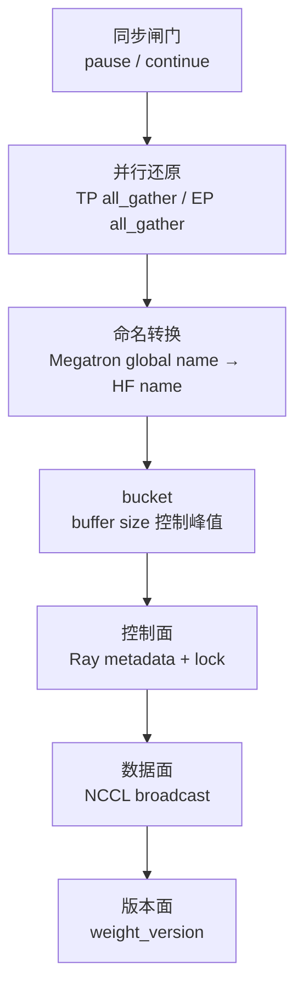

# 分布式权重同步 · 核心概念

## 先建立模型

NCCL 权重同步不是“把一个 checkpoint 发给 SGLang”。它更像一个带闸门的流水线：

1. 关闸：暂停 generation，flush cache，避免请求跨越半更新权重。
2. 拼权重：TP/EP rank 参与 gather，把 Megatron shard 拼成完整 tensor。
3. 改名字：把 Megatron global name 转成 HF/SGLang 能加载的名字。
4. 分桶：按 `update_weight_buffer_size` 切成 bucket。
5. 双通道发送：Ray 先发 metadata，NCCL 再 broadcast tensor。
6. 开闸：engine 更新 `weight_version` 后继续 generation。



## 四条同步路径的分界

Slime 在 actor 初始化时选择 weight updater。本专题只读 `UpdateWeightFromDistributed`。

源码入口：来源：slime/backends/megatron_utils/actor.py L139-L168

```python
# 定位骨架（基于 slime/backends/megatron_utils/actor.py L139-L168；省略 updater 构造参数）
if self.args.colocate:
    assert (
        self.args.update_weight_mode == "full"
    ), "--update-weight-mode=delta is not supported with --colocate"
    update_weight_cls = UpdateWeightFromTensor
elif self.args.update_weight_mode == "delta":
    assert (
        self.args.update_weight_transport == "disk"
    ), "--update-weight-mode=delta requires --update-weight-transport=disk"
    from .update_weight.update_weight_from_disk_delta import UpdateWeightFromDiskDelta

    update_weight_cls = UpdateWeightFromDiskDelta
else:
    assert self.args.update_weight_mode == "full"
    if self.args.update_weight_transport == "disk":
        update_weight_cls = UpdateWeightFromDisk
    else:
        assert (
            self.args.update_weight_mode == "full" and self.args.update_weight_transport == "nccl"
        ), f"unsupported weight sync mode/transport: {self.args.update_weight_mode!r}/{self.args.update_weight_transport!r}"
        update_weight_cls = UpdateWeightFromDistributed
```

读者抓手：

- `colocate` 走 tensor IPC，不走本专题 NCCL group。
- `delta` 只能 disk，因为需要本地 checkpoint、diff 和 reload。
- `disk` full sync 写共享目录，engine 从磁盘 reload。
- `full + nccl + non-colocate` 才进入 `UpdateWeightFromDistributed`。

## PP source rank：谁负责发权重

流水线并行下，每个 PP stage 只持有一部分层。该 stage 内只有 `DP-with-CP rank = 0` 且 `TP rank = 0` 的 rank 是 source，负责创建 `slime-pp_{pp_rank}` group 并向 rollout engines broadcast。开启 CP 时，这个条件也把 source 收缩到 combined DP×CP group 的 rank 0，不应只写成普通 DP rank。

源码入口：来源：slime/backends/megatron_utils/update_weight/update_weight_from_distributed.py L57-L92

```python
# 来源：slime/backends/megatron_utils/update_weight/update_weight_from_distributed.py L72-L92
# For TP:
#   1. AllGather parameters to rank 0
#   2. Broadcast parameters from rank 0 to all sglang engines
self._is_pp_src_rank = (
    mpu.get_data_parallel_rank(with_context_parallel=True) == 0 and mpu.get_tensor_model_parallel_rank() == 0
)
pp_rank = mpu.get_pipeline_model_parallel_rank()
if self._is_pp_src_rank:
    self._group_name = f"slime-pp_{pp_rank}"

if self._is_pp_src_rank:
    if self._model_update_groups is not None:
        disconnect_rollout_engines_from_distributed(
            self.args, self._group_name, self._model_update_groups, self.rollout_engines
        )
    self._model_update_groups = connect_rollout_engines_from_distributed(
        self.args,
        self._group_name,
        rollout_engines,
        engine_gpu_counts=engine_gpu_counts,
    )
```

非 source rank 不发 Ray metadata、不发 NCCL broadcast，但仍参与 `all_gather_param` 或 EP gather。否则 source rank 拼不出完整权重。

## 张量如何从 Megatron 形态变成 HF 形态

这一步有三层：

| 层 | 函数 | 作用 |
|----|------|------|
| shard 还原 | `all_gather_param` | 把 TP shard 拼成完整 Megatron tensor |
| global name | `named_params_and_buffers` | 把 PP/VPP/EP 局部名字变成全局一致名字 |
| HF 转换 | `convert_to_hf` | 把 Megatron tensor 拆成 SGLang/HF 能加载的命名 tensor |

源码入口：来源：slime/backends/megatron_utils/update_weight/common.py L15-L50

```python
# 定位骨架（基于 slime/backends/megatron_utils/update_weight/common.py L15-L50；省略 stride 断言与形态修正）
def all_gather_param(name: str, param: torch.nn.Parameter) -> torch.Tensor:
    if "expert_bias" in name:
        return param

    assert hasattr(param, "tensor_model_parallel"), f"{name} does not have tensor_model_parallel attribute"
    if not param.tensor_model_parallel or getattr(param, "parallel_mode", None) == "duplicated":
        return param.data

    if ".experts." in name:
        tp_size = mpu.get_expert_tensor_parallel_world_size()
        tp_group = mpu.get_expert_tensor_parallel_group()
    else:
        tp_size = mpu.get_tensor_model_parallel_world_size()
        tp_group = mpu.get_tensor_model_parallel_group()

    param_partitions = [torch.empty_like(param.data) for _ in range(tp_size)]
    dist.all_gather(param_partitions, param.data, group=tp_group)
    partition_dim = param.partition_dim
    ...
    param = torch.cat(param_partitions, dim=partition_dim)
    return param
```

源码入口：来源：slime/backends/megatron_utils/update_weight/common.py L160-L219

`all_gather_param` 还处理两个容易漏的形态修正：

- `linear_fc1` 的 GLU 分片需要重新 chunk。
- MoE `linear_fc2.weight` 的 `partition_dim` 有特殊修正。

## 为什么 expert 权重要单独一趟

MoE expert 权重不只是 TP shard，还涉及 EP rank 上不同 expert 的集合。Slime 因此先同步非 expert，再同步 expert，中间插入 Gloo barrier。

源码入口：来源：slime/backends/megatron_utils/update_weight/update_weight_from_distributed.py L136-L146

```python
# 来源：slime/backends/megatron_utils/update_weight/update_weight_from_distributed.py L136-L146
def _send_weights(self, pbar: tqdm | None) -> None:
    """
    Non-expert (TP) pass → barrier → expert (EP) pass → barrier. Each iterator
    yields broadcast-ready chunks (bucketing happens internally); subclasses
    override ``_on_chunk`` to inject per-chunk behaviour.
    """
    for chunk_iter in (self._iter_non_expert_chunks(), self._iter_expert_chunks()):
        for hf_chunk in chunk_iter:
            self._on_chunk(hf_chunk)
            self._update_bucket_weights_from_distributed(hf_chunk, pbar=pbar)
        dist.barrier(group=get_gloo_group())
```

源码入口：来源：slime/backends/megatron_utils/update_weight/update_weight_from_distributed.py L178-L238

Expert chunk 的 buffer 判断会乘上 EP world size，这是 MoE 模型调 `update_weight_buffer_size` 时最容易忽略的点。

`update_weight_buffer_size` 只是 flush 阈值，不是严格峰值上限：非 expert 路径若单个 `convert_to_hf` 结果本身超过阈值，仍会作为一个超大 bucket 发送；expert 路径也会先把至少一个参数放入 batch，再在后续 flush。调参时必须同时看最大单参数或转换 chunk。

## 双通道传输：Ray 负责形状，NCCL 负责字节

训练侧不会把 tensor 序列化进 HTTP 请求。每个 bucket 先通过 Ray RPC 告诉 engine：有哪些名字、dtype、shape、group_name、weight_version；然后训练 source rank 在同一个 NCCL group 上 broadcast tensor payload。

源码入口：来源：slime/backends/megatron_utils/update_weight/update_weight_from_distributed.py L326-L355

```python
# 来源：slime/backends/megatron_utils/update_weight/update_weight_from_distributed.py L337-L355
refs = [
    engine.update_weights_from_distributed.remote(
        names=[name for name, _ in converted_named_tensors],
        dtypes=[param.dtype for _, param in converted_named_tensors],
        shapes=[param.shape for _, param in converted_named_tensors],
        group_name=group_name,
        weight_version=str(weight_version),
        load_format=load_format,
    )
    for engine in rollout_engines
]

handles = []
for _, param in converted_named_tensors:
    handles.append(dist.broadcast(param.data, 0, group=group, async_op=True))
for handle in handles:
    handle.wait()

return refs
```

源码入口：来源：slime/backends/sglang_utils/sglang_engine.py L464-L488

这个顺序很关键：engine 先拿到 metadata，才能按同一个 `group_name` 接收对应形状的 tensor。

## `rollout_engine_lock` 是顺序闸，不是性能优化

多个 PP source 可能同时准备好 bucket。如果它们同时调用 engine 的 distributed update，engine recv 顺序就可能和训练侧 broadcast 顺序不一致，结果是 NCCL hang。

源码入口：来源：slime/backends/megatron_utils/update_weight/update_weight_from_distributed.py L240-L265

```python
# 来源：slime/backends/megatron_utils/update_weight/update_weight_from_distributed.py L246-L265
"""
Lock → broadcast → clear → unlock → pbar++. Lock prevents NCCL deadlock.
"""
# lock the rollout engines to prevent dead lock on broadcast.
while not ray.get(self.rollout_engine_lock.acquire.remote()):
    time.sleep(0.1)

refs = update_weights_from_distributed(
    self._group_name,
    self._model_update_groups,
    self.weight_version,
    self.rollout_engines,
    converted_named_tensors,
    load_format=load_format,
)

ray.get(refs)
converted_named_tensors.clear()
ray.get(self.rollout_engine_lock.release.remote())
pbar.update(1)
```

当前 acquire→update→release 没有 `try/finally`，轮询也没有 timeout。metadata RPC、broadcast 或 `ray.get(refs)` 任一异常都可能让锁永久占用，后续 PP source 只会持续轮询。

## `weight_version` 是闭环验收信号

`UpdateWeightFromDistributed.update_weights()` 每次递增 `weight_version`，发送 metadata 时传给 engine。CI 模式下 actor 会随机抽一个 engine 校验版本一致。

源码入口：来源：slime/backends/megatron_utils/update_weight/update_weight_from_distributed.py L102-L134

源码入口：来源：slime/backends/megatron_utils/actor.py L625-L636

如果版本不一致，说明至少有一个 engine 没完成这轮更新，下一轮 rollout 可能混用旧权重。

反过来，抽查一致也不能证明全部 engine 一致：CI 只随机选择一个 engine。并且 updater 在 pause/发送之前就递增 `weight_version`；失败不会回退版本，因此它是尝试版本/诊断标记，不是原子 commit id。

## 重连不是无状态替换

`connect_rollout_engines` 先把 `self.rollout_engines` 更新为新列表，再在旧 process group 存在时调用 disconnect。若 fault tolerance 真正替换了 engine actor，销毁 RPC 会发给新列表，旧 actor 上同名 group 可能残留。当前实现更适合“原列表扩展或仍可访问”的情形；替换拓扑需要显式验证旧组清理。

## HfWeightIteratorDirect 与本专题的关系

`HfWeightIteratorDirect` 不是 `UpdateWeightFromDistributed` 的调用链一环。它服务 checkpoint 保存等场景，但共享 `named_params_and_buffers`、`convert_to_hf`、bucket size 和 TP gather 思路。读它可以帮助理解分桶与跨 PP/EP 补齐，但不要把它画进 NCCL 主线。

源码入口：来源：slime/backends/megatron_utils/update_weight/hf_weight_iterator_base.py L4-L15

源码入口：来源：slime/backends/megatron_utils/update_weight/hf_weight_iterator_direct.py L108-L135
