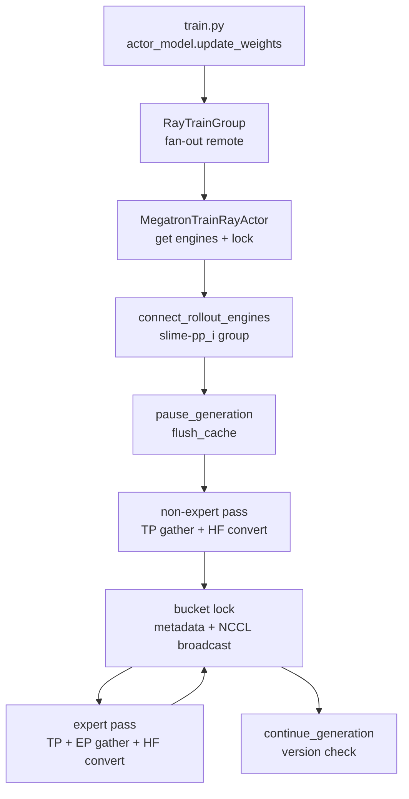

# 分布式权重同步 · 源码走读

## 读者任务

这篇追一轮真实的 `update_weights`：actor 已经完成训练，主循环如何暂停 rollout engine，训练侧如何把 Megatron shard 拼成 HF 张量，如何通过 Ray + NCCL 送到 SGLang，最后如何确认下一轮 rollout 能看到新权重。

读完后应能定位：

- 主循环到底何时推权重，为什么初始化后也要推一次。
- `UpdateWeightFromDistributed` 何时被选中，哪些配置会走其他路径。
- PP source rank 如何建 `slime-pp_{pp_rank}` NCCL group。
- 每个 bucket 为什么必须先发 metadata，再 broadcast tensor。
- `rollout_engine_lock`、`weight_version`、offload reconnect 各自防什么问题。

## 长文读法

这篇按“Megatron shard 如何在线变成 SGLang 可加载的 HF 张量”读：训练主循环初始化后和每轮训练后都会推权重；actor init 已经选好 distributed updater；更新时先拿 updatable engines 和 lock，PP source rank 建 `slime-pp_i` NCCL group，非 expert 和 expert 各自 gather/convert，再按 bucket 先发 metadata、后走 NCCL broadcast。

| 读者任务 | 先读 | 要抓住的判断 |
|----------|------|--------------|
| 第一次建立 NCCL 同步主线 | 读者任务、主线地图、1 到 3 | 初始化后也要推一次权重，后续每轮训练后再推最新 actor |
| 排查 updater 选路 | 2 | colocate、delta disk、full disk 会走其他 updater；本篇只讲 full + nccl |
| 排查 engine 连接 | 3 到 4 | 只有 PP source rank 建 `slime-pp_{pp_rank}` group，engine GPU 数决定 NCCL world size |
| 排查发送内容 | 5 到 7 | 非 expert 走 TP gather；expert 还要 EP gather；最后都转换成 HF 名称与张量 |
| 排查 bucket 卡死 | 8 | 每个 bucket 先通过 Ray 发 names/dtypes/shapes，再用 NCCL broadcast tensor，lock 防止并发 broadcast |
| 排查 offload 或版本不一致 | 9 到 10 | offload reconnect、`weight_version` 和 CI 抽查分别覆盖连接恢复、版本标记和端到端一致性 |

读的时候把“训练侧 gather/convert”和“SGLang 侧加载”分开。训练侧负责把 Megatron shard 还原成 HF 张量，engine 侧只按 metadata 和 NCCL group 接收。

## 主线地图



## 1. 主循环在训练前后都可能推权重

系统压力：SGLang rollout engine 启动后需要先拿到 actor 初始权重；每轮训练后也要拿到最新 actor 权重，否则下一轮 rollout 是旧策略采样。

设计选择：`train.py` 创建 actor/critic 后先 `actor_model.update_weights()`；每轮 train 后再 onload rollout weights、调用 update、恢复 KV。

源码入口：来源：train.py L18-L32

```python
# 来源：train.py L18-L32
# create the actor and critic models
actor_model, critic_model = create_training_models(args, pgs, rollout_manager)

if args.offload_rollout:
    ray.get(rollout_manager.onload_weights.remote())

# Always push actor weights to rollout once weights are loaded.
actor_model.update_weights()

if args.check_weight_update_equal:
    ray.get(rollout_manager.check_weights.remote(action="compare"))

if args.offload_rollout:
    ray.get(rollout_manager.onload_kv.remote())
```

源码入口：来源：train.py L83-L92

```python
# 来源：train.py L83-L92
if should_run_periodic_action(rollout_id, args.save_interval, num_rollout_per_epoch, args.num_rollout):
    save(rollout_id)

offload_train(actor_trains_this_step)
if args.offload_rollout:
    ray.get(rollout_manager.onload_weights.remote())
actor_model.update_weights()

if args.offload_rollout:
    ray.get(rollout_manager.onload_kv.remote())
```

不变量：rollout engine 的 KV 和 generation 状态不应跨过半更新权重；所以 offload rollout 时先恢复 weights，update 完再恢复 KV。

## 2. RayTrainGroup 只是把 update 发给每个 train actor

系统压力：Megatron actor 是一组 Ray actors，主进程不能只更新 rank 0；所有训练 rank 都要进入同一套 barrier、TP/EP gather 和 process group 生命周期。

设计选择：`RayTrainGroup.update_weights` 对所有 handlers 调 `actor.update_weights.remote()` 并等待。

源码入口：来源：slime/ray/actor_group.py L155-L157

```python
# 来源：slime/ray/actor_group.py L155-L157
def update_weights(self):
    """Broadcast weights from rank 0 to all other ranks."""
    return ray.get([actor.update_weights.remote() for actor in self._actor_handlers])
```

这里的注释“rank 0”是 group 语境；真正哪些 rank 向 SGLang 发 payload，要到 `UpdateWeightFromDistributed` 的 PP source 判断里看。

## 3. actor 初始化时选择 distributed updater

系统压力：Slime 同时支持 colocate、disk、delta 和 NCCL。如果读错路径，后面所有 lock、NCCL group、bucket 的解释都会错。

设计选择：actor 初始化按 `colocate/update_weight_mode/update_weight_transport` 选择 updater。本专题只进入 `UpdateWeightFromDistributed`。

源码入口：来源：slime/backends/megatron_utils/actor.py L139-L168

```python
# 来源：slime/backends/megatron_utils/actor.py L153-L168
else:
    assert self.args.update_weight_mode == "full"
    if self.args.update_weight_transport == "disk":
        update_weight_cls = UpdateWeightFromDisk
    else:
        assert (
            self.args.update_weight_mode == "full" and self.args.update_weight_transport == "nccl"
        ), f"unsupported weight sync mode/transport: {self.args.update_weight_mode!r}/{self.args.update_weight_transport!r}"
        update_weight_cls = UpdateWeightFromDistributed
self.weight_updater = update_weight_cls(
    self.args,
    self.model,
    weights_getter=lambda: self.weights_backuper.get("actor"),
    model_name=type(self.hf_config).__name__.lower() if self.args.model_name is None else self.args.model_name,
    quantization_config=getattr(self.hf_config, "quantization_config", None),
)
```

读者抓手：`weights_getter` 指向 actor 备份权重，但 distributed 路径同步 live model 参数时主要走 `self.model` 和 `named_params_and_buffers`。

## 4. actor.update_weights 先拿 engine 拓扑和 lock

系统压力：SGLang 可能有多 model server、可更新 server、fault tolerance 新 engine、不同 engine GPU count。训练 actor 自己不维护这些状态。

设计选择：actor 从 RolloutManager 取 `rollout_engines`、`rollout_engine_lock`、`num_new_engines`、`engine_gpu_counts`、`engine_gpu_offsets` 和完整 engine actor 列表。

源码入口：来源：slime/backends/megatron_utils/actor.py L583-L655

```python
# 来源：slime/backends/megatron_utils/actor.py L592-L620
(
    rollout_engines,
    rollout_engine_lock,
    num_new_engines,
    engine_gpu_counts,
    engine_gpu_offsets,
    all_engine_actors,
) = ray.get(self.rollout_manager.get_updatable_engines_and_lock.remote())

reconnect_rollout_engines = self.args.offload_train and self.args.use_critic and not self.args.colocate

if not rollout_engines and not reconnect_rollout_engines:
    if dist.get_rank() == 0:
        logger.info("No updatable SGLang engines are running; skip weight update.")
    return

if reconnect_rollout_engines:
    self.wake_up()
elif self.args.offload_train:
    reload_process_groups()

if num_new_engines > 0 or reconnect_rollout_engines:
    self.weight_updater.connect_rollout_engines(
        rollout_engines,
        rollout_engine_lock,
        engine_gpu_counts=engine_gpu_counts,
        engine_gpu_offsets=engine_gpu_offsets,
        all_engine_actors=all_engine_actors,
    )
```

源码入口：来源：slime/ray/rollout.py L527-L540

```python
# 来源：slime/ray/rollout.py L527-L540
def get_updatable_engines_and_lock(self):
    """Return engines eligible for weight updates.

    Returns engines from the first model that has
    ``update_weights=True``.  Frozen models (reference, reward,
    etc.) are automatically excluded.
    """
    srv = self._get_updatable_server()
    engines = srv.engines if srv else []
    gpu_counts = srv.engine_gpu_counts if srv else []
    gpu_offsets = srv.engine_gpu_offsets if srv else []
    num_new = srv.num_new_engines if srv else 0
    all_engine_actors = srv.all_engines if srv else []
    return engines, self.rollout_engine_lock, num_new, gpu_counts, gpu_offsets, all_engine_actors
```

不变量：只有 update_weights=True 的 server 被同步；reference/reward/teacher 等冻结 engine 不该收到 actor 权重。

## 5. 建 NCCL group：一个 PP source 对一组 engine GPU

系统压力：每个 PP stage 只持有部分层；engine 侧要按同一个 `group_name` 加入接收组。异构 engine TP 时，每个 engine 占用的 NCCL rank 数也不同。

设计选择：PP source rank 建 `slime-pp_{pp_rank}`；训练 rank 固定是 group rank 0，engine ranks 从 1 开始按 `engine_gpu_counts` 累加。

源码入口：来源：slime/backends/megatron_utils/update_weight/update_weight_from_distributed.py L57-L92

源码入口：来源：slime/backends/megatron_utils/update_weight/update_weight_from_distributed.py L268-L314

```python
# 定位骨架（基于 slime/backends/megatron_utils/update_weight/update_weight_from_distributed.py L284-L314；省略默认 GPU count 与 rank-offset 注释）
master_address = ray._private.services.get_node_ip_address()
with socket.socket() as sock:
    sock.bind(("", 0))
    master_port = sock.getsockname()[1]
world_size = sum(engine_gpu_counts) + 1  # +1 for training rank 0

cumulative = [0]
for c in engine_gpu_counts:
    cumulative.append(cumulative[-1] + c)

refs = [
    engine.init_weights_update_group.remote(
        master_address=master_address,
        master_port=master_port,
        rank_offset=cumulative[i] + 1,
        world_size=world_size,
        group_name=group_name,
        backend="nccl",
    )
    for i, engine in enumerate(rollout_engines)
]
model_update_groups = init_process_group(
    backend="nccl",
    init_method=f"tcp://{_wrap_ipv6(master_address)}:{master_port}",
    world_size=world_size,
    rank=0,
    group_name=group_name,
)
ray.get(refs)
return model_update_groups
```

读者抓手：如果 engine 重启或 fault tolerance 创建新 engine，`num_new_engines > 0` 会触发重新 connect。

重连不是无状态替换：updater 先覆盖 `self.rollout_engines`，再在旧 process group 存在时调用 disconnect，因此 destroy RPC 面向的是新列表。若 fault tolerance 真正替换旧 actor，必须额外确认旧 group 已随 actor 退出或被显式清理。

## 6. update_weights 是 pause → send → continue

系统压力：推理请求不能在权重更新过程中继续消费旧 KV 或半更新参数；量化模型还可能需要加载前后的 post-process。

设计选择：rank 0 先 pause generation、flush cache；compressed-tensors 在发送前后各做一次 `post_process_weights`；所有 rank 用 Gloo barrier 对齐；发送完成后 continue generation。

源码入口：来源：slime/backends/megatron_utils/update_weight/update_weight_from_distributed.py L102-L134

```python
# 定位骨架（基于 slime/backends/megatron_utils/update_weight/update_weight_from_distributed.py L107-L134；省略量化参数换行）
self.weight_version += 1

if dist.get_rank() == 0:
    ray.get([engine.pause_generation.remote() for engine in self.rollout_engines])
    ray.get([engine.flush_cache.remote() for engine in self.rollout_engines])

    if self.quantization_config and self.quantization_config["quant_method"] in ["compressed-tensors"]:
        post_process_weights(
            restore_weights_before_load=True,
            post_process_quantization=False,
            rollout_engines=self.rollout_engines,
        )
dist.barrier(group=get_gloo_group())

pbar = tqdm(desc=f"[{self._group_name}] Update weights", total=0) if self._is_pp_src_rank else None
self._send_weights(pbar)

if dist.get_rank() == 0:
    if self.quantization_config and self.quantization_config["quant_method"] in ["compressed-tensors"]:
        post_process_weights(
            restore_weights_before_load=False,
            post_process_quantization=True,
            rollout_engines=self.rollout_engines,
        )
    ray.get([engine.continue_generation.remote() for engine in self.rollout_engines])
dist.barrier(group=get_gloo_group())
```

失败模式：如果 pause 成功但 continue 前异常，engine 会停在暂停状态；排查时同时看训练 actor 日志和 engine HTTP 日志。

此外 `weight_version` 在 pause 前就递增，整个方法没有 `try/finally`。失败后版本不回退，generation、量化 restore/post-process 和末尾 barrier 也不保证收尾；它是分阶段协议，不是原子切换。

## 7. 非 expert bucket：TP gather 后立即转换成 HF

系统压力：Megatron tensor 可能是 TP shard；SGLang engine 需要 HF 命名的完整 tensor。一次性转换全模型会有峰值显存和通信压力。

设计选择：遍历非 expert 参数，所有 rank 参与 `all_gather_param`；只有 PP source 把完整 tensor 交给 `convert_to_hf`，并按 `update_weight_buffer_size` yield bucket。

源码入口：来源：slime/backends/megatron_utils/update_weight/update_weight_from_distributed.py L153-L176

```python
# 定位骨架（基于 slime/backends/megatron_utils/update_weight/update_weight_from_distributed.py L153-L176；省略类型标注与尾部 flush）
def _iter_non_expert_chunks(self) -> Iterator[list[tuple[str, torch.Tensor]]]:
    buffer_size = 0
    buffer: list[tuple[str, torch.Tensor]] = []
    for name, param in named_params_and_buffers(self.args, self.model):
        if ".experts." in name:
            continue
        param = all_gather_param(name, param)
        if not self._is_pp_src_rank:
            continue
        hf_chunk = convert_to_hf(self.args, self.model_name, name, param, self.quantization_config)
        chunk_bytes = sum(t.numel() * t.element_size() for _, t in hf_chunk)
        if buffer and buffer_size + chunk_bytes > self.args.update_weight_buffer_size:
            yield buffer
            buffer = []
            buffer_size = 0
        buffer.extend(hf_chunk)
        buffer_size += chunk_bytes
    if buffer:
        yield buffer
```

源码入口：来源：slime/backends/megatron_utils/update_weight/common.py L15-L50

bucket 阈值只决定何时 flush 已有 buffer。若单个 `hf_chunk` 本身大于 `update_weight_buffer_size`，源码不会继续拆 tensor，仍会发送超限 bucket；所以配置值不能当成显存峰值硬上限。

## 8. Expert bucket：先 TP，再 EP，再转换

系统压力：MoE expert 权重分布在 EP ranks 上。只做 TP gather 只能得到本 EP rank 的 experts，不能得到完整 expert 集合。

设计选择：expert pass 先按 buffer 收集参数，超过阈值时调用 `_ep_gather_and_convert`；其中用 `all_gather_object` 对齐 names，再对每个 param 做 EP all_gather，最后 PP source 统一 `convert_to_hf`。

源码入口：来源：slime/backends/megatron_utils/update_weight/update_weight_from_distributed.py L178-L238

```python
# 来源：slime/backends/megatron_utils/update_weight/update_weight_from_distributed.py L183-L202
params = ((n, p) for n, p in named_params_and_buffers(self.args, self.model) if ".experts." in n)
buffer_size = 0
batch: list[tuple[str, torch.Tensor]] = []
for name, param in params:
    param = all_gather_param(name, param)
    param_size = param.numel() * param.element_size()
    if (
        buffer_size + param_size
    ) * mpu.get_expert_model_parallel_world_size() > self.args.update_weight_buffer_size:
        hf_chunk = self._ep_gather_and_convert(batch)
        if hf_chunk:
            yield hf_chunk
        batch = []
        buffer_size = 0
    batch.append((name, param))
    buffer_size += param_size
if batch:
    hf_chunk = self._ep_gather_and_convert(batch)
    if hf_chunk:
        yield hf_chunk
```

关键点：expert buffer 的阈值乘以 EP world size，MoE 模型更容易触碰峰值显存。

## 9. 每个 bucket 用 lock 串行发送

系统压力：多个 PP source 都可能同时进入 engine 的 update endpoint。engine 端按 metadata 顺序 recv，如果两个 PP stage 的 metadata/broadcast 交错，最坏就是 NCCL deadlock。

设计选择：每个 bucket 先拿 RolloutManager 的 Ray lock，再发 metadata、broadcast tensors、等待 Ray refs、清空 bucket、释放 lock。

源码入口：来源：slime/backends/megatron_utils/update_weight/update_weight_from_distributed.py L240-L265

```python
# 来源：slime/backends/megatron_utils/update_weight/update_weight_from_distributed.py L249-L265
# lock the rollout engines to prevent dead lock on broadcast.
while not ray.get(self.rollout_engine_lock.acquire.remote()):
    time.sleep(0.1)

refs = update_weights_from_distributed(
    self._group_name,
    self._model_update_groups,
    self.weight_version,
    self.rollout_engines,
    converted_named_tensors,
    load_format=load_format,
)

ray.get(refs)
converted_named_tensors.clear()
ray.get(self.rollout_engine_lock.release.remote())
pbar.update(1)
```

这一段没有 `try/finally` 和 acquire timeout。update RPC、NCCL handle 或 engine ref 任一失败，都可能留下永久占用的 Ray lock；`converted_named_tensors.clear()` 也只有成功路径执行。

源码入口：来源：slime/backends/megatron_utils/update_weight/update_weight_from_distributed.py L326-L355

```python
# 来源：slime/backends/megatron_utils/update_weight/update_weight_from_distributed.py L337-L355
refs = [
    engine.update_weights_from_distributed.remote(
        names=[name for name, _ in converted_named_tensors],
        dtypes=[param.dtype for _, param in converted_named_tensors],
        shapes=[param.shape for _, param in converted_named_tensors],
        group_name=group_name,
        weight_version=str(weight_version),
        load_format=load_format,
    )
    for engine in rollout_engines
]

handles = []
for _, param in converted_named_tensors:
    handles.append(dist.broadcast(param.data, 0, group=group, async_op=True))
for handle in handles:
    handle.wait()

return refs
```

## 10. Slime 的 SGLangEngine 包装层只发 metadata

系统压力：HTTP/Ray 不适合承载大权重 tensor；engine 需要先知道名字、dtype、shape 和 group_name，实际字节从 NCCL group 收。

设计选择：`SGLangEngine.update_weights_from_distributed` 构造 metadata payload，并调用 SGLang HTTP endpoint；tensor 不进 payload。

源码入口：来源：slime/backends/sglang_utils/sglang_engine.py L439-L488

```python
# 来源：slime/backends/sglang_utils/sglang_engine.py L464-L488
def update_weights_from_distributed(
    self,
    names,
    dtypes,
    shapes,
    group_name,
    flush_cache=False,
    weight_version: str | None = None,
    load_format: str | None = None,
):
    payload = {
        "names": names,
        "dtypes": [str(dtype).replace("torch.", "") for dtype in dtypes],
        "shapes": shapes,
        "group_name": group_name,
        "flush_cache": flush_cache,
    }
    if weight_version is not None:
        payload["weight_version"] = weight_version
    if load_format is not None:
        payload["load_format"] = load_format
    return self._make_request(
        "update_weights_from_distributed",
        payload,
    )
```

同文件还封装了 `init_weights_update_group`、`destroy_weights_update_group`、`pause_generation`、`continue_generation` 和 `post_process_weights`，说明 Slime 对 engine 的控制面都走 HTTP/Ray 包装。

## 11. 版本校验和 old actor 备份在 actor 侧收尾

系统压力：更新完成不代表所有 engine 真的进入同一版本；同时 keep-old-actor 路径还要维护 rollout_actor/old_actor 队列。

设计选择：CI 模式下随机抽一个 engine 比对 `weight_version`；如果开启 `keep_old_actor`，在同一个更新窗口内维护 actor 备份。

源码入口：来源：slime/backends/megatron_utils/actor.py L625-L648

```python
# 定位骨架（基于 slime/backends/megatron_utils/actor.py L625-L648；省略内存日志与 old-actor 分支细节）
with torch_memory_saver.disable() if self.args.offload_train else nullcontext():
    print_memory("before update_weights")
    self.weight_updater.update_weights()
    print_memory("after update_weights")

    if self.args.ci_test and len(rollout_engines) > 0 and self.weight_updater.weight_version > 0:
        engine = random.choice(rollout_engines)
        engine_version = ray.get(engine.get_weight_version.remote())
        if str(engine_version) != str(self.weight_updater.weight_version):
            raise RuntimeError(
                f"Weight version mismatch! Engine: {engine_version}, Updater: {self.weight_updater.weight_version}"
            )

    if getattr(self.args, "keep_old_actor", False):
        if self.args.update_weights_interval == 1:
            logger.info("updating model queue: rollout_actor -> old_actor, actor -> rollout_actor")
            self.weights_backuper.copy(src_tag="rollout_actor", dst_tag="old_actor")
            self.weights_backuper.backup("rollout_actor")
        else:
            self.weights_backuper.backup("old_actor")
```

CI 只随机抽一个 engine；抽查通过不能证明所有 engine、所有 PP stage 都完成。生产验收若要证明无混权重，应枚举全部 engine version，并结合每个 bucket 的 metadata/broadcast 完成记录。

## 运行验证

- 开启 `--ci-test`：预期每轮更新后不会触发 `Weight version mismatch`。
- 调小 `--update-weight-buffer-size`：预期 `[slime-pp_i] Update weights` bucket 数增加，同步变慢但峰值显存降低。
- 使用 MoE 模型：预期非 expert pass 后还有 expert pass；若卡在 expert pass，优先看 EP group 和 buffer 大小。
- 打开 `--offload` + PPO critic：预期 update 前 `wake_up` 和 reconnect，update 后 `sleep` 或 destroy process groups。

## 复盘迁移

- WeightSync-Dist 的核心不是“发 checkpoint”，而是“在 rollout 闭环中安全切换在线权重版本”。
- Ray metadata 和 NCCL payload 是两条通道，顺序必须一致。
- PP source rank 发权重，非 source rank 仍参与 collective。
- `rollout_engine_lock` 保护 engine recv 顺序，不是装饰性锁。
- `weight_version` 是闭环验收信号，能把训练侧和 rollout 侧连起来。
- 它不是原子 commit id：发送前递增、失败不回退、CI 只做单 engine 随机抽查。
- pause/continue、Ray lock 与旧 group 清理没有统一回滚，失败恢复必须逐项审计。
