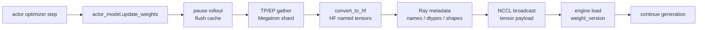
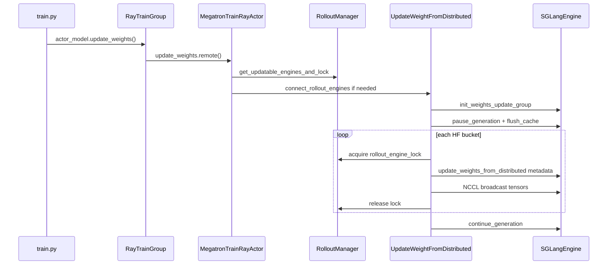

# 分布式权重同步

> **Slime 权重同步**
> **源码范围：** `train.py`、`slime/backends/megatron_utils/actor.py`、`update_weight/update_weight_from_distributed.py`、`update_weight/common.py`、`slime/ray/rollout.py`、`slime/backends/sglang_utils/sglang_engine.py`

## 读者为什么要读

Train Step 已经让 Megatron actor 完成 optimizer step。WeightSync-Dist 回答闭环最后一个问题：怎样保证下一轮 SGLang rollout 用的是新 actor 权重，而不是上一轮权重。

读完本专题，应该能排查：

- `update_weights()` 执行了，但 SGLang 仍在用旧权重。
- NCCL 权重同步 hang、broadcast 卡住或 engine recv 顺序错乱。
- PP/TP/EP 并行下，为什么只有部分 rank 负责发权重，其他 rank 仍要参与 collective。
- `update_weight_buffer_size` 太大导致 OOM，太小导致同步慢。
- offload、fault tolerance、compressed-tensors 量化让同步时序多出额外分支。
- pause、lock、group 或 version 任一阶段失败后，为什么不能把一次 RPC 返回或单 engine 抽查当成全体原子提交。

## 一句话模型

WeightSync-Dist 是 RL 闭环的 **同步闸门**：训练侧先暂停 rollout engine，按 PP stage 把 Megatron 分片权重拼成 HF 命名张量，通过 Ray 发送 metadata、通过 NCCL 发送 tensor payload，engine 接收完成并更新 `weight_version` 后才继续生成。

这是一条分阶段协议，不是事务：源码没有统一回滚 pause、Ray lock、NCCL group 与版本号。判断“更新完成”必须同时看所有 engine、所有 PP bucket 和 generation 恢复，不能只看训练侧函数返回。

## 首次阅读路径

| 文件 | 读它解决什么 |
| ------ | -------------- |
| [[Slime-分布式权重同步-核心概念]] | 建立同步闸门、PP source、双通道传输、bucket 的心理模型 |
| [[Slime-分布式权重同步-源码走读]] | 沿 `train.py → actor.update_weights → UpdateWeightFromDistributed → SGLangEngine` 走完整主线 |
| [[Slime-分布式权重同步-数据流]] | 看权重张量、metadata、NCCL group、lock 和 `weight_version` 的生命周期 |
| [[Slime-分布式权重同步-排障指南]] | 按症状定位 hang、旧权重、buffer、MoE、offload、量化问题 |
| [[Slime-分布式权重同步-学习检查]] | 用图和检查命令验收自己是否读通 |

## 本专题覆盖哪条路径

本专题只覆盖 **非 colocate + full weight + NCCL transport**：

| 组合 | updater | 本专题 |
|------|---------|--------|
| `colocate=True` | `UpdateWeightFromTensor` | 否，见 [[Slime-磁盘权重同步]] |
| `update_weight_mode=delta` | `UpdateWeightFromDiskDelta` | 否，delta 只能 disk |
| `transport=disk` | `UpdateWeightFromDisk` | 否，见 [[Slime-磁盘权重同步]] |
| `full + nccl + non-colocate` | `UpdateWeightFromDistributed` | 是 |

源码入口：来源：slime/backends/megatron_utils/actor.py L139-L168

## 主线位置

源码入口：来源：train.py L18-L32

源码入口：来源：train.py L83-L92

## 与上下游的关系

| 方向 | 模块 | 关系 |
|------|------|------|
| 上游 | [[Slime-训练步骤]] | actor optimizer step 后才需要同步权重 |
| 上游 | [[Slime-Megatron-Actor初始化]] | actor 初始化时按配置选择 weight updater |
| 上游 | [[Slime-RolloutManager]] | 提供可更新 engines、engine GPU 拓扑和 Ray lock |
| 并行 | [[Slime-Megatron到HF转换]] | 解释 Megatron 名称到 HF 名称的转换 |
| 下游 | [[Slime-SGLang-Engine]] | SGLang engine 负责 HTTP metadata 和 NCCL recv |
| 对照 | [[Slime-磁盘权重同步]] | disk、delta、colocate 等其他同步路径 |

## 验证抓手

- 日志：看 `[slime-pp_0] Update weights` 进度条和 bucket 数。
- CI：`--ci-test` 下 actor 会抽查 engine `weight_version` 是否等于 updater 版本。
- 参数：`--update-weight-transport nccl`、`--update-weight-mode full`、`--update-weight-buffer-size`。
- 运行对照：同一模型切换 disk transport，对比单轮 sync 时间和是否依赖共享目录。
