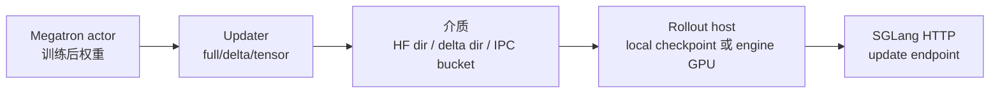
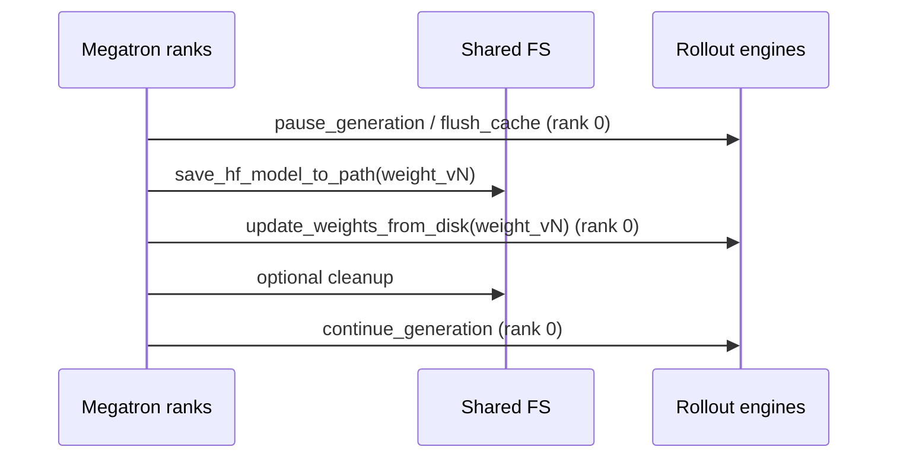
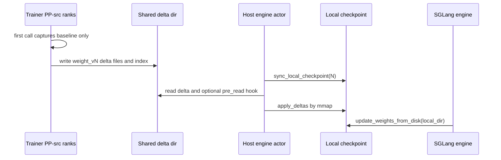

# 磁盘权重同步 · 数据流

## 读者任务

这篇回答“权重到底在哪个边界改变形态”。读完后，你应该能区分 Ray 控制面、共享文件系统数据面、host-local checkpoint 状态面和 SGLang HTTP reload 面。

## 总图：一次权重版本的四段旅程



## Full Disk：共享目录就是版本边界

full disk 的数据面是 `weight_vNNNNNN/`。所有 rank 参与 `save_hf_model_to_path`，但只有 rank 0 暂停和恢复 engine。



```python
# 来源：slime/backends/megatron_utils/update_weight/update_weight_from_disk.py L70-L97
if dist.get_rank() == 0:
    logger.info("Updating rollout weights from disk checkpoint %s", version_dir)
    ray.get([engine.pause_generation.remote() for engine in self.rollout_engines])
    ray.get([engine.flush_cache.remote() for engine in self.rollout_engines])
dist.barrier(group=get_gloo_group())

save_hf_model_to_path(
    self.args,
    version_dir,
    self.model,
    model_name=self.model_name,
    quantization_config=self.quantization_config,
    progress_desc="Save HF  weights for update from disk",
)
dist.barrier(group=get_gloo_group())

if dist.get_rank() == 0:
    refs = [
        engine.update_weights_from_disk.remote(
            model_path=str(version_dir),
            weight_version=str(self.weight_version),
        )
        for engine in self.rollout_engines
    ]
    ray.get(refs)
    if not self.args.update_weight_disk_keep_files:
        shutil.rmtree(version_dir, ignore_errors=True)
    ray.get([engine.continue_generation.remote() for engine in self.rollout_engines])
```

该目录是最终路径而非 staging rename；engine reload 被 barrier 延后到保存完成之后。若共享盘对其他 host 不具备及时 read-after-write 可见性，full disk 没有内置 hook 修复这一点。

## Delta Disk：trainer publish，host apply，engine reload

delta disk 多了一层 host-local checkpoint。Trainer 只发布 diff；每个 rollout host 先把自己的本地 HF 副本追到目标版本，再让 engine 从这个本地目录 reload。



delta updater 连接 engine 时保留两类 actor：`rollout_engines` 用于 reload，`all_engine_actors` 用于每台 host 本地 apply。

```python
# 定位骨架（基于 slime/backends/megatron_utils/update_weight/update_weight_from_disk_delta.py L60-L75；省略未消费参数）
def connect_rollout_engines(
    self,
    rollout_engines: Sequence[ActorHandle],
    rollout_engine_lock: ActorHandle,
    engine_gpu_counts: Sequence[int] | None = None,
    engine_gpu_offsets: Sequence[int] | None = None,
    all_engine_actors: Sequence[ActorHandle] | None = None,
) -> None:
    self.rollout_engines = rollout_engines
    self.all_engine_actors = list(all_engine_actors or rollout_engines)
    self._is_pp_src_rank = (
        mpu.get_data_parallel_rank(with_context_parallel=True) == 0 and mpu.get_tensor_model_parallel_rank() == 0
    )
```

reload 阶段先让 host apply，再让 engine 普通 disk reload：

```python
# 定位骨架（基于 slime/backends/megatron_utils/update_weight/update_weight_from_disk_delta.py L169-L186；省略 barrier 与列表换行）
def _reload_engines(self) -> None:
    if self._commit_hook is not None:
        self._commit_hook(self.args, self._version_dir, list(self.rollout_engines))
    dist.barrier(group=get_gloo_group())
    if dist.get_rank() == 0:
        ray.get([actor.sync_local_checkpoint.remote(self.weight_version) for actor in self.all_engine_actors])
        ray.get(
            [
                engine.update_weights_from_disk.remote(
                    model_path=self.args.update_weight_local_checkpoint_dir,
                    weight_version=str(self.weight_version),
                )
                for engine in self.rollout_engines
            ]
        )
        ray.get([engine.continue_generation.remote() for engine in self.rollout_engines])
    dist.barrier(group=get_gloo_group())
```

注意 trainer 的 `_snapshot` 已在 `_encode_delta.collect` 中前移，早于这里的 commit、host apply 与 reload。任何后续失败都会让 trainer base 与 host state 分叉；版本号和 snapshot 都不会自动回滚。

## Host-Local Apply：版本链是强不变量

`apply_deltas` 必须从当前 `.delta_sync/state.json` 的下一版开始逐个 apply。若本地版本和 delta 的 `base_version` 不一致，直接失败。

```python
# 定位骨架（基于 slime/utils/disk_delta.py L155-L164；省略 compression/encoding 校验）
def _apply_version(local_ckpt_dir: str, version_dir: str) -> None:
    with open(os.path.join(version_dir, "model.safetensors.index.json")) as f:
        meta = json.load(f)["metadata"]
    applied = _read_applied_version(local_ckpt_dir)
    if applied == meta["version"]:
        return
    if applied != meta["base_version"]:
        raise RuntimeError(f"out-of-order delta: local at {applied}, delta builds on {meta['base_version']}")
```

```python
# 来源：slime/utils/disk_delta.py L255-L264
def apply_deltas(local_ckpt_dir: str, delta_root: str, target_version: int) -> None:
    """Apply the delta chain in order to bring the local checkpoint up to target_version, in place.
    A per-tensor checksum guards every write and any mismatch raises (fail loud, never serve bad
    weights). Serialized per host by the lock (co-located actors collapse to one apply)."""
    with _apply_lock(local_ckpt_dir):
        applied = _read_applied_version(local_ckpt_dir)
        if applied is None:
            raise RuntimeError("local checkpoint not materialized")
        for version in range(int(applied) + 1, target_version + 1):
            _apply_version(local_ckpt_dir, os.path.join(delta_root, f"weight_v{version:06d}"))
```

但强校验不等于事务回滚：每版先原地写 mmap，后验 checksum，最后才更新 state。失败时 state 保持旧值，文件可能已部分变化。overwrite 可用同版重放修复；XOR 路径应重建本地 checkpoint，而不是直接重试。

## Engine 侧：delta 被隐藏在 Slime 层

SGLang engine actor 在启动时后台 materialize base；真正 reload 时 `sync_local_checkpoint` 负责 apply，`update_weights_from_disk` 只发送普通 HTTP payload。

```python
# 来源：slime/backends/sglang_utils/sglang_engine.py L175-L182
if self.args.update_weight_mode == "delta" and self.args.update_weight_transport == "disk":
    from slime.utils.disk_delta import init_local_checkpoint

    threading.Thread(
        target=init_local_checkpoint,
        args=(self.args.update_weight_local_checkpoint_dir, self.args.hf_checkpoint),
        daemon=True,
    ).start()
```

```python
# 定位骨架（基于 slime/backends/sglang_utils/sglang_engine.py L396-L437；拼接 local sync 与 HTTP reload）
def sync_local_checkpoint(self, target_version: int):
    from slime.utils.disk_delta import apply_deltas, init_local_checkpoint

    init_local_checkpoint(self.args.update_weight_local_checkpoint_dir, self.args.hf_checkpoint)
    if self.args.custom_delta_pre_read_path:
        from slime.utils.misc import load_function

        load_function(self.args.custom_delta_pre_read_path)(self.args.update_weight_disk_dir, target_version)
    apply_deltas(
        self.args.update_weight_local_checkpoint_dir,
        self.args.update_weight_disk_dir,
        target_version,
    )

def update_weights_from_disk(
    self,
    model_path: str,
    load_format: str | None = None,
    weight_version: str | None = None,
    files: list[str] | None = None,
):
    payload: dict = {"model_path": model_path}
    if load_format is not None:
        payload["load_format"] = load_format
    if weight_version is not None:
        payload["weight_version"] = weight_version
    if files is not None:
        payload["files"] = files
    return self._make_request("update_weights_from_disk", payload)
```

## Colocate Tensor：数据面换成 IPC bucket

colocate tensor 的边界是 GPU rank group，而不是文件版本。落在 actor GPU 范围内的 engine 走 IPC；超出的远端 engine 会保留 distributed 更新路径。

```python
# 来源：slime/backends/megatron_utils/update_weight/update_weight_from_tensor.py L87-L105
total_actor_gpus = self.args.actor_num_nodes * self.args.actor_num_gpus_per_node
colocate_engine_nums = 0
for gpu_offset, gpu_count in zip(engine_gpu_offsets, engine_gpu_counts, strict=True):
    if gpu_offset + gpu_count > total_actor_gpus:
        break
    colocate_engine_nums += 1

self.use_distribute = len(rollout_engines) > colocate_engine_nums

if self.use_distribute:
    self.rollout_engines = rollout_engines[:colocate_engine_nums]
    self.distributed_rollout_engines = rollout_engines[colocate_engine_nums:]
    distributed_gpu_counts = engine_gpu_counts[colocate_engine_nums:]
    self._is_distributed_src_rank = (
        mpu.get_data_parallel_rank(with_context_parallel=True) == 0
        and mpu.get_tensor_model_parallel_rank() == 0
        and mpu.get_pipeline_model_parallel_rank() == 0
    )
    self._group_name = "slime"
```

切分后 `self.rollout_engines` 只保留 colocated 子集。`update_weights()` 的 pause、flush、continue 和量化 post-process 都遍历该字段，远端 `distributed_rollout_engines` 不在闸门内；混合模式的数据传输存在，但更新隔离语义弱于纯 colocate 或纯 distributed。

## 复盘

- full disk 的状态边界是共享目录。
- delta disk 的状态边界是 shared delta dir 加每 host 的 `.delta_sync/state.json`。
- engine 侧看到的仍是 disk reload，delta 是 Slime trainer 与 host actor 的内部协议。
- colocate tensor 没有 checkpoint 目录，排障时要看 IPC bucket、Gloo group 和 CUDA IPC 清理。
- full/delta/tensor 三条路径都缺少统一失败回滚；版本、文件、engine 服务态和 trainer snapshot 必须分账检查。
