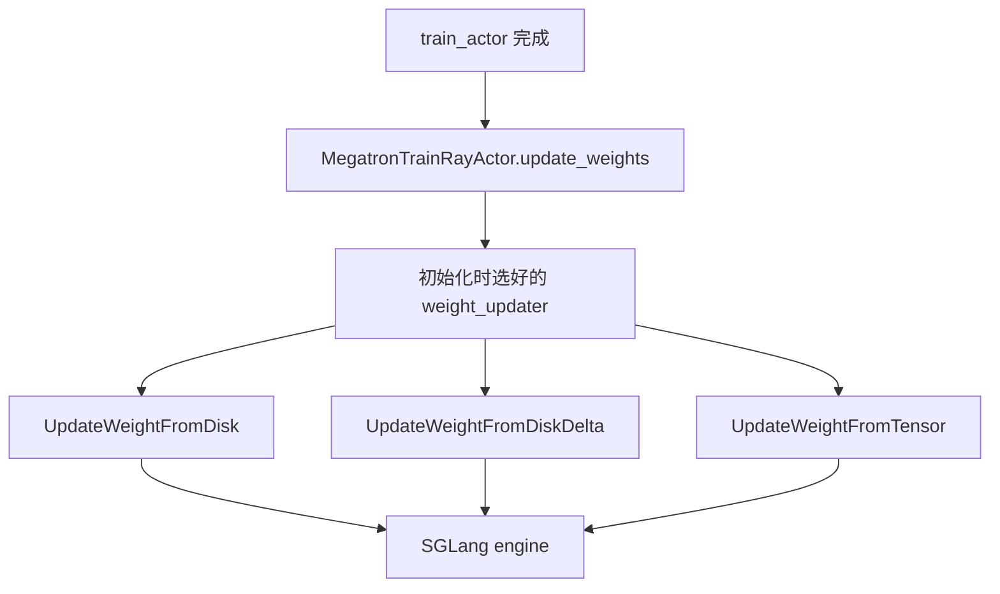

# 磁盘权重同步 · 源码走读

## 读者任务

这篇沿着一次 `actor_model.update_weights()` 追踪权重如何从 Megatron actor 进入 rollout engine。读完后，你应该能解释三件事：

1. full disk 为什么必须先暂停生成、写完整 HF 目录，再让 engine reload。
2. delta disk 为什么首轮不发权重，以及为什么 SGLang 不需要理解 delta。
3. colocate tensor 为什么不属于磁盘协议，但必须作为同机路径的对照。

## 长文读法

这篇按“同一个 `update_weights()` 调用如何走到三种运输协议”读：actor 初始化时先选 updater，full disk 写完整 HF 目录后让 engine reload，delta disk 首轮只抓 baseline、后续发布 byte-level delta，最后用 colocate tensor 对照说明什么不属于磁盘协议。

| 读者任务 | 先读 | 要抓住的判断 |
|----------|------|--------------|
| 第一次建立权重同步主线 | 读者任务、贯穿场景、1 | 运输方式在 actor init 阶段已经固定，update 时只调用选好的 updater |
| 排查 full disk reload | 2、8、10 | full disk 的协议边界是完整 HF 目录，engine 通过普通 disk reload 统一入口加载 |
| 排查 delta 首轮没发权重 | 3 | 第一轮只 capture baseline，下一轮才有可发布的 diff |
| 理解 delta 文件内容 | 4 到 7 | delta 是 canonical safetensors + index + byte-level diff + host 本地 apply，不要求 SGLang 理解 delta |
| 区分 colocate tensor | 9 | colocate 走 CUDA IPC / tensor 发送，不维护磁盘目录和 delta 版本链 |
| 做 E2E 验证 | 10 | CI 只证明 full disk 路径写出了可 reload 的目录，不等价于 delta 协议验证 |

读的时候把“发布介质”和“SGLang reload 入口”分开：full disk 的介质就是完整目录；delta disk 的介质是增量流，但最终仍把本地 checkpoint 变成可被 engine reload 的目录。

## 贯穿场景

场景：一次 RL 训练 step 后，actor 权重已经更新，rollout engine 需要拿到新版本。



## 1. Actor 初始化时已经决定运输方式

系统压力：权重同步路径不能在每次 update 时临时猜。Slime 在 actor init 阶段根据部署拓扑把 updater 固定下来，后续 `update_weights()` 只调用对应对象。

```python
# 定位骨架（基于 slime/backends/megatron_utils/actor.py L139-L161；省略 updater 构造）
if self.args.colocate:
    assert (
        self.args.update_weight_mode == "full"
    ), "--update-weight-mode=delta is not supported with --colocate"
    update_weight_cls = UpdateWeightFromTensor
elif self.args.update_weight_mode == "delta":
    assert (
        self.args.update_weight_transport == "disk"
    ), "--update-weight-mode=delta requires --update-weight-transport=disk"
    from .update_weight.update_weight_from_disk_delta import UpdateWeightFromDiskDelta

    update_weight_cls = UpdateWeightFromDiskDelta
else:
    assert self.args.update_weight_mode == "full"
    if self.args.update_weight_transport == "disk":
        update_weight_cls = UpdateWeightFromDisk
    else:
        assert (
            self.args.update_weight_mode == "full" and self.args.update_weight_transport == "nccl"
        ), f"unsupported weight sync mode/transport: {self.args.update_weight_mode!r}/{self.args.update_weight_transport!r}"
        update_weight_cls = UpdateWeightFromDistributed
```

执行逻辑：

- `colocate` 优先级最高，并强制 full mode，因为它走 tensor IPC，不维护 delta 版本链。
- `delta` 强制 disk transport，因为每台 host 要从共享目录读 delta 并 patch 本地 checkpoint。
- 剩余 full mode 再按 `disk` 或 `nccl` 分到本专题或 [[Slime-分布式权重同步]]。

## 2. Full Disk：完整 HF 目录是同步协议

full disk 的主线是 `pause → flush → save_hf_model_to_path → update_weights_from_disk → continue`。这里的关键不在保存函数本身，而在阶段顺序：engine 不能一边生成一边 reload 半写入目录。

```python
# 来源：slime/backends/megatron_utils/update_weight/update_weight_from_disk.py L61-L98
@torch.no_grad()
def update_weights(self) -> None:
    self.weight_version += 1
    version_dir = Path(self.args.update_weight_disk_dir) / f"weight_v{self.weight_version:06d}"

    if dist.get_rank() == 0:
        shutil.rmtree(version_dir, ignore_errors=True)
    dist.barrier(group=get_gloo_group())

    if dist.get_rank() == 0:
        logger.info("Updating rollout weights from disk checkpoint %s", version_dir)
        ray.get([engine.pause_generation.remote() for engine in self.rollout_engines])
        ray.get([engine.flush_cache.remote() for engine in self.rollout_engines])
    dist.barrier(group=get_gloo_group())

    save_hf_model_to_path(
        self.args,
        version_dir,
        self.model,
        model_name=self.model_name,
        quantization_config=self.quantization_config,
        progress_desc="Save HF  weights for update from disk",
    )
    dist.barrier(group=get_gloo_group())

    if dist.get_rank() == 0:
        refs = [
            engine.update_weights_from_disk.remote(
                model_path=str(version_dir),
                weight_version=str(self.weight_version),
            )
            for engine in self.rollout_engines
        ]
        ray.get(refs)
        if not self.args.update_weight_disk_keep_files:
            shutil.rmtree(version_dir, ignore_errors=True)
        ray.get([engine.continue_generation.remote() for engine in self.rollout_engines])
    dist.barrier(group=get_gloo_group())
```

不变量：

- `version_dir` 由当前 `weight_version` 唯一决定。
- 目录清理只在 rank 0 做，但保存前后都有 Gloo barrier。
- 所有 rank 参与 HF 保存；只有 rank 0 控制 engine pause/reload/continue。

这些是不带回滚的阶段不变量：目录直接写最终路径，不做整个目录的 staging rename；`weight_version` 在成功前递增；pause/save/reload/cleanup/continue 没有 `try/finally`。full disk 还默认共享 FS 对 rollout host 具备 read-after-write 可见性。

## 3. Delta Disk：首轮 capture baseline，次轮才 publish

delta disk 把 full checkpoint 的每轮重写改成版本链。第一轮 update 只建立 baseline，这不是 bug，而是为后续 diff 建立“old bytes”。

```python
# 定位骨架（基于 slime/backends/megatron_utils/update_weight/update_weight_from_disk_delta.py L80-L96；省略注释与尾部阶段）
@torch.no_grad()
def update_weights(self) -> None:
    if not self._baseline_captured:
        self._capture_baseline()
        self._baseline_captured = True
        return

    self.weight_version += 1
    if dist.get_rank() == 0:
        ray.get([engine.pause_generation.remote() for engine in self.rollout_engines])
        ray.get([engine.flush_cache.remote() for engine in self.rollout_engines])
    dist.barrier(group=get_gloo_group())

    self._publish()
    self._reload_engines()
    self._record_metrics()
```

baseline 从 `hf_checkpoint` 读，而不是直接拿当前 GPU 权重做 seed。原因是 rollout host 的本地副本也从同一个 HF checkpoint materialize；如果 Megatron 到 HF 的转换过程裁剪了 padding 行，GPU gather 的 bytes 和本地 HF 文件 bytes 可能不完全一致。

这也限制了首轮语义：第一次调用不推任何权重。只有当 engine 的 HF base 与 actor 当前初始策略一致时，第一轮 rollout 才正确；actor 若从另一份恢复点启动，差异要到下一次 delta 才可能被发布。

```python
# 定位骨架（基于 slime/backends/megatron_utils/update_weight/update_weight_from_disk_delta.py L98-L124；省略日志与 barrier 尾部）
def _capture_baseline(self) -> None:
    if dist.get_rank() == 0:
        shutil.rmtree(self.delta_dir, ignore_errors=True)
        os.makedirs(self.delta_dir, exist_ok=True)
        if self._commit_hook is not None:
            self._commit_hook(self.args, self.delta_dir, list(self.rollout_engines))
    dist.barrier(group=get_gloo_group())

    read_hf = make_tensor_reader(self.args.hf_checkpoint)
    for name, tensor in self._iter_hf_tensors():
        try:
            self._snapshot[name] = read_hf(name)
        except KeyError:
            self._snapshot[name] = tensor.detach().cpu().contiguous().view(torch.uint8).numpy().reshape(-1)
            logger.warning("seed: %s absent from hf_checkpoint; seeding from current weights", name)
    if dist.get_rank() == 0:
        logger.info(
            "[disk delta] captured baseline snapshot of %d tensors from %s",
            len(self._snapshot),
            self.args.hf_checkpoint,
        )
```

## 4. Publish：PP-src ranks 写 canonical safetensors delta

delta publish 有两个阶段：先 diff/compress，再把各 rank 的 changed tensors 编成 safetensors 分片和 index。文件编号不是靠 filesystem listing，而是通过 `all_gather_object` 计算。

```python
# 定位骨架（基于 slime/backends/megatron_utils/update_weight/update_weight_from_disk_delta.py L132-L167；省略 docstring 与局部变量）
def _write_delta_files(self) -> None:
    group = get_gloo_group()
    world, rank = dist.get_world_size(), dist.get_rank()

    counts: list = [None] * world
    dist.all_gather_object(counts, int(bool(self._delta)), group=group)
    offset, total = sum(counts[:rank]), sum(counts)

    fname = None
    self.wire_bytes = 0
    if self._delta:
        fname = f"model-{offset:05d}-of-{total:05d}.safetensors"
        blob = safetensors.numpy.save(self._delta, metadata=self._checksums)
        self.wire_bytes = len(blob)
        _atomic_write(os.path.join(self._version_dir, fname), blob)

    maps: list = [None] * world
    dist.all_gather_object(maps, {name: fname for name in self._delta}, group=group)
    if rank == 0:
        index = {
            "metadata": {
                "version": f"{self.weight_version:06d}",
                "base_version": f"{self.weight_version - 1:06d}",
                "delta_encoding": self.delta_encoding,
                "compression_format": "zstd",
                "checksum_format": self.checksum_algorithm,
            },
            "weight_map": {name: f for m in maps for name, f in m.items()},
        }
        _atomic_write(os.path.join(self._version_dir, "model.safetensors.index.json"), json.dumps(index).encode())
    dist.barrier(group=group)
```

设计选择：

- `base_version` 是 apply 端的顺序闸门。
- `delta_encoding` 和 `checksum_format` 写进 index，避免 apply 端靠命令行猜。
- `_atomic_write` 避免 reader 看到半写文件。

## 5. Encode：byte-level diff，不关心 tensor dtype

delta encode 先把 tensor 视作 `uint8`。`xor` 写完整差分 bytes，`overwrite` 写 changed positions 和新 bytes；二者之后都 zstd 压缩，并保存新状态 checksum。

```python
# 定位骨架（基于 slime/backends/megatron_utils/update_weight/update_weight_from_disk_delta.py L219-L247；拼接 diff 与 collect 内部函数）
def diff_and_compress(name, buf, nbytes, pinned):
    if pinned:
        new = np.empty(nbytes, dtype=np.uint8)
        np.copyto(new, buf.numpy()[:nbytes])
        free_q.put(buf)
    else:
        new = buf
    old = snapshot[name]
    if self.delta_encoding == "xor":
        diff = new ^ old
        changed = int(np.count_nonzero(diff))
    elif self.delta_encoding == "overwrite":
        mask = new != old
        changed = int(np.count_nonzero(mask))
        diff = overwrite_encode(new, mask)
    else:
        raise ValueError(f"unknown delta encoding {self.delta_encoding!r}")
    if not changed:
        return name, new, None, None, 0
    compressed = np.frombuffer(zstandard.ZstdCompressor(level=1).compress(diff), dtype=np.uint8)
    return name, new, compressed, checksum(self.checksum_algorithm, new), changed

def collect(fut):
    name, new, compressed, digest, changed = fut.result()
    snapshot[name] = new
    if changed:
        self.changed_bytes += changed
        self._delta[name] = compressed
        self._checksums[name] = digest
```

不变量：

- `snapshot[name]` 在 collect 后更新为新状态，成为下一轮 base。
- 没变的 tensor 不写入 `_delta`，但总字节仍计入 density 的分母。
- checksum 对新状态计算，不是对 diff 计算。

`collect` 同时把 `snapshot[name]` 前移，时点早于 `_write_delta_files`、commit hook、host apply 与 engine reload。这意味着后续失败不是简单“本版没提交”：trainer 已经失去旧 base，直接继续会生成建立在未部署版本上的下一版 diff。

## 6. Reload：每台 host 先 apply，本地目录再被 engine reload

delta 的关键边界在 `_reload_engines`：trainer 不把 delta 直接交给 SGLang HTTP，而是让每台 host actor 先 `sync_local_checkpoint`。

```python
# 定位骨架（基于 slime/backends/megatron_utils/update_weight/update_weight_from_disk_delta.py L169-L186；省略 barrier 与列表换行）
def _reload_engines(self) -> None:
    if self._commit_hook is not None:
        self._commit_hook(self.args, self._version_dir, list(self.rollout_engines))
    dist.barrier(group=get_gloo_group())
    if dist.get_rank() == 0:
        ray.get([actor.sync_local_checkpoint.remote(self.weight_version) for actor in self.all_engine_actors])
        ray.get(
            [
                engine.update_weights_from_disk.remote(
                    model_path=self.args.update_weight_local_checkpoint_dir,
                    weight_version=str(self.weight_version),
                )
                for engine in self.rollout_engines
            ]
        )
        ray.get([engine.continue_generation.remote() for engine in self.rollout_engines])
    dist.barrier(group=get_gloo_group())
```

`all_engine_actors` 和 `rollout_engines` 不能混淆：

- `all_engine_actors`：每个 host 至少一个，用来 patch 本地 checkpoint。
- `rollout_engines`：node 0 的 updatable engines，用来触发 reload 和 continue。

## 7. Host apply：mmap patch + checksum + state.json

本地 checkpoint 初始化只复制一次；之后 delta 都在同一目录上 mmap patch。锁在 `.delta_sync/lock`，状态在 `.delta_sync/state.json`。

```python
# 来源：slime/utils/disk_delta.py L69-L78
@contextmanager
def _apply_lock(local_ckpt_dir: str):
    sync = os.path.join(local_ckpt_dir, SYNC_DIR)
    os.makedirs(sync, exist_ok=True)
    with open(os.path.join(sync, "lock"), "w") as f:
        fcntl.flock(f, fcntl.LOCK_EX)
        try:
            yield
        finally:
            fcntl.flock(f, fcntl.LOCK_UN)
```

```python
# 定位骨架（基于 slime/utils/disk_delta.py L204-L231；拼接 XOR 与 overwrite 核心写入）
def apply_xor(item) -> None:
    name, compressed, path, offset, nbytes, want = item
    region = np.ndarray((nbytes,), dtype=np.uint8, buffer=open_mmaps[path][1], offset=offset)
    hasher = _new_hasher(algorithm)
    reader = zstandard.ZstdDecompressor().stream_reader(io.BytesIO(bytes(compressed)))
    pos = 0
    while pos < nbytes:
        block = reader.read(min(2 << 20, nbytes - pos))
        if not block:
            break
        chunk = np.frombuffer(block, dtype=np.uint8)
        region[pos : pos + chunk.size] ^= chunk
        hasher.update(region[pos : pos + chunk.size])
        pos += chunk.size
    if hasher.hexdigest() != want:
        with lock:
            mismatches.append(name)

def apply_overwrite(item) -> None:
    name, compressed, path, offset, nbytes, want = item
    delta = np.frombuffer(zstandard.ZstdDecompressor().decompress(bytes(compressed)), dtype=np.uint8)
    region = np.ndarray((nbytes,), dtype=np.uint8, buffer=open_mmaps[path][1], offset=offset)
    count = int.from_bytes(delta[:4].tobytes(), "little")
    positions = np.frombuffer(delta[4 : 4 + 4 * count].tobytes(), dtype="<u4")
    region[positions] = delta[4 + 4 * count :]
    if checksum(algorithm, region) != want:
        with lock:
            mismatches.append(name)
```

失败模式：

- 版本乱序会在 `_apply_version` 拦住。
- checksum mismatch 会 raise，不会 silent serve 坏权重。
- 本地 checkpoint 未 materialize 会在 `apply_deltas` 抛错。

checksum 是后验检测，不提供 rollback。XOR 原地 apply 若半途失败，本地 state 虽未推进，文件却可能已部分推进；同版重试会对成功区域再次 XOR。overwrite 可重复写相同位置，但位置数组是 `<u4` byte offset，单 tensor 达到 2^32 bytes 时没有显式溢出保护。

实现还明确不调用 `msync`：它依赖 page cache 给 engine 读取，主机丢失 cache 时从 base 重建。配合 `fcntl.flock`，这是一条 Linux/POSIX host-local 协议。

## 8. SGLangEngine：普通 disk reload 是统一出口

engine actor 侧有两个函数：`sync_local_checkpoint` 是 delta 专属的本地 patch；`update_weights_from_disk` 是统一 HTTP 出口。

```python
# 定位骨架（基于 slime/backends/sglang_utils/sglang_engine.py L396-L437；拼接 local sync 与 HTTP reload）
def sync_local_checkpoint(self, target_version: int):
    from slime.utils.disk_delta import apply_deltas, init_local_checkpoint

    init_local_checkpoint(self.args.update_weight_local_checkpoint_dir, self.args.hf_checkpoint)
    if self.args.custom_delta_pre_read_path:
        from slime.utils.misc import load_function

        load_function(self.args.custom_delta_pre_read_path)(self.args.update_weight_disk_dir, target_version)
    apply_deltas(
        self.args.update_weight_local_checkpoint_dir,
        self.args.update_weight_disk_dir,
        target_version,
    )

def update_weights_from_disk(
    self,
    model_path: str,
    load_format: str | None = None,
    weight_version: str | None = None,
    files: list[str] | None = None,
):
    payload: dict = {"model_path": model_path}
    if load_format is not None:
        payload["load_format"] = load_format
    if weight_version is not None:
        payload["weight_version"] = weight_version
    if files is not None:
        payload["files"] = files
    return self._make_request("update_weights_from_disk", payload)
```

读者抓手：Slime trainer-side delta 最终传给 HTTP 的 `model_path` 是本地完整 checkpoint，不是 delta 文件目录。

## 9. Tensor 对照：colocate 是 IPC 协议，不是文件协议

colocate updater 的 update 主循环和 full disk 相似，也 pause/flush/continue，但数据面是 chunked HF tensor bucket。

```python
# 定位骨架（基于 slime/backends/megatron_utils/update_weight/update_weight_from_tensor.py L147-L191；省略量化参数与注释）
@torch.no_grad()
def update_weights(self) -> None:
    self.weight_version += 1

    rank = dist.get_rank()
    if rank == 0:
        ray.get([engine.pause_generation.remote() for engine in self.rollout_engines])
        ray.get([engine.flush_cache.remote() for engine in self.rollout_engines])
        if self.quantization_config and self.quantization_config["quant_method"] in ["compressed-tensors"]:
            post_process_weights(
                restore_weights_before_load=True,
                post_process_quantization=False,
                rollout_engines=self.rollout_engines,
            )
    dist.barrier(group=get_gloo_group())

    megatron_local_weights = self.weights_getter()

    for hf_named_tensors in self._hf_weight_iterator.get_hf_weight_chunks(megatron_local_weights):
        refs, long_lived_tensors = self._send_hf_params(hf_named_tensors)
        ray.get(refs)
        del long_lived_tensors, hf_named_tensors
        torch.cuda.ipc_collect()

    dist.barrier(group=get_gloo_group())
    torch.cuda.ipc_collect()

    if rank == 0:
        if self.quantization_config and self.quantization_config["quant_method"] in ["compressed-tensors"]:
            post_process_weights(
                restore_weights_before_load=False,
                post_process_quantization=True,
                rollout_engines=self.rollout_engines,
            )
        ray.get([engine.continue_generation.remote() for engine in self.rollout_engines])
    dist.barrier(group=get_gloo_group())
```

如果存在远端 engine，`_send_hf_params` 会同时发 colocated IPC 和 distributed NCCL。

```python
# 来源：slime/backends/megatron_utils/update_weight/update_weight_from_tensor.py L193-L216
def _send_hf_params(self, hf_named_tensors) -> tuple[list[ObjectRef], Any]:
    all_refs = []

    refs_colocated, long_lived_tensors = _send_to_colocated_engine(
        hf_named_tensors,
        ipc_engine=self._ipc_engine,
        ipc_gather_src=self._ipc_gather_src,
        ipc_gather_group=self._ipc_gather_group,
        weight_version=self.weight_version,
    )
    all_refs.extend(refs_colocated)

    if self.use_distribute and self._is_distributed_src_rank:
        refs_distributed = update_weights_from_distributed(
            self._group_name,
            self._model_update_groups,
            self.weight_version,
            self.distributed_rollout_engines,
            hf_named_tensors,
        )
        if refs_distributed:
            all_refs.extend(refs_distributed)

    return all_refs, long_lived_tensors
```

但混合模式只完成了“数据可发送”的组合：connect 时 `self.rollout_engines` 被切成 colocated 子集，update 主循环的 pause/flush/continue 和量化 post-process 只遍历该子集；远端 engine 不在同一更新闸门内。IPC tensor、Ray refs 与 continue 也没有 finally 清理。

## 10. 运行验证：full disk E2E

full disk 路径有 E2E smoke test。它的验收不是只看函数返回，而是确认版本目录、HF index 和 safetensors 分片真的写出来。

```python
# 来源：tests/test_full_disk_weight_update.py L1-L5
"""E2E smoke test for full checkpoint weight updates through disk.

Runs a tiny Qwen3.5-0.8B job where each weight sync writes a complete HF
checkpoint and rollout engines reload it through ``update_weights_from_disk``.
"""
```

```python
# 定位骨架（基于 tests/test_full_disk_weight_update.py L91-L133；摘取配置、执行与产物断言）
disk_update_args = (
    "--update-weight-mode full "
    "--update-weight-transport disk "
    f"--update-weight-disk-dir {disk_dir} "
    "--update-weight-disk-keep-files "
)

ci_args = "--ci-test "

U.execute_train(
    train_args=train_args,
    num_gpus_per_node=NUM_GPUS,
    megatron_model_type=MODEL_TYPE,
)

checkpoint_dirs = sorted(Path(disk_dir).glob("weight_v*"))
assert checkpoint_dirs, f"No disk checkpoint directories were written under {disk_dir}"
assert any((path / "model.safetensors.index.json").exists() for path in checkpoint_dirs)
assert any(list(path.glob("*.safetensors")) for path in checkpoint_dirs)
```

建议先跑：

```powershell
Set-Location slime
python -m pytest tests/test_full_disk_weight_update.py -q
```

该 E2E 固定需要 4 GPU、Qwen 模型和数据下载。资源不足时运行 `python -m pytest tests/test_empty_colocated_weight_bucket.py -q` 只能验证空 IPC bucket 的 collective 对齐，不能替代 full disk 或 delta E2E。

delta 路径没有同一个轻量 E2E 入口时，至少观察三类现象：

| 阶段 | 预期现象 |
|------|----------|
| 首轮 | 日志显示 captured baseline，不出现新版本 reload |
| 次轮 publish | `weight_v000001/model.safetensors.index.json` 写出 `base_version=000000` |
| host apply | local checkpoint 的 `.delta_sync/state.json` 更新到目标版本 |

## 复盘

- full disk 的正确性来自目录版本和全局 barrier。
- delta disk 的正确性来自 baseline 一致、版本链顺序和 per-tensor checksum。
- 这些校验不构成事务：snapshot 可提前前移，mmap 可部分写入，XOR 失败后需要重建本地副本。
- SGLang 对 Slime trainer-side delta 不需要特殊支持，因为 reload 看到的是 patch 后的完整 HF 目录。
- colocate tensor 是同机优化路径；排障重点从文件状态转向 IPC bucket、Gloo group 和 CUDA IPC 生命周期。
- 混合 colocate+远端 distributed 当前缺少统一 pause/continue 闸门。
