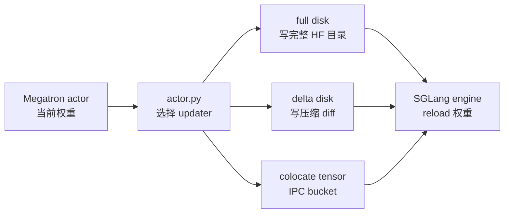

# 磁盘权重同步

## 读者任务

这组笔记解决一个部署问题：训练侧已经完成一轮 actor 更新，但 rollout 引擎不一定能和 Megatron rank 建 NCCL 组。读完后，你应该能判断什么时候用 full disk、什么时候用 delta disk、什么时候用 colocate tensor，并能排查版本乱序、checksum mismatch、首轮 delta 不生效和 IPC 显存不释放。

三条路径都不是原子事务：full/delta 的版本号在成功前推进，delta 的内存 snapshot 在文件发布和 host apply 前推进，tensor 的 pause/IPC/远端 NCCL 没有统一回滚。选择路径时除吞吐外，还要明确失败后是重试、重建本地副本，还是重启 worker。

源码主线是一条权重版本的旅程：



## 首次阅读路径

| 读者目标 | 先读 | 读完能做什么 |
|----------|------|--------------|
| 判断该选哪条同步路径 | [[Slime-磁盘权重同步-核心概念]] | 解释 full disk、delta disk、colocate tensor、NCCL 的边界 |
| 跟一轮 update_weights | [[Slime-磁盘权重同步-源码走读]] | 复述 pause、save/diff、apply、reload、continue 的顺序 |
| 排查跨机或本地盘问题 | [[Slime-磁盘权重同步-数据流]] | 找到 trainer、shared FS、host-local checkpoint、engine 的状态边界 |
| 看症状定位源码 | [[Slime-磁盘权重同步-排障指南]] | 从 checksum、首轮 delta、IPC 泄漏、共享盘可见性定位入口 |
| 自查是否读懂 | [[Slime-磁盘权重同步-学习检查]] | 用命令、日志、状态文件和版本号验收 |

## 源码范围

| 源码对象 | 负责什么 |
|----------|----------|
| `MegatronTrainRayActor.init` | 根据 `colocate`、`update_weight_mode`、`update_weight_transport` 选择 updater |
| `UpdateWeightFromDisk` | full disk：写完整 HF checkpoint，再让 rollout engine reload |
| `UpdateWeightFromDiskDelta` | delta disk：训练侧发布 diff，各 host 本地 apply 后普通 reload |
| `disk_delta.apply_deltas` | host-local checkpoint 的版本链、mmap patch 和 checksum |
| `SGLangEngine.sync_local_checkpoint` | engine actor 在 reload 前把本地 checkpoint 追到目标版本 |
| `UpdateWeightFromTensor` | colocate full：HF tensor bucket 经 Gloo gather 和 Ray IPC 送入 engine |

## 入口证据

Actor 初始化时已经把四条路径分开；后续专题都围绕这个分叉展开。

```python
# 定位骨架（基于 slime/backends/megatron_utils/actor.py L139-L161；省略 updater 构造）
if self.args.colocate:
    assert (
        self.args.update_weight_mode == "full"
    ), "--update-weight-mode=delta is not supported with --colocate"
    update_weight_cls = UpdateWeightFromTensor
elif self.args.update_weight_mode == "delta":
    assert (
        self.args.update_weight_transport == "disk"
    ), "--update-weight-mode=delta requires --update-weight-transport=disk"
    from .update_weight.update_weight_from_disk_delta import UpdateWeightFromDiskDelta

    update_weight_cls = UpdateWeightFromDiskDelta
else:
    assert self.args.update_weight_mode == "full"
    if self.args.update_weight_transport == "disk":
        update_weight_cls = UpdateWeightFromDisk
    else:
        assert (
            self.args.update_weight_mode == "full" and self.args.update_weight_transport == "nccl"
        ), f"unsupported weight sync mode/transport: {self.args.update_weight_mode!r}/{self.args.update_weight_transport!r}"
        update_weight_cls = UpdateWeightFromDistributed
```

## 与相邻专题的关系

- [[Slime-分布式权重同步]] 讲 full + NCCL：适合训练 rank 与 rollout GPU 能建通信组的场景。
- 本专题讲 disk 和 colocate tensor：前者把通信问题转成文件版本问题，后者把同机通信转成 IPC bucket 问题。
- [[Slime-Megatron到HF转换]] 讲 Megatron 权重如何保存成 HF checkpoint；full disk 复用这条转换栈。

当前混合 colocate+远端 engine 还有一个实现边界：tensor updater 只对切分后的 colocated engine 列表执行 pause/flush/continue 与量化 post-process，远端 distributed 列表只收到 metadata+NCCL payload。不能把该混合模式视为与纯 colocate 同等的更新闸门。
