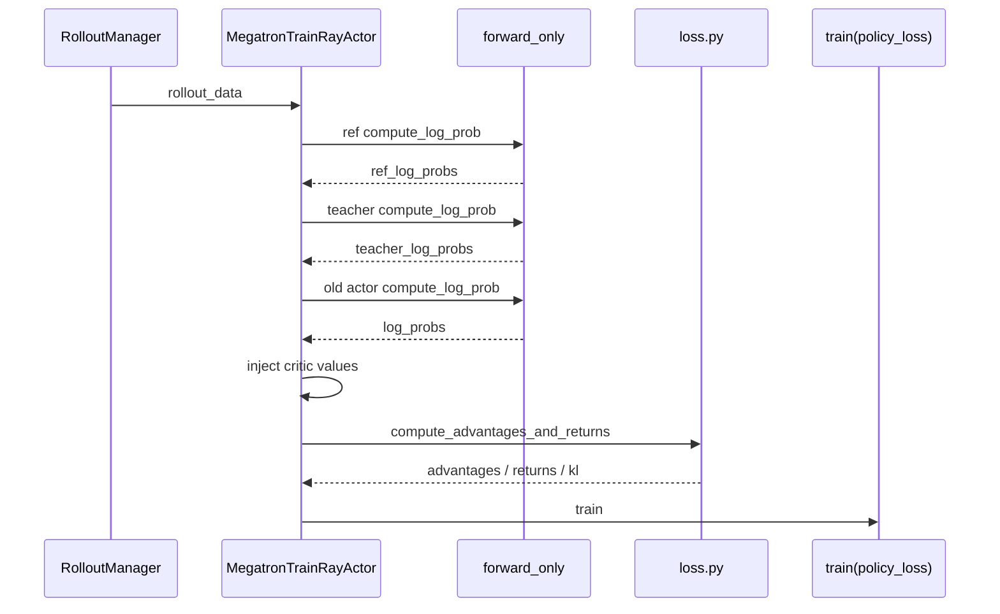
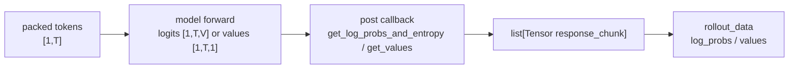

# Advantage计算 · 数据流

## 你为什么要读

本篇只回答数据如何跨边界流动：哪些字段被读，哪些字段被写，哪些字段只在特定并行或配置下存在。

## RolloutBatch 字段生命周期

| 字段 | 方向 | 形态 | 主要来源或去向 |
|------|------|------|----------------|
| `rewards` | 读 | `list[float]` | rollout / reward model |
| `response_lengths` | 读 | `list[int]` | [[Slime-训练数据]] |
| `total_lengths` | 读 | `list[int]` | [[Slime-训练数据]] |
| `loss_masks` | 读 | `list[Tensor[R]]` | Train Data response mask |
| `rollout_log_probs` | 读 | `list[Tensor[R]]` | rollout engine，可由 `use_rollout_logprobs` 选用 |
| `log_probs` | 读 | `list[Tensor[R]]` | train engine forward-only |
| `ref_log_probs` | 读 | `list[Tensor[R]]` | ref model forward-only |
| `teacher_log_probs` | 读 | `list[Tensor[R]]` | OPD teacher |
| `values` | 读 | `list[Tensor[R]]` | critic forward |
| `kl` | 写 | `list[Tensor[R]]` | 本专题产物 |
| `advantages` | 写 | `list[Tensor[R]]` | 本专题产物，policy loss 消费 |
| `returns` | 写 | `list[Tensor[R]]` | 本专题产物，value loss 或 metrics 消费 |
| `opd_reverse_kl` | 写 | `list[Tensor[R]]` | OPD metrics 消费 |

字段读取与写回集中在 `compute_advantages_and_returns`：

```python
# 定位骨架（基于 `slime/backends/megatron_utils/loss.py` L686-L695；省略类型注解）
rollout_log_probs = rollout_data.get("rollout_log_probs")
log_probs = rollout_log_probs if args.use_rollout_logprobs else rollout_data.get("log_probs")
ref_log_probs = rollout_data.get("ref_log_probs")
rewards = rollout_data.get("rewards")
values = rollout_data.get("values")
response_lengths = rollout_data.get("response_lengths")
loss_masks = rollout_data.get("loss_masks")
total_lengths = rollout_data.get("total_lengths")
```

```python
# 来源：slime/backends/megatron_utils/loss.py L827-L828
rollout_data["advantages"] = advantages
rollout_data["returns"] = returns
```

## actor 路径



源码入口：来源：slime/backends/megatron_utils/actor.py L430-L509

这个顺序解释了两个现象：

- 开启 `use_rollout_logprobs` 后，可以跳过训练侧 old actor logprob，但 ref/teacher 或 mismatch metrics 仍可能触发额外 forward。
- 开启 PPO 时，actor 需要外部 critic values；否则 `get_advantages_and_returns_batch` 没有 baseline。
- 命中 `can_reuse_log_probs_in_loss` 只表示 policy loss 可以用当前 forward 的 detached logprob；advantage 在它之前执行，仍需现成的 `rollout_log_probs` 或 `values` 来构造零 KL 的 shape。自定义 rollout 不提供二者时，这项复用不可达。

## critic 路径

critic actor 也会调用同一个函数，因为 value loss 需要 `returns`，而 PPO actor 下一步还需要 old values。

```python
# 定位骨架（基于 `slime/backends/megatron_utils/actor.py` L402-L427；省略函数签名与参数）
rollout_data.update(forward_only(get_values, self.args, self.model, data_iterator, num_microbatches))
compute_advantages_and_returns(self.args, rollout_data)
self.args.loss_type = "value_loss"
train(...)
if mpu.is_pipeline_last_stage() and "values" in rollout_data:
    return {"values": tensors_to_cpu(rollout_data["values"])}
```

这里的返回值会通过 Ray actor 间数据传递进入 actor 训练路径，成为 `external_data["values"]`。

## logprob/value 的形态转换

`forward_only` 的输入是 packed token batch，输出是 response 对齐 list。



`get_log_probs_and_entropy` 负责概率路径，`get_values` 负责 value head 路径。两者都必须按 `total_lengths` 与 `response_lengths` 找到 response token。

源码入口：

- 来源：slime/backends/megatron_utils/loss.py L470-L561
- 来源：slime/backends/megatron_utils/loss.py L564-L617

## 并行维度

| 并行 | 数据影响 | 排查入口 |
|------|----------|----------|
| PP | 只有 last stage 聚合 forward-only 输出并写 advantage | `model.py` L487-L506，`loss.py` L696-L698 |
| TP | vocab-parallel logprob 在 `calculate_log_probs_and_entropy` 内处理 | `loss.py` L527-L536 |
| CP | response 可能是本 rank chunk，GAE/return 需要 gather 后 slice | `ppo_utils.py` L534-L639 |
| DP | normalization 使用 DP group 统计 masked mean/variance | `loss.py` L775-L825 |

allgather-CP 有一个额外转换：先按 contiguous global sequence chunk 得到局部 response，再重分布到 downstream 期待的 zigzag CP 布局。

```python
# 定位骨架（基于 `slime/backends/megatron_utils/loss.py` L151-L227；省略重建与 padding 细节）
def _allgather_cp_redistribute(...):
    cp_group = mpu.get_context_parallel_group()
    cp_rank = mpu.get_context_parallel_rank()
    chunk_start = cp_rank * logits_local_len
    ...
    all_cat = torch.cat(full_resps, dim=0)
    all_cat = dist.nn.all_reduce(all_cat, group=cp_group)
    ...
    new_values.append(slice_log_prob_with_cp(full_resp, total_length, response_length))
    res[key] = new_values
```

这个转换会影响 `log_probs`、`entropy`、`values`，所以 CP shape 问题不要只盯 estimator。

## 与 policy loss 的接口

`policy_loss_function` 不重新计算 advantage，它只读取本专题写入的字段。OPD 的 reverse KL 也只是作为 metric 上报。

```python
# 定位骨架（基于 `slime/backends/megatron_utils/loss.py` L1105-L1108；省略外层条件上下文）
if "opd_reverse_kl" in batch:
    opd_reverse_kl = torch.cat(batch["opd_reverse_kl"], dim=0)
    reported_loss["opd_reverse_kl"] = sum_of_sample_mean(opd_reverse_kl).clone().detach()
```

边界判断：

- advantage 的数值来源属于本专题。
- ratio、clip、entropy bonus、GSPO/CISPO policy 差异属于 [[Slime-Policy-Loss]]。
- top-p replay 字段的采样来源属于 rollout，训练侧只校验和使用。

## estimator 后的对象别名

多数分支的 `advantages` 与 `returns` 是不同 list；REINFORCE++ baseline 例外，源码执行 `returns = advantages`。随后数据流为：

```text
baseline helper list
  ├─ advantages ─┐
  └─ returns ────┘  同一对象
        ↓ OPD: advantages[i] = new_tensor
advantages 与 returns 同时看到新 tensor
        ↓ whitening: advantages = new_list
advantages 变 whitened；returns 保留 OPD 后、whitening 前值
```

这会影响日志、自定义 hook 和任何未来消费 returns 的路径。验证时应比较 `advantages is returns`，不能只比较 tensor 数值。

## 数据不变量

- 所有 list 字段必须按 sample 顺序对齐。
- 每个 `advantages[i]` 的长度必须等于本 rank 对该 sample 持有的 response token 数。
- `loss_masks[i]` 是完整 response mask；CP normalization 前要切成本地 mask chunk。
- `returns` 与 `advantages` 都写回 `rollout_data`，函数没有返回值。
- baseline helper 当前不读取传入的 `loss_masks`；mask 在 whitening 和下游 loss reducer 才生效。
- 多个 helper 使用 `zip(strict=False)`；所有 sample list 等长、每项 shape 相等不是函数自动保证的不变量。

## 运行验证

这篇的数据流要同时验证字段写回、CP 切片、OPD 后处理和 policy loss 消费点。

```powershell
rg -n 'def compute_advantages_and_returns|def apply_opd_kl_to_advantages|def policy_loss_function|opd_reverse_kl|distributed_masked_whiten|slice_log_prob_with_cp|all_gather_with_cp|get_advantages_and_returns_batch|rollout_log_probs|returns|advantages' slime/slime/backends/megatron_utils/loss.py slime/slime/backends/megatron_utils/actor.py slime/slime/utils/ppo_utils.py
```

读输出时先看 `compute_advantages_and_returns` 写入 `advantages/returns/kl`，再看 `slice_log_prob_with_cp` 和 `all_gather_with_cp` 如何处理 CP。本地字段长度问题优先查 actor 侧对 `rollout_log_probs/teacher_log_probs` 的切片，policy loss 侧只确认它读取而不重算 advantage。
