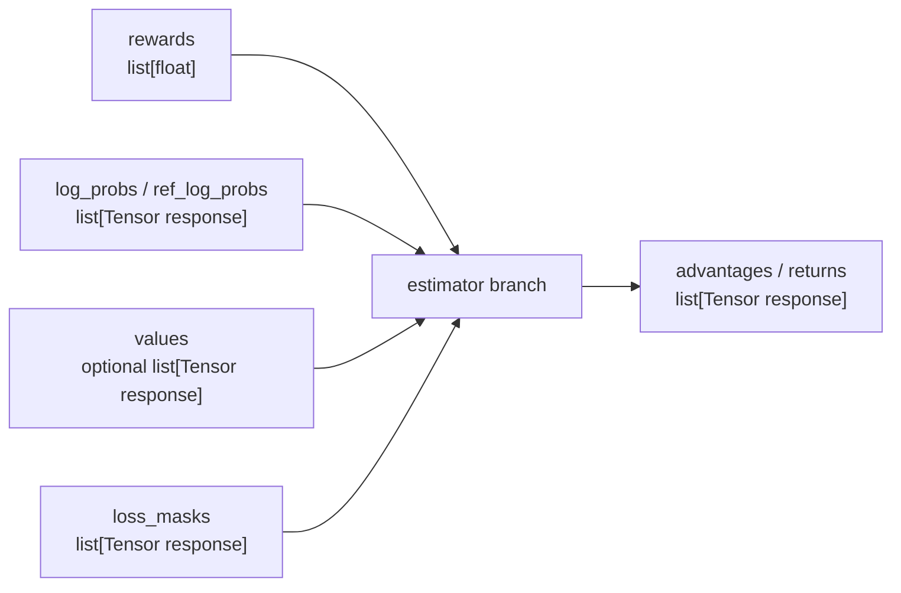

# Advantage计算 · 核心概念

## 你为什么要读

本篇先建立模型：`advantages` 不是一个普通中间变量，而是把序列级反馈翻译成 token 级训练权重的结果。后面的 policy loss 只相信这个结果，不再重新判断 reward 应该落在哪个 token 上。

## 三层账本

可以把本模块看成三层账本，但这个类比只用于理解字段归属，不能替代源码证据：

| 类比 | 源码对象 | 失效边界 |
|------|----------|----------|
| 总分 | `rewards: list[float]` | 不能说明 token 级 KL 怎么分配 |
| 每 token 扣分项 | `kl: list[Tensor[R]]` | 不能说明 PPO 的 value baseline |
| 最终记账权重 | `advantages` / `returns` | 不能解释 policy clipping，后者属于 [[Slime-Policy-Loss]] |

进入 `compute_advantages_and_returns` 前，样本已经是 response 对齐的形态：



## 字段语义

| 字段 | 来源 | 在本模块中的作用 |
|------|------|------------------|
| `rewards` | rollout / reward model | 序列级环境反馈 |
| `rollout_log_probs` | rollout engine | 可选 old logprob 来源 |
| `log_probs` | train engine `forward_only` | 训练侧重算的 old actor/student logprob |
| `ref_log_probs` | ref model forward | KL 基线 |
| `teacher_log_probs` | teacher forward 或 rollout teacher | OPD reverse KL |
| `values` | critic forward | PPO GAE 的 value baseline |
| `loss_masks` | Train Data | 只让有效 response token 进入统计 |
| `total_lengths` / `response_lengths` | Train Data | CP 切片、GAE 还原完整 response |

## Estimator 选择

| `advantage_estimator` | 是否需要 critic | advantage 阶段做什么 | 主要 helper |
|-----------------------|----------------|----------------------|-------------|
| `grpo` | 否 | 把序列 reward 广播到 response token | `get_grpo_returns` |
| `gspo` | 否 | 与 GRPO 共用 advantage，差异在 policy loss | `get_grpo_returns` |
| `cispo` | 否 | 与 GRPO 共用 advantage，clip 语义在 policy loss | `get_grpo_returns` |
| `ppo` | 是 | token KL 塑形 reward，再用 GAE 生成 advantage/return | `get_advantages_and_returns_batch` |
| `reinforce_plus_plus` | 否 | 在完整 response 上构造折扣 return | `get_reinforce_plus_plus_returns` |
| `reinforce_plus_plus_baseline` | 否 | 广播 baseline 后 reward，再扣 KL | `get_reinforce_plus_plus_baseline_advantages` |

源码证据：`loss.py` 的分派把 `grpo/gspo/cispo` 放在同一分支，PPO 单独需要 `values`，REINFORCE++ 两个变体再分支。

```python
# 定位骨架（基于 `slime/backends/megatron_utils/loss.py` L720-L764；压缩 estimator helper 参数）
elif args.advantage_estimator in ["grpo", "gspo", "cispo"]:
    rewards = torch.tensor(rewards, dtype=torch.float32, device=kl[0].device)
    returns = get_grpo_returns(rewards, kl)
    advantages = [r for r in returns]
elif args.advantage_estimator == "ppo":
    ...
    advantages, returns = get_advantages_and_returns_batch(
        total_lengths, response_lengths, values, rewards, args.gamma, args.lambd
    )
elif args.advantage_estimator == "reinforce_plus_plus":
    returns = get_reinforce_plus_plus_returns(...)
    advantages = [r for r in returns]
elif args.advantage_estimator == "reinforce_plus_plus_baseline":
    advantages = get_reinforce_plus_plus_baseline_advantages(...)
    returns = advantages
```

这里最容易误读的是 `gspo` 和 `cispo`。它们不是在 advantage 阶段特殊处理，而是在 [[Slime-Policy-Loss]] 的 policy loss 中改变 ratio、KL 或 clip 的解释。

## KL 的两种角色

KL 在本专题有两种角色：

- 作为记录和后续 loss 的输入：`rollout_data["kl"] = kl`。
- 作为 estimator 的 token 级塑形项：PPO 和 REINFORCE++ 会把 KL 进入 reward/return，GRPO 分支只用 KL 的 shape 广播 reward。

`kl_coef == 0` 时仍构造零 KL，是为了保持 list 长度、dtype、device 与 response token 对齐。

这里有一个隐藏前提：零 KL 的模板按 `log_probs or rollout_log_probs or values` 选择，没有退回 `loss_masks`。默认 SGLang rollout 会请求并保存 rollout log-prob，所以常见无 critic 路径仍有模板；自定义 rollout 若不产 `rollout_log_probs`，同时又命中“在 policy loss 内复用 logprob”的窄优化，就可能在 advantage 阶段以 `xs=None` 失败，尚未进入 policy loss。

```python
# 定位骨架（基于 `slime/backends/megatron_utils/loss.py` L700-L713；省略外层上下文）
if args.kl_coef == 0 or not log_probs:
    xs = log_probs or rollout_log_probs or values
    kl = [torch.zeros_like(x, dtype=torch.float32, device=x.device) for x in xs]
else:
    kl = [
        compute_approx_kl(
            log_probs[i],
            ref_log_probs[i],
            kl_loss_type=args.kl_loss_type,
        )
        for i in range(len(log_probs))
    ]
rollout_data["kl"] = kl
```

`compute_approx_kl` 本身只看两组 logprob，不关心 reward、mask 或 PPO。

```python
# 定位骨架（基于 `slime/utils/ppo_utils.py` L11-L51；省略 docstring 与 importance-ratio 收尾）
def compute_approx_kl(log_probs, log_probs_base, kl_loss_type, importance_ratio=None):
    log_ratio = log_probs.float() - log_probs_base.float()
    if kl_loss_type == "k1":
        kl = log_ratio
    elif kl_loss_type == "k2":
        kl = log_ratio**2 / 2.0
    elif kl_loss_type in ["k3", "low_var_kl"]:
        log_ratio = -log_ratio
        kl = log_ratio.exp() - 1 - log_ratio
    ...
    return kl
```

## PPO 与非 PPO 的分水岭

PPO 的特殊性不在于“也有 reward”，而在于它需要 value baseline，并且把 token KL 与序列 reward 合成一条 per-token reward 序列后再跑 GAE。

在 CP 下，同一条 response 被切到多个 rank；环境 reward 是序列级标量，只能加一次。当前实现选择 `cp_rank == 0` 的本地末 token 加 reward。

```python
# 来源：slime/backends/megatron_utils/loss.py L726-L738
elif args.advantage_estimator == "ppo":
    old_rewards = rewards
    rewards = []
    kl_coef = -args.kl_coef
    cp_rank = mpu.get_context_parallel_rank()
    for reward, k in zip(old_rewards, kl, strict=False):
        k *= kl_coef
        if cp_rank == 0:
            k[-1] += reward
        rewards.append(k)
    advantages, returns = get_advantages_and_returns_batch(
        total_lengths, response_lengths, values, rewards, args.gamma, args.lambd
    )
```

这段也给出一个排障信号：PPO 配置下如果 `values` 为空，不要先看 policy loss，应先看 critic 是否已经 forward 并把 `values` 注入 actor。

## OPD 是后处理，不是新 estimator

OPD 的 teacher 信号不替代 GRPO/PPO/REINFORCE++。它在 estimator 产出 `advantages` 之后，把 `student_logp - teacher_logp` 作为 reverse KL 从 advantage 中扣掉。

```python
# 定位骨架（基于 `slime/backends/megatron_utils/loss.py` L620-L658；省略函数入口与 device 搬运）
teacher_log_probs = rollout_data.get("teacher_log_probs")
if teacher_log_probs is None:
    raise ValueError(f"OPD with opd_type='{args.opd_type}' requires teacher_log_probs, but it is missing.")
...
for i, adv in enumerate(advantages):
    reverse_kl = student_log_probs[i] - teacher_log_probs[i]
    advantages[i] = adv - args.opd_kl_coef * reverse_kl
    reverse_kls.append(reverse_kl)
rollout_data["opd_reverse_kl"] = reverse_kls
```

所以 OPD 的排障顺序是：先确认 `teacher_log_probs` 是否存在，再确认长度是否和 `log_probs`、`response_lengths` 对齐。

还要区分 estimator 的 list 所有权：

- GRPO/GSPO/CISPO 用新 list 引用 returns tensor；PPO 与 REINFORCE++ 也分别持有 advantages/returns。
- `reinforce_plus_plus_baseline` 直接执行 `returns = advantages`，两者是同一个 list。随后 OPD 用 `advantages[i] = ...` 替换元素时，returns 也同步变成 OPD-adjusted tensor。
- normalization 随后把 `advantages` 重新绑定到 whitening 结果的新 list，不再改变 returns。

因此“OPD 只改 advantages、不改 returns”只适用于 baseline 以外的当前分支。若算法希望 baseline returns 保留 OPD 前值，需要先复制 list，而不是共享别名。

## Normalize 是全 batch 统计

`normalize_advantages` 不是 micro-batch 内局部标准化。它先把本 rank 的 advantage 拼起来，再用 DP group 做 masked whitening。CP 大于 1 时，`loss_masks` 还要按本 rank 拥有的 response token 切片，否则 advantage 与 mask 形状不一致。

```python
# 定位骨架（基于 `slime/backends/megatron_utils/loss.py` L775-L825；省略 CP mask 重建细节）
if args.normalize_advantages:
    all_advs = torch.cat(advantages)
    cp_size = mpu.get_context_parallel_world_size()
    if cp_size == 1:
        all_masks = torch.cat(loss_masks)
    else:
        ...
    if all_masks.numel() > 0:
        assert all_advs.size() == all_masks.size()
        dp_group = mpu.get_data_parallel_group()
        whitened_advs_flat = distributed_masked_whiten(
            all_advs,
            all_masks,
            process_group=dp_group,
            shift_mean=True,
        )
        chunk_lengths = [chunk.size(0) for chunk in advantages]
        advantages = list(torch.split(whitened_advs_flat, chunk_lengths))
```

数值边界：`distributed_masked_whiten` 用 `E[x²]-E[x]²` 算方差并做 Bessel 修正，没有把轻微负方差 clamp 到 0。大幅值、低方差或跨 rank 累加舍入时，应检查 `global_var` 与输出 finite，而不是只检查 mask sum 非零。

## REINFORCE++ baseline 的 mask 参数并未在 helper 内消费

`get_reinforce_plus_plus_baseline_advantages` 的签名接收 `loss_masks`，但函数体只按 `zip(kl, rewards, strict=False)` 计算 `reward - kl_coef * kl`。无效 token 最终仍会被 policy reducer 的 mask 排除，normalization 也使用 mask；只是不能声称 baseline helper 自己已经执行 masked advantage 构造。

这还带来两个审计点：list 长度不一致会被 `strict=False` 截断，且 helper 本身不校验每个 KL tensor 与 mask shape。自定义 estimator 应主动使用 strict 校验或显式断言。

## 三个并行边界

| 并行维度 | 本模块的不变量 |
|----------|----------------|
| PP | 只有 pipeline last stage 写 `advantages`、`returns`、`kl` |
| CP | response token 可能是本地 chunk，GAE/REINFORCE++ 需要还原完整 response 后再切回本地 |
| DP | advantage whitening 使用 DP group 汇总 masked mean/variance |

这三个边界解释了为什么 advantage 不能随手挪到每个 micro-batch 的 loss 函数里做：它需要整批字段、完整 response 语义和跨 rank 统计。

## 运行验证

Advantages 的验证要同时看 estimator、KL、OPD、normalization 和 policy loss 消费点。只看 `advantages` 字段是否存在不够。

```powershell
rg -n 'def compute_advantages_and_returns|def apply_opd_kl_to_advantages|def compute_approx_kl|def get_grpo_returns|def get_advantages_and_returns_batch|def get_reinforce_plus_plus_returns|distributed_masked_whiten|normalize_advantages|advantage_estimator|policy_loss_function' slime/slime/backends/megatron_utils/loss.py slime/slime/utils/ppo_utils.py
```

读输出时先看 `compute_advantages_and_returns` 的 estimator 分支，再看 `compute_approx_kl` 如何提供 reward shaping 的 KL；如果启用 OPD，继续看 `apply_opd_kl_to_advantages`；最后看 `distributed_masked_whiten` 和 `policy_loss_function`，确认 normalization 发生在 policy loss 消费之前。
