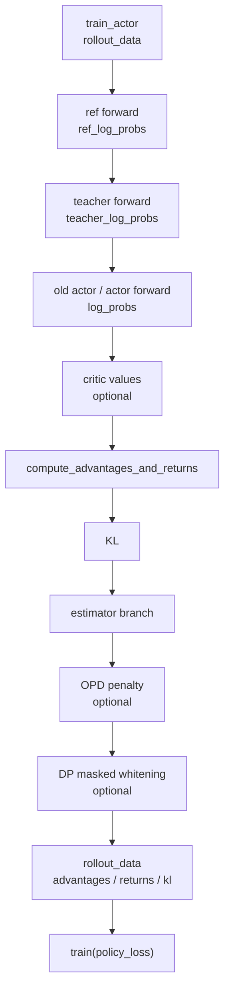

# Advantage计算 · 源码走读

## 读者任务

这篇只走一条主线：actor 准备做 policy backward 前，如何把一个 `RolloutBatch` 从“有 reward/logprob/value 的样本表”变成“有 `advantages` 和 `returns` 的训练表”。

读完后应能定位：

- actor 训练为什么可能先跑 ref、teacher、old actor 的 forward-only。
- `use_rollout_logprobs` 如何改变 KL 的 logprob 来源。
- PPO、GRPO、REINFORCE++ 分支分别在哪里改变数据语义。
- OPD 和 normalization 为什么放在 estimator 之后。
- `advantages` 最后写回哪里，下游 loss 从哪里读。
- logprob-reuse 为什么仍依赖 rollout logprob/value 作为 advantage 的 shape 模板。
- baseline、OPD、whitening 之间的 list 别名怎样改变 returns 语义。

## 长文读法

这篇按 policy backward 前的信用分配转换读：actor 先补 ref、teacher、old actor、current `log_probs` 和 critic `values`，`forward_only` 把 packed logits 对齐回 response list，`compute_advantages_and_returns` 计算 KL，再分 GRPO、PPO、REINFORCE++，最后统一 OPD、whitening，并写回 `rollout_data`。

| 你的任务 | 先读 | 抓住什么 |
|----------|------|----------|
| 排查 backward 前字段 | 1 | advantage 计算在 policy loss 前完成，字段来自 ref、teacher、old actor、critic 或 rollout |
| 排查 packed 到 sample 对齐 | 2 | `forward_only` 把 Megatron packed 输出还原成 response token list |
| 判断 `use_rollout_logprobs` | 3 | KL 的 student logprob 来源可能来自 rollout，也可能来自训练侧 forward |
| 分清 PPO / GRPO / REINFORCE++ | 4 到 5 | estimator 改的是 credit assignment，不是 policy loss 入口 |
| 排查 OPD | 6 | OPD 是 estimator 后处理，依赖 `teacher_log_probs` 并修改最终 advantage |
| 排查 normalization | 6 | whitening 作用在 OPD 后的 advantage 上 |
| 接下游 loss | 7 | `rollout_data` 写回 `advantages` / `returns` 后，policy loss 只读取这些字段 |

## 主线地图



## 1. actor 在 backward 前先补齐信用分配所需字段

系统压力：policy backward 只适合处理当前 micro-batch 的梯度；advantage 计算需要整批 rollout 的 reward、mask、old/ref/teacher logprob 和可选 value。把它放在 backward 内部，会让 normalization、GAE 和 OPD 都失去全局上下文。

设计选择：`train_actor` 在正式 `train()` 前，按配置切换模型 tag，先收集 `ref_log_probs`、`teacher_log_probs`、old actor `log_probs`，再调用 `compute_advantages_and_returns`。

```python
# 定位骨架（基于 `slime/backends/megatron_utils/actor.py` L440-L509；省略多条条件分支）
if self.args.compute_advantages_and_returns:
    if "ref" in self.weights_backuper.backup_tags:
        self._switch_model("ref")
        rollout_data.update(self.compute_log_prob(..., store_prefix="ref_"))
    if "teacher" in self.weights_backuper.backup_tags:
        self._switch_model("teacher")
        rollout_data.update(self.compute_log_prob(..., store_prefix="teacher_"))
    self._switch_model("old_actor" if self.args.keep_old_actor else "actor")
    ...
    if self.args.use_critic:
        ...
        rollout_data["values"] = tensors_to_gpu(values)
    if self._active_model_tag != "actor":
        self._switch_model("actor")
    compute_advantages_and_returns(self.args, rollout_data)
```

执行逻辑：

- ref forward 只在 backup tags 含 `"ref"` 时发生，用于 KL baseline。
- teacher forward 只在 OPD 的 Megatron teacher 路径需要时发生。
- old actor/actor forward 负责产出 student/old `log_probs`，但在极窄条件下可以复用 policy loss 的 logprob。
- critic values 可能来自 `external_data`，由 critic actor 先算好再交给 actor。

不变量：`compute_advantages_and_returns` 必须在 `train(policy_loss)` 前执行，因为 `policy_loss_function` 直接读 `batch["advantages"]`。

## 2. forward_only 把 packed logits 变回 response 对齐的 list

系统压力：Megatron 训练输入是 packed tokens，模型输出是 `[1, T, V]` 或 `[1, T, 1]`；advantage 计算要的是每条样本 response token 对齐的 list。直接在 per-sample 循环里重跑 logprob 会浪费吞吐，也容易破坏 CP/TP 对齐。

设计选择：`forward_only` 把 `get_log_probs_and_entropy` 或 `get_values` 注册成 post-forward callback。最后只在 pipeline last stage 聚合输出，并按 dynamic batch 的原始顺序还原。

```python
# 定位骨架（基于 `slime/backends/megatron_utils/model.py` L384-L445；省略 forward kwargs 细节）
batch_keys = [
    "tokens",
    "loss_masks",
    "multimodal_train_inputs",
    "total_lengths",
    "response_lengths",
]
...
output_tensor = model(**forward_kwargs)
output_kwargs = {
    "args": args,
    "unconcat_tokens": unconcat_tokens,
    "total_lengths": total_lengths,
    "response_lengths": response_lengths,
    "with_entropy": args.use_rollout_entropy,
}
return output_tensor, partial(f, **output_kwargs)
```

```python
# 定位骨架（基于 `slime/backends/megatron_utils/model.py` L487-L506；省略注释与断言）
rollout_data = {}
if mpu.is_pipeline_last_stage():
    keys = forward_data_store[0].keys()
    for key in keys:
        values = []
        for value in forward_data_store:
            values += value[key]
        if args.use_dynamic_batch_size:
            origin_values = [None] * len(values)
            origin_indices = sum(data_iterator[0].micro_batch_indices, [])
            for value, origin_index in zip(values, origin_indices, strict=False):
                origin_values[origin_index] = value
            values = origin_values
        rollout_data[f"{store_prefix}{key}"] = values
```

执行逻辑：

- `store_prefix="ref_"` 让返回键变成 `ref_log_probs`。
- `store_prefix="teacher_"` 让返回键变成 `teacher_log_probs`。
- 无 prefix 时返回 `log_probs` 或 `values`。
- dynamic batch 会改变 micro-batch 顺序，所以这里必须用 `origin_indices` 还原。

读者抓手：如果 `rollout_data["log_probs"]` 数量和 sample 数不一致，先看这段聚合逻辑，再看 `get_log_probs_and_entropy` 的 response 切片。

## 3. logprob 提取先整段计算，再切 response

系统压力：logprob 需要经过 TP vocab 并行和 top-p replay mask。对每条样本单独切 logits 再算，会重复处理 `[T, V]`，也会把 CP 与 top-p 对齐问题散落在多个地方。

设计选择：`get_log_probs_and_entropy` 先在整段 logits 上调用 `calculate_log_probs_and_entropy`，再用 `_extract_per_sample` 切回每条 response。

```python
# 定位骨架（基于 `slime/backends/megatron_utils/loss.py` L470-L561；省略 mask 构造与返回分支）
logits = logits.squeeze(0)
rollout_temperature = getattr(args, "rollout_temperature", 1.0)
if rollout_temperature != 1.0:
    logits = logits / rollout_temperature
...
full_tokens = _build_shifted_tokens(T, device, unconcat_tokens, total_lengths, response_lengths, args.allgather_cp)
...
log_prob_full, entropy_full = calculate_log_probs_and_entropy(
    logits,
    full_tokens,
    tp_group,
    with_entropy=with_entropy,
    with_entropy_grad=with_entropy_grad,
    chunk_size=chunk_size,
    log_prob_keep_mask=top_p_keep_mask,
)
log_probs_list, entropy_list = _extract_per_sample(...)
res = {"log_probs": log_probs_list}
```

关键点：

- `rollout_temperature` 保证训练侧重算 logprob 与 rollout 时温度一致。
- top-p replay 只 mask logprob，不 mask entropy。
- allgather-CP 路径还要 `_allgather_cp_redistribute`，把 contiguous CP chunk 转回下游期待的 zigzag response chunk。

`get_values` 复用同一套 response 对齐逻辑，但关闭温度缩放，因为 value head 不是概率分布。

```python
# 定位骨架（基于 `slime/backends/megatron_utils/loss.py` L564-L617；省略 docstring 与 allgather 收尾）
for logits_chunk, _ in get_responses(
    logits,
    args=args,
    unconcat_tokens=unconcat_tokens,
    total_lengths=total_lengths,
    response_lengths=response_lengths,
    apply_temperature=False,
):
    assert logits_chunk.size(-1) == 1
    value_list.append(logits_chunk.squeeze(-1))
res = {"values": value_list}
```

## 4. compute_advantages_and_returns 先定 logprob 来源，再算 KL

系统压力：同一条训练可以选择使用 rollout engine 返回的 old logprob，也可以由训练 engine 重算 old actor logprob。后续 estimator 不应关心 logprob 来自哪里，只需要 response 对齐的 list。

设计选择：函数开头统一选择 `log_probs`，只在 pipeline last stage 执行，然后写入 `rollout_data["kl"]`。

```python
# 定位骨架（基于 `slime/backends/megatron_utils/loss.py` L686-L713；省略类型注解与上下文）
rollout_log_probs = rollout_data.get("rollout_log_probs")
log_probs = rollout_log_probs if args.use_rollout_logprobs else rollout_data.get("log_probs")
ref_log_probs = rollout_data.get("ref_log_probs")
rewards = rollout_data.get("rewards")
values = rollout_data.get("values")
...
if not mpu.is_pipeline_last_stage():
    return

if args.kl_coef == 0 or not log_probs:
    xs = log_probs or rollout_log_probs or values
    kl = [torch.zeros_like(x, dtype=torch.float32, device=x.device) for x in xs]
else:
    kl = [compute_approx_kl(log_probs[i], ref_log_probs[i], kl_loss_type=args.kl_loss_type) for i in range(len(log_probs))]
rollout_data["kl"] = kl
```

执行逻辑：

- 非 last PP stage 直接返回，所以不要在中间 stage 查 `advantages`。
- `use_rollout_logprobs` 为真时，KL 使用 rollout logprob 与 ref logprob。
- `kl_coef == 0` 或 `log_probs` 缺失时，零 KL 仍保留 shape/device。

失败模式：如果 `kl_coef != 0` 但 `ref_log_probs` 缺失，问题通常不在 estimator，而在 ref backup tag 或 `compute_log_prob(store_prefix="ref_")` 没跑。

零 KL 分支也有失败边界：`xs = log_probs or rollout_log_probs or values`，没有 mask fallback。默认 SGLang rollout 总是请求 logprob，常见路径因此可用 `rollout_log_probs` 建 shape；自定义 rollout 可以不提供它。若同时无 critic values、又命中 policy-loss logprob reuse，函数会在 loss forward 之前尝试遍历 `None`。

## 5. estimator 分支把序列 reward 变成 token 权重

系统压力：不同 RL 算法对 reward 的落点不同。GRPO 类方法把序列 reward 广播到 token；PPO 要用 value baseline 做 GAE；REINFORCE++ 要构造折扣 return。它们必须产出同一种接口：`list[Tensor response_chunk]`。

设计选择：`compute_advantages_and_returns` 只做分派，具体数学放在 `ppo_utils.py`。

```python
# 定位骨架（基于 `slime/utils/ppo_utils.py` L361-L368；省略函数签名格式差异）
def get_grpo_returns(rewards: torch.Tensor, kl: list[torch.Tensor]):
    returns = []
    for i in range(len(rewards)):
        returns.append(torch.ones_like(kl[i]) * rewards[i])
    return returns
```

GRPO/GSPO/CISPO 在这里完全相同：每个 token 拿到同一个序列 reward。GSPO/CISPO 的区别不要在本专题里找，要到 policy loss 看 ratio 与 clip。

```python
# 定位骨架（基于 `slime/utils/ppo_utils.py` L534-L639；省略 batched GAE 中间实现）
def get_advantages_and_returns_batch(
    total_lengths,
    response_lengths,
    values_list,
    rewards_list,
    gamma,
    lambd,
    chunked: bool = True,
):
    ...
    if cp_size > 1:
        full_v = all_gather_with_cp(v, total_len, resp_len)
        full_r = all_gather_with_cp(r, total_len, resp_len)
    ...
    if not chunked:
        full_advantages, full_returns = vanilla_gae(...)
    else:
        full_advantages, full_returns = chunked_gae(...)
    ...
    advantages_list.append(full_advantages[i, :L])
    returns_list.append(full_returns[i, :L])
```

PPO 的关键是先在完整 response 上跑 GAE，再切回 CP 本地 chunk。`tests/test_chunked_gae.py` 用普通 GAE 对照 chunked GAE，适合作为修改这段前的回归测试。

```python
# 定位骨架（基于 `slime/utils/ppo_utils.py` L371-L438；省略 docstring 与循环收尾）
def get_reinforce_plus_plus_returns(...):
    ...
    if cp_size > 1:
        full_kl_response = all_gather_with_cp(local_kl_chunk, total_len, response_len)
    else:
        full_kl_response = local_kl_chunk
    full_mask = loss_masks[i]
    masked_kl = full_kl_response * full_mask
    token_level_rewards = -kl_coef * masked_kl
    last_idx = full_mask.nonzero(as_tuple=True)[0][-1]
    token_level_rewards[last_idx] += rewards[i]
    ...
    if cp_size > 1:
        local_returns_chunk = slice_log_prob_with_cp(returns_for_seq, total_len, response_len)
```

REINFORCE++ 的落点是 `loss_mask` 中最后一个有效 token，而不是简单取 response 最后一位。这能避免尾部 padding 或 masked token 吃到环境 reward。

## 6. OPD 与 normalization 在 estimator 之后统一处理

系统压力：OPD 是教师信号，不应该迫使每个 estimator 复制一遍 reverse KL 逻辑；advantage normalization 也必须作用在最终用于 policy loss 的 advantage 上。

设计选择：所有 estimator 分支结束后，先按需应用 OPD，再按需 whitening。

```python
# 定位骨架（基于 `slime/backends/megatron_utils/loss.py` L766-L828；省略 CP mask 重建细节）
if args.use_opd:
    apply_opd_kl_to_advantages(
        args=args,
        rollout_data=rollout_data,
        advantages=advantages,
        student_log_probs=log_probs,
    )

if args.normalize_advantages:
    all_advs = torch.cat(advantages)
    ...
    whitened_advs_flat = distributed_masked_whiten(
        all_advs,
        all_masks,
        process_group=dp_group,
        shift_mean=True,
    )
    chunk_lengths = [chunk.size(0) for chunk in advantages]
    advantages = list(torch.split(whitened_advs_flat, chunk_lengths))

rollout_data["advantages"] = advantages
rollout_data["returns"] = returns
```

执行逻辑：

- 对 GRPO/PPO/REINFORCE++ 等分支，OPD 修改 `advantages` 而不修改独立的 `returns`；REINFORCE++ baseline 因 `returns = advantages` 共享 list，OPD 元素替换会同时改变 returns。
- normalization 发生在 OPD 之后，所以 policy loss 看到的是最终 whitened advantage。
- 写回 `rollout_data` 是函数的唯一输出契约。

baseline 的精确对象生命周期是：helper 返回 list → `returns` 与 `advantages` 指向同一 list → OPD 替换共享元素 → whitening 把 `advantages` 重新绑定到新 list。最终 returns 是 OPD 后、whitening 前的值。

另一个容易被签名误导的边界：baseline helper 接收 `loss_masks`，但函数体没有读取它，并使用 `zip(kl, rewards, strict=False)`。mask 在 normalization 和 policy reducer 才生效；helper 不会替调用方检查样本数或 shape。

## 7. whitening 的统计正确性与数值稳定性

`distributed_masked_whiten` 在 DP group 上 all-reduce `sum/sum_sq/count`，以 `E[x²]-E[x]²` 求方差，count≥2 时再做 Bessel 修正。它检查全局 mask sum 非零，但不 clamp 负方差，也不检查输入/输出 finite。

源码入口：来源：slime/utils/distributed_utils.py L94-L154

因此验收至少包括：DP group 是否正确、mask 与 advantage shape 是否一致、global count、variance 非负/finite、whitened output finite。低方差大幅值数据尤其需要这组检查。

## 8. 运行验证

本专题最小验证不要求跑完整分布式训练，先跑上游已有单测：

```powershell
python -m pytest slime/tests/test_chunked_gae.py
```

预期现象：chunked GAE 与 vanilla GAE 数值一致。若失败，PPO 分支的 `get_advantages_and_returns_batch` 不可信。

再跑 CP 相关测试：

```powershell
python -m pytest slime/tests/test_loss_cp_invariance.py
```

预期现象：CP 切分不改变 loss/advantage 相关结果。若失败，优先看 `_allgather_cp_redistribute`、`slice_log_prob_with_cp`、normalization mask 重建。

配置级验证：

- `--advantage-estimator ppo` 应派生 `args.use_critic = True`。
- `--advantage-estimator reinforce_plus_plus` 必须同时开启 `--normalize-advantages`。
- `--use-rollout-logprobs` 不能与 `--use-tis` 同时开启。
- baseline + OPD 时检查 `advantages is returns` 的阶段变化；预期 OPD 连带修改 returns，whitening 后二者分离。
- 自定义 rollout 不提供 rollout logprob 时，确认不会在无 values 情况下启用 logprob-reuse 快路。

对应校验入口：来源：slime/utils/arguments.py L1796-L1856

## 复盘

- 本专题的中心对象是 `RolloutBatch`，不是某个单独函数。
- `log_probs`、`values`、`advantages` 都是 response 对齐的 list；packed tensor 只是前向计算形态。
- PPO 与 GRPO 的分界在 advantage 阶段，GSPO/CISPO 与 GRPO 的分界在 policy loss 阶段。
- OPD 和 normalization 是所有 estimator 的共同后处理。
- 遇到分布式 shape 问题时，先问当前张量是完整 response、CP 本地 chunk，还是 DP 拼接统计向量。
